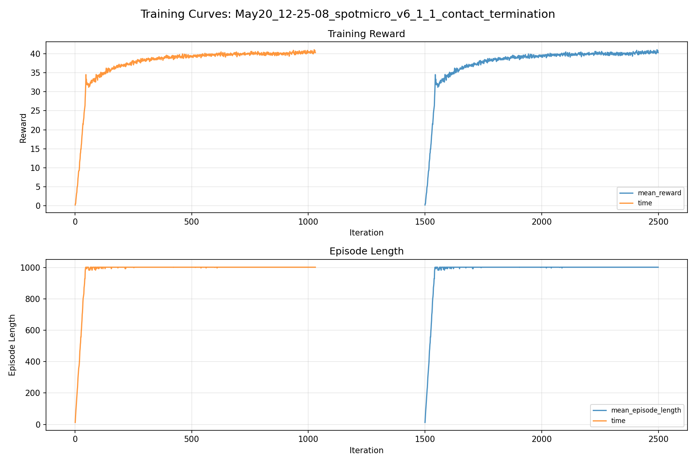
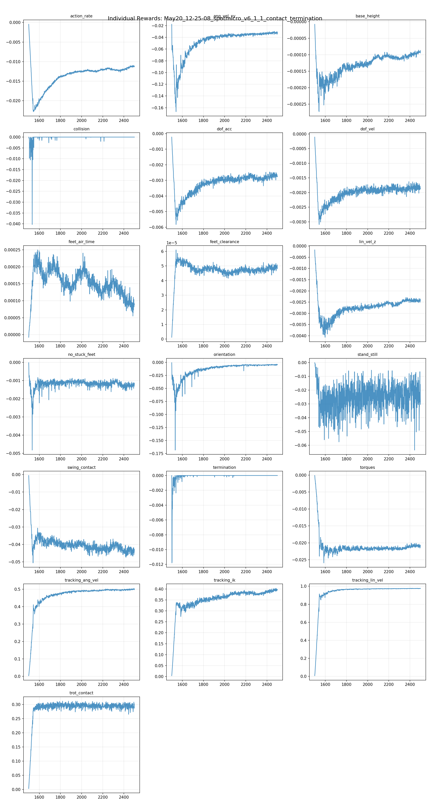
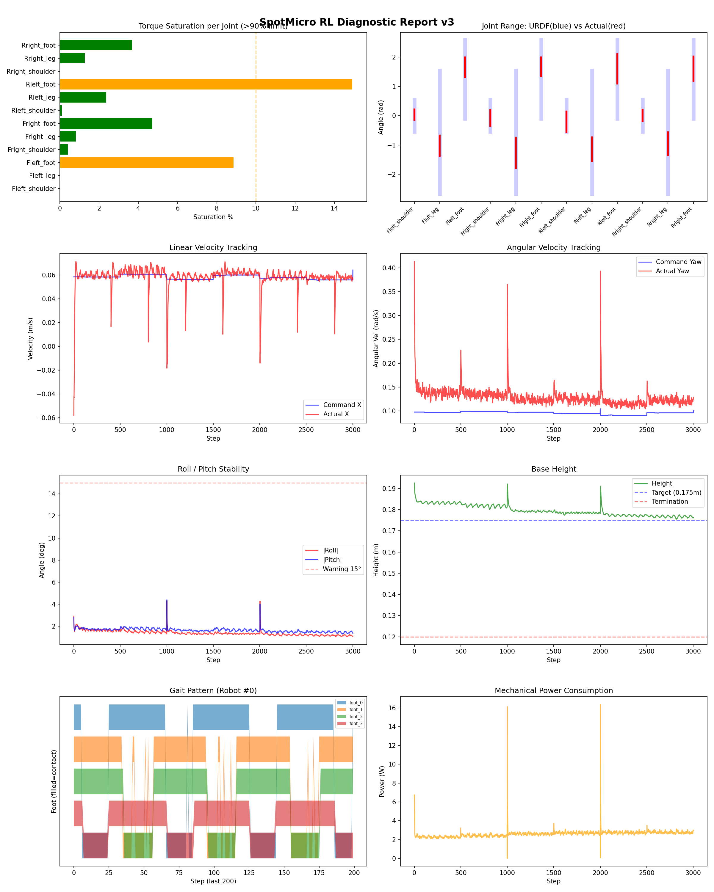
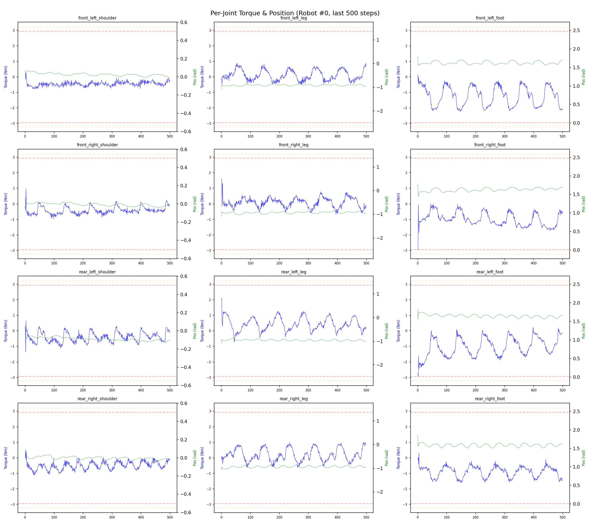
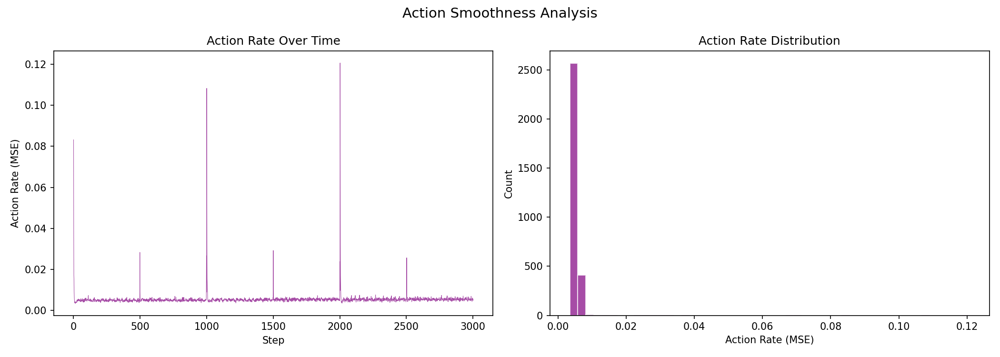

# 실험 067: spotmicro_v6_1_1_contact_termination

- **날짜:** 2026-05-20 12:45
- **Task:** spotmicro_test
- **Run name:** `spotmicro_v6_1_1_contact_termination`
- **판정:** ✅ PASS

---

## 실험 목적

v6.1.1: exp065에서 resume, recovery 안정성 강화

---

## 변경점 (이전 커밋 대비)

```diff
diff --git a/ai_training/rl/legged_gym/legged_gym/envs/spotmicro_test/spotmicro_test_config.py b/ai_training/rl/legged_gym/legged_gym/envs/spotmicro_test/spotmicro_test_config.py
index ea449fa..66ff203 100644
--- a/ai_training/rl/legged_gym/legged_gym/envs/spotmicro_test/spotmicro_test_config.py
+++ b/ai_training/rl/legged_gym/legged_gym/envs/spotmicro_test/spotmicro_test_config.py
@@ -181,7 +181,7 @@ class SpotmicroTestCfgPPO(LeggedRobotCfgPPO):
         learning_rate = 1e-4
 
     class runner(LeggedRobotCfgPPO.runner):
-        run_name = 'spotmicro_v6_1_1_recovery_contact_termination'
+        run_name = 'spotmicro_v6_1_1_contact_termination'
         experiment_name = 'spotmicro_test'
         max_iterations = 1000
         save_interval = 100
```

**변경 요약:**
  - run_name = 'spotmicro_v6_1_1_recovery_contact_termination'
  + run_name = 'spotmicro_v6_1_1_contact_termination'

---

## 현재 Reward Scales

| Reward | Scale |
|--------|-------|
| action_rate | -0.05 |
| ang_vel_xy | -1.0 |
| base_height | -2.0 |
| collision | -1.0 |
| dof_acc | -2.5e-07 |
| dof_vel | -0.0005 |
| feet_air_time | 0.04 |
| feet_clearance | 0.03 |
| lin_vel_z | -2.0 |
| no_stuck_feet | -0.2 |
| orientation | -10.0 |
| stand_still | -0.4 |
| swing_contact | -0.45 |
| termination | -20.0 |
| torques | -0.001 |
| tracking_ang_vel | 0.6 |
| tracking_ik | 0.6 |
| tracking_lin_vel | 1.0 |
| trot_contact | 0.35 |

---

## 진단 결과 (Diagnostic)

### 핵심 지표

- ✅ Timeout: 99.4% (≥80%)
- ✅ 속도오차 X: 0.0257 m/s (<0.08)
- ✅ 토크포화: 3.1% (<10%)
- ✅ 자세: roll 1.4°, pitch 1.6° (안정)
- ✅ 조기종료: 0.0% (<5%)

### 상세 수치

| 지표 | 값 |
|------|-----|
| Timeout% | 99.41747572815534 |
| 조기종료% | 0.0 |
| 속도오차 X | 0.025711089372634888 m/s |
| 속도오차 Y | 0.023590540513396263 m/s |
| 각속도오차 | 0.09246890991926193 rad/s |
| 토크포화% | 3.092816471722722 |
| 평균 높이 | 0.17965588040086694 m |
| Roll (평균) | 1.3869130611419678° |
| Pitch (평균) | 1.6333575248718262° |
| Action Rate | 0.005440196488052607 |
| 평균 전력 | 2.6074936389923096 W |
| CoT | 1.5659772721178595 |
| Recovery 성공률 | 94.3127962085308% |
| Recovery eligible trials | 422 |
| 평균 회복 시간 | 0.062060300120381856 s |
| Recovery 조기 실패율 | 0.0% |

## Recovery Assist 분석

| 지표 | 값 |
|------|-----|
| 판정 | ✅ Recovery 안정적 |
| Recovery 성공률 | 94.3% |
| 성공/실패 | 398 / 24 |
| Eligible trials | 422 / 771 |
| 평균 회복 시간 | 0.062s |
| 조기 실패율 | 0.0% |
| 평가 horizon | 1.0 s |
| 초기 tilt 기준 | 7.0° |
| 안정 기준 | roll/pitch < 5.0°, height > 0.165m |
| 평균 초기 tilt | 8.584936610211251° |
| 평균 초기 roll/pitch | 6.430141202226145° / 6.332231243052219° |
| 1초 후 평균 roll/pitch | 1.6141882230863152° / 1.7777588264133906° |
| 1초 내 최대 roll/pitch 평균 | 6.797092852999249° / 6.8471944159806055° |

> 해석: `Recovery 성공률`은 초기 tilt가 기준 이상인 episode 중 1초 내 안정 자세로 복귀한 비율입니다. 조기 실패율이 높으면 reset 직후 바로 넘어지는 것이고, 평균 회복 시간이 짧을수록 위기 대응이 빠른 것입니다.


## Command Mode별 회전 추종 분석

| 모드 | 비율 | 샘플 수 | 평균 abs(cmd_wz) | 평균 abs(actual_wz) | yaw 오차 | 상태 |
|------|------|---------|------------------|---------------------|----------|------|
| 정지 | 12.6% | 97090 | 0.0235 | 0.0775 | 0.0761 | ❌ |
| 직진/저회전 | 41.7% | 320685 | 0.0720 | 0.1217 | 0.0986 | ⚠️ |
| 제자리 회전 | 11.5% | 88093 | 0.1746 | 0.1663 | 0.0878 | ⚠️ |
| 전진+회전 | 11.7% | 90243 | 0.1736 | 0.1915 | 0.1035 | ⚠️ |
| 큰 회전명령 | 0.0% | 0 | N/A | N/A | N/A | N/A |

> 해석 기준: `제자리 회전`만 나쁘면 pure turn 학습/보행 패턴 문제, `큰 회전명령`만 나쁘면 yaw 명령 범위가 현재 토크/보폭 한계보다 큰 문제, `정지`가 나쁘면 stop drift 문제로 보면 됩니다.
        


## 학습 곡선 분석

| 지표 | 값 | 판정 |
|------|-----|------|
| 수렴 iter (90%) | 1676 | 보통 |
| 후반 안정성 (CV) | 0.008 | 안정 |
| 정체 구간 | 있음 (iter 1730, 49 iter) | |


## Per-leg 분석

### 발별 접촉/공중 비율

| 발 | 접촉% | 공중% |
|-----|-------|------|
| foot_0 | 72.5% | 27.5% |
| foot_1 | 76.1% | 23.9% |
| foot_2 | 66.8% | 33.2% |
| foot_3 | 66.3% | 33.7% |

### 관절별 토크 포화

| 관절 | 포화% | 최대토크 | 한계 | 상태 |
|------|------|---------|------|------|
| front_left_shoulder | 0.0% | 2.494 | 2.940 | ✅ |
| front_left_leg | 0.0% | 2.940 | 2.940 | ✅ |
| front_left_foot | 8.9% | 2.940 | 2.940 | ⚠️ |
| front_right_shoulder | 0.4% | 2.940 | 2.940 | ✅ |
| front_right_leg | 0.8% | 2.940 | 2.940 | ✅ |
| front_right_foot | 4.7% | 2.940 | 2.940 | ✅ |
| rear_left_shoulder | 0.1% | 2.940 | 2.940 | ✅ |
| rear_left_leg | 2.4% | 2.940 | 2.940 | ✅ |
| rear_left_foot | 14.9% | 2.940 | 2.940 | ⚠️ |
| rear_right_shoulder | 0.0% | 2.592 | 2.940 | ✅ |
| rear_right_leg | 1.3% | 2.940 | 2.940 | ✅ |
| rear_right_foot | 3.7% | 2.940 | 2.940 | ✅ |


## Gait 분석

| 지표 | 값 |
|------|-----|
| Gait 주파수 | 0.21 Hz |
| Gait 주기 | 60 steps |
| 대각 동기화율 | 83.4% |
| L/R 비대칭 | 0.0%p |
| 판정 | ✅ Trot 패턴 / ✅ 대칭 |


## 관절별 상세

| 관절 | 토크포화% | 사용범위% | 편향(rad) | 한계근접% | 상태 |
|------|----------|----------|----------|----------|------|
| front_left_shoulder | 0.0% | 32% | +0.042 | 0.0% | ✅ |
| front_left_leg | 0.0% | 16% | -1.022 | 0.0% | ⚠️ |
| front_left_foot | 8.9% | 25% | +1.662 | 0.0% | ⚠️ |
| front_right_shoulder | 0.4% | 49% | -0.075 | 0.0% | ✅ |
| front_right_leg | 0.8% | 25% | -1.267 | 0.0% | ⚠️ |
| front_right_foot | 4.7% | 24% | +1.675 | 0.0% | ⚠️ |
| rear_left_shoulder | 0.1% | 64% | -0.202 | 0.1% | ⚠️ |
| rear_left_leg | 2.4% | 19% | -1.140 | 0.0% | ⚠️ |
| rear_left_foot | 14.9% | 38% | +1.600 | 0.0% | ⚠️ |
| rear_right_shoulder | 0.0% | 35% | +0.015 | 0.0% | ✅ |
| rear_right_leg | 1.3% | 18% | -0.953 | 0.0% | ⚠️ |
| rear_right_foot | 3.7% | 31% | +1.611 | 0.0% | ⚠️ |


## 에너지 효율 상세

| 지표 | 값 |
|------|-----|
| 평균 전력 | 2.61 W |
| 피크 전력 | 16.36 W |
| 피크/평균 비율 | 6.3x |
| CoT | 1.57 |

### 관절별 전력 분배

| 관절 | 평균전력(W) | 비율% |
|------|-----------|-------|
| rear_right_foot | 0.439 | 16.8% |
| front_left_foot | 0.419 | 16.1% |
| rear_left_foot | 0.396 | 15.2% |
| front_right_foot | 0.276 | 10.6% |
| rear_right_leg | 0.258 | 9.9% |
| rear_left_leg | 0.217 | 8.3% |
| front_right_leg | 0.207 | 7.9% |
| front_left_leg | 0.204 | 7.8% |
| rear_left_shoulder | 0.055 | 2.1% |
| front_right_shoulder | 0.051 | 1.9% |
| rear_right_shoulder | 0.050 | 1.9% |
| front_left_shoulder | 0.037 | 1.4% |


## 이전 실험 대비 비교

| 지표 | 이전 (exp066) | 현재 (exp067) | 변화 |
|------|-------|-------|------|
| Timeout% | 93.9% | 99.4% | ✅ ↑ 5.4725% |
| 속도오차 X | 0.0245 | 0.0257 | ⚠️ ↑ 0.0013m/s |
| 토크포화 | 7.9% | 3.1% | ✅ ↓ 4.7824% |
| Roll | 1.7° | 1.4° | ✅ ↓ 0.3026° |
| Pitch | 2.9° | 1.6° | ✅ ↓ 1.2762° |
| 평균 전력 | 3.2514W | 2.6075W | ✅ ↓ 0.6439W |


## Tensorboard 학습 곡선 요약

| 스칼라 | 최종값 | 최대 | 최소 | 후반10% 평균 |
|--------|--------|------|------|-------------|
| rew_action_rate | -0.0112 | -0.0005 | -0.0228 | -0.0115 |
| rew_ang_vel_xy | -0.0314 | -0.0177 | -0.1668 | -0.0325 |
| rew_base_height | -0.0001 | -0.0000 | -0.0003 | -0.0001 |
| rew_collision | 0.0000 | 0.0000 | -0.0403 | 0.0000 |
| rew_dof_acc | -0.0028 | -0.0002 | -0.0058 | -0.0027 |
| rew_dof_vel | -0.0019 | -0.0001 | -0.0031 | -0.0018 |
| rew_feet_air_time | 0.0001 | 0.0002 | -0.0000 | 0.0001 |
| rew_feet_clearance | 0.0000 | 0.0001 | 0.0000 | 0.0000 |
| rew_lin_vel_z | -0.0024 | -0.0002 | -0.0041 | -0.0024 |
| rew_no_stuck_feet | -0.0012 | -0.0000 | -0.0048 | -0.0013 |
| rew_orientation | -0.0044 | -0.0008 | -0.1684 | -0.0048 |
| rew_stand_still | -0.0303 | -0.0001 | -0.0635 | -0.0234 |
| rew_swing_contact | -0.0428 | -0.0005 | -0.0506 | -0.0438 |
| rew_termination | 0.0000 | 0.0000 | -0.0118 | 0.0000 |
| rew_torques | -0.0207 | -0.0001 | -0.0259 | -0.0209 |
| rew_tracking_ang_vel | 0.4991 | 0.5056 | 0.0030 | 0.4988 |
| rew_tracking_ik | 0.3967 | 0.4030 | 0.0039 | 0.3922 |
| rew_tracking_lin_vel | 0.9757 | 0.9770 | 0.0070 | 0.9751 |
| rew_trot_contact | 0.2867 | 0.3115 | 0.0036 | 0.2927 |
| learning_rate | 0.0001 | 0.0003 | 0.0000 | 0.0001 |
| surrogate | -0.0015 | 0.0028 | -0.0036 | -0.0015 |
| value_function | 0.0019 | 0.2571 | 0.0010 | 0.0027 |
| collection time | 0.7445 | 0.8435 | 0.6963 | 0.7351 |
| learning_time | 0.3092 | 0.3222 | 0.2663 | 0.2845 |
| total_fps | 93296.0000 | 100800.0000 | 85287.0000 | 96436.7400 |
| mean_noise_std | 0.0702 | 0.1126 | 0.0698 | 0.0709 |
| mean_episode_length | 1002.0000 | 1002.0000 | 12.5000 | 1002.0000 |
| time | 1002.0000 | 1002.0000 | 12.5000 | 1002.0000 |
| mean_reward | 40.3038 | 41.0624 | 0.2014 | 40.3525 |
| time | 40.3038 | 41.0624 | 0.2014 | 40.3525 |

총 학습 iteration: 2499


---

## 그래프

### Tensorboard 학습 곡선



### Diagnostic 결과





---

## 결론 및 다음 실험 방향

**자동 판정:** ✅ PASS

모든 기준을 통과했습니다. 다음 Step으로 진행 가능합니다.

> 💡 위 결론은 자동 생성되었습니다. 필요시 수정하세요.

---

## 메모

_(추가 메모가 있으면 여기에 작성)_

