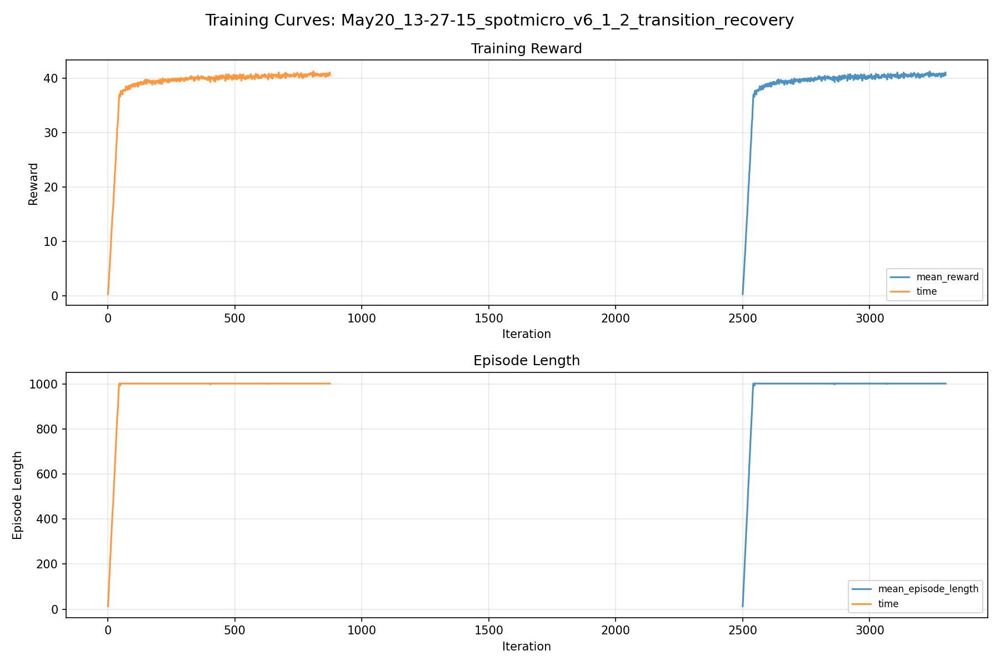
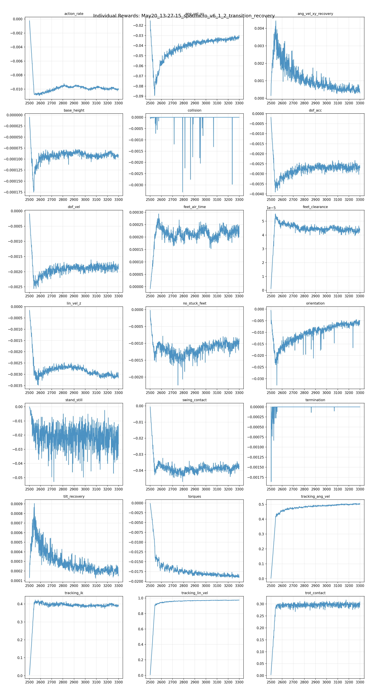
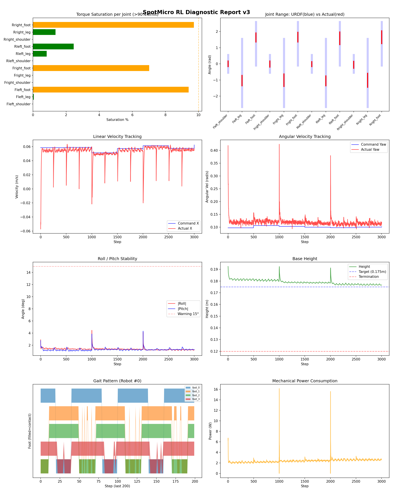
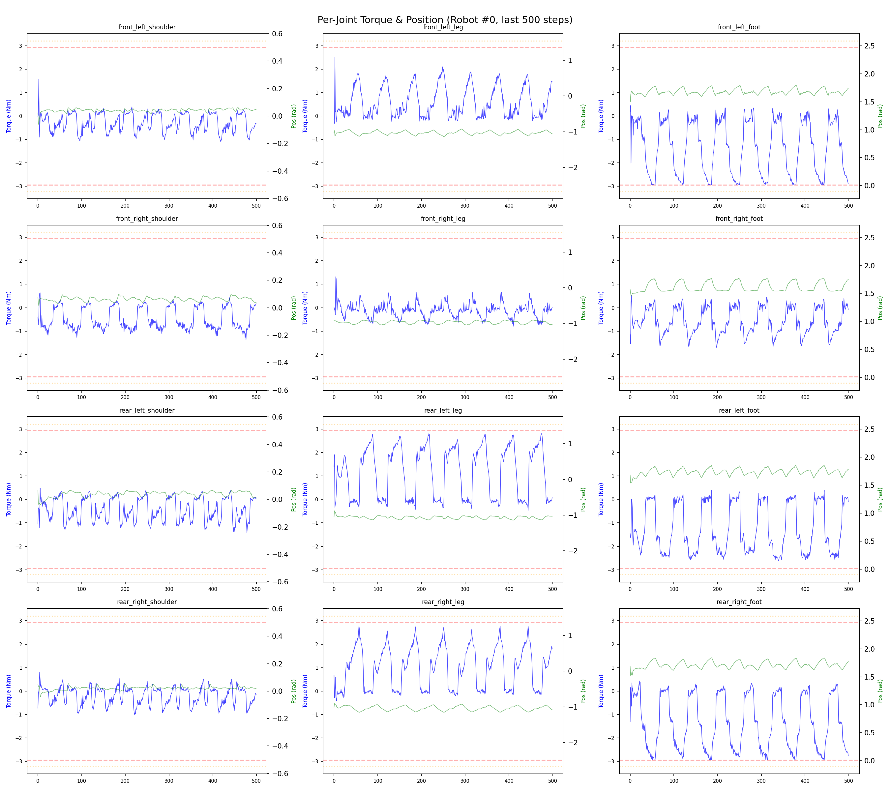
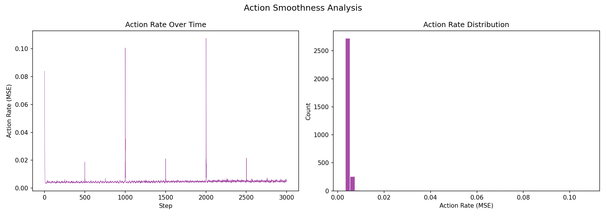

# 실험 068: spotmicro_v6_1_2_transition_recovery

- **날짜:** 2026-05-20 13:45
- **Task:** spotmicro_test
- **Run name:** `spotmicro_v6_1_2_transition_recovery`
- **판정:** ✅ PASS

---

## 실험 목적

v6.1.2: roll/pitch recovery reward 추가

---

## 변경점 (이전 커밋 대비)

```diff
diff --git a/ai_training/rl/experiment_report.py b/ai_training/rl/experiment_report.py
index 0667969..2670e35 100644
--- a/ai_training/rl/experiment_report.py
+++ b/ai_training/rl/experiment_report.py
@@ -490,6 +490,16 @@ def auto_judge(metrics, run_name=''):
         judgments.append(f"❌ 조기종료: {early_death:.1f}% (>20%)")
         all_pass = False
 
+    transition_sr = metrics.get('transition_recovery_success_rate_pct')
+    if transition_sr is not None:
+        if transition_sr >= 80:
+            judgments.append(f"✅ 전환복구: {transition_sr:.1f}% (≥80%)")
+        elif transition_sr >= 50:
+            judgments.append(f"⚠️ 전환복구: {transition_sr:.1f}% (50~80%)")
+        else:
+            judgments.append(f"❌ 전환복구: {transition_sr:.1f}% (<50%)")
+            all_pass = False
+
     overall = "✅ PASS" if all_pass else "❌ FAIL (일부 기준 미달)"
     return overall, judgments
 
@@ -522,6 +532,7 @@ def generate_report(exp_id, purpose, diag_data, tb_data, diff_text,
     
     command_mode_metrics = diag_data.get('command_mode_metrics', {}) if diag_data else {}
     recovery_data = diag_data.get('recovery', {}) if diag_data else {}
+    transition_recovery_data = diag_data.get('transition_recovery', {}) if diag_data else {}
 
     # 자동 판정
     overall_judge, judgments = auto_judge(metrics, run_name)
@@ -815,6 +826,50 @@ def generate_report(exp_id, purpose, diag_data, tb_data, diff_text,
 
 > 해석: `Recovery 성공률`은 초기 tilt가 기준 이상인 episode 중 1초 내 안정 자세로 복귀한 비율입니다. 조기 실패율이 높으면 reset 직후 바로 넘어지는 것이고, 평균 회복 시간이 짧을수록 위기 대응이 빠른 것입니다.
 """
+    # --- 항목 3: Gait 분석 ---
+    transition_recovery_section = ""
+    if transition_recovery_data:
+        sr = transition_recovery_data.get('success_rate_pct')
+        ert = transition_recovery_data.get('early_failure_rate_pct')
+        mrt = transition_recovery_data.get('mean_recovery_time_s')
+        eligible = transition_recovery_data.get('eligible_trials', 0)
+        total = transition_recovery_data.get('total_trials', 0)
+        success_count = transition_recovery_data.get('success_count', 0)
+        failure_count = transition_recovery_data.get('failure_count', 0)
+
+        sr_str = f"{sr:.1f}%" if sr is not None else "N/A"
+        ert_str = f"{ert:.1f}%" if ert is not None else "N/A"
+        mrt_str = f"{mrt:.3f}s" if mrt is not None else "N/A"
+
+        if sr is None:
+            transition_judge = "⚠️ eligible trial 없음"
+        elif sr >= 80 and (ert is not None and ert < 10):
+            transition_judge = "✅ 전환 복구 안정적"
+        elif sr >= 50:
+            transition_judge = "⚠️ 일부 전환 복구 가능"
+        else:
+            transition_judge = "❌ 전환 복구 부족"
+
+        transition_recovery_section = f"""
+## Transition Recovery 분석
+
+| 지표 | 값 |
+|------|-----|
+| 판정 | {transition_judge} |
+| Transition recovery 성공률 | {sr_str} |
+| 성공/실패 | {success_count} / {failure_count} |
+| Eligible trials | {eligible} / {total} |
+| 평균 회복 시간 | {mrt_str} |
+| 조기 실패율 | {ert_str} |
+| 평가 horizon | {transition_recovery_data.get('hori
```

**변경 요약:**
  + transition_sr = metrics.get('transition_recovery_success_rate_pct')
  + if transition_sr is not None:
  + if transition_sr >= 80:
  + judgments.append(f"✅ 전환복구: {transition_sr:.1f}% (≥80%)")
  + elif transition_sr >= 50:
  + judgments.append(f"⚠️ 전환복구: {transition_sr:.1f}% (50~80%)")
  + else:
  + judgments.append(f"❌ 전환복구: {transition_sr:.1f}% (<50%)")
  + all_pass = False
  + transition_recovery_data = diag_data.get('transition_recovery', {}) if diag_data else {}
  + transition_recovery_section = ""
  + if transition_recovery_data:
  + sr = transition_recovery_data.get('success_rate_pct')
  + ert = transition_recovery_data.get('early_failure_rate_pct')
  + mrt = transition_recovery_data.get('mean_recovery_time_s')
  + eligible = transition_recovery_data.get('eligible_trials', 0)
  + total = transition_recovery_data.get('total_trials', 0)
  + success_count = transition_recovery_data.get('success_count', 0)
  + failure_count = transition_recovery_data.get('failure_count', 0)
  + sr_str = f"{sr:.1f}%" if sr is not None else "N/A"
  + ert_str = f"{ert:.1f}%" if ert is not None else "N/A"
  + mrt_str = f"{mrt:.3f}s" if mrt is not None else "N/A"
  + if sr is None:
  + transition_judge = "⚠️ eligible trial 없음"
  + elif sr >= 80 and (ert is not None and ert < 10):
  + transition_judge = "✅ 전환 복구 안정적"
  + elif sr >= 50:
  + transition_judge = "⚠️ 일부 전환 복구 가능"
  + else:
  + transition_judge = "❌ 전환 복구 부족"
  + transition_recovery_section = f"""
  + | 지표 | 값 |
  + |------|-----|
  + | 판정 | {transition_judge} |
  + | Transition recovery 성공률 | {sr_str} |
  + | 성공/실패 | {success_count} / {failure_count} |
  + | Eligible trials | {eligible} / {total} |
  + | 평균 회복 시간 | {mrt_str} |
  + | 조기 실패율 | {ert_str} |
  + | 평가 horizon | {transition_recovery_data.get('horizon_s', 'N/A')} s |
  + | push 후 eligible 기준 | max roll/pitch > {transition_recovery_data.get('initial_tilt_threshold_deg', 'N/A')}° |
  + | 안정 기준 | roll/pitch < {transition_recovery_data.get('stable_threshold_deg', 'N/A')}°, height > {transition_recovery_data.get('min_height_m', 'N/A')}m |
  + | 평균 최대 tilt | {transition_recovery_data.get('mean_max_tilt_deg', 'N/A')}° |
  + | horizon 후 평균 roll/pitch | {transition_recovery_data.get('mean_end_roll_deg', 'N/A')}° / {transition_recovery_data.get('mean_end_pitch_deg', 'N/A')}° |
  + > 해석: `Transition Recovery`는 학습 중 push/roll-pitch angular impulse가 들어간 뒤 일정 시간 안에 자세가 안정 기준으로 돌아오는지를 봅니다.
  + """
  + | Transition recovery 성공률 | {metrics.get('transition_recovery_success_rate_pct', 'N/A')}% |
  + | Transition recovery eligible trials | {metrics.get('transition_recovery_eligible_trials', 'N/A')} |
  + | 평균 Transition recovery 시간 | {metrics.get('mean_transition_recovery_time_s', 'N/A')} s |
  + {transition_recovery_section}
  + 'transition_recovery': diag_data.get('transition_recovery', {}) if diag_data else {},
  + self.last_tilt_metric = torch.zeros(
  + self.num_envs, device=self.device, dtype=torch.float
  + )
  + self.last_ang_vel_xy_metric = torch.zeros(
  + self.num_envs, device=self.device, dtype=torch.float
  + )
  + self.last_tilt_metric = torch.norm(self.projected_gravity[:, :2], dim=1)
  + self.last_ang_vel_xy_metric = torch.norm(self.base_ang_vel[:, :2], dim=1)
  + def _push_robots(self):
  + """주행 중 전환 복구 상황을 만들기 위해 선속도와 roll/pitch 각속도 impulse를 함께 부여."""
  + max_lin = self.cfg.domain_rand.max_push_vel_xy
  + self.root_states[:, 7:9] = torch_rand_float(
  + -max_lin, max_lin, (self.num_envs, 2), device=self.device)
  + max_ang_xy = getattr(self.cfg.domain_rand, "max_push_ang_vel_xy", 0.0)
  + if max_ang_xy > 0.0:
  + self.root_states[:, 10:12] = torch_rand_float(
  + -max_ang_xy, max_ang_xy, (self.num_envs, 2), device=self.device)
  + max_ang_z = getattr(self.cfg.domain_rand, "max_push_ang_vel_z", 0.0)
  + if max_ang_z > 0.0:
  + self.root_states[:, 12] = torch_rand_float(
  + -max_ang_z, max_ang_z, (self.num_envs, 1), device=self.device).squeeze(1)
  + self.last_transition_push_step = int(self.common_step_counter)
  + self.last_transition_push_lin = float(max_lin)
  + self.last_transition_push_ang_xy = float(max_ang_xy)
  + self.last_transition_push_ang_z = float(max_ang_z)
  + self.gym.set_actor_root_state_tensor(self.sim, gymtorch.unwrap_tensor(self.root_states))
  + if not hasattr(self, '_push_count'):
  + self._push_count = 0
  + self._push_count += 1
  + if self._push_count <= 3:
  + print(
  + f"[DR] Push #{self._push_count} at step {self.common_step_counter}, "
  + f"lin={max_lin}, ang_xy={max_ang_xy}, ang_z={max_ang_z}")
  + def _recovery_tilt_mask(self):
  + threshold_deg = getattr(self.cfg.rewards, "recovery_reward_tilt_threshold_deg", 4.0)
  + threshold = math.sin(math.radians(threshold_deg))
  + tilt = torch.norm(self.projected_gravity[:, :2], dim=1)
  + return tilt, (tilt > threshold).float()
  + def _reward_tilt_recovery(self):
  + tilt, mask = self._recovery_tilt_mask()
  + improvement = torch.clamp(self.last_tilt_metric - tilt, min=0.0, max=0.05)
  + return improvement * mask
  + def _reward_ang_vel_xy_recovery(self):
  + _, mask = self._recovery_tilt_mask()
  + ang_vel_xy = torch.norm(self.base_ang_vel[:, :2], dim=1)
  + damping = torch.clamp(self.last_ang_vel_xy_metric - ang_vel_xy, min=0.0, max=0.5)
  + return damping * mask
  + tilt_recovery = 4.0
  + ang_vel_xy_recovery = 0.5
  + recovery_reward_tilt_threshold_deg = 4.0
  - push_interval_s = 8
  - max_push_vel_xy = 0.1
  + push_interval_s = 5
  + max_push_vel_xy = 0.14
  + max_push_ang_vel_xy = 0.50
  + max_push_ang_vel_z = 0.15
  - run_name = 'spotmicro_v6_1_1_recovery_contact_termination'
  + run_name = 'spotmicro_v6_1_2_transition_recovery'
  - max_iterations = 1000
  + max_iterations = 800
  - load_run = "May20_10-11-07_spotmicro_v6_0_4_reward_retune"
  - checkpoint = 1500
  + load_run = "May20_12-25-08_spotmicro_v6_1_1_contact_termination"
  + checkpoint = 2500
  + transition_horizon_s = 0.75
  + transition_horizon_steps = max(1, int(transition_horizon_s / env.dt))
  + transition_initial_tilt_threshold = np.radians(4.0)
  + transition_stable_threshold = recovery_stable_threshold
  + transition_min_height = recovery_min_height
  + transition_age = np.zeros(num_envs, dtype=np.int32)
  + transition_active = np.zeros(num_envs, dtype=bool)
  + transition_init_roll = np.full(num_envs, np.nan)
  + transition_init_pitch = np.full(num_envs, np.nan)
  + transition_max_roll = np.zeros(num_envs, dtype=np.float32)
  + transition_max_pitch = np.zeros(num_envs, dtype=np.float32)
  + transition_first_stable_step = np.full(num_envs, -1, dtype=np.int32)
  + transition_trials = []
  + last_seen_transition_push_step = -1
  + def _start_transition_trials(env_ids_np, roll_abs_np, pitch_abs_np, height_np, push_step):
  + if len(env_ids_np) == 0:
  + return
  + transition_age[env_ids_np] = 0
  + transition_active[env_ids_np] = True
  + transition_init_roll[env_ids_np] = roll_abs_np[env_ids_np]
  + transition_init_pitch[env_ids_np] = pitch_abs_np[env_ids_np]
  + transition_max_roll[env_ids_np] = roll_abs_np[env_ids_np]
  + transition_max_pitch[env_ids_np] = pitch_abs_np[env_ids_np]
  + transition_first_stable_step[env_ids_np] = -1
  + def _record_transition_trial(env_i, success, end_roll, end_pitch, end_height, forced_failure=False):
  + init_roll = transition_init_roll[env_i]
  + init_pitch = transition_init_pitch[env_i]
  + if np.isnan(init_roll) or np.isnan(init_pitch):
  + return
  + max_tilt = max(float(transition_max_roll[env_i]), float(transition_max_pitch[env_i]))
  + eligible = max_tilt >= transition_initial_tilt_threshold
  + recovery_time_s = None
  + if success and transition_first_stable_step[env_i] >= 0:
  + recovery_time_s = float(transition_first_stable_step[env_i] * env.dt)
  + transition_trials.append({
  + 'eligible': bool(eligible),
  + 'success': bool(success) if eligible else False,
  + 'forced_failure': bool(forced_failure),
  + 'init_roll_deg': float(np.degrees(init_roll)),
  + 'init_pitch_deg': float(np.degrees(init_pitch)),
  + 'max_roll_deg': float(np.degrees(transition_max_roll[env_i])),
  + 'max_pitch_deg': float(np.degrees(transition_max_pitch[env_i])),
  + 'max_tilt_deg': float(np.degrees(max_tilt)),
  + 'end_roll_deg': float(np.degrees(end_roll)),
  + 'end_pitch_deg': float(np.degrees(end_pitch)),
  + 'end_height_m': float(end_height),
  + 'recovery_time_s': recovery_time_s,
  + })
  + def _summarize_transition_trials():
  + eligible = [t for t in transition_trials if t['eligible']]
  + successes = [t for t in eligible if t['success']]
  + failures = [t for t in eligible if not t['success']]
  + times = [t['recovery_time_s'] for t in successes if t['recovery_time_s'] is not None]
  + def _mean(key, rows):
  + return float(np.mean([r[key] for r in rows])) if rows else None
  + return {
  + 'horizon_s': float(transition_horizon_s),
  + 'initial_tilt_threshold_deg': float(np.degrees(transition_initial_tilt_threshold)),
  + 'stable_threshold_deg': float(np.degrees(transition_stable_threshold)),
  + 'min_height_m': float(transition_min_height),
  + 'total_trials': int(len(transition_trials)),
  + 'eligible_trials': int(len(eligible)),
  + 'success_count': int(len(successes)),
  + 'failure_count': int(len(failures)),
  + 'success_rate_pct': float(len(successes) / len(eligible) * 100) if eligible else None,
  + 'early_failure_rate_pct': float(
  + sum(1 for t in eligible if t.get('forced_failure')) / len(eligible) * 100
  + ) if eligible else None,
  + 'mean_recovery_time_s': float(np.mean(times)) if times else None,
  + 'mean_max_tilt_deg': _mean('max_tilt_deg', eligible),
  + 'mean_end_roll_deg': _mean('end_roll_deg', eligible),
  + 'mean_end_pitch_deg': _mean('end_pitch_deg', eligible),
  + 'mean_end_height_m': _mean('end_height_m', eligible),
  + }
  + current_push_step = int(getattr(env, 'last_transition_push_step', -1))
  + if current_push_step >= 0 and current_push_step != last_seen_transition_push_step:
  + all_env_ids = np.arange(num_envs, dtype=np.int64)
  + _start_transition_trials(
  + all_env_ids, roll_abs_np, pitch_abs_np, base_height_np, current_push_step)
  + last_seen_transition_push_step = current_push_step
  + transition_active_mask = transition_active.copy()
  + if np.any(transition_active_mask):
  + transition_ids = np.where(transition_active_mask)[0]
  + transition_age[transition_ids] += 1
  + transition_max_roll[transition_ids] = np.maximum(
  + transition_max_roll[transition_ids], roll_abs_np[transition_ids])
  + transition_max_pitch[transition_ids] = np.maximum(
  + transition_max_pitch[transition_ids], pitch_abs_np[transition_ids])
  + transition_stable_now = (
  + (roll_abs_np < transition_stable_threshold) &
  + (pitch_abs_np < transition_stable_threshold) &
  + (base_height_np > transition_min_height)
  + )
  + transition_first_stable_ids = transition_ids[
  + transition_stable_now[transition_ids] &
  + (transition_first_stable_step[transition_ids] < 0)
  + ]
  + transition_first_stable_step[transition_first_stable_ids] = transition_age[
  + transition_first_stable_ids]
  + transition_horizon_ids = transition_ids[
  + transition_age[transition_ids] >= transition_horizon_steps]
  + for env_i in transition_horizon_ids:
  + success = bool(transition_stable_now[env_i])
  + _record_transition_trial(
  + env_i,
  + success=success,
  + end_roll=roll_abs_np[env_i],
  + end_pitch=pitch_abs_np[env_i],
  + end_height=base_height_np[env_i],
  + forced_failure=False,
  + )
  + transition_active[transition_horizon_ids] = False
  + transition_done_ids = done_ids_np[transition_active[done_ids_np]]
  + for env_i in transition_done_ids:
  + _record_transition_trial(
  + env_i,
  + success=False,
  + end_roll=roll_abs_np[env_i],
  + end_pitch=pitch_abs_np[env_i],
  + end_height=base_height_np[env_i],
  + forced_failure=True,
  + )
  + transition_active[transition_done_ids] = False
  + transition_recovery_summary = _summarize_transition_trials()
  + print(f"\n{'='*60}")
  + print(f"  [16] Transition Recovery 분석")
  + print(f"{'='*60}")
  + print(f"  평가 horizon: {transition_recovery_summary['horizon_s']:.2f}s")
  + print(f"  eligible 기준: push 후 최대 |roll| 또는 |pitch| ≥ "
  + f"{transition_recovery_summary['initial_tilt_threshold_deg']:.1f}°")
  + print(f"  안정 기준: |roll|, |pitch| < "
  + f"{transition_recovery_summary['stable_threshold_deg']:.1f}°, "
  + f"height > {transition_recovery_summary['min_height_m']:.3f}m")
  + print(f"  전체 trial: {transition_recovery_summary['total_trials']}")
  + print(f"  eligible trial: {transition_recovery_summary['eligible_trials']}")
  + if transition_recovery_summary['success_rate_pct'] is None:
  + print("  Transition recovery 성공률: N/A (eligible trial 없음)")
  + else:
  + print(f"  Transition recovery 성공률: "
  + f"{transition_recovery_summary['success_rate_pct']:.1f}% "
  + f"({transition_recovery_summary['success_count']}/"
  + f"{transition_recovery_summary['eligible_trials']})")
  + print(f"  조기 실패율: {transition_recovery_summary['early_failure_rate_pct']:.1f}%")
  + if transition_recovery_summary['mean_recovery_time_s'] is not None:
  + print(f"  평균 회복 시간: {transition_recovery_summary['mean_recovery_time_s']:.3f}s")
  + print(f"  평균 최대 tilt: {transition_recovery_summary['mean_max_tilt_deg']:.2f}°")
  + print(f"  horizon 후 평균 |roll|/|pitch|: "
  + f"{transition_recovery_summary['mean_end_roll_deg']:.2f}° / "
  + f"{transition_recovery_summary['mean_end_pitch_deg']:.2f}°")
  + 'transition_recovery_success_rate_pct': transition_recovery_summary.get('success_rate_pct'),
  + 'transition_recovery_eligible_trials': transition_recovery_summary.get('eligible_trials', 0),
  + 'mean_transition_recovery_time_s': transition_recovery_summary.get('mean_recovery_time_s'),
  + 'transition_recovery_early_failure_rate_pct': transition_recovery_summary.get('early_failure_rate_pct'),
  + 'transition_recovery_mean_max_tilt_deg': transition_recovery_summary.get('mean_max_tilt_deg'),
  + 'transition_recovery': transition_recovery_summary,

---

## 현재 Reward Scales

| Reward | Scale |
|--------|-------|
| action_rate | -0.05 |
| ang_vel_xy | -1.0 |
| ang_vel_xy_recovery | 0.5 |
| base_height | -2.0 |
| collision | -1.0 |
| dof_acc | -2.5e-07 |
| dof_vel | -0.0005 |
| feet_air_time | 0.04 |
| feet_clearance | 0.03 |
| lin_vel_z | -2.0 |
| no_stuck_feet | -0.2 |
| orientation | -10.0 |
| stand_still | -0.4 |
| swing_contact | -0.45 |
| termination | -20.0 |
| tilt_recovery | 4.0 |
| torques | -0.001 |
| tracking_ang_vel | 0.6 |
| tracking_ik | 0.6 |
| tracking_lin_vel | 1.0 |
| trot_contact | 0.35 |

---

## 진단 결과 (Diagnostic)

### 핵심 지표

- ✅ Timeout: 100.0% (≥80%)
- ✅ 속도오차 X: 0.0201 m/s (<0.08)
- ✅ 토크포화: 2.6% (<10%)
- ✅ 자세: roll 1.4°, pitch 1.3° (안정)
- ✅ 조기종료: 0.0% (<5%)
- ✅ 전환복구: 98.0% (≥80%)

### 상세 수치

| 지표 | 값 |
|------|-----|
| Timeout% | 100.0 |
| 조기종료% | 0.0 |
| 속도오차 X | 0.020101375877857208 m/s |
| 속도오차 Y | 0.018746545538306236 m/s |
| 각속도오차 | 0.07859707623720169 rad/s |
| 토크포화% | 2.570313800782551 |
| 평균 높이 | 0.17910345151767387 m |
| Roll (평균) | 1.3657994270324707° |
| Pitch (평균) | 1.282345175743103° |
| Action Rate | 0.00484786182641983 |
| 평균 전력 | 2.3967151641845703 W |
| CoT | 1.5580364498446544 |
| Recovery 성공률 | 98.56459330143541% |
| Recovery eligible trials | 418 |
| 평균 회복 시간 | 0.07213592071773357 s |
| Recovery 조기 실패율 | 0.0% |
| Transition recovery 성공률 | 97.96511627906976% |
| Transition recovery eligible trials | 688 |
| 평균 Transition recovery 시간 | 0.04017804064497749 s |

## Recovery Assist 분석

| 지표 | 값 |
|------|-----|
| 판정 | ✅ Recovery 안정적 |
| Recovery 성공률 | 98.6% |
| 성공/실패 | 412 / 6 |
| Eligible trials | 418 / 768 |
| 평균 회복 시간 | 0.072s |
| 조기 실패율 | 0.0% |
| 평가 horizon | 1.0 s |
| 초기 tilt 기준 | 7.0° |
| 안정 기준 | roll/pitch < 5.0°, height > 0.165m |
| 평균 초기 tilt | 8.586477215318444° |
| 평균 초기 roll/pitch | 6.270458557923058° / 6.389574003934435° |
| 1초 후 평균 roll/pitch | 1.4843072124963523° / 1.2989674815479175° |
| 1초 내 최대 roll/pitch 평균 | 6.67531649119546° / 6.849131180624072° |

> 해석: `Recovery 성공률`은 초기 tilt가 기준 이상인 episode 중 1초 내 안정 자세로 복귀한 비율입니다. 조기 실패율이 높으면 reset 직후 바로 넘어지는 것이고, 평균 회복 시간이 짧을수록 위기 대응이 빠른 것입니다.


## Transition Recovery 분석

| 지표 | 값 |
|------|-----|
| 판정 | ✅ 전환 복구 안정적 |
| Transition recovery 성공률 | 98.0% |
| 성공/실패 | 674 / 14 |
| Eligible trials | 688 / 2816 |
| 평균 회복 시간 | 0.040s |
| 조기 실패율 | 0.0% |
| 평가 horizon | 0.75 s |
| push 후 eligible 기준 | max roll/pitch > 4.0° |
| 안정 기준 | roll/pitch < 5.0°, height > 0.165m |
| 평균 최대 tilt | 4.960968969351135° |
| horizon 후 평균 roll/pitch | 1.734661227934466° / 1.7362965483822166° |

> 해석: `Transition Recovery`는 학습 중 push/roll-pitch angular impulse가 들어간 뒤 일정 시간 안에 자세가 안정 기준으로 돌아오는지를 봅니다.


## Command Mode별 회전 추종 분석

| 모드 | 비율 | 샘플 수 | 평균 abs(cmd_wz) | 평균 abs(actual_wz) | yaw 오차 | 상태 |
|------|------|---------|------------------|---------------------|----------|------|
| 정지 | 13.0% | 100091 | 0.0247 | 0.0675 | 0.0649 | ❌ |
| 직진/저회전 | 39.1% | 300311 | 0.0751 | 0.1070 | 0.0826 | ⚠️ |
| 제자리 회전 | 13.5% | 103576 | 0.1743 | 0.1646 | 0.0796 | ✅ |
| 전진+회전 | 13.4% | 103120 | 0.1748 | 0.1720 | 0.0851 | ⚠️ |
| 큰 회전명령 | 0.0% | 0 | N/A | N/A | N/A | N/A |

> 해석 기준: `제자리 회전`만 나쁘면 pure turn 학습/보행 패턴 문제, `큰 회전명령`만 나쁘면 yaw 명령 범위가 현재 토크/보폭 한계보다 큰 문제, `정지`가 나쁘면 stop drift 문제로 보면 됩니다.
        


## 학습 곡선 분석

| 지표 | 값 | 판정 |
|------|-----|------|
| 수렴 iter (90%) | 2547 | 느림 |
| 후반 안정성 (CV) | 0.007 | 안정 |
| 정체 구간 | 있음 (iter 2555, 39 iter) | |


## Per-leg 분석

### 발별 접촉/공중 비율

| 발 | 접촉% | 공중% |
|-----|-------|------|
| foot_0 | 67.4% | 32.6% |
| foot_1 | 71.1% | 28.9% |
| foot_2 | 63.9% | 36.1% |
| foot_3 | 68.2% | 31.8% |

### 관절별 토크 포화

| 관절 | 포화% | 최대토크 | 한계 | 상태 |
|------|------|---------|------|------|
| front_left_shoulder | 0.0% | 2.714 | 2.940 | ✅ |
| front_left_leg | 0.0% | 2.940 | 2.940 | ✅ |
| front_left_foot | 9.4% | 2.940 | 2.940 | ⚠️ |
| front_right_shoulder | 0.0% | 2.940 | 2.940 | ✅ |
| front_right_leg | 0.0% | 2.940 | 2.940 | ✅ |
| front_right_foot | 7.0% | 2.940 | 2.940 | ⚠️ |
| rear_left_shoulder | 0.0% | 2.367 | 2.940 | ✅ |
| rear_left_leg | 0.8% | 2.940 | 2.940 | ✅ |
| rear_left_foot | 2.5% | 2.940 | 2.940 | ✅ |
| rear_right_shoulder | 0.0% | 2.940 | 2.940 | ✅ |
| rear_right_leg | 1.4% | 2.940 | 2.940 | ✅ |
| rear_right_foot | 9.7% | 2.940 | 2.940 | ⚠️ |


## Gait 분석

| 지표 | 값 |
|------|-----|
| Gait 주파수 | 0.20 Hz |
| Gait 주기 | 61 steps |
| 대각 동기화율 | 87.5% |
| L/R 비대칭 | 0.0%p |
| 판정 | ✅ Trot 패턴 / ✅ 대칭 |


## 관절별 상세

| 관절 | 토크포화% | 사용범위% | 편향(rad) | 한계근접% | 상태 |
|------|----------|----------|----------|----------|------|
| front_left_shoulder | 0.0% | 32% | +0.006 | 0.0% | ✅ |
| front_left_leg | 0.0% | 15% | -1.034 | 0.0% | ⚠️ |
| front_left_foot | 9.4% | 21% | +1.636 | 0.0% | ⚠️ |
| front_right_shoulder | 0.0% | 34% | -0.014 | 0.0% | ✅ |
| front_right_leg | 0.0% | 18% | -1.014 | 0.0% | ⚠️ |
| front_right_foot | 7.0% | 22% | +1.655 | 0.0% | ⚠️ |
| rear_left_shoulder | 0.0% | 28% | -0.019 | 0.0% | ✅ |
| rear_left_leg | 0.8% | 14% | -1.056 | 0.0% | ⚠️ |
| rear_left_foot | 2.5% | 29% | +1.585 | 0.0% | ⚠️ |
| rear_right_shoulder | 0.0% | 39% | -0.059 | 0.0% | ✅ |
| rear_right_leg | 1.4% | 20% | -1.015 | 0.0% | ⚠️ |
| rear_right_foot | 9.7% | 30% | +1.651 | 0.0% | ⚠️ |


## 에너지 효율 상세

| 지표 | 값 |
|------|-----|
| 평균 전력 | 2.40 W |
| 피크 전력 | 16.14 W |
| 피크/평균 비율 | 6.7x |
| CoT | 1.56 |

### 관절별 전력 분배

| 관절 | 평균전력(W) | 비율% |
|------|-----------|-------|
| rear_right_foot | 0.542 | 22.6% |
| front_left_foot | 0.406 | 16.9% |
| front_right_foot | 0.292 | 12.2% |
| rear_right_leg | 0.281 | 11.7% |
| rear_left_foot | 0.212 | 8.8% |
| front_left_leg | 0.170 | 7.1% |
| front_right_leg | 0.163 | 6.8% |
| rear_left_leg | 0.136 | 5.7% |
| rear_right_shoulder | 0.053 | 2.2% |
| front_right_shoulder | 0.052 | 2.2% |
| rear_left_shoulder | 0.050 | 2.1% |
| front_left_shoulder | 0.042 | 1.8% |


## 이전 실험 대비 비교

| 지표 | 이전 (exp067) | 현재 (exp068) | 변화 |
|------|-------|-------|------|
| Timeout% | 99.4% | 100.0% | ✅ ↑ 0.5825% |
| 속도오차 X | 0.0257 | 0.0201 | ✅ ↓ 0.0056m/s |
| 토크포화 | 3.1% | 2.6% | ✅ ↓ 0.5225% |
| Roll | 1.4° | 1.4° | ✅ ↓ 0.0211° |
| Pitch | 1.6° | 1.3° | ✅ ↓ 0.3510° |
| 평균 전력 | 2.6075W | 2.3967W | ✅ ↓ 0.2108W |


## Tensorboard 학습 곡선 요약

| 스칼라 | 최종값 | 최대 | 최소 | 후반10% 평균 |
|--------|--------|------|------|-------------|
| rew_action_rate | -0.0100 | -0.0002 | -0.0109 | -0.0099 |
| rew_ang_vel_xy | -0.0314 | -0.0155 | -0.0894 | -0.0326 |
| rew_ang_vel_xy_recovery | 0.0003 | 0.0044 | 0.0002 | 0.0005 |
| rew_base_height | -0.0001 | -0.0000 | -0.0002 | -0.0001 |
| rew_collision | 0.0000 | 0.0000 | -0.0033 | -0.0000 |
| rew_dof_acc | -0.0027 | -0.0002 | -0.0039 | -0.0027 |
| rew_dof_vel | -0.0018 | -0.0001 | -0.0026 | -0.0019 |
| rew_feet_air_time | 0.0002 | 0.0003 | -0.0000 | 0.0002 |
| rew_feet_clearance | 0.0000 | 0.0001 | 0.0000 | 0.0000 |
| rew_lin_vel_z | -0.0031 | -0.0002 | -0.0035 | -0.0031 |
| rew_no_stuck_feet | -0.0009 | -0.0000 | -0.0022 | -0.0010 |
| rew_orientation | -0.0050 | -0.0005 | -0.0328 | -0.0061 |
| rew_stand_still | -0.0263 | -0.0001 | -0.0528 | -0.0234 |
| rew_swing_contact | -0.0376 | -0.0006 | -0.0470 | -0.0383 |
| rew_termination | 0.0000 | 0.0000 | -0.0019 | 0.0000 |
| rew_tilt_recovery | 0.0002 | 0.0009 | 0.0001 | 0.0002 |
| rew_torques | -0.0188 | -0.0001 | -0.0192 | -0.0187 |
| rew_tracking_ang_vel | 0.5033 | 0.5058 | 0.0035 | 0.5016 |
| rew_tracking_ik | 0.3935 | 0.4226 | 0.0051 | 0.3944 |
| rew_tracking_lin_vel | 0.9755 | 0.9762 | 0.0076 | 0.9734 |
| rew_trot_contact | 0.2957 | 0.3166 | 0.0036 | 0.2963 |
| learning_rate | 0.0002 | 0.0002 | 0.0000 | 0.0001 |
| surrogate | -0.0013 | 0.0049 | -0.0033 | -0.0015 |
| value_function | 0.0019 | 0.0103 | 0.0010 | 0.0025 |
| collection time | 0.7579 | 1.3009 | 0.7194 | 0.7593 |
| learning_time | 0.2847 | 0.3315 | 0.2745 | 0.2865 |
| total_fps | 94291.0000 | 97780.0000 | 60353.0000 | 94019.8250 |
| mean_noise_std | 0.0648 | 0.0707 | 0.0636 | 0.0647 |
| mean_episode_length | 1002.0000 | 1002.0000 | 12.5000 | 1002.0000 |
| time | 1002.0000 | 1002.0000 | 12.5000 | 1002.0000 |
| mean_reward | 40.5846 | 41.2722 | 0.2712 | 40.6979 |
| time | 40.5846 | 41.2722 | 0.2712 | 40.6979 |

총 학습 iteration: 3299


---

## 그래프

### Tensorboard 학습 곡선



### Diagnostic 결과





---

## 결론 및 다음 실험 방향

**자동 판정:** ✅ PASS

모든 기준을 통과했습니다. 다음 Step으로 진행 가능합니다.

> 💡 위 결론은 자동 생성되었습니다. 필요시 수정하세요.

---

## 메모

_(추가 메모가 있으면 여기에 작성)_

