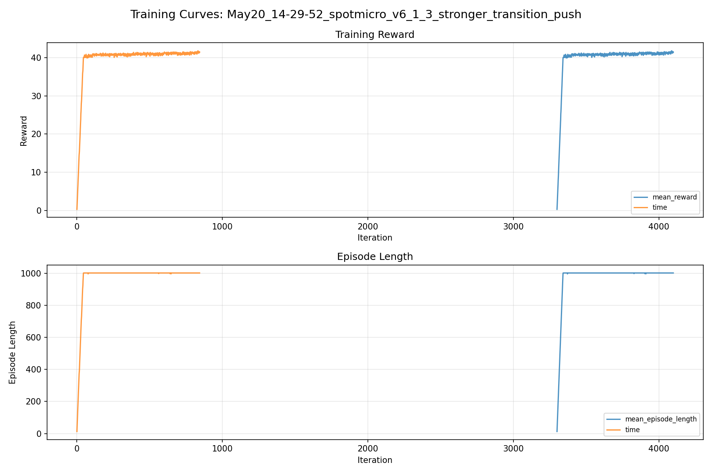
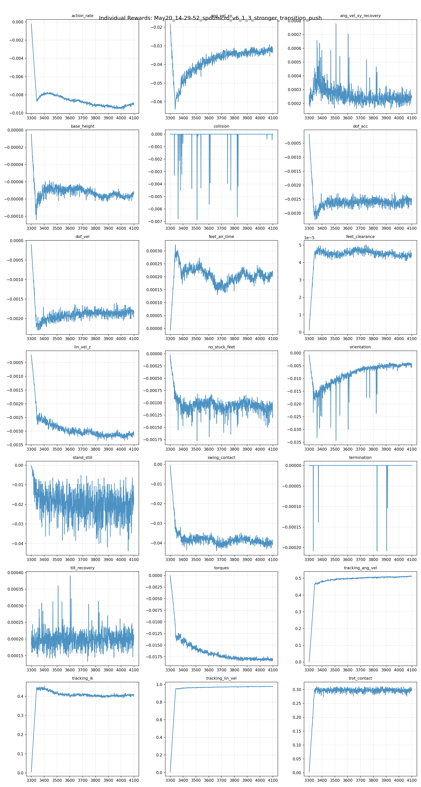
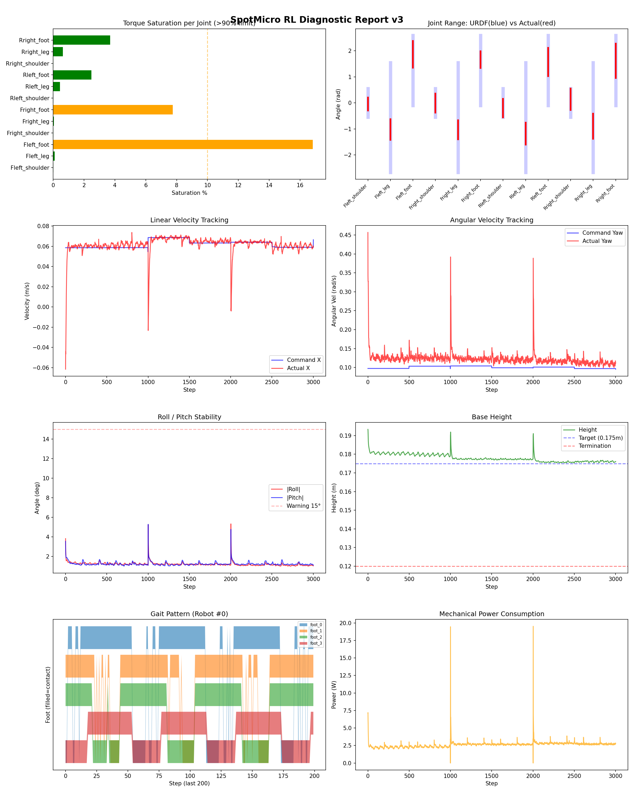
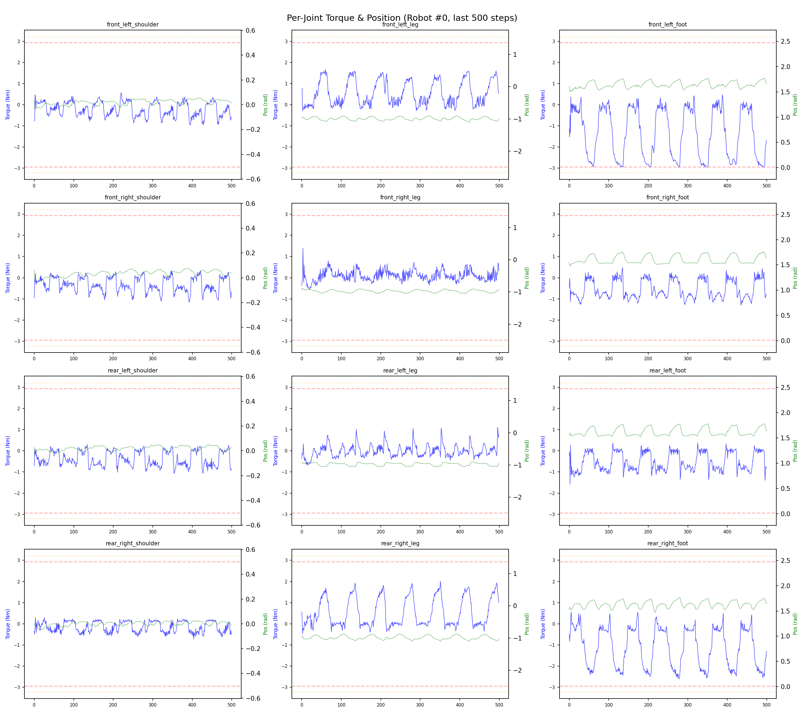
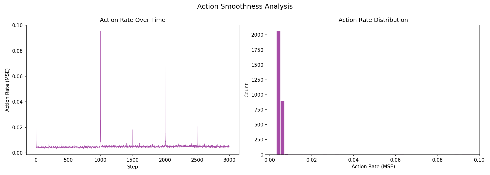

# 실험 069: spotmicro_v6_1_3_stronger_transition_push

- **날짜:** 2026-05-20 14:47
- **Task:** spotmicro_test
- **Run name:** `spotmicro_v6_1_3_stronger_transition_push`
- **판정:** ✅ PASS

---

## 실험 목적

v6.1.3: push, roll 수치 강화

---

## 변경점 (이전 커밋 대비)

```diff
(변경 사항 없음 또는 git 미설정)
```

**변경 요약:**
(변경 사항 없음 또는 git 미설정)

---

## 현재 Reward Scales

| Reward | Scale |
|--------|-------|
| action_rate | -0.05 |
| ang_vel_xy | -1.0 |
| ang_vel_xy_recovery | 0.5 |
| base_height | -2.0 |
| collision | -1.0 |
| dof_acc | -2.5e-07 |
| dof_vel | -0.0005 |
| feet_air_time | 0.04 |
| feet_clearance | 0.03 |
| lin_vel_z | -2.0 |
| no_stuck_feet | -0.2 |
| orientation | -10.0 |
| stand_still | -0.4 |
| swing_contact | -0.45 |
| termination | -20.0 |
| tilt_recovery | 4.0 |
| torques | -0.001 |
| tracking_ang_vel | 0.6 |
| tracking_ik | 0.6 |
| tracking_lin_vel | 1.0 |
| trot_contact | 0.35 |

---

## 진단 결과 (Diagnostic)

### 핵심 지표

- ✅ Timeout: 99.8% (≥80%)
- ✅ 속도오차 X: 0.0203 m/s (<0.08)
- ✅ 토크포화: 2.7% (<10%)
- ✅ 자세: roll 1.2°, pitch 1.2° (안정)
- ✅ 조기종료: 0.0% (<5%)
- ✅ 전환복구: 91.7% (≥80%)

### 상세 수치

| 지표 | 값 |
|------|-----|
| Timeout% | 99.80506822612085 |
| 조기종료% | 0.0 |
| 속도오차 X | 0.020273791626095772 m/s |
| 속도오차 Y | 0.018242012709379196 m/s |
| 각속도오차 | 0.08227532356977463 rad/s |
| 토크포화% | 2.6663332327394826 |
| 평균 높이 | 0.17795575001499392 m |
| Roll (평균) | 1.2143484354019165° |
| Pitch (평균) | 1.2379604578018188° |
| Action Rate | 0.0050432803109288216 |
| 평균 전력 | 2.629424810409546 W |
| CoT | 1.5263657317628005 |
| Recovery 성공률 | 98.42829076620825% |
| Recovery eligible trials | 509 |
| 평균 회복 시간 | 0.07808383059001968 s |
| Recovery 조기 실패율 | 0.0% |
| Transition recovery 성공률 | 91.66666666666666% |
| Transition recovery eligible trials | 84 |
| 평균 Transition recovery 시간 | 0.10935064690647187 s |

## Recovery Assist 분석

| 지표 | 값 |
|------|-----|
| 판정 | ✅ Recovery 안정적 |
| Recovery 성공률 | 98.4% |
| 성공/실패 | 501 / 8 |
| Eligible trials | 509 / 769 |
| 평균 회복 시간 | 0.078s |
| 조기 실패율 | 0.0% |
| 평가 horizon | 1.0 s |
| 초기 tilt 기준 | 7.0° |
| 안정 기준 | roll/pitch < 5.0°, height > 0.165m |
| 평균 초기 tilt | 9.62235294248547° |
| 평균 초기 roll/pitch | 7.253894000066617° / 7.1251773703948595° |
| 1초 후 평균 roll/pitch | 1.3807117368464226° / 1.3926791202565396° |
| 1초 내 최대 roll/pitch 평균 | 7.621693667119519° / 7.571193709823143° |

> 해석: `Recovery 성공률`은 초기 tilt가 기준 이상인 episode 중 1초 내 안정 자세로 복귀한 비율입니다. 조기 실패율이 높으면 reset 직후 바로 넘어지는 것이고, 평균 회복 시간이 짧을수록 위기 대응이 빠른 것입니다.


## Transition Recovery 분석

| 지표 | 값 |
|------|-----|
| 판정 | ✅ 전환 복구 안정적 |
| Transition recovery 성공률 | 91.7% |
| 성공/실패 | 77 / 7 |
| Eligible trials | 84 / 3584 |
| 평균 회복 시간 | 0.109s |
| 조기 실패율 | 0.0% |
| 평가 horizon | 0.75 s |
| push 후 eligible 기준 | max roll/pitch > 6.000000000000001° |
| 안정 기준 | roll/pitch < 5.0°, height > 0.165m |
| 평균 최대 tilt | 7.900024355205388° |
| horizon 후 평균 roll/pitch | 1.9666353323430354° / 2.111593725669774° |

> 해석: `Transition Recovery`는 학습 중 push/roll-pitch angular impulse가 들어간 뒤 일정 시간 안에 자세가 안정 기준으로 돌아오는지를 봅니다.


## Command Mode별 회전 추종 분석

| 모드 | 비율 | 샘플 수 | 평균 abs(cmd_wz) | 평균 abs(actual_wz) | yaw 오차 | 상태 |
|------|------|---------|------------------|---------------------|----------|------|
| 정지 | 10.1% | 77586 | 0.0227 | 0.0704 | 0.0693 | ❌ |
| 직진/저회전 | 43.3% | 332905 | 0.0759 | 0.1108 | 0.0863 | ⚠️ |
| 제자리 회전 | 11.8% | 90551 | 0.1743 | 0.1684 | 0.0809 | ⚠️ |
| 전진+회전 | 13.1% | 100591 | 0.1737 | 0.1753 | 0.0854 | ⚠️ |
| 큰 회전명령 | 0.0% | 0 | N/A | N/A | N/A | N/A |

> 해석 기준: `제자리 회전`만 나쁘면 pure turn 학습/보행 패턴 문제, `큰 회전명령`만 나쁘면 yaw 명령 범위가 현재 토크/보폭 한계보다 큰 문제, `정지`가 나쁘면 stop drift 문제로 보면 됩니다.
        


## 학습 곡선 분석

| 지표 | 값 | 판정 |
|------|-----|------|
| 수렴 iter (90%) | 3340 | 느림 |
| 후반 안정성 (CV) | 0.006 | 안정 |
| 정체 구간 | 있음 (iter 3340, 39 iter) | |


## Per-leg 분석

### 발별 접촉/공중 비율

| 발 | 접촉% | 공중% |
|-----|-------|------|
| foot_0 | 68.7% | 31.3% |
| foot_1 | 72.3% | 27.7% |
| foot_2 | 64.8% | 35.2% |
| foot_3 | 65.0% | 35.0% |

### 관절별 토크 포화

| 관절 | 포화% | 최대토크 | 한계 | 상태 |
|------|------|---------|------|------|
| front_left_shoulder | 0.0% | 2.940 | 2.940 | ✅ |
| front_left_leg | 0.1% | 2.940 | 2.940 | ✅ |
| front_left_foot | 16.8% | 2.940 | 2.940 | ⚠️ |
| front_right_shoulder | 0.0% | 2.940 | 2.940 | ✅ |
| front_right_leg | 0.0% | 2.940 | 2.940 | ✅ |
| front_right_foot | 7.7% | 2.940 | 2.940 | ⚠️ |
| rear_left_shoulder | 0.0% | 2.940 | 2.940 | ✅ |
| rear_left_leg | 0.4% | 2.940 | 2.940 | ✅ |
| rear_left_foot | 2.5% | 2.940 | 2.940 | ✅ |
| rear_right_shoulder | 0.0% | 2.940 | 2.940 | ✅ |
| rear_right_leg | 0.6% | 2.940 | 2.940 | ✅ |
| rear_right_foot | 3.7% | 2.940 | 2.940 | ✅ |


## Gait 분석

| 지표 | 값 |
|------|-----|
| Gait 주파수 | 0.21 Hz |
| Gait 주기 | 58 steps |
| 대각 동기화율 | 86.3% |
| L/R 비대칭 | 0.0%p |
| 판정 | ✅ Trot 패턴 / ✅ 대칭 |


## 관절별 상세

| 관절 | 토크포화% | 사용범위% | 편향(rad) | 한계근접% | 상태 |
|------|----------|----------|----------|----------|------|
| front_left_shoulder | 0.0% | 45% | -0.047 | 0.0% | ✅ |
| front_left_leg | 0.1% | 19% | -1.021 | 0.0% | ⚠️ |
| front_left_foot | 16.8% | 38% | +1.870 | 0.0% | ⚠️ |
| front_right_shoulder | 0.0% | 67% | -0.007 | 0.0% | ✅ |
| front_right_leg | 0.0% | 17% | -1.037 | 0.0% | ⚠️ |
| front_right_foot | 7.7% | 24% | +1.660 | 0.0% | ⚠️ |
| rear_left_shoulder | 0.0% | 65% | -0.203 | 0.0% | ⚠️ |
| rear_left_leg | 0.4% | 20% | -1.177 | 0.0% | ⚠️ |
| rear_left_foot | 2.5% | 40% | +1.570 | 0.0% | ⚠️ |
| rear_right_shoulder | 0.0% | 75% | +0.140 | 0.0% | ⚠️ |
| rear_right_leg | 0.6% | 23% | -0.898 | 0.0% | ⚠️ |
| rear_right_foot | 3.7% | 49% | +1.621 | 0.0% | ⚠️ |


## 에너지 효율 상세

| 지표 | 값 |
|------|-----|
| 평균 전력 | 2.63 W |
| 피크 전력 | 19.53 W |
| 피크/평균 비율 | 7.4x |
| CoT | 1.53 |

### 관절별 전력 분배

| 관절 | 평균전력(W) | 비율% |
|------|-----------|-------|
| rear_right_foot | 0.518 | 19.7% |
| front_left_foot | 0.498 | 19.0% |
| front_right_foot | 0.320 | 12.2% |
| rear_left_foot | 0.285 | 10.8% |
| rear_right_leg | 0.251 | 9.6% |
| front_left_leg | 0.208 | 7.9% |
| front_right_leg | 0.176 | 6.7% |
| rear_left_leg | 0.164 | 6.2% |
| rear_right_shoulder | 0.059 | 2.2% |
| rear_left_shoulder | 0.052 | 2.0% |
| front_right_shoulder | 0.052 | 2.0% |
| front_left_shoulder | 0.046 | 1.8% |


## 이전 실험 대비 비교

| 지표 | 이전 (exp068) | 현재 (exp069) | 변화 |
|------|-------|-------|------|
| Timeout% | 100.0% | 99.8% | ⚠️ ↓ 0.1949% |
| 속도오차 X | 0.0201 | 0.0203 | ⚠️ ↑ 0.0002m/s |
| 토크포화 | 2.6% | 2.7% | ⚠️ ↑ 0.0960% |
| Roll | 1.4° | 1.2° | ✅ ↓ 0.1515° |
| Pitch | 1.3° | 1.2° | ✅ ↓ 0.0444° |
| 평균 전력 | 2.3967W | 2.6294W | ⚠️ ↑ 0.2327W |


## Tensorboard 학습 곡선 요약

| 스칼라 | 최종값 | 최대 | 최소 | 후반10% 평균 |
|--------|--------|------|------|-------------|
| rew_action_rate | -0.0090 | -0.0002 | -0.0096 | -0.0091 |
| rew_ang_vel_xy | -0.0333 | -0.0181 | -0.0640 | -0.0324 |
| rew_ang_vel_xy_recovery | 0.0003 | 0.0008 | 0.0002 | 0.0002 |
| rew_base_height | -0.0001 | -0.0000 | -0.0001 | -0.0001 |
| rew_collision | 0.0000 | 0.0000 | -0.0069 | -0.0000 |
| rew_dof_acc | -0.0025 | -0.0002 | -0.0032 | -0.0026 |
| rew_dof_vel | -0.0018 | -0.0001 | -0.0023 | -0.0018 |
| rew_feet_air_time | 0.0002 | 0.0003 | -0.0000 | 0.0002 |
| rew_feet_clearance | 0.0000 | 0.0001 | 0.0000 | 0.0000 |
| rew_lin_vel_z | -0.0030 | -0.0002 | -0.0033 | -0.0031 |
| rew_no_stuck_feet | -0.0012 | -0.0000 | -0.0018 | -0.0011 |
| rew_orientation | -0.0056 | -0.0008 | -0.0343 | -0.0045 |
| rew_stand_still | -0.0167 | -0.0001 | -0.0438 | -0.0207 |
| rew_swing_contact | -0.0402 | -0.0006 | -0.0440 | -0.0402 |
| rew_termination | 0.0000 | 0.0000 | -0.0002 | 0.0000 |
| rew_tilt_recovery | 0.0002 | 0.0004 | 0.0001 | 0.0002 |
| rew_torques | -0.0179 | -0.0001 | -0.0185 | -0.0180 |
| rew_tracking_ang_vel | 0.5112 | 0.5146 | 0.0035 | 0.5108 |
| rew_tracking_ik | 0.4082 | 0.4524 | 0.0055 | 0.4062 |
| rew_tracking_lin_vel | 0.9750 | 0.9794 | 0.0074 | 0.9771 |
| rew_trot_contact | 0.2967 | 0.3115 | 0.0036 | 0.2964 |
| learning_rate | 0.0001 | 0.0002 | 0.0000 | 0.0001 |
| surrogate | -0.0015 | 0.0021 | -0.0033 | -0.0016 |
| value_function | 0.0019 | 0.0093 | 0.0009 | 0.0020 |
| collection time | 0.7470 | 0.8764 | 0.7187 | 0.7581 |
| learning_time | 0.2809 | 0.3365 | 0.2714 | 0.2854 |
| total_fps | 95632.0000 | 98246.0000 | 82764.0000 | 94228.9125 |
| mean_noise_std | 0.0603 | 0.0649 | 0.0567 | 0.0611 |
| mean_episode_length | 1002.0000 | 1002.0000 | 12.5000 | 1002.0000 |
| time | 1002.0000 | 1002.0000 | 12.5000 | 1002.0000 |
| mean_reward | 41.4650 | 41.8178 | 0.2622 | 41.2613 |
| time | 41.4650 | 41.8178 | 0.2622 | 41.2613 |

총 학습 iteration: 4099


---

## 그래프

### Tensorboard 학습 곡선



### Diagnostic 결과





---

## 결론 및 다음 실험 방향

**자동 판정:** ✅ PASS

모든 기준을 통과했습니다. 다음 Step으로 진행 가능합니다.

> 💡 위 결론은 자동 생성되었습니다. 필요시 수정하세요.

---

## 메모

_(추가 메모가 있으면 여기에 작성)_

