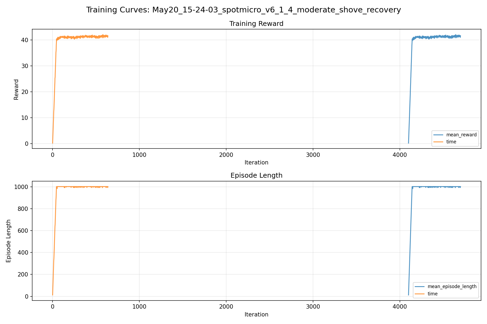
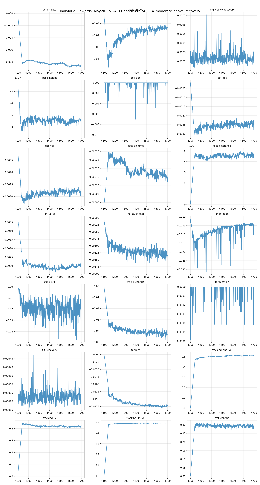
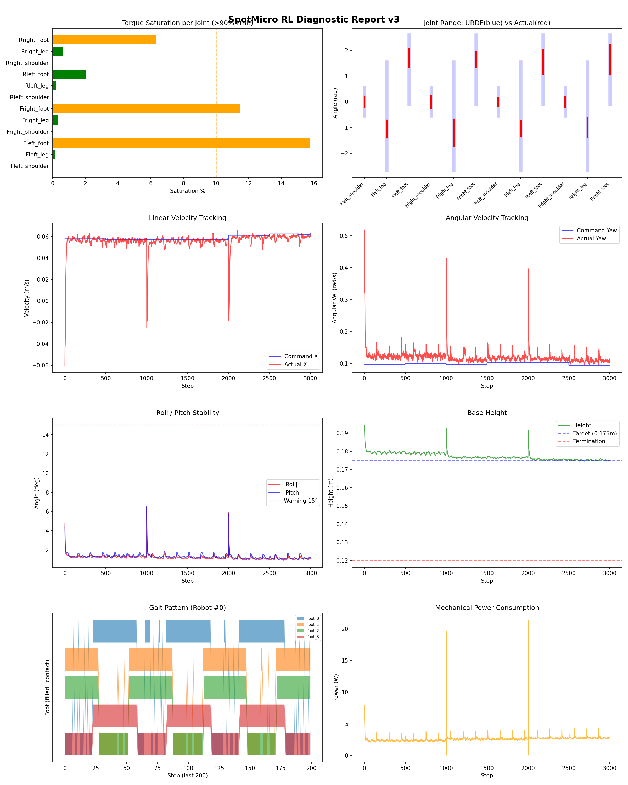
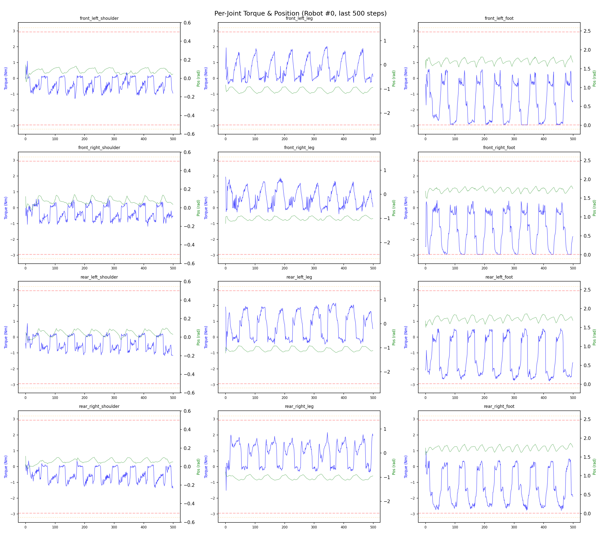
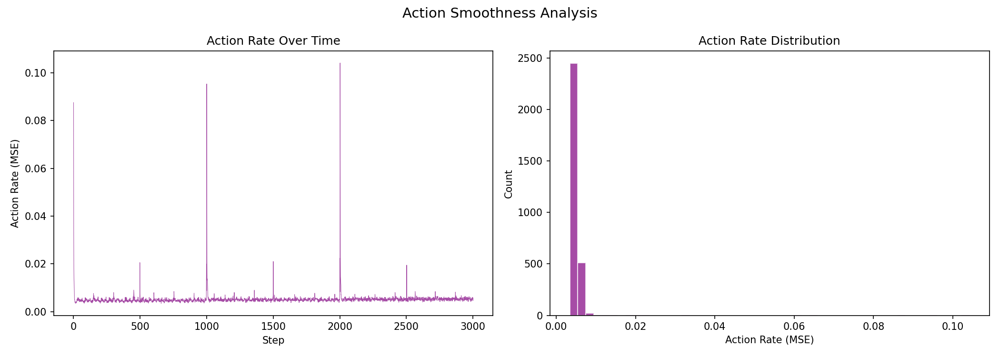

# 실험 070: spotmicro_v6_1_4_moderate_shove_recovery

- **날짜:** 2026-05-20 15:38
- **Task:** spotmicro_test
- **Run name:** `spotmicro_v6_1_4_moderate_shove_recovery`
- **판정:** ✅ PASS

---

## 실험 목적

v6.1.4: recovery 수치 강화

---

## 변경점 (이전 커밋 대비)

```diff
diff --git a/ai_training/rl/legged_gym/legged_gym/envs/spotmicro_test/spotmicro_test_config.py b/ai_training/rl/legged_gym/legged_gym/envs/spotmicro_test/spotmicro_test_config.py
index 557ea8f..a0493dc 100644
--- a/ai_training/rl/legged_gym/legged_gym/envs/spotmicro_test/spotmicro_test_config.py
+++ b/ai_training/rl/legged_gym/legged_gym/envs/spotmicro_test/spotmicro_test_config.py
@@ -121,9 +121,9 @@ class SpotmicroTestCfg(LeggedRobotCfg):
         min_base_height = 0.13
         max_base_tilt_deg = 50.0
         recovery_min_height = 0.165
-        recovery_reward_tilt_threshold_deg = 5.0
+        recovery_reward_tilt_threshold_deg = 6.0
         transition_recovery_horizon_s = 0.75
-        transition_recovery_initial_tilt_threshold_deg = 6.0
+        transition_recovery_initial_tilt_threshold_deg = 8.0
         tracking_sigma = 0.02
         tracking_sigma_ang_vel = 0.03
         swing_contact_grace_time = 0.02
@@ -168,20 +168,20 @@ class SpotmicroTestCfg(LeggedRobotCfg):
         randomize_base_mass = False
         added_mass_range = [-0.2, 0.2]
         push_robots = True
-        push_interval_s = 4
-        max_push_vel_xy = 0.18
-        max_push_ang_vel_xy = 0.85
-        max_push_ang_vel_z = 0.20
-        push_lin_vel_clip = 0.30
-        push_ang_vel_xy_clip = 1.20
-        push_ang_vel_z_clip = 0.35
+        push_interval_s = 3
+        max_push_vel_xy = 0.22
+        max_push_ang_vel_xy = 1.05
+        max_push_ang_vel_z = 0.25
+        push_lin_vel_clip = 0.35
+        push_ang_vel_xy_clip = 1.45
+        push_ang_vel_z_clip = 0.45
         action_delay = True
         action_delay_range = [1, 2]
-        recovery_roll_pitch_range_deg = 12.0
-        recovery_lin_vel_xy_range = 0.12
-        recovery_lin_vel_z_range = 0.035
-        recovery_ang_vel_xy_range = 0.80
-        recovery_ang_vel_z_range = 0.30
+        recovery_roll_pitch_range_deg = 14.0
+        recovery_lin_vel_xy_range = 0.14
+        recovery_lin_vel_z_range = 0.04
+        recovery_ang_vel_xy_range = 1.00
+        recovery_ang_vel_z_range = 0.35
 
 
 class SpotmicroTestCfgPPO(LeggedRobotCfgPPO):
@@ -191,10 +191,10 @@ class SpotmicroTestCfgPPO(LeggedRobotCfgPPO):
         learning_rate = 1e-4
 
     class runner(LeggedRobotCfgPPO.runner):
-        run_name = 'spotmicro_v6_1_3_stronger_transition_push'
+        run_name = 'spotmicro_v6_1_4_moderate_shove_recovery'
         experiment_name = 'spotmicro_test'
-        max_iterations = 800
+        max_iterations = 600
         save_interval = 100
         resume = True
-        load_run = "May20_13-27-15_spotmicro_v6_1_2_transition_recovery"
-        checkpoint = 3300
+        load_run = "May20_14-29-52_spotmicro_v6_1_3_stronger_transition_push"
+        checkpoint = 4100
```

**변경 요약:**
  - recovery_reward_tilt_threshold_deg = 5.0
  + recovery_reward_tilt_threshold_deg = 6.0
  - transition_recovery_initial_tilt_threshold_deg = 6.0
  + transition_recovery_initial_tilt_threshold_deg = 8.0
  - push_interval_s = 4
  - max_push_vel_xy = 0.18
  - max_push_ang_vel_xy = 0.85
  - max_push_ang_vel_z = 0.20
  - push_lin_vel_clip = 0.30
  - push_ang_vel_xy_clip = 1.20
  - push_ang_vel_z_clip = 0.35
  + push_interval_s = 3
  + max_push_vel_xy = 0.22
  + max_push_ang_vel_xy = 1.05
  + max_push_ang_vel_z = 0.25
  + push_lin_vel_clip = 0.35
  + push_ang_vel_xy_clip = 1.45
  + push_ang_vel_z_clip = 0.45
  - recovery_roll_pitch_range_deg = 12.0
  - recovery_lin_vel_xy_range = 0.12
  - recovery_lin_vel_z_range = 0.035
  - recovery_ang_vel_xy_range = 0.80
  - recovery_ang_vel_z_range = 0.30
  + recovery_roll_pitch_range_deg = 14.0
  + recovery_lin_vel_xy_range = 0.14
  + recovery_lin_vel_z_range = 0.04
  + recovery_ang_vel_xy_range = 1.00
  + recovery_ang_vel_z_range = 0.35
  - run_name = 'spotmicro_v6_1_3_stronger_transition_push'
  + run_name = 'spotmicro_v6_1_4_moderate_shove_recovery'
  - max_iterations = 800
  + max_iterations = 600
  - load_run = "May20_13-27-15_spotmicro_v6_1_2_transition_recovery"
  - checkpoint = 3300
  + load_run = "May20_14-29-52_spotmicro_v6_1_3_stronger_transition_push"
  + checkpoint = 4100

---

## 현재 Reward Scales

| Reward | Scale |
|--------|-------|
| action_rate | -0.05 |
| ang_vel_xy | -1.0 |
| ang_vel_xy_recovery | 0.5 |
| base_height | -2.0 |
| collision | -1.0 |
| dof_acc | -2.5e-07 |
| dof_vel | -0.0005 |
| feet_air_time | 0.04 |
| feet_clearance | 0.03 |
| lin_vel_z | -2.0 |
| no_stuck_feet | -0.2 |
| orientation | -10.0 |
| stand_still | -0.4 |
| swing_contact | -0.45 |
| termination | -20.0 |
| tilt_recovery | 4.0 |
| torques | -0.001 |
| tracking_ang_vel | 0.6 |
| tracking_ik | 0.6 |
| tracking_lin_vel | 1.0 |
| trot_contact | 0.35 |

---

## 진단 결과 (Diagnostic)

### 핵심 지표

- ✅ Timeout: 99.8% (≥80%)
- ✅ 속도오차 X: 0.0202 m/s (<0.08)
- ✅ 토크포화: 3.1% (<10%)
- ✅ 자세: roll 1.2°, pitch 1.3° (안정)
- ✅ 조기종료: 0.0% (<5%)
- ⚠️ 전환복구: 50.0% (50~80%)

### 상세 수치

| 지표 | 값 |
|------|-----|
| Timeout% | 99.80506822612085 |
| 조기종료% | 0.0 |
| 속도오차 X | 0.02017039991915226 m/s |
| 속도오차 Y | 0.018873916938900948 m/s |
| 각속도오차 | 0.0750143751502037 rad/s |
| 토크포화% | 3.07504995004995 |
| 평균 높이 | 0.17714918405065685 m |
| Roll (평균) | 1.2221201658248901° |
| Pitch (평균) | 1.333998203277588° |
| Action Rate | 0.005155371036380529 |
| 평균 전력 | 2.618412733078003 W |
| CoT | 1.6354921158756437 |
| Recovery 성공률 | 97.94871794871794% |
| Recovery eligible trials | 585 |
| 평균 회복 시간 | 0.09417102756352533 s |
| Recovery 조기 실패율 | 0.0% |
| Transition recovery 성공률 | 50.0% |
| Transition recovery eligible trials | 10 |
| 평균 Transition recovery 시간 | 0.04799999892711639 s |

## Recovery Assist 분석

| 지표 | 값 |
|------|-----|
| 판정 | ✅ Recovery 안정적 |
| Recovery 성공률 | 97.9% |
| 성공/실패 | 573 / 12 |
| Eligible trials | 585 / 769 |
| 평균 회복 시간 | 0.094s |
| 조기 실패율 | 0.0% |
| 평가 horizon | 1.0 s |
| 초기 tilt 기준 | 7.0° |
| 안정 기준 | roll/pitch < 5.0°, height > 0.165m |
| 평균 초기 tilt | 10.951832139555277° |
| 평균 초기 roll/pitch | 8.116316228057219° / 8.140232119290943° |
| 1초 후 평균 roll/pitch | 1.2593704619637938° / 1.3265194732906758° |
| 1초 내 최대 roll/pitch 평균 | 8.436912245424384° / 8.51842490648612° |

> 해석: `Recovery 성공률`은 초기 tilt가 기준 이상인 episode 중 1초 내 안정 자세로 복귀한 비율입니다. 조기 실패율이 높으면 reset 직후 바로 넘어지는 것이고, 평균 회복 시간이 짧을수록 위기 대응이 빠른 것입니다.


## Transition Recovery 분석

| 지표 | 값 |
|------|-----|
| 판정 | ⚠️ 일부 전환 복구 가능 |
| Transition recovery 성공률 | 50.0% |
| 성공/실패 | 5 / 5 |
| Eligible trials | 10 / 4864 |
| 평균 회복 시간 | 0.048s |
| 조기 실패율 | 0.0% |
| 평가 horizon | 0.75 s |
| push 후 eligible 기준 | max roll/pitch > 8.0° |
| 안정 기준 | roll/pitch < 5.0°, height > 0.165m |
| 평균 최대 tilt | 14.451055894007624° |
| horizon 후 평균 roll/pitch | 3.5774964798241853° / 4.440282723307609° |

> 해석: `Transition Recovery`는 학습 중 push/roll-pitch angular impulse가 들어간 뒤 일정 시간 안에 자세가 안정 기준으로 돌아오는지를 봅니다.


## Command Mode별 회전 추종 분석

| 모드 | 비율 | 샘플 수 | 평균 abs(cmd_wz) | 평균 abs(actual_wz) | yaw 오차 | 상태 |
|------|------|---------|------------------|---------------------|----------|------|
| 정지 | 13.2% | 101596 | 0.0260 | 0.0660 | 0.0637 | ❌ |
| 직진/저회전 | 40.6% | 312190 | 0.0760 | 0.1075 | 0.0796 | ✅ |
| 제자리 회전 | 10.6% | 81593 | 0.1742 | 0.1686 | 0.0754 | ✅ |
| 전진+회전 | 13.5% | 104117 | 0.1754 | 0.1831 | 0.0823 | ⚠️ |
| 큰 회전명령 | 0.0% | 0 | N/A | N/A | N/A | N/A |

> 해석 기준: `제자리 회전`만 나쁘면 pure turn 학습/보행 패턴 문제, `큰 회전명령`만 나쁘면 yaw 명령 범위가 현재 토크/보폭 한계보다 큰 문제, `정지`가 나쁘면 stop drift 문제로 보면 됩니다.
        


## 학습 곡선 분석

| 지표 | 값 | 판정 |
|------|-----|------|
| 수렴 iter (90%) | 4139 | 느림 |
| 후반 안정성 (CV) | 0.006 | 안정 |
| 정체 구간 | 있음 (iter 4141, 29 iter) | |


## Per-leg 분석

### 발별 접촉/공중 비율

| 발 | 접촉% | 공중% |
|-----|-------|------|
| foot_0 | 70.9% | 29.1% |
| foot_1 | 70.5% | 29.5% |
| foot_2 | 64.9% | 35.1% |
| foot_3 | 67.6% | 32.4% |

### 관절별 토크 포화

| 관절 | 포화% | 최대토크 | 한계 | 상태 |
|------|------|---------|------|------|
| front_left_shoulder | 0.0% | 2.940 | 2.940 | ✅ |
| front_left_leg | 0.1% | 2.940 | 2.940 | ✅ |
| front_left_foot | 15.7% | 2.940 | 2.940 | ⚠️ |
| front_right_shoulder | 0.0% | 2.940 | 2.940 | ✅ |
| front_right_leg | 0.3% | 2.940 | 2.940 | ✅ |
| front_right_foot | 11.5% | 2.940 | 2.940 | ⚠️ |
| rear_left_shoulder | 0.0% | 2.284 | 2.940 | ✅ |
| rear_left_leg | 0.2% | 2.940 | 2.940 | ✅ |
| rear_left_foot | 2.1% | 2.940 | 2.940 | ✅ |
| rear_right_shoulder | 0.0% | 2.831 | 2.940 | ✅ |
| rear_right_leg | 0.6% | 2.940 | 2.940 | ✅ |
| rear_right_foot | 6.3% | 2.940 | 2.940 | ⚠️ |


## Gait 분석

| 지표 | 값 |
|------|-----|
| Gait 주파수 | 0.21 Hz |
| Gait 주기 | 60 steps |
| 대각 동기화율 | 90.3% |
| L/R 비대칭 | 0.0%p |
| 판정 | ✅ Trot 패턴 / ✅ 대칭 |


## 관절별 상세

| 관절 | 토크포화% | 사용범위% | 편향(rad) | 한계근접% | 상태 |
|------|----------|----------|----------|----------|------|
| front_left_shoulder | 0.0% | 38% | +0.010 | 0.0% | ✅ |
| front_left_leg | 0.1% | 16% | -1.056 | 0.0% | ⚠️ |
| front_left_foot | 15.7% | 26% | +1.703 | 0.0% | ⚠️ |
| front_right_shoulder | 0.0% | 43% | +0.000 | 0.0% | ✅ |
| front_right_leg | 0.3% | 25% | -1.199 | 0.0% | ⚠️ |
| front_right_foot | 11.5% | 23% | +1.652 | 0.0% | ⚠️ |
| rear_left_shoulder | 0.0% | 30% | -0.007 | 0.0% | ✅ |
| rear_left_leg | 0.2% | 14% | -1.045 | 0.0% | ⚠️ |
| rear_left_foot | 2.1% | 35% | +1.548 | 0.0% | ⚠️ |
| rear_right_shoulder | 0.0% | 34% | -0.006 | 0.0% | ✅ |
| rear_right_leg | 0.6% | 18% | -0.990 | 0.0% | ⚠️ |
| rear_right_foot | 6.3% | 43% | +1.632 | 0.0% | ⚠️ |


## 에너지 효율 상세

| 지표 | 값 |
|------|-----|
| 평균 전력 | 2.62 W |
| 피크 전력 | 21.41 W |
| 피크/평균 비율 | 8.2x |
| CoT | 1.64 |

### 관절별 전력 분배

| 관절 | 평균전력(W) | 비율% |
|------|-----------|-------|
| rear_right_foot | 0.511 | 19.5% |
| front_left_foot | 0.443 | 16.9% |
| front_right_foot | 0.362 | 13.8% |
| rear_left_foot | 0.293 | 11.2% |
| rear_right_leg | 0.263 | 10.0% |
| front_right_leg | 0.190 | 7.3% |
| front_left_leg | 0.179 | 6.9% |
| rear_left_leg | 0.171 | 6.5% |
| rear_right_shoulder | 0.057 | 2.2% |
| rear_left_shoulder | 0.052 | 2.0% |
| front_right_shoulder | 0.049 | 1.9% |
| front_left_shoulder | 0.049 | 1.9% |


## 이전 실험 대비 비교

| 지표 | 이전 (exp069) | 현재 (exp070) | 변화 |
|------|-------|-------|------|
| Timeout% | 99.8% | 99.8% | → 유지 |
| 속도오차 X | 0.0203 | 0.0202 | ✅ ↓ 0.0001m/s |
| 토크포화 | 2.7% | 3.1% | ⚠️ ↑ 0.4087% |
| Roll | 1.2° | 1.2° | ⚠️ ↑ 0.0078° |
| Pitch | 1.2° | 1.3° | ⚠️ ↑ 0.0960° |
| 평균 전력 | 2.6294W | 2.6184W | ✅ ↓ 0.0110W |


## Tensorboard 학습 곡선 요약

| 스칼라 | 최종값 | 최대 | 최소 | 후반10% 평균 |
|--------|--------|------|------|-------------|
| rew_action_rate | -0.0086 | -0.0002 | -0.0089 | -0.0086 |
| rew_ang_vel_xy | -0.0337 | -0.0225 | -0.0673 | -0.0338 |
| rew_ang_vel_xy_recovery | 0.0002 | 0.0007 | 0.0001 | 0.0002 |
| rew_base_height | -0.0001 | -0.0000 | -0.0001 | -0.0001 |
| rew_collision | 0.0000 | 0.0000 | -0.0101 | -0.0000 |
| rew_dof_acc | -0.0024 | -0.0002 | -0.0031 | -0.0025 |
| rew_dof_vel | -0.0017 | -0.0001 | -0.0023 | -0.0018 |
| rew_feet_air_time | 0.0001 | 0.0003 | -0.0000 | 0.0002 |
| rew_feet_clearance | 0.0000 | 0.0001 | 0.0000 | 0.0000 |
| rew_lin_vel_z | -0.0029 | -0.0003 | -0.0033 | -0.0030 |
| rew_no_stuck_feet | -0.0014 | -0.0000 | -0.0019 | -0.0013 |
| rew_orientation | -0.0050 | -0.0011 | -0.0312 | -0.0045 |
| rew_stand_still | -0.0206 | -0.0001 | -0.0472 | -0.0204 |
| rew_swing_contact | -0.0437 | -0.0007 | -0.0477 | -0.0424 |
| rew_termination | 0.0000 | 0.0000 | -0.0006 | -0.0000 |
| rew_tilt_recovery | 0.0002 | 0.0005 | 0.0002 | 0.0002 |
| rew_torques | -0.0172 | -0.0001 | -0.0179 | -0.0175 |
| rew_tracking_ang_vel | 0.5119 | 0.5173 | 0.0030 | 0.5143 |
| rew_tracking_ik | 0.4248 | 0.4467 | 0.0054 | 0.4181 |
| rew_tracking_lin_vel | 0.9765 | 0.9791 | 0.0069 | 0.9766 |
| rew_trot_contact | 0.2897 | 0.3113 | 0.0034 | 0.2941 |
| learning_rate | 0.0001 | 0.0002 | 0.0000 | 0.0001 |
| surrogate | -0.0017 | 0.0020 | -0.0036 | -0.0015 |
| value_function | 0.0013 | 0.0095 | 0.0008 | 0.0019 |
| collection time | 0.7591 | 0.9630 | 0.7146 | 0.7539 |
| learning_time | 0.2849 | 0.3408 | 0.2747 | 0.2861 |
| total_fps | 94159.0000 | 98611.0000 | 76615.0000 | 94686.6833 |
| mean_noise_std | 0.0600 | 0.0607 | 0.0553 | 0.0593 |
| mean_episode_length | 1002.0000 | 1002.0000 | 12.5000 | 1001.5018 |
| time | 1002.0000 | 1002.0000 | 12.5000 | 1001.5018 |
| mean_reward | 41.5708 | 42.0713 | 0.2285 | 41.5648 |
| time | 41.5708 | 42.0713 | 0.2285 | 41.5648 |

총 학습 iteration: 4699


---

## 그래프

### Tensorboard 학습 곡선



### Diagnostic 결과





---

## 결론 및 다음 실험 방향

**자동 판정:** ✅ PASS

대부분 기준을 통과했으나 일부 항목이 보통 수준입니다.
  - ⚠️ 전환복구: 50.0% (50~80%)

> 💡 위 결론은 자동 생성되었습니다. 필요시 수정하세요.

---

## 메모

_(추가 메모가 있으면 여기에 작성)_

