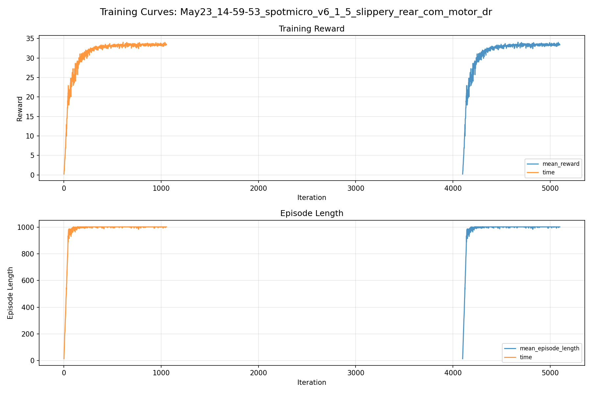
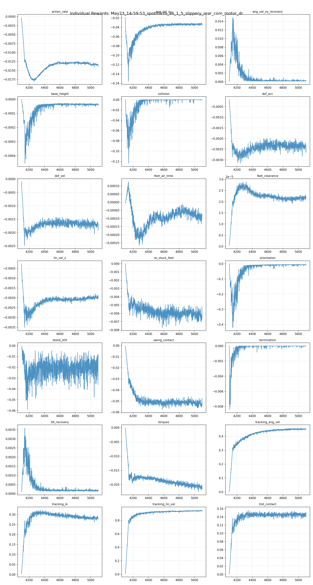
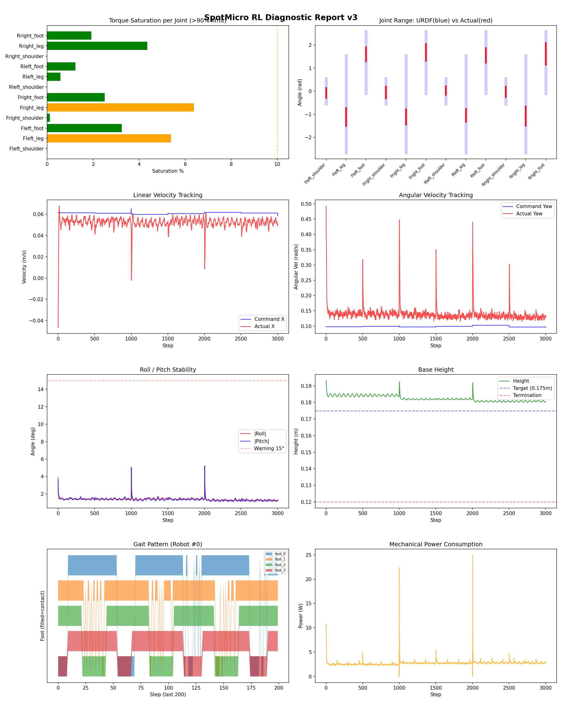
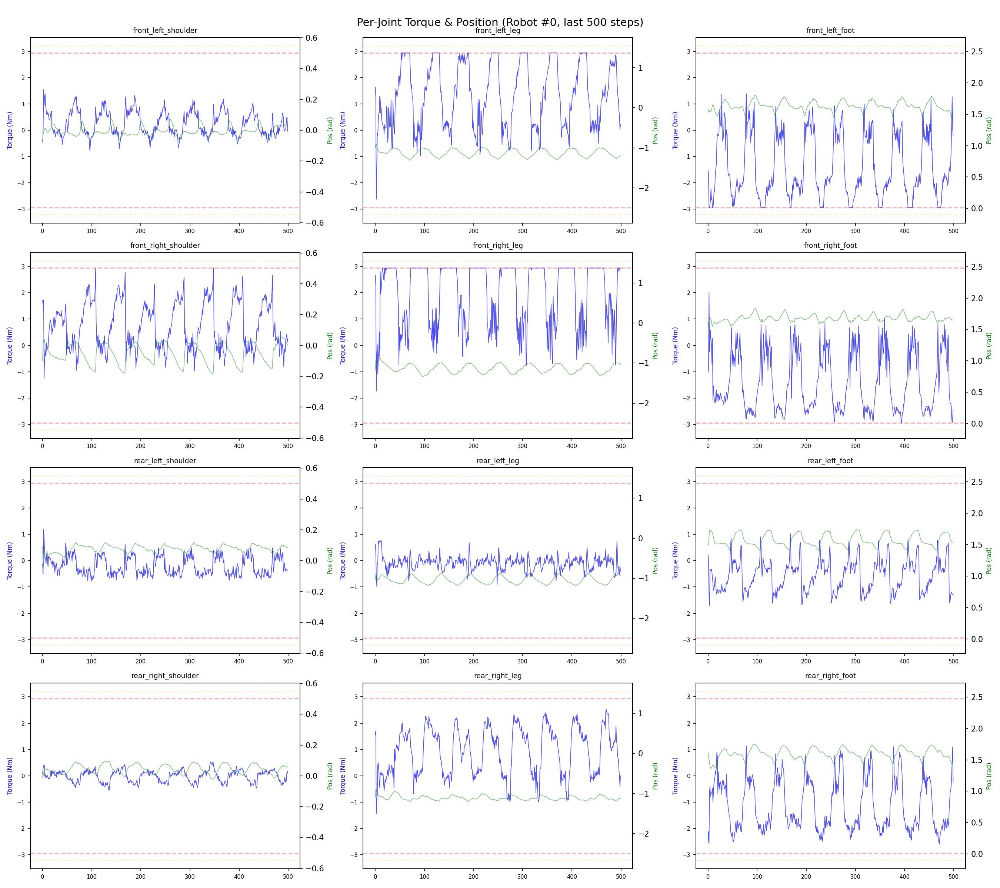
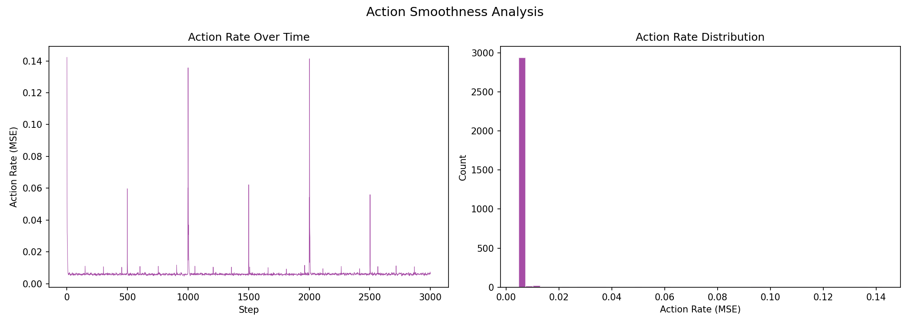

# 실험 071: spotmicro_v6_1_5_slippery_rear_com_motor_dr

- **날짜:** 2026-05-23 15:25
- **Task:** spotmicro_test
- **Run name:** `spotmicro_v6_1_5_slippery_rear_com_motor_dr`
- **판정:** ✅ PASS

---

## 실험 목적

v6.1.5: 랜덤화 추가 및 마찰 감소

---

## 변경점 (이전 커밋 대비)

```diff
diff --git a/ai_training/rl/legged_gym/legged_gym/envs/spotmicro_test/spotmicro_test.py b/ai_training/rl/legged_gym/legged_gym/envs/spotmicro_test/spotmicro_test.py
index 7360f46..014b1f4 100644
--- a/ai_training/rl/legged_gym/legged_gym/envs/spotmicro_test/spotmicro_test.py
+++ b/ai_training/rl/legged_gym/legged_gym/envs/spotmicro_test/spotmicro_test.py
@@ -3,13 +3,14 @@ from isaacgym.torch_utils import torch_rand_float, quat_from_euler_xyz
 from isaacgym import gymtorch
 from pathlib import Path
 import math
+import numpy as np
 import sys
 import torch
 
 
 def _ensure_locomotion_common_on_path():
     try:
-        from locomotion_common import TorchSharedTrotReference  # noqa: F401
+        from locomotion_common import SharedTrotReference  # noqa: F401
         return
     except ImportError:
         pass
@@ -22,7 +23,138 @@ def _ensure_locomotion_common_on_path():
 
 
 _ensure_locomotion_common_on_path()
-from locomotion_common import TorchSharedTrotReference
+
+
+class TorchSharedTrotReference:
+    def __init__(
+        self,
+        device,
+        dtype=torch.float,
+        gait_period=1.0,
+        duty_factor=0.55,
+        body_height=(0.170, 0.170, 0.170, 0.170),
+        step_height=(0.013, 0.013, 0.016, 0.016),
+        default_foot_x=(-0.010, -0.010, -0.010, -0.010),
+        default_foot_y=(0.0, 0.0, 0.0, 0.0),
+        leg_origin_x=(0.093, 0.093, -0.093, -0.093),
+        leg_origin_y=(0.036, -0.036, 0.036, -0.036),
+        shoulder_sign=(1.0, -1.0, 1.0, -1.0),
+        phase_offsets=(0.0, 0.5, 0.5, 0.0),
+        max_stride_x=0.070,
+        max_stride_y=0.035,
+        upper_link_x=0.0,
+        upper_link_z=0.105,
+        lower_link=0.130,
+        shoulder_y_gain=1.0,
+        shoulder_limit=0.16,
+        joint_min=None,
+        joint_max=None,
+    ):
+        self.device = device
+        self.dtype = dtype
+        self.gait_period = float(gait_period)
+        self.duty_factor = float(duty_factor)
+        self.max_stride_x = float(max_stride_x)
+        self.max_stride_y = float(max_stride_y)
+        self.upper_link_x = float(upper_link_x)
+        self.upper_link_z = float(upper_link_z)
+        self.lower_link = float(lower_link)
+        self.shoulder_y_gain = float(shoulder_y_gain)
+        self.shoulder_limit = float(shoulder_limit)
+
+        self.body_height = self._tensor4(body_height)
+        self.step_height = self._tensor4(step_height)
+        self.default_foot_x = self._tensor4(default_foot_x)
+        self.default_foot_y = self._tensor4(default_foot_y)
+        self.leg_origin_x = self._tensor4(leg_origin_x)
+        self.leg_origin_y = self._tensor4(leg_origin_y)
+        self.shoulder_sign = self._tensor4(shoulder_sign)
+        self.phase_offsets = self._tensor4(phase_offsets)
+
+        if joint_min is not None and joint_max is not None:
+            self.joint_min = torch.tensor(
+                joint_min, device=device, dtype=dtype).view(1, 12)
+            self.joint_max = torch.tensor
```

**변경 요약:**
  + import numpy as np
  - from locomotion_common import TorchSharedTrotReference  # noqa: F401
  + from locomotion_common import SharedTrotReference  # noqa: F401
  - from locomotion_common import TorchSharedTrotReference
  + class TorchSharedTrotReference:
  + def __init__(
  + self,
  + device,
  + dtype=torch.float,
  + gait_period=1.0,
  + duty_factor=0.55,
  + body_height=(0.170, 0.170, 0.170, 0.170),
  + step_height=(0.013, 0.013, 0.016, 0.016),
  + default_foot_x=(-0.010, -0.010, -0.010, -0.010),
  + default_foot_y=(0.0, 0.0, 0.0, 0.0),
  + leg_origin_x=(0.093, 0.093, -0.093, -0.093),
  + leg_origin_y=(0.036, -0.036, 0.036, -0.036),
  + shoulder_sign=(1.0, -1.0, 1.0, -1.0),
  + phase_offsets=(0.0, 0.5, 0.5, 0.0),
  + max_stride_x=0.070,
  + max_stride_y=0.035,
  + upper_link_x=0.0,
  + upper_link_z=0.105,
  + lower_link=0.130,
  + shoulder_y_gain=1.0,
  + shoulder_limit=0.16,
  + joint_min=None,
  + joint_max=None,
  + ):
  + self.device = device
  + self.dtype = dtype
  + self.gait_period = float(gait_period)
  + self.duty_factor = float(duty_factor)
  + self.max_stride_x = float(max_stride_x)
  + self.max_stride_y = float(max_stride_y)
  + self.upper_link_x = float(upper_link_x)
  + self.upper_link_z = float(upper_link_z)
  + self.lower_link = float(lower_link)
  + self.shoulder_y_gain = float(shoulder_y_gain)
  + self.shoulder_limit = float(shoulder_limit)
  + self.body_height = self._tensor4(body_height)
  + self.step_height = self._tensor4(step_height)
  + self.default_foot_x = self._tensor4(default_foot_x)
  + self.default_foot_y = self._tensor4(default_foot_y)
  + self.leg_origin_x = self._tensor4(leg_origin_x)
  + self.leg_origin_y = self._tensor4(leg_origin_y)
  + self.shoulder_sign = self._tensor4(shoulder_sign)
  + self.phase_offsets = self._tensor4(phase_offsets)
  + if joint_min is not None and joint_max is not None:
  + self.joint_min = torch.tensor(
  + joint_min, device=device, dtype=dtype).view(1, 12)
  + self.joint_max = torch.tensor(
  + joint_max, device=device, dtype=dtype).view(1, 12)
  + else:
  + self.joint_min = None
  + self.joint_max = None
  + def _tensor4(self, values):
  + return torch.tensor(values, device=self.device, dtype=self.dtype).view(1, 4)
  + def get_reference(self, phase, commands):
  + if phase.dim() == 1:
  + phase = phase.unsqueeze(1)
  + cmd_vx = commands[:, 0:1]
  + cmd_vy = commands[:, 1:2]
  + cmd_wz = commands[:, 2:3]
  + stance_time = self.gait_period * self.duty_factor
  + foot_vx = cmd_vx - cmd_wz * self.leg_origin_y
  + foot_vy = cmd_vy + cmd_wz * self.leg_origin_x
  + stride_x = torch.clamp(foot_vx * stance_time, -self.max_stride_x, self.max_stride_x)
  + stride_y = torch.clamp(foot_vy * stance_time, -self.max_stride_y, self.max_stride_y)
  + leg_phase = torch.remainder(phase + self.phase_offsets, 1.0)
  + stance = leg_phase < self.duty_factor
  + s_stance = torch.clamp(leg_phase / self.duty_factor, 0.0, 1.0)
  + s_swing = torch.clamp(
  + (leg_phase - self.duty_factor) / (1.0 - self.duty_factor),
  + 0.0,
  + 1.0,
  + )
  + smooth_swing = s_swing * s_swing * (3.0 - 2.0 * s_swing)
  + x_stance = stride_x * (0.5 - s_stance)
  + y_stance = stride_y * (0.5 - s_stance)
  + x_swing = stride_x * (-0.5 + smooth_swing)
  + y_swing = stride_y * (-0.5 + smooth_swing)
  + z_swing = self.step_height * torch.sin(math.pi * s_swing)
  + x = self.default_foot_x + torch.where(stance, x_stance, x_swing)
  + y = self.default_foot_y + torch.where(stance, y_stance, y_swing)
  + z = -self.body_height + torch.where(stance, torch.zeros_like(z_swing), z_swing)
  + shoulder = self.shoulder_y_gain * torch.atan2(y, -z)
  + shoulder = torch.clamp(shoulder, -self.shoulder_limit, self.shoulder_limit)
  + shoulder = shoulder * self.shoulder_sign
  + z_eff = -torch.sqrt(torch.clamp(z * z + y * y, min=1.0e-9))
  + thigh, knee = self._solve_sagittal_ik(x, z_eff)
  + target = torch.stack((shoulder, thigh, knee), dim=2).reshape(commands.shape[0], 12)
  + if self.joint_min is not None:
  + target = torch.max(torch.min(target, self.joint_max), self.joint_min)
  + return target
  + def _solve_sagittal_ik(self, x, z):
  + upper_eff = math.sqrt(
  + self.upper_link_x * self.upper_link_x
  + + self.upper_link_z * self.upper_link_z
  + )
  + upper_alpha = math.atan2(self.upper_link_x, self.upper_link_z)
  + r2 = x * x + z * z
  + cos_knee = (
  + r2 - upper_eff * upper_eff - self.lower_link * self.lower_link
  + ) / (2.0 * upper_eff * self.lower_link)
  + cos_knee = torch.clamp(cos_knee, -1.0, 1.0)
  + sin_knee = torch.sqrt(torch.clamp(1.0 - cos_knee * cos_knee, min=0.0))
  + knee_raw = torch.atan2(sin_knee, cos_knee)
  + a = upper_eff + self.lower_link * cos_knee
  + b = self.lower_link * sin_knee
  + det = a * a + b * b
  + z_neg = -z
  + sin_thigh = (a * x - b * z_neg) / det
  + cos_thigh = (b * x + a * z_neg) / det
  + thigh = torch.atan2(sin_thigh, cos_thigh) - upper_alpha
  + knee = knee_raw + upper_alpha
  + return thigh, knee
  + self._init_domain_randomization_buffers()
  + def _init_domain_randomization_buffers(self):
  + cfg = self.cfg.domain_rand
  + self.motor_strength_scales = torch.ones(
  + self.num_envs, self.num_actions, dtype=torch.float, device=self.device)
  + self.stiffness_scales = torch.ones(
  + self.num_envs, self.num_actions, dtype=torch.float, device=self.device)
  + self.damping_scales = torch.ones(
  + self.num_envs, self.num_actions, dtype=torch.float, device=self.device)
  + self.joint_obs_offsets = torch.zeros(
  + self.num_envs, self.num_dof, dtype=torch.float, device=self.device)
  + if getattr(cfg, "randomize_motor_strength", False):
  + rng = cfg.motor_strength_range
  + self.motor_strength_scales = torch_rand_float(
  + rng[0], rng[1],
  + (self.num_envs, self.num_actions),
  + device=self.device,
  + )
  + print(
  + f"[DR] Motor strength scale: "
  + f"{self.motor_strength_scales.min().item():.3f} ~ "
  + f"{self.motor_strength_scales.max().item():.3f}")
  + if getattr(cfg, "randomize_pd_gains", False):
  + k_rng = cfg.stiffness_scale_range
  + d_rng = cfg.damping_scale_range
  + self.stiffness_scales = torch_rand_float(
  + k_rng[0], k_rng[1],
  + (self.num_envs, self.num_actions),
  + device=self.device,
  + )
  + self.damping_scales = torch_rand_float(
  + d_rng[0], d_rng[1],
  + (self.num_envs, self.num_actions),
  + device=self.device,
  + )
  + print(
  + f"[DR] Stiffness scale: "
  + f"{self.stiffness_scales.min().item():.3f} ~ "
  + f"{self.stiffness_scales.max().item():.3f}, "
  + f"damping scale: {self.damping_scales.min().item():.3f} ~ "
  + f"{self.damping_scales.max().item():.3f}")
  + if getattr(cfg, "randomize_joint_obs_offset", False):
  + self._resample_joint_obs_offsets(
  + torch.arange(self.num_envs, device=self.device))
  + if getattr(self.cfg.domain_rand, "randomize_joint_obs_offset", False):
  + self._resample_joint_obs_offsets(env_ids)
  + def _process_rigid_shape_props(self, props, env_id):
  + props = super()._process_rigid_shape_props(props, env_id)
  + if env_id == 0 and self.cfg.domain_rand.randomize_friction:
  + print(
  + f"[DR] Plane friction static/dynamic="
  + f"{self.cfg.terrain.static_friction:.3f}/"
  + f"{self.cfg.terrain.dynamic_friction:.3f}")
  + return props
  + def _process_rigid_body_props(self, props, env_id):
  + props = super()._process_rigid_body_props(props, env_id)
  + cfg = self.cfg.domain_rand
  + if getattr(cfg, "randomize_base_com", False):
  + dx = np.random.uniform(
  + cfg.base_com_offset_x_range[0],
  + cfg.base_com_offset_x_range[1],
  + )
  + dy = np.random.uniform(
  + cfg.base_com_offset_y_range[0],
  + cfg.base_com_offset_y_range[1],
  + )
  + dz = np.random.uniform(
  + cfg.base_com_offset_z_range[0],
  + cfg.base_com_offset_z_range[1],
  + )
  + props[0].com.x += dx
  + props[0].com.y += dy
  + props[0].com.z += dz
  + if env_id < 5:
  + print(
  + f"[DR] Env {env_id}: base COM offset "
  + f"dx={dx:+.3f}, dy={dy:+.3f}, dz={dz:+.3f}")
  + return props
  + dof_pos_obs = self.dof_pos + self.joint_obs_offsets
  - (self.dof_pos - ref_dof_pos) * self.obs_scales.dof_pos,  # 12
  + (dof_pos_obs - ref_dof_pos) * self.obs_scales.dof_pos,  # 12
  + def _resample_joint_obs_offsets(self, env_ids):
  + if len(env_ids) == 0:
  + return
  + rng = self.cfg.domain_rand.joint_obs_offset_range
  + self.joint_obs_offsets[env_ids] = torch_rand_float(
  + rng[0], rng[1],
  + (len(env_ids), self.num_dof),
  + device=self.device,
  + )
  + def _recovery_relief_scale(self, scale_attr):
  + threshold_deg = getattr(
  + self.cfg.rewards, "recovery_relief_tilt_threshold_deg", 7.0)
  + threshold = math.sin(math.radians(threshold_deg))
  + relief = getattr(self.cfg.rewards, scale_attr, 0.25)
  + tilt = torch.norm(self.projected_gravity[:, :2], dim=1)
  + return torch.where(
  + tilt > threshold,
  + torch.full_like(tilt, float(relief)),
  + torch.ones_like(tilt),
  + )
  + penalty *= self._recovery_relief_scale("recovery_gait_relief_scale")
  - return torch.sum(dragging * is_moving, dim=1) / 4.0
  + penalty = torch.sum(dragging * is_moving, dim=1) / 4.0
  + return penalty * self._recovery_relief_scale("recovery_gait_relief_scale")
  - torques = self.p_gains * (actions_scaled + ref_dof_pos - self.dof_pos) - self.d_gains * self.dof_vel
  + p_gains = self.p_gains.unsqueeze(0) * self.stiffness_scales
  + d_gains = self.d_gains.unsqueeze(0) * self.damping_scales
  + torques = p_gains * (actions_scaled + ref_dof_pos - self.dof_pos) - d_gains * self.dof_vel
  + torques = torques * self.motor_strength_scales
  - return torch.exp(-error / sigma)
  + reward = torch.exp(-error / sigma)
  + return reward * self._recovery_relief_scale("recovery_ik_relief_scale")
  - return torch.sum(match * is_moving, dim=1) / 4.0
  + reward = torch.sum(match * is_moving, dim=1) / 4.0
  + return reward * self._recovery_relief_scale("recovery_gait_relief_scale")
  + static_friction = 0.65
  + dynamic_friction = 0.50
  + restitution = 0.0
  - orientation = -10.0
  - torques = -0.0010
  + orientation = -8.0
  + torques = -0.0012
  - action_rate = -0.05
  - base_height = -2.0
  + action_rate = -0.07
  + base_height = -1.5
  - no_stuck_feet = -0.20
  + no_stuck_feet = -0.14
  - feet_clearance = 0.03
  - swing_contact = -0.45
  - trot_contact = 0.35
  - tracking_ik = 0.6
  + feet_clearance = 0.012
  + swing_contact = -0.25
  + trot_contact = 0.20
  + tracking_ik = 0.45
  - tilt_recovery = 4.0
  - ang_vel_xy_recovery = 0.5
  + tilt_recovery = 5.0
  + ang_vel_xy_recovery = 0.8
  + recovery_relief_tilt_threshold_deg = 7.0
  + recovery_gait_relief_scale = 0.25
  + recovery_ik_relief_scale = 0.35
  - randomize_friction = False
  - friction_range = [0.4, 1.2]
  - randomize_base_mass = False
  - added_mass_range = [-0.2, 0.2]
  + randomize_friction = True
  + friction_range = [0.18, 1.05]
  + randomize_base_mass = True
  + added_mass_range = [-0.10, 0.30]
  + randomize_base_com = True
  + base_com_offset_x_range = [-0.055, 0.010]
  + base_com_offset_y_range = [-0.012, 0.012]
  + base_com_offset_z_range = [-0.012, 0.030]
  + randomize_motor_strength = True
  + motor_strength_range = [0.75, 1.10]
  + randomize_pd_gains = True
  + stiffness_scale_range = [0.65, 1.35]
  + damping_scale_range = [0.70, 1.80]
  + randomize_joint_obs_offset = True
  + joint_obs_offset_range = [-0.025, 0.025]
  - max_push_vel_xy = 0.22
  - max_push_ang_vel_xy = 1.05
  - max_push_ang_vel_z = 0.25
  - push_lin_vel_clip = 0.35
  - push_ang_vel_xy_clip = 1.45
  - push_ang_vel_z_clip = 0.45
  + max_push_vel_xy = 0.16
  + max_push_ang_vel_xy = 0.75
  + max_push_ang_vel_z = 0.20
  + push_lin_vel_clip = 0.30
  + push_ang_vel_xy_clip = 1.10
  + push_ang_vel_z_clip = 0.35
  - action_delay_range = [1, 2]
  - recovery_roll_pitch_range_deg = 14.0
  + action_delay_range = [0, 3]
  + recovery_roll_pitch_range_deg = 12.0
  - recovery_ang_vel_xy_range = 1.00
  + recovery_ang_vel_xy_range = 0.85
  - run_name = 'spotmicro_v6_1_4_moderate_shove_recovery'
  + run_name = 'spotmicro_v6_1_5_slippery_rear_com_motor_dr'
  - max_iterations = 600
  + max_iterations = 1000
  - env_cfg.env.num_envs = min(env_cfg.env.num_envs, 64)
  + env_cfg.env.num_envs = min(env_cfg.env.num_envs, 256)

---

## 현재 Reward Scales

| Reward | Scale |
|--------|-------|
| action_rate | -0.07 |
| ang_vel_xy | -1.0 |
| ang_vel_xy_recovery | 0.8 |
| base_height | -1.5 |
| collision | -1.0 |
| dof_acc | -2.5e-07 |
| dof_vel | -0.0005 |
| feet_air_time | 0.04 |
| feet_clearance | 0.012 |
| lin_vel_z | -2.0 |
| no_stuck_feet | -0.14 |
| orientation | -8.0 |
| stand_still | -0.4 |
| swing_contact | -0.25 |
| termination | -20.0 |
| tilt_recovery | 5.0 |
| torques | -0.0012 |
| tracking_ang_vel | 0.6 |
| tracking_ik | 0.45 |
| tracking_lin_vel | 1.0 |
| trot_contact | 0.2 |

---

## 진단 결과 (Diagnostic)

### 핵심 지표

- ✅ Timeout: 100.0% (≥80%)
- ✅ 속도오차 X: 0.0296 m/s (<0.08)
- ✅ 토크포화: 2.1% (<10%)
- ✅ 자세: roll 1.4°, pitch 1.4° (안정)
- ✅ 조기종료: 0.0% (<5%)
- ⚠️ 전환복구: 50.0% (50~80%)

### 상세 수치

| 지표 | 값 |
|------|-----|
| Timeout% | 100.0 |
| 조기종료% | 0.0 |
| 속도오차 X | 0.029600193724036217 m/s |
| 속도오차 Y | 0.022760305553674698 m/s |
| 각속도오차 | 0.09847838431596756 rad/s |
| 토크포화% | 2.141857708263958 |
| 평균 높이 | 0.18237329799157162 m |
| Roll (평균) | 1.3824902772903442° |
| Pitch (평균) | 1.3635469675064087° |
| Action Rate | 0.006369804963469505 |
| 평균 전력 | 2.7301392555236816 W |
| CoT | 1.72888432536347 |
| Recovery 성공률 | 99.23224568138195% |
| Recovery eligible trials | 521 |
| 평균 회복 시간 | 0.0748549306286027 s |
| Recovery 조기 실패율 | 0.0% |
| Transition recovery 성공률 | 50.0% |
| Transition recovery eligible trials | 12 |
| 평균 Transition recovery 시간 | 0.019999999552965164 s |

## Recovery Assist 분석

| 지표 | 값 |
|------|-----|
| 판정 | ✅ Recovery 안정적 |
| Recovery 성공률 | 99.2% |
| 성공/실패 | 517 / 4 |
| Eligible trials | 521 / 768 |
| 평균 회복 시간 | 0.075s |
| 조기 실패율 | 0.0% |
| 평가 horizon | 1.0 s |
| 초기 tilt 기준 | 7.0° |
| 안정 기준 | roll/pitch < 5.0°, height > 0.165m |
| 평균 초기 tilt | 9.754677767743358° |
| 평균 초기 roll/pitch | 7.127853023845768° / 7.500909249107004° |
| 1초 후 평균 roll/pitch | 1.342239691357257° / 1.336545828729868° |
| 1초 내 최대 roll/pitch 평균 | 7.508503208233619° / 7.777384322801615° |

> 해석: `Recovery 성공률`은 초기 tilt가 기준 이상인 episode 중 1초 내 안정 자세로 복귀한 비율입니다. 조기 실패율이 높으면 reset 직후 바로 넘어지는 것이고, 평균 회복 시간이 짧을수록 위기 대응이 빠른 것입니다.


## Transition Recovery 분석

| 지표 | 값 |
|------|-----|
| 판정 | ⚠️ 일부 전환 복구 가능 |
| Transition recovery 성공률 | 50.0% |
| 성공/실패 | 6 / 6 |
| Eligible trials | 12 / 4864 |
| 평균 회복 시간 | 0.020s |
| 조기 실패율 | 0.0% |
| 평가 horizon | 0.75 s |
| push 후 eligible 기준 | max roll/pitch > 8.0° |
| 안정 기준 | roll/pitch < 5.0°, height > 0.165m |
| 평균 최대 tilt | 18.311469933652912° |
| horizon 후 평균 roll/pitch | 13.419946302970251° / 11.436249082364762° |

> 해석: `Transition Recovery`는 학습 중 push/roll-pitch angular impulse가 들어간 뒤 일정 시간 안에 자세가 안정 기준으로 돌아오는지를 봅니다.


## Command Mode별 회전 추종 분석

| 모드 | 비율 | 샘플 수 | 평균 abs(cmd_wz) | 평균 abs(actual_wz) | yaw 오차 | 상태 |
|------|------|---------|------------------|---------------------|----------|------|
| 정지 | 10.6% | 81627 | 0.0251 | 0.0769 | 0.0757 | ❌ |
| 직진/저회전 | 42.3% | 325331 | 0.0723 | 0.1284 | 0.1047 | ⚠️ |
| 제자리 회전 | 10.8% | 83079 | 0.1752 | 0.1885 | 0.0955 | ⚠️ |
| 전진+회전 | 14.6% | 112119 | 0.1733 | 0.1960 | 0.1067 | ⚠️ |
| 큰 회전명령 | 0.0% | 0 | N/A | N/A | N/A | N/A |

> 해석 기준: `제자리 회전`만 나쁘면 pure turn 학습/보행 패턴 문제, `큰 회전명령`만 나쁘면 yaw 명령 범위가 현재 토크/보폭 한계보다 큰 문제, `정지`가 나쁘면 stop drift 문제로 보면 됩니다.
        


## 학습 곡선 분석

| 지표 | 값 | 판정 |
|------|-----|------|
| 수렴 iter (90%) | 4248 | 느림 |
| 후반 안정성 (CV) | 0.007 | 안정 |
| 정체 구간 | 있음 (iter 4362, 49 iter) | |


## Per-leg 분석

### 발별 접촉/공중 비율

| 발 | 접촉% | 공중% |
|-----|-------|------|
| foot_0 | 78.2% | 21.8% |
| foot_1 | 81.2% | 18.8% |
| foot_2 | 68.8% | 31.2% |
| foot_3 | 73.0% | 27.0% |

### 관절별 토크 포화

| 관절 | 포화% | 최대토크 | 한계 | 상태 |
|------|------|---------|------|------|
| front_left_shoulder | 0.0% | 2.940 | 2.940 | ✅ |
| front_left_leg | 5.4% | 2.940 | 2.940 | ⚠️ |
| front_left_foot | 3.2% | 2.940 | 2.940 | ✅ |
| front_right_shoulder | 0.1% | 2.940 | 2.940 | ✅ |
| front_right_leg | 6.4% | 2.940 | 2.940 | ⚠️ |
| front_right_foot | 2.5% | 2.940 | 2.940 | ✅ |
| rear_left_shoulder | 0.0% | 2.798 | 2.940 | ✅ |
| rear_left_leg | 0.6% | 2.940 | 2.940 | ✅ |
| rear_left_foot | 1.2% | 2.940 | 2.940 | ✅ |
| rear_right_shoulder | 0.0% | 2.940 | 2.940 | ✅ |
| rear_right_leg | 4.4% | 2.940 | 2.940 | ✅ |
| rear_right_foot | 1.9% | 2.940 | 2.940 | ✅ |


## Gait 분석

| 지표 | 값 |
|------|-----|
| Gait 주파수 | 0.21 Hz |
| Gait 주기 | 60 steps |
| 대각 동기화율 | 83.3% |
| L/R 비대칭 | 0.0%p |
| 판정 | ✅ Trot 패턴 / ✅ 대칭 |


## 관절별 상세

| 관절 | 토크포화% | 사용범위% | 편향(rad) | 한계근접% | 상태 |
|------|----------|----------|----------|----------|------|
| front_left_shoulder | 0.0% | 40% | -0.068 | 0.0% | ✅ |
| front_left_leg | 5.4% | 18% | -1.119 | 0.0% | ⚠️ |
| front_left_foot | 3.2% | 23% | +1.600 | 0.0% | ⚠️ |
| front_right_shoulder | 0.1% | 48% | -0.055 | 0.0% | ✅ |
| front_right_leg | 6.4% | 16% | -1.115 | 0.0% | ⚠️ |
| front_right_foot | 2.5% | 27% | +1.677 | 0.0% | ⚠️ |
| rear_left_shoulder | 0.0% | 34% | +0.032 | 0.0% | ✅ |
| rear_left_leg | 0.6% | 13% | -1.050 | 0.0% | ⚠️ |
| rear_left_foot | 1.2% | 24% | +1.556 | 0.0% | ⚠️ |
| rear_right_shoulder | 0.0% | 41% | -0.021 | 0.0% | ✅ |
| rear_right_leg | 4.4% | 20% | -1.077 | 0.0% | ⚠️ |
| rear_right_foot | 1.9% | 35% | +1.621 | 0.0% | ⚠️ |


## 에너지 효율 상세

| 지표 | 값 |
|------|-----|
| 평균 전력 | 2.73 W |
| 피크 전력 | 24.93 W |
| 피크/평균 비율 | 9.1x |
| CoT | 1.73 |

### 관절별 전력 분배

| 관절 | 평균전력(W) | 비율% |
|------|-----------|-------|
| rear_right_foot | 0.456 | 16.7% |
| front_left_foot | 0.416 | 15.2% |
| front_right_foot | 0.343 | 12.6% |
| rear_left_foot | 0.321 | 11.7% |
| front_right_leg | 0.309 | 11.3% |
| front_left_leg | 0.273 | 10.0% |
| rear_right_leg | 0.244 | 8.9% |
| rear_left_leg | 0.109 | 4.0% |
| rear_right_shoulder | 0.079 | 2.9% |
| front_left_shoulder | 0.065 | 2.4% |
| front_right_shoulder | 0.064 | 2.4% |
| rear_left_shoulder | 0.051 | 1.9% |


## 이전 실험 대비 비교

| 지표 | 이전 (exp070) | 현재 (exp071) | 변화 |
|------|-------|-------|------|
| Timeout% | 99.8% | 100.0% | ✅ ↑ 0.1949% |
| 속도오차 X | 0.0202 | 0.0296 | ⚠️ ↑ 0.0094m/s |
| 토크포화 | 3.1% | 2.1% | ✅ ↓ 0.9332% |
| Roll | 1.2° | 1.4° | ⚠️ ↑ 0.1604° |
| Pitch | 1.3° | 1.4° | ⚠️ ↑ 0.0295° |
| 평균 전력 | 2.6184W | 2.7301W | ⚠️ ↑ 0.1117W |


## Tensorboard 학습 곡선 요약

| 스칼라 | 최종값 | 최대 | 최소 | 후반10% 평균 |
|--------|--------|------|------|-------------|
| rew_action_rate | -0.0139 | -0.0003 | -0.0180 | -0.0134 |
| rew_ang_vel_xy | -0.0345 | -0.0195 | -0.1556 | -0.0336 |
| rew_ang_vel_xy_recovery | 0.0002 | 0.0148 | 0.0001 | 0.0002 |
| rew_base_height | -0.0000 | -0.0000 | -0.0005 | -0.0000 |
| rew_collision | 0.0000 | 0.0000 | -0.1238 | -0.0000 |
| rew_dof_acc | -0.0027 | -0.0002 | -0.0032 | -0.0024 |
| rew_dof_vel | -0.0018 | -0.0001 | -0.0025 | -0.0017 |
| rew_feet_air_time | -0.0001 | 0.0001 | -0.0003 | -0.0001 |
| rew_feet_clearance | 0.0000 | 0.0000 | 0.0000 | 0.0000 |
| rew_lin_vel_z | -0.0020 | -0.0003 | -0.0035 | -0.0020 |
| rew_no_stuck_feet | -0.0064 | -0.0000 | -0.0077 | -0.0062 |
| rew_orientation | -0.0048 | -0.0006 | -0.4193 | -0.0057 |
| rew_stand_still | -0.0088 | -0.0003 | -0.0591 | -0.0200 |
| rew_swing_contact | -0.0542 | -0.0004 | -0.0576 | -0.0522 |
| rew_termination | 0.0000 | 0.0000 | -0.0084 | -0.0000 |
| rew_tilt_recovery | 0.0002 | 0.0036 | 0.0001 | 0.0002 |
| rew_torques | -0.0205 | -0.0001 | -0.0225 | -0.0206 |
| rew_tracking_ang_vel | 0.4513 | 0.4591 | 0.0026 | 0.4519 |
| rew_tracking_ik | 0.2774 | 0.3219 | 0.0038 | 0.2814 |
| rew_tracking_lin_vel | 0.9367 | 0.9523 | 0.0071 | 0.9422 |
| rew_trot_contact | 0.1510 | 0.1563 | 0.0017 | 0.1448 |
| learning_rate | 0.0002 | 0.0003 | 0.0000 | 0.0001 |
| surrogate | -0.0000 | 0.0075 | -0.0041 | -0.0006 |
| value_function | 0.0017 | 0.1046 | 0.0009 | 0.0014 |
| collection time | 0.7470 | 0.8574 | 0.7096 | 0.7513 |
| learning_time | 0.2885 | 0.3835 | 0.2655 | 0.2886 |
| total_fps | 94931.0000 | 98978.0000 | 81092.0000 | 94559.6200 |
| mean_noise_std | 0.0633 | 0.0808 | 0.0606 | 0.0632 |
| mean_episode_length | 1002.0000 | 1002.0000 | 14.0000 | 1001.6613 |
| time | 1002.0000 | 1002.0000 | 14.0000 | 1001.6613 |
| mean_reward | 33.3687 | 34.0443 | 0.2123 | 33.4228 |
| time | 33.3687 | 34.0443 | 0.2123 | 33.4228 |

총 학습 iteration: 5099


---

## 그래프

### Tensorboard 학습 곡선



### Diagnostic 결과





---

## 결론 및 다음 실험 방향

**자동 판정:** ✅ PASS

대부분 기준을 통과했으나 일부 항목이 보통 수준입니다.
  - ⚠️ 전환복구: 50.0% (50~80%)

> 💡 위 결론은 자동 생성되었습니다. 필요시 수정하세요.

---

## 메모

_(추가 메모가 있으면 여기에 작성)_

