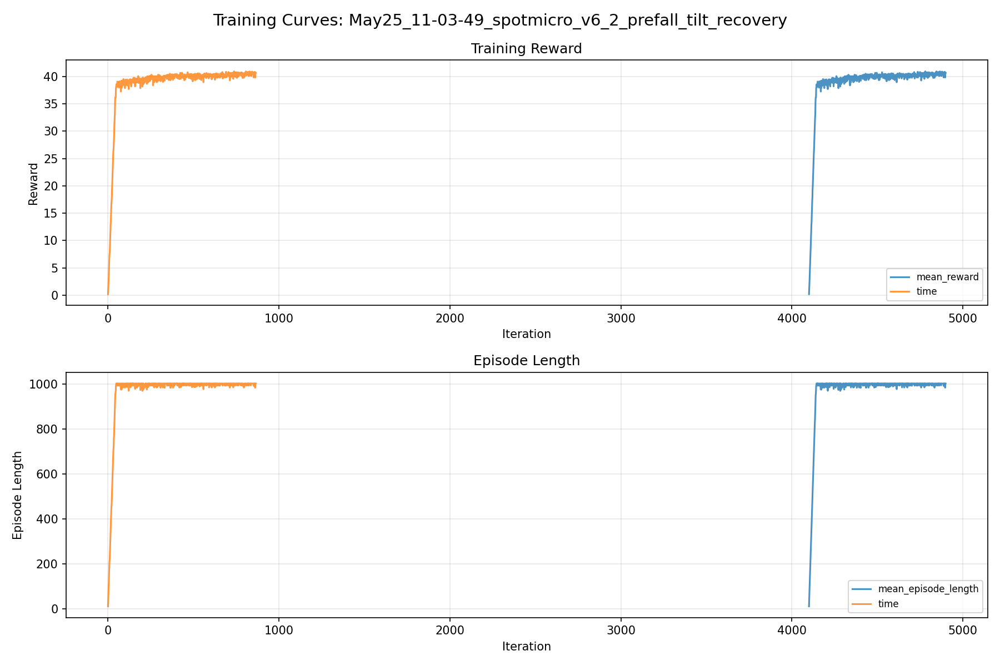
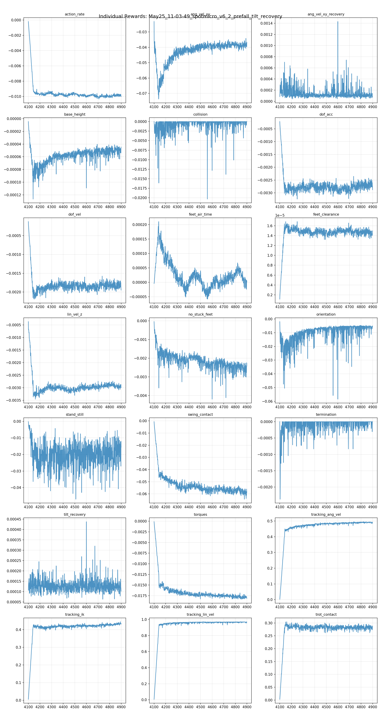
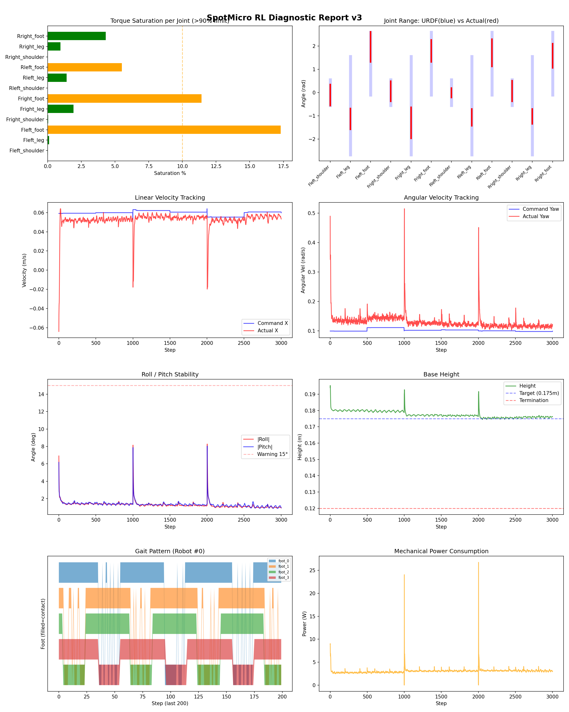
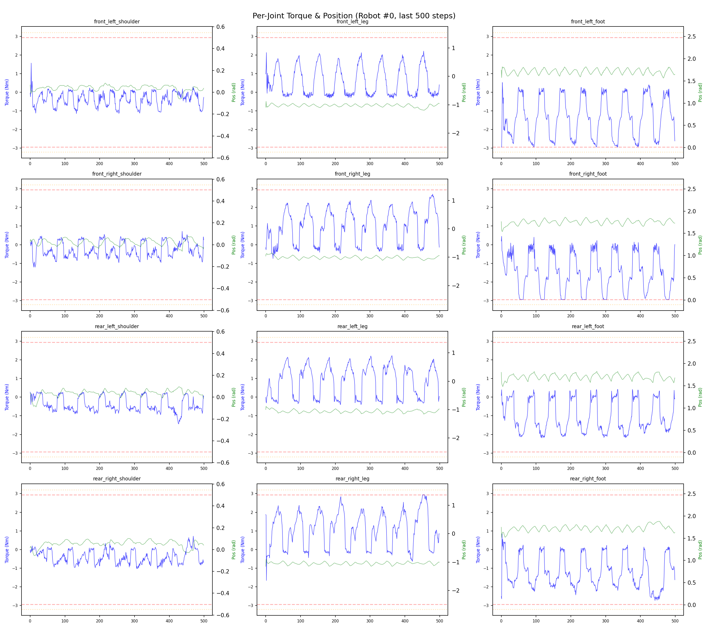
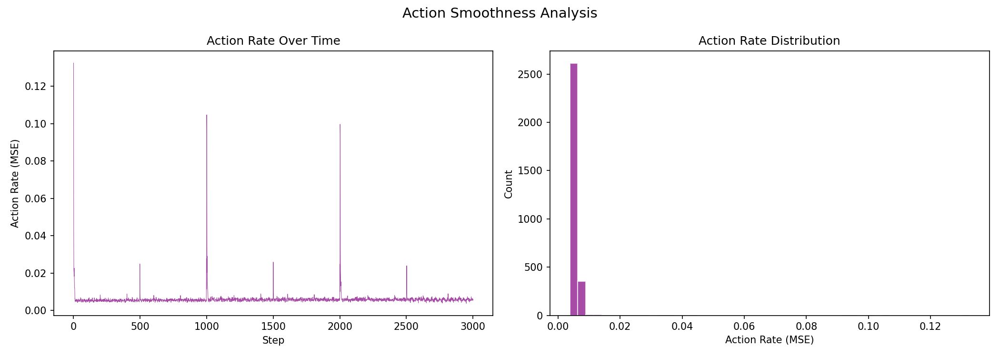

# 실험 073: spotmicro_v6_2_prefall_tilt_recovery

- **날짜:** 2026-05-25 11:22
- **Task:** spotmicro_test
- **Run name:** `spotmicro_v6_2_prefall_tilt_recovery`
- **판정:** ❌ FAIL (일부 기준 미달)

---

## 실험 목적

v6.2 : tilt 회복

---

## 변경점 (이전 커밋 대비)

```diff
diff --git a/ai_training/rl/experiment_report.py b/ai_training/rl/experiment_report.py
index 2670e35..fc1551e 100644
--- a/ai_training/rl/experiment_report.py
+++ b/ai_training/rl/experiment_report.py
@@ -500,6 +500,19 @@ def auto_judge(metrics, run_name=''):
             judgments.append(f"❌ 전환복구: {transition_sr:.1f}% (<50%)")
             all_pass = False
 
+    prefall_trials = metrics.get('transition_prefall_trials', 0)
+    prefall_sr = metrics.get('transition_prefall_success_rate_pct')
+    if prefall_trials:
+        if prefall_sr is not None and prefall_sr >= 85:
+            judgments.append(f"✅ 18도+ pre-fall 복구: {prefall_sr:.1f}% (≥85%)")
+        elif prefall_sr is not None and prefall_sr >= 60:
+            judgments.append(f"⚠️ 18도+ pre-fall 복구: {prefall_sr:.1f}% (60~85%)")
+        elif prefall_sr is not None:
+            judgments.append(f"❌ 18도+ pre-fall 복구: {prefall_sr:.1f}% (<60%)")
+            all_pass = False
+    else:
+        judgments.append("⚠️ 18도+ pre-fall 복구: trial 없음 (30도 목표 미검증)")
+
     overall = "✅ PASS" if all_pass else "❌ FAIL (일부 기준 미달)"
     return overall, judgments
 
@@ -782,6 +795,45 @@ def generate_report(exp_id, purpose, diag_data, tb_data, diff_text,
 
 
     # --- Recovery assist 분석 ---
+    def _fmt_pct(value):
+        return "N/A" if value is None else f"{value:.1f}%"
+
+    def _fmt_num(value, suffix=""):
+        return "N/A" if value is None else f"{value:.2f}{suffix}"
+
+    def _tilt_band_table(summary, title):
+        bands = summary.get('tilt_bands', []) if summary else []
+        prefall = summary.get('prefall', {}) if summary else {}
+        if not bands and not prefall:
+            return ""
+
+        rows = []
+        for band in bands:
+            rows.append(
+                f"| {band.get('label', 'N/A')} | "
+                f"{band.get('trials', 0)} | "
+                f"{_fmt_pct(band.get('success_rate_pct'))} | "
+                f"{_fmt_num(band.get('mean_end_tilt_deg'), '°')} | "
+                f"{_fmt_num(band.get('mean_recovery_time_s'), 's')} |"
+            )
+        rows.append(
+            f"| 18+ deg 전체 | "
+            f"{prefall.get('trials', 0)} | "
+            f"{_fmt_pct(prefall.get('success_rate_pct'))} | "
+            f"{_fmt_num(prefall.get('mean_end_tilt_deg'), '°')} | "
+            f"{_fmt_num(prefall.get('mean_recovery_time_s'), 's')} |"
+        )
+
+        return f"""
+### {title} Tilt Band 분석
+
+| Tilt 구간 | Trials | 성공률 | Horizon 후 평균 tilt | 평균 회복 시간 |
+|-----------|--------|--------|----------------------|----------------|
+{chr(10).join(rows)}
+
+> 이번 pre-fall 목표는 특히 `18-25 deg`, `25-30 deg`, `18+ deg 전체` 행을 우선 봅니다. `25-30 deg` trial이 없으면 30도 근처 회복 성능은 아직 검증되지 않은 것입니다.
+"""
+
     recovery_section = ""
     if recovery_data:
         sr = recovery_data.get('success_rate_pct')
@@ -795,6 +847,7 @@ def generate_report(exp_id, purpose, diag_data, tb_data, diff_text,
         sr_str = f"{sr:.1f}%" if sr is not None else "N/A"
         ert_str = f
```

**변경 요약:**
  + prefall_trials = metrics.get('transition_prefall_trials', 0)
  + prefall_sr = metrics.get('transition_prefall_success_rate_pct')
  + if prefall_trials:
  + if prefall_sr is not None and prefall_sr >= 85:
  + judgments.append(f"✅ 18도+ pre-fall 복구: {prefall_sr:.1f}% (≥85%)")
  + elif prefall_sr is not None and prefall_sr >= 60:
  + judgments.append(f"⚠️ 18도+ pre-fall 복구: {prefall_sr:.1f}% (60~85%)")
  + elif prefall_sr is not None:
  + judgments.append(f"❌ 18도+ pre-fall 복구: {prefall_sr:.1f}% (<60%)")
  + all_pass = False
  + else:
  + judgments.append("⚠️ 18도+ pre-fall 복구: trial 없음 (30도 목표 미검증)")
  + def _fmt_pct(value):
  + return "N/A" if value is None else f"{value:.1f}%"
  + def _fmt_num(value, suffix=""):
  + return "N/A" if value is None else f"{value:.2f}{suffix}"
  + def _tilt_band_table(summary, title):
  + bands = summary.get('tilt_bands', []) if summary else []
  + prefall = summary.get('prefall', {}) if summary else {}
  + if not bands and not prefall:
  + return ""
  + rows = []
  + for band in bands:
  + rows.append(
  + f"| {band.get('label', 'N/A')} | "
  + f"{band.get('trials', 0)} | "
  + f"{_fmt_pct(band.get('success_rate_pct'))} | "
  + f"{_fmt_num(band.get('mean_end_tilt_deg'), '°')} | "
  + f"{_fmt_num(band.get('mean_recovery_time_s'), 's')} |"
  + )
  + rows.append(
  + f"| 18+ deg 전체 | "
  + f"{prefall.get('trials', 0)} | "
  + f"{_fmt_pct(prefall.get('success_rate_pct'))} | "
  + f"{_fmt_num(prefall.get('mean_end_tilt_deg'), '°')} | "
  + f"{_fmt_num(prefall.get('mean_recovery_time_s'), 's')} |"
  + )
  + return f"""
  + | Tilt 구간 | Trials | 성공률 | Horizon 후 평균 tilt | 평균 회복 시간 |
  + |-----------|--------|--------|----------------------|----------------|
  + {chr(10).join(rows)}
  + > 이번 pre-fall 목표는 특히 `18-25 deg`, `25-30 deg`, `18+ deg 전체` 행을 우선 봅니다. `25-30 deg` trial이 없으면 30도 근처 회복 성능은 아직 검증되지 않은 것입니다.
  + """
  + recovery_band_section = _tilt_band_table(recovery_data, "Recovery")
  + {recovery_band_section}
  + transition_band_section = _tilt_band_table(transition_recovery_data, "Transition Recovery")
  + {transition_band_section}
  + | Recovery 18도+ 성공률 | {metrics.get('recovery_prefall_success_rate_pct', 'N/A')}% |
  + | Recovery 18도+ trials | {metrics.get('recovery_prefall_trials', 'N/A')} |
  + | Recovery 18도+ horizon 후 tilt | {metrics.get('recovery_prefall_mean_end_tilt_deg', 'N/A')}° |
  + | Transition 18도+ 성공률 | {metrics.get('transition_prefall_success_rate_pct', 'N/A')}% |
  + | Transition 18도+ trials | {metrics.get('transition_prefall_trials', 'N/A')} |
  + | Transition 18도+ horizon 후 tilt | {metrics.get('transition_prefall_mean_end_tilt_deg', 'N/A')}° |
  + super().post_physics_step()
  + self.last_tilt_metric = torch.norm(self.projected_gravity[:, :2], dim=1)
  + self.last_ang_vel_xy_metric = torch.norm(self.base_ang_vel[:, :2], dim=1)
  + def _post_physics_step_callback(self):
  + super()._post_physics_step_callback()
  - cmd_norm = torch.norm(self.commands[:, :3], dim=1, keepdim=True)  # [num_envs, 1]
  - phase_scale = torch.clamp(cmd_norm / self.phase_cmd_norm, 0.0, 1.0)  # phase_cmd_norm 이하면 감속→정지
  + cmd_norm = torch.norm(
  + self._get_effective_commands(), dim=1, keepdim=True)
  + phase_scale = torch.clamp(cmd_norm / self.phase_cmd_norm, 0.0, 1.0)
  + recovery_cfg = getattr(self.cfg, "recovery", None)
  + if getattr(recovery_cfg, "phase_enabled", False):
  + blend = self._recovery_blend().unsqueeze(1)
  + if getattr(recovery_cfg, "phase_freeze", False):
  + phase_scale = torch.where(
  + blend > 0.0, torch.zeros_like(phase_scale), phase_scale)
  + else:
  + recovery_phase_scale = float(
  + getattr(recovery_cfg, "phase_scale", 0.2))
  + phase_scale = phase_scale * (
  + 1.0 - blend * (1.0 - recovery_phase_scale))
  - super().post_physics_step()
  - self.last_tilt_metric = torch.norm(self.projected_gravity[:, :2], dim=1)
  - self.last_ang_vel_xy_metric = torch.norm(self.base_ang_vel[:, :2], dim=1)
  - ref_dof_pos = self._get_ik_target()
  + effective_commands = self._get_effective_commands()
  + ref_dof_pos = self._get_ik_target(effective_commands)
  - self.commands[:, :3] * self.commands_scale,            # 3
  + effective_commands * self.commands_scale,               # 3
  + def _recovery_tilt_metric(self):
  + return torch.norm(self.projected_gravity[:, :2], dim=1)
  + def _recovery_blend(self, threshold_deg=None, full_tilt_deg=None):
  + recovery_cfg = getattr(self.cfg, "recovery", None)
  + if not getattr(recovery_cfg, "enabled", False):
  + return torch.zeros(self.num_envs, device=self.device)
  + if threshold_deg is None:
  + threshold_deg = getattr(recovery_cfg, "tilt_threshold_deg", 14.0)
  + if full_tilt_deg is None:
  + full_tilt_deg = getattr(recovery_cfg, "full_tilt_deg", 25.0)
  + threshold = math.sin(math.radians(float(threshold_deg)))
  + full_tilt = math.sin(math.radians(float(full_tilt_deg)))
  + tilt = self._recovery_tilt_metric()
  + if full_tilt <= threshold:
  + return (tilt > threshold).float()
  + return torch.clamp((tilt - threshold) / (full_tilt - threshold), 0.0, 1.0)
  + def _get_effective_commands(self):
  + commands = self.commands[:, :3]
  + recovery_cfg = getattr(self.cfg, "recovery", None)
  + if not getattr(recovery_cfg, "command_scale_enabled", False):
  + return commands
  + blend = self._recovery_blend().unsqueeze(1)
  + recovery_cmd_scale = float(
  + getattr(recovery_cfg, "command_scale", 0.25))
  + scale = 1.0 - blend * (1.0 - recovery_cmd_scale)
  + return commands * scale
  + def _get_effective_action_scale(self):
  + normal_scale = float(self.cfg.control.action_scale)
  + recovery_cfg = getattr(self.cfg, "recovery", None)
  + if not getattr(recovery_cfg, "action_scale_enabled", False):
  + return normal_scale
  + recovery_scale = float(
  + getattr(self.cfg.control, "recovery_action_scale", normal_scale))
  + blend = self._recovery_blend().unsqueeze(1)
  + return normal_scale + blend * (recovery_scale - normal_scale)
  - self.cfg.rewards, "recovery_relief_tilt_threshold_deg", 7.0)
  - threshold = math.sin(math.radians(threshold_deg))
  + self.cfg.rewards, "recovery_relief_tilt_threshold_deg", 14.0)
  + full_tilt_deg = getattr(
  + self.cfg.rewards, "recovery_relief_full_tilt_deg", 25.0)
  - tilt = torch.norm(self.projected_gravity[:, :2], dim=1)
  - return torch.where(
  - tilt > threshold,
  - torch.full_like(tilt, float(relief)),
  - torch.ones_like(tilt),
  - )
  + blend = self._recovery_blend(threshold_deg, full_tilt_deg)
  + return 1.0 - blend * (1.0 - float(relief))
  - rew_airTime *= torch.norm(self.commands[:, :3], dim=1) > self.blend_cmd_norm
  + rew_airTime *= torch.norm(
  + self._get_effective_commands(), dim=1) > self.blend_cmd_norm
  - reward *= (torch.norm(self.commands[:, :3], dim=1) > self.blend_cmd_norm).float()
  + reward *= (torch.norm(
  + self._get_effective_commands(), dim=1) > self.blend_cmd_norm).float()
  - penalty *= (torch.norm(self.commands[:, :3], dim=1) > self.blend_cmd_norm).float()
  + penalty *= (torch.norm(
  + self._get_effective_commands(), dim=1) > self.blend_cmd_norm).float()
  - reward *= (torch.norm(self.commands[:, :3], dim=1) > self.blend_cmd_norm).float()
  + reward *= (torch.norm(
  + self._get_effective_commands(), dim=1) > self.blend_cmd_norm).float()
  - reward *= (torch.norm(self.commands[:, :3], dim=1) > self.blend_cmd_norm).float()
  + reward *= (torch.norm(
  + self._get_effective_commands(), dim=1) > self.blend_cmd_norm).float()
  - cmd_norm = torch.norm(self.commands[:, :3], dim=1, keepdim=True)
  + cmd_norm = torch.norm(
  + self._get_effective_commands(), dim=1, keepdim=True)
  - cmd_norm = torch.norm(self.commands[:, :3], dim=1)
  + cmd_norm = torch.norm(self._get_effective_commands(), dim=1)
  - def _get_ik_target(self):
  + def _get_ik_target(self, commands=None):
  + if commands is None:
  + commands = self._get_effective_commands()
  - self.commands[:, :3],
  + commands,
  - cmd_norm = torch.norm(self.commands[:, :3], dim=1, keepdim=True)
  + cmd_norm = torch.norm(commands, dim=1, keepdim=True)
  - actions_scaled = actions * self.cfg.control.action_scale
  + actions_scaled = actions * self._get_effective_action_scale()
  + def _reward_tracking_lin_vel(self):
  + commands = self._get_effective_commands()
  + lin_vel_error = torch.sum(
  + torch.square(commands[:, :2] - self.base_lin_vel[:, :2]), dim=1)
  + return torch.exp(-lin_vel_error / self.cfg.rewards.tracking_sigma)
  + commands = self._get_effective_commands()
  - self.commands[:, 2] - self.base_ang_vel[:, 2])
  + commands[:, 2] - self.base_ang_vel[:, 2])
  - cmd_norm = torch.norm(self.commands[:, :3], dim=1, keepdim=True)
  + cmd_norm = torch.norm(
  + self._get_effective_commands(), dim=1, keepdim=True)
  - tilt = torch.norm(self.projected_gravity[:, :2], dim=1)
  + tilt = self._recovery_tilt_metric()
  - static_friction = 0.65
  - dynamic_friction = 0.50
  + static_friction = 1.0
  + dynamic_friction = 1.0
  + recovery_action_scale = 0.35
  + class recovery:
  + enabled = True
  + tilt_threshold_deg = 14.0
  + full_tilt_deg = 25.0
  + command_scale_enabled = True
  + command_scale = 0.25
  + phase_enabled = True
  + phase_scale = 0.2
  + phase_freeze = False
  + action_scale_enabled = True
  - orientation = -8.0
  - torques = -0.0012
  + orientation = -10.0
  + torques = -0.001
  - action_rate = -0.07
  - base_height = -1.5
  + action_rate = -0.05
  + base_height = -2.0
  - no_stuck_feet = -0.14
  + no_stuck_feet = -0.2
  - feet_clearance = 0.012
  - swing_contact = -0.25
  - trot_contact = 0.20
  - tracking_ik = 0.45
  + feet_clearance = 0.03
  + swing_contact = -0.45
  + trot_contact = 0.35
  + tracking_ik = 0.6
  - tilt_recovery = 5.0
  - ang_vel_xy_recovery = 0.8
  + tilt_recovery = 4.0
  + ang_vel_xy_recovery = 0.5
  - recovery_reward_tilt_threshold_deg = 6.0
  - recovery_relief_tilt_threshold_deg = 7.0
  - recovery_gait_relief_scale = 0.25
  - recovery_ik_relief_scale = 0.35
  + recovery_reward_tilt_threshold_deg = 12.0
  + recovery_diagnostic_initial_tilt_threshold_deg = 12.0
  + recovery_relief_tilt_threshold_deg = 14.0
  + recovery_relief_full_tilt_deg = 25.0
  + recovery_gait_relief_scale = 0.65
  + recovery_ik_relief_scale = 0.65
  - transition_recovery_initial_tilt_threshold_deg = 8.0
  + transition_recovery_initial_tilt_threshold_deg = 12.0
  - feet_clearance_min = 0.006
  - feet_clearance_cap = 0.010
  + feet_clearance_min = 0.020
  + feet_clearance_cap = 0.030
  - friction_range = [0.18, 1.05]
  + friction_range = [0.35, 1.10]
  - added_mass_range = [-0.10, 0.30]
  + added_mass_range = [-0.05, 0.15]
  - base_com_offset_x_range = [-0.055, 0.010]
  - base_com_offset_y_range = [-0.012, 0.012]
  - base_com_offset_z_range = [-0.012, 0.030]
  + base_com_offset_x_range = [-0.020, 0.010]
  + base_com_offset_y_range = [-0.008, 0.008]
  + base_com_offset_z_range = [-0.008, 0.015]
  - motor_strength_range = [0.75, 1.10]
  - randomize_pd_gains = True
  - stiffness_scale_range = [0.65, 1.35]
  - damping_scale_range = [0.70, 1.80]
  - randomize_joint_obs_offset = True
  - joint_obs_offset_range = [-0.025, 0.025]
  + motor_strength_range = [0.85, 1.10]
  + randomize_pd_gains = False
  + stiffness_scale_range = [1.0, 1.0]
  + damping_scale_range = [1.0, 1.0]
  + randomize_joint_obs_offset = False
  + joint_obs_offset_range = [0.0, 0.0]
  - push_interval_s = 3
  - max_push_vel_xy = 0.16
  - max_push_ang_vel_xy = 0.75
  + push_interval_s = 4
  + max_push_vel_xy = 0.18
  + max_push_ang_vel_xy = 0.85
  - push_ang_vel_xy_clip = 1.10
  + push_ang_vel_xy_clip = 1.20
  - action_delay_range = [0, 3]
  - recovery_roll_pitch_range_deg = 12.0
  + action_delay_range = [1, 2]
  + recovery_roll_pitch_range_deg = 18.0
  - recovery_ang_vel_xy_range = 0.85
  + recovery_ang_vel_xy_range = 0.90
  - run_name = 'spotmicro_v6_1_5_slippery_rear_com_motor_dr'
  + run_name = 'spotmicro_v6_2_prefall_tilt_recovery'
  - max_iterations = 1000
  + max_iterations = 800
  - def run_diagnostic(args, checkpoint_path=None, lightweight=False, with_dr=False):
  + def run_diagnostic(args, checkpoint_path=None, lightweight=False, with_dr=False, recovery_range_deg=None):
  + if recovery_range_deg is not None:
  + env_cfg.domain_rand.recovery_roll_pitch_range_deg = float(recovery_range_deg)
  + print(
  + "[진단] recovery_roll_pitch_range_deg override: "
  + f"{env_cfg.domain_rand.recovery_roll_pitch_range_deg:.1f} deg")
  - recovery_initial_tilt_threshold = np.radians(7.0)
  + recovery_initial_tilt_threshold = np.radians(
  + float(getattr(
  + env.cfg.rewards,
  + "recovery_diagnostic_initial_tilt_threshold_deg",
  + getattr(env.cfg.rewards, "recovery_reward_tilt_threshold_deg", 12.0),
  + ))
  + )
  + tilt_band_defs = [
  + (12.0, 18.0, "12-18 deg"),
  + (18.0, 25.0, "18-25 deg"),
  + (25.0, 30.0, "25-30 deg"),
  + (30.0, None, "30+ deg"),
  + ]
  + def _mean_or_none(values):
  + return float(np.mean(values)) if values else None
  + def _summarize_tilt_rows(rows, tilt_key):
  + successes = [t for t in rows if t.get('success')]
  + failures = [t for t in rows if not t.get('success')]
  + times = [
  + t['recovery_time_s'] for t in successes
  + if t.get('recovery_time_s') is not None
  + ]
  + end_tilts = [
  + max(t.get('end_roll_deg', 0.0), t.get('end_pitch_deg', 0.0))
  + for t in rows
  + ]
  + return {
  + 'trials': int(len(rows)),
  + 'success_count': int(len(successes)),
  + 'failure_count': int(len(failures)),
  + 'success_rate_pct': (
  + float(len(successes) / len(rows) * 100) if rows else None
  + ),
  + 'early_failure_rate_pct': (
  + float(sum(1 for t in rows if t.get('forced_failure')) / len(rows) * 100)
  + if rows else None
  + ),
  + 'mean_recovery_time_s': _mean_or_none(times),
  + 'mean_tilt_deg': _mean_or_none([t[tilt_key] for t in rows]),
  + 'mean_end_tilt_deg': _mean_or_none(end_tilts),
  + 'mean_end_roll_deg': _mean_or_none([t.get('end_roll_deg', 0.0) for t in rows]),
  + 'mean_end_pitch_deg': _mean_or_none([t.get('end_pitch_deg', 0.0) for t in rows]),
  + 'mean_end_height_m': _mean_or_none([t.get('end_height_m', 0.0) for t in rows]),
  + }
  + def _summarize_tilt_bands(trials, tilt_key):
  + bands = []
  + for low, high, label in tilt_band_defs:
  + rows = [
  + t for t in trials
  + if t.get(tilt_key) is not None
  + and t[tilt_key] >= low
  + and (high is None or t[tilt_key] < high)
  + ]
  + band = _summarize_tilt_rows(rows, tilt_key)
  + band.update({
  + 'label': label,
  + 'min_tilt_deg': float(low),
  + 'max_tilt_deg': float(high) if high is not None else None,
  + })
  + bands.append(band)
  + return bands
  + def _summarize_prefall(trials, tilt_key):
  + rows = [
  + t for t in trials
  + if t.get(tilt_key) is not None and t[tilt_key] >= 18.0
  + ]
  + summary = _summarize_tilt_rows(rows, tilt_key)
  + summary['min_tilt_deg'] = 18.0
  + return summary
  + tilt_bands = _summarize_tilt_bands(recovery_trials, 'init_tilt_deg')
  + prefall = _summarize_prefall(recovery_trials, 'init_tilt_deg')
  + 'tilt_bands': tilt_bands,
  + 'prefall': prefall,
  + tilt_bands = _summarize_tilt_bands(transition_trials, 'max_tilt_deg')
  + prefall = _summarize_prefall(transition_trials, 'max_tilt_deg')
  + 'tilt_bands': tilt_bands,
  + 'prefall': prefall,
  + 'recovery_prefall_success_rate_pct': recovery_summary.get('prefall', {}).get('success_rate_pct'),
  + 'recovery_prefall_trials': recovery_summary.get('prefall', {}).get('trials', 0),
  + def _fmt_pct(value):
  + return "N/A" if value is None else f"{value:.1f}%"
  + def _fmt_num(value, suffix=""):
  + return "N/A" if value is None else f"{value:.2f}{suffix}"
  + def _print_tilt_band_summary(title, summary):
  + bands = summary.get('tilt_bands', [])
  + prefall = summary.get('prefall', {})
  + print(f"\n  {title} tilt band summary")
  + print(f"  {'Band':<10} {'Trials':>7} {'Success':>9} {'EndTilt':>9} {'Time':>8}")
  + print(f"  {'-'*48}")
  + for band in bands:
  + print(
  + f"  {band['label']:<10} "
  + f"{band.get('trials', 0):>7} "
  + f"{_fmt_pct(band.get('success_rate_pct')):>9} "
  + f"{_fmt_num(band.get('mean_end_tilt_deg'), '°'):>9} "
  + f"{_fmt_num(band.get('mean_recovery_time_s'), 's'):>8}"
  + )
  + print(
  + f"  {'18+ deg':<10} "
  + f"{prefall.get('trials', 0):>7} "
  + f"{_fmt_pct(prefall.get('success_rate_pct')):>9} "
  + f"{_fmt_num(prefall.get('mean_end_tilt_deg'), '°'):>9} "
  + f"{_fmt_num(prefall.get('mean_recovery_time_s'), 's'):>8}"
  + )
  + _print_tilt_band_summary("Recovery", recovery_summary)
  + _print_tilt_band_summary("Transition", transition_recovery_summary)
  + ax.axhline(y=18, color='purple', linestyle=':', alpha=0.4, label='Pre-fall 18 deg')
  + ax.axhline(y=25, color='red', linestyle=':', alpha=0.35, label='Pre-fall 25 deg')
  + ax.axvline(18, color='purple', linestyle=':', alpha=0.6, label='18 deg')
  + ax.axvline(25, color='red', linestyle=':', alpha=0.5, label='25 deg')
  + ax.axvline(30, color='black', linestyle=':', alpha=0.4, label='30 deg')
  + 'recovery_prefall_success_rate_pct': recovery_summary.get('prefall', {}).get('success_rate_pct'),
  + 'recovery_prefall_trials': recovery_summary.get('prefall', {}).get('trials', 0),
  + 'recovery_prefall_mean_end_tilt_deg': recovery_summary.get('prefall', {}).get('mean_end_tilt_deg'),
  + 'transition_prefall_success_rate_pct': transition_recovery_summary.get('prefall', {}).get('success_rate_pct'),
  + 'transition_prefall_trials': transition_recovery_summary.get('prefall', {}).get('trials', 0),
  + 'transition_prefall_mean_end_tilt_deg': transition_recovery_summary.get('prefall', {}).get('mean_end_tilt_deg'),
  + prefall_eval = '--prefall-eval' in sys.argv
  + if prefall_eval:
  + sys.argv.remove('--prefall-eval')
  + recovery_range_deg = 30.0 if prefall_eval else None
  + i = 1
  + while i < len(sys.argv):
  + arg = sys.argv[i]
  + if arg == '--recovery-range-deg' and i + 1 < len(sys.argv):
  + recovery_range_deg = float(sys.argv[i + 1])
  + del sys.argv[i:i + 2]
  + continue
  + if arg.startswith('--recovery-range-deg='):
  + recovery_range_deg = float(arg.split('=', 1)[1])
  + del sys.argv[i]
  + continue
  + i += 1
  - run_diagnostic(args, checkpoint_path=checkpoint_path, lightweight=lightweight, with_dr=with_dr)
  + run_diagnostic(
  + args,
  + checkpoint_path=checkpoint_path,
  + lightweight=lightweight,
  + with_dr=with_dr,
  + recovery_range_deg=recovery_range_deg,
  + )

---

## 현재 Reward Scales

| Reward | Scale |
|--------|-------|
| action_rate | -0.05 |
| ang_vel_xy | -1.0 |
| ang_vel_xy_recovery | 0.5 |
| base_height | -2.0 |
| collision | -1.0 |
| dof_acc | -2.5e-07 |
| dof_vel | -0.0005 |
| feet_air_time | 0.04 |
| feet_clearance | 0.03 |
| lin_vel_z | -2.0 |
| no_stuck_feet | -0.2 |
| orientation | -10.0 |
| stand_still | -0.4 |
| swing_contact | -0.45 |
| termination | -20.0 |
| tilt_recovery | 4.0 |
| torques | -0.001 |
| tracking_ang_vel | 0.6 |
| tracking_ik | 0.6 |
| tracking_lin_vel | 1.0 |
| trot_contact | 0.35 |

---

## 진단 결과 (Diagnostic)

### 핵심 지표

- ✅ Timeout: 99.4% (≥80%)
- ✅ 속도오차 X: 0.0241 m/s (<0.08)
- ✅ 토크포화: 3.6% (<10%)
- ✅ 자세: roll 1.3°, pitch 1.3° (안정)
- ✅ 조기종료: 0.2% (<5%)
- ✅ 전환복구: 80.3% (≥80%)
- ❌ 18도+ pre-fall 복구: 44.4% (<60%)

### 상세 수치

| 지표 | 값 |
|------|-----|
| Timeout% | 99.41747572815534 |
| 조기종료% | 0.1941747572815534 |
| 속도오차 X | 0.02406388521194458 m/s |
| 속도오차 Y | 0.02080547995865345 m/s |
| 각속도오차 | 0.08696310967206955 rad/s |
| 토크포화% | 3.5782251602564106 |
| 평균 높이 | 0.17762143197871033 m |
| Roll (평균) | 1.2871352434158325° |
| Pitch (평균) | 1.3378909826278687° |
| Action Rate | 0.005974506493657827 |
| 평균 전력 | 3.0626583099365234 W |
| CoT | 1.9976132425723268 |
| Recovery 성공률 | 95.0% |
| Recovery eligible trials | 420 |
| 평균 회복 시간 | 0.17974936941587238 s |
| Recovery 조기 실패율 | 0.2380952380952381% |
| Recovery 18도+ 성공률 | None% |
| Recovery 18도+ trials | 0 |
| Recovery 18도+ horizon 후 tilt | None° |
| Transition recovery 성공률 | 80.3030303030303% |
| Transition recovery eligible trials | 66 |
| 평균 Transition recovery 시간 | 0.2362264098142678 s |
| Transition 18도+ 성공률 | 44.44444444444444% |
| Transition 18도+ trials | 9 |
| Transition 18도+ horizon 후 tilt | 10.91141140460968° |

## Recovery Assist 분석

| 지표 | 값 |
|------|-----|
| 판정 | ✅ Recovery 안정적 |
| Recovery 성공률 | 95.0% |
| 성공/실패 | 399 / 21 |
| Eligible trials | 420 / 771 |
| 평균 회복 시간 | 0.180s |
| 조기 실패율 | 0.2% |
| 평가 horizon | 1.0 s |
| 초기 tilt 기준 | 12.000000000000002° |
| 안정 기준 | roll/pitch < 5.0°, height > 0.165m |
| 평균 초기 tilt | 15.335838849124785° |
| 평균 초기 roll/pitch | 11.847938112662606° / 11.246790834651208° |
| 1초 후 평균 roll/pitch | 1.5440136758067335° / 1.523575616680873° |
| 1초 내 최대 roll/pitch 평균 | 12.304032090448198° / 11.779946348780678° |

> 해석: `Recovery 성공률`은 초기 tilt가 기준 이상인 episode 중 1초 내 안정 자세로 복귀한 비율입니다. 조기 실패율이 높으면 reset 직후 바로 넘어지는 것이고, 평균 회복 시간이 짧을수록 위기 대응이 빠른 것입니다.

### Recovery Tilt Band 분석

| Tilt 구간 | Trials | 성공률 | Horizon 후 평균 tilt | 평균 회복 시간 |
|-----------|--------|--------|----------------------|----------------|
| 12-18 deg | 420 | 95.0% | 2.07° | 0.18s |
| 18-25 deg | 0 | N/A | N/A | N/A |
| 25-30 deg | 0 | N/A | N/A | N/A |
| 30+ deg | 0 | N/A | N/A | N/A |
| 18+ deg 전체 | 0 | N/A | N/A | N/A |

> 이번 pre-fall 목표는 특히 `18-25 deg`, `25-30 deg`, `18+ deg 전체` 행을 우선 봅니다. `25-30 deg` trial이 없으면 30도 근처 회복 성능은 아직 검증되지 않은 것입니다.


## Transition Recovery 분석

| 지표 | 값 |
|------|-----|
| 판정 | ✅ 전환 복구 안정적 |
| Transition recovery 성공률 | 80.3% |
| 성공/실패 | 53 / 13 |
| Eligible trials | 66 / 3584 |
| 평균 회복 시간 | 0.236s |
| 조기 실패율 | 0.0% |
| 평가 horizon | 0.75 s |
| push 후 eligible 기준 | max roll/pitch > 12.000000000000002° |
| 안정 기준 | roll/pitch < 5.0°, height > 0.165m |
| 평균 최대 tilt | 15.030811995813314° |
| horizon 후 평균 roll/pitch | 3.2761117410987164° / 3.741331190604604° |

> 해석: `Transition Recovery`는 학습 중 push/roll-pitch angular impulse가 들어간 뒤 일정 시간 안에 자세가 안정 기준으로 돌아오는지를 봅니다.

### Transition Recovery Tilt Band 분석

| Tilt 구간 | Trials | 성공률 | Horizon 후 평균 tilt | 평균 회복 시간 |
|-----------|--------|--------|----------------------|----------------|
| 12-18 deg | 57 | 86.0% | 3.35° | 0.23s |
| 18-25 deg | 8 | 50.0% | 6.55° | 0.30s |
| 25-30 deg | 0 | N/A | N/A | N/A |
| 30+ deg | 1 | 0.0% | 45.83° | N/A |
| 18+ deg 전체 | 9 | 44.4% | 10.91° | 0.30s |

> 이번 pre-fall 목표는 특히 `18-25 deg`, `25-30 deg`, `18+ deg 전체` 행을 우선 봅니다. `25-30 deg` trial이 없으면 30도 근처 회복 성능은 아직 검증되지 않은 것입니다.


## Command Mode별 회전 추종 분석

| 모드 | 비율 | 샘플 수 | 평균 abs(cmd_wz) | 평균 abs(actual_wz) | yaw 오차 | 상태 |
|------|------|---------|------------------|---------------------|----------|------|
| 정지 | 10.5% | 81040 | 0.0228 | 0.0661 | 0.0634 | ❌ |
| 직진/저회전 | 39.8% | 305804 | 0.0747 | 0.1202 | 0.0958 | ⚠️ |
| 제자리 회전 | 11.8% | 91082 | 0.1755 | 0.1757 | 0.0769 | ✅ |
| 전진+회전 | 14.8% | 113654 | 0.1752 | 0.1870 | 0.1031 | ⚠️ |
| 큰 회전명령 | 0.0% | 0 | N/A | N/A | N/A | N/A |

> 해석 기준: `제자리 회전`만 나쁘면 pure turn 학습/보행 패턴 문제, `큰 회전명령`만 나쁘면 yaw 명령 범위가 현재 토크/보폭 한계보다 큰 문제, `정지`가 나쁘면 stop drift 문제로 보면 됩니다.
        


## 학습 곡선 분석

| 지표 | 값 | 판정 |
|------|-----|------|
| 수렴 iter (90%) | 4142 | 느림 |
| 후반 안정성 (CV) | 0.008 | 안정 |
| 정체 구간 | 있음 (iter 4341, 39 iter) | |


## Per-leg 분석

### 발별 접촉/공중 비율

| 발 | 접촉% | 공중% |
|-----|-------|------|
| foot_0 | 72.2% | 27.8% |
| foot_1 | 74.9% | 25.1% |
| foot_2 | 67.9% | 32.1% |
| foot_3 | 69.4% | 30.6% |

### 관절별 토크 포화

| 관절 | 포화% | 최대토크 | 한계 | 상태 |
|------|------|---------|------|------|
| front_left_shoulder | 0.0% | 2.940 | 2.940 | ✅ |
| front_left_leg | 0.1% | 2.940 | 2.940 | ✅ |
| front_left_foot | 17.3% | 2.940 | 2.940 | ⚠️ |
| front_right_shoulder | 0.0% | 2.940 | 2.940 | ✅ |
| front_right_leg | 1.9% | 2.940 | 2.940 | ✅ |
| front_right_foot | 11.4% | 2.940 | 2.940 | ⚠️ |
| rear_left_shoulder | 0.0% | 2.940 | 2.940 | ✅ |
| rear_left_leg | 1.4% | 2.940 | 2.940 | ✅ |
| rear_left_foot | 5.5% | 2.940 | 2.940 | ⚠️ |
| rear_right_shoulder | 0.0% | 2.940 | 2.940 | ✅ |
| rear_right_leg | 0.9% | 2.940 | 2.940 | ✅ |
| rear_right_foot | 4.3% | 2.940 | 2.940 | ✅ |


## Gait 분석

| 지표 | 값 |
|------|-----|
| Gait 주파수 | 0.21 Hz |
| Gait 주기 | 58 steps |
| 대각 동기화율 | 87.9% |
| L/R 비대칭 | 0.0%p |
| 판정 | ✅ Trot 패턴 / ✅ 대칭 |


## 관절별 상세

| 관절 | 토크포화% | 사용범위% | 편향(rad) | 한계근접% | 상태 |
|------|----------|----------|----------|----------|------|
| front_left_shoulder | 0.0% | 82% | -0.106 | 0.0% | ⚠️ |
| front_left_leg | 0.1% | 21% | -1.128 | 0.0% | ⚠️ |
| front_left_foot | 17.3% | 48% | +1.963 | 0.0% | ⚠️ |
| front_right_shoulder | 0.0% | 79% | +0.055 | 0.0% | ✅ |
| front_right_leg | 1.9% | 32% | -1.299 | 0.0% | ⚠️ |
| front_right_foot | 11.4% | 35% | +1.789 | 0.0% | ⚠️ |
| rear_left_shoulder | 0.0% | 37% | -0.006 | 0.0% | ✅ |
| rear_left_leg | 1.4% | 17% | -1.061 | 0.0% | ⚠️ |
| rear_left_foot | 5.5% | 43% | +1.705 | 0.0% | ⚠️ |
| rear_right_shoulder | 0.0% | 80% | +0.066 | 0.0% | ✅ |
| rear_right_leg | 0.9% | 15% | -1.021 | 0.0% | ⚠️ |
| rear_right_foot | 4.3% | 39% | +1.577 | 0.0% | ⚠️ |


## 에너지 효율 상세

| 지표 | 값 |
|------|-----|
| 평균 전력 | 3.06 W |
| 피크 전력 | 26.77 W |
| 피크/평균 비율 | 8.7x |
| CoT | 2.00 |

### 관절별 전력 분배

| 관절 | 평균전력(W) | 비율% |
|------|-----------|-------|
| front_left_foot | 0.579 | 18.9% |
| rear_right_foot | 0.515 | 16.8% |
| front_right_foot | 0.453 | 14.8% |
| rear_left_foot | 0.380 | 12.4% |
| rear_right_leg | 0.265 | 8.7% |
| front_right_leg | 0.257 | 8.4% |
| front_left_leg | 0.215 | 7.0% |
| rear_left_leg | 0.196 | 6.4% |
| front_right_shoulder | 0.060 | 2.0% |
| rear_right_shoulder | 0.054 | 1.8% |
| front_left_shoulder | 0.046 | 1.5% |
| rear_left_shoulder | 0.045 | 1.5% |


## Tensorboard 학습 곡선 요약

| 스칼라 | 최종값 | 최대 | 최소 | 후반10% 평균 |
|--------|--------|------|------|-------------|
| rew_action_rate | -0.0100 | -0.0002 | -0.0103 | -0.0099 |
| rew_ang_vel_xy | -0.0367 | -0.0232 | -0.0737 | -0.0388 |
| rew_ang_vel_xy_recovery | 0.0001 | 0.0014 | 0.0000 | 0.0001 |
| rew_base_height | -0.0000 | -0.0000 | -0.0001 | -0.0001 |
| rew_collision | 0.0000 | 0.0000 | -0.0203 | -0.0004 |
| rew_dof_acc | -0.0029 | -0.0002 | -0.0032 | -0.0027 |
| rew_dof_vel | -0.0019 | -0.0001 | -0.0022 | -0.0018 |
| rew_feet_air_time | 0.0000 | 0.0002 | -0.0001 | 0.0000 |
| rew_feet_clearance | 0.0000 | 0.0000 | 0.0000 | 0.0000 |
| rew_lin_vel_z | -0.0030 | -0.0004 | -0.0035 | -0.0029 |
| rew_no_stuck_feet | -0.0023 | -0.0000 | -0.0042 | -0.0025 |
| rew_orientation | -0.0051 | -0.0020 | -0.0584 | -0.0064 |
| rew_stand_still | -0.0156 | -0.0002 | -0.0470 | -0.0192 |
| rew_swing_contact | -0.0582 | -0.0007 | -0.0643 | -0.0579 |
| rew_termination | 0.0000 | 0.0000 | -0.0024 | -0.0001 |
| rew_tilt_recovery | 0.0001 | 0.0004 | 0.0001 | 0.0001 |
| rew_torques | -0.0181 | -0.0001 | -0.0183 | -0.0178 |
| rew_tracking_ang_vel | 0.4921 | 0.4956 | 0.0028 | 0.4911 |
| rew_tracking_ik | 0.4316 | 0.4443 | 0.0052 | 0.4309 |
| rew_tracking_lin_vel | 0.9681 | 0.9718 | 0.0065 | 0.9667 |
| rew_trot_contact | 0.2860 | 0.3046 | 0.0032 | 0.2816 |
| learning_rate | 0.0002 | 0.0002 | 0.0000 | 0.0001 |
| surrogate | -0.0018 | 0.0014 | -0.0034 | -0.0017 |
| value_function | 0.0017 | 0.0211 | 0.0009 | 0.0018 |
| collection time | 0.7485 | 1.0768 | 0.7372 | 0.7748 |
| learning_time | 0.2857 | 0.4125 | 0.2684 | 0.2864 |
| total_fps | 95054.0000 | 96039.0000 | 72101.0000 | 92667.0750 |
| mean_noise_std | 0.0635 | 0.0667 | 0.0606 | 0.0636 |
| mean_episode_length | 1002.0000 | 1002.0000 | 11.8316 | 999.3166 |
| time | 1002.0000 | 1002.0000 | 11.8316 | 999.3166 |
| mean_reward | 40.6815 | 40.9477 | 0.1755 | 40.4575 |
| time | 40.6815 | 40.9477 | 0.1755 | 40.4575 |

총 학습 iteration: 4899


---

## 그래프

### Tensorboard 학습 곡선



### Diagnostic 결과





---

## 결론 및 다음 실험 방향

**자동 판정:** ❌ FAIL (일부 기준 미달)

일부 기준을 통과하지 못했습니다. 조정이 필요합니다.
  - ❌ 18도+ pre-fall 복구: 44.4% (<60%)

> 💡 위 결론은 자동 생성되었습니다. 필요시 수정하세요.

---

## 메모

_(추가 메모가 있으면 여기에 작성)_

