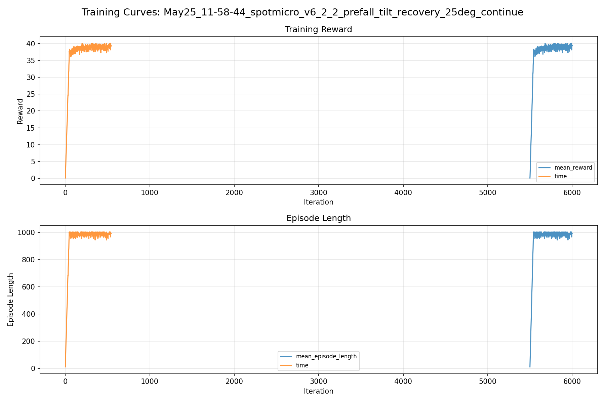
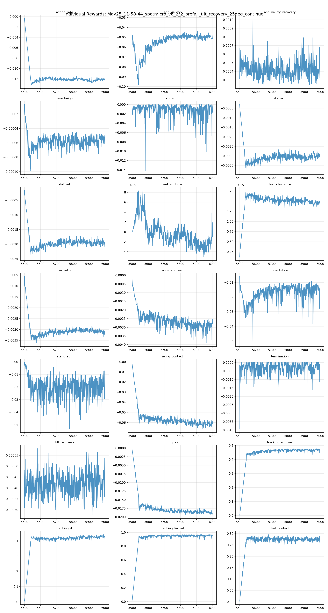
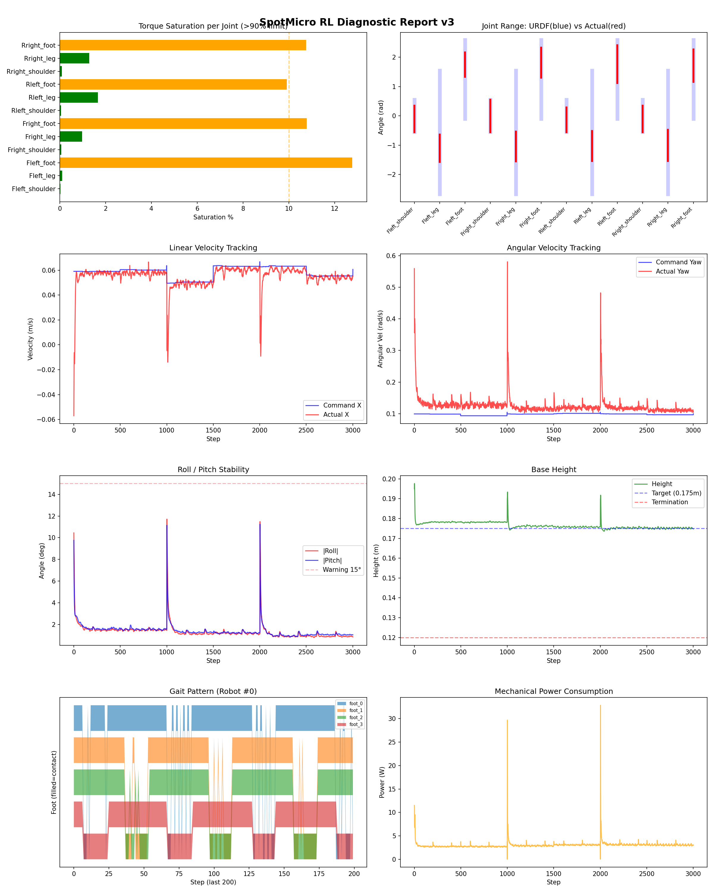
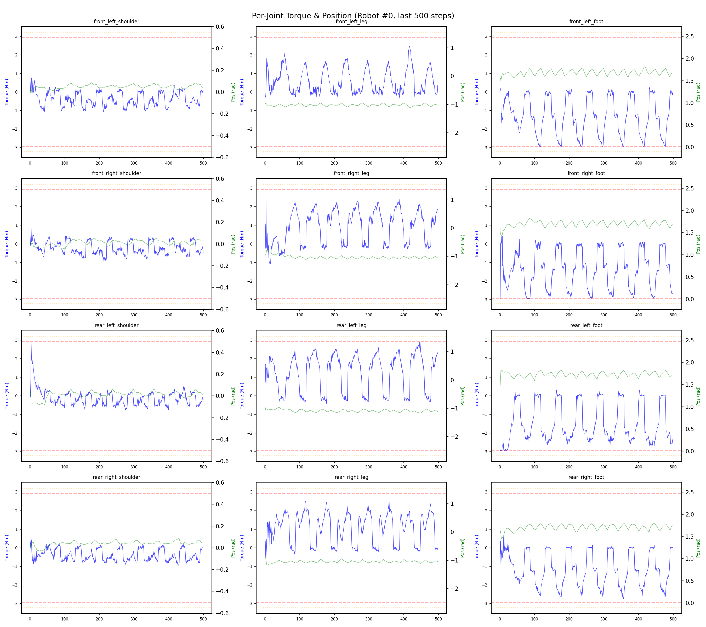
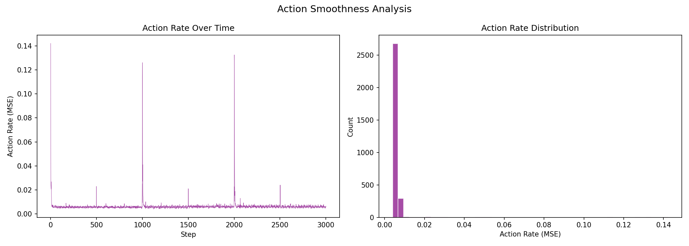

# 실험 075: spotmicro_v6_2_2_prefall_tilt_recovery_25deg_continue

- **날짜:** 2026-05-25 12:11
- **Task:** spotmicro_test
- **Run name:** `spotmicro_v6_2_2_prefall_tilt_recovery_25deg_continue`
- **판정:** ✅ PASS

---

## 실험 목적

v6.2.2 : 6.2.1 추가학습

---

## 변경점 (이전 커밋 대비)

```diff
diff --git a/ai_training/rl/legged_gym/legged_gym/envs/spotmicro_test/spotmicro_test_config.py b/ai_training/rl/legged_gym/legged_gym/envs/spotmicro_test/spotmicro_test_config.py
index e5a94d3..84a1e57 100644
--- a/ai_training/rl/legged_gym/legged_gym/envs/spotmicro_test/spotmicro_test_config.py
+++ b/ai_training/rl/legged_gym/legged_gym/envs/spotmicro_test/spotmicro_test_config.py
@@ -222,10 +222,10 @@ class SpotmicroTestCfgPPO(LeggedRobotCfgPPO):
         learning_rate = 1e-4
 
     class runner(LeggedRobotCfgPPO.runner):
-        run_name = 'spotmicro_v6_2_1_prefall_tilt_recovery_25deg'
+        run_name = 'spotmicro_v6_2_2_prefall_tilt_recovery_25deg_continue'
         experiment_name = 'spotmicro_test'
-        max_iterations = 600
+        max_iterations = 500
         save_interval = 100
         resume = True
-        load_run = "May25_11-03-49_spotmicro_v6_2_prefall_tilt_recovery"
-        checkpoint = 4900
+        load_run = "May25_11-31-19_spotmicro_v6_2_1_prefall_tilt_recovery_25deg"
+        checkpoint = 5500
```

**변경 요약:**
  - run_name = 'spotmicro_v6_2_1_prefall_tilt_recovery_25deg'
  + run_name = 'spotmicro_v6_2_2_prefall_tilt_recovery_25deg_continue'
  - max_iterations = 600
  + max_iterations = 500
  - load_run = "May25_11-03-49_spotmicro_v6_2_prefall_tilt_recovery"
  - checkpoint = 4900
  + load_run = "May25_11-31-19_spotmicro_v6_2_1_prefall_tilt_recovery_25deg"
  + checkpoint = 5500

---

## 현재 Reward Scales

| Reward | Scale |
|--------|-------|
| action_rate | -0.05 |
| ang_vel_xy | -1.0 |
| ang_vel_xy_recovery | 0.5 |
| base_height | -2.0 |
| collision | -1.0 |
| dof_acc | -2.5e-07 |
| dof_vel | -0.0005 |
| feet_air_time | 0.04 |
| feet_clearance | 0.03 |
| lin_vel_z | -2.0 |
| no_stuck_feet | -0.2 |
| orientation | -10.0 |
| stand_still | -0.4 |
| swing_contact | -0.45 |
| termination | -20.0 |
| tilt_recovery | 4.0 |
| torques | -0.001 |
| tracking_ang_vel | 0.6 |
| tracking_ik | 0.6 |
| tracking_lin_vel | 1.0 |
| trot_contact | 0.35 |

---

## 진단 결과 (Diagnostic)

### 핵심 지표

- ✅ Timeout: 98.8% (≥80%)
- ✅ 속도오차 X: 0.0205 m/s (<0.08)
- ✅ 토크포화: 4.0% (<10%)
- ✅ 자세: roll 1.3°, pitch 1.4° (안정)
- ✅ 조기종료: 0.2% (<5%)
- ✅ 전환복구: 80.6% (≥80%)
- ⚠️ 18도+ pre-fall 복구: 65.0% (60~85%)

### 상세 수치

| 지표 | 값 |
|------|-----|
| Timeout% | 98.84169884169884 |
| 조기종료% | 0.19305019305019305 |
| 속도오차 X | 0.020495060831308365 m/s |
| 속도오차 Y | 0.018413396552205086 m/s |
| 각속도오차 | 0.07970651984214783 rad/s |
| 토크포화% | 4.036740169552669 |
| 평균 높이 | 0.1764781582446802 m |
| Roll (평균) | 1.342390537261963° |
| Pitch (평균) | 1.4069113731384277° |
| Action Rate | 0.006209210027009249 |
| 평균 전력 | 3.0519165992736816 W |
| CoT | 1.9584053342672336 |
| Recovery 성공률 | 90.86294416243655% |
| Recovery eligible trials | 591 |
| 평균 회복 시간 | 0.2452886351132748 s |
| Recovery 조기 실패율 | 0.1692047377326565% |
| Recovery 18도+ 성공률 | 86.83473389355743% |
| Recovery 18도+ trials | 357 |
| Recovery 18도+ horizon 후 tilt | 3.265547414224188° |
| Transition recovery 성공률 | 80.64516129032258% |
| Transition recovery eligible trials | 217 |
| 평균 Transition recovery 시간 | 0.2668571368924209 s |
| Transition 18도+ 성공률 | 65.0% |
| Transition 18도+ trials | 80 |
| Transition 18도+ horizon 후 tilt | 5.772409014217556° |

## Recovery Assist 분석

| 지표 | 값 |
|------|-----|
| 판정 | ✅ Recovery 안정적 |
| Recovery 성공률 | 90.9% |
| 성공/실패 | 537 / 54 |
| Eligible trials | 591 / 774 |
| 평균 회복 시간 | 0.245s |
| 조기 실패율 | 0.2% |
| 평가 horizon | 1.0 s |
| 초기 tilt 기준 | 12.000000000000002° |
| 안정 기준 | roll/pitch < 5.0°, height > 0.165m |
| 평균 초기 tilt | 19.05458305947041° |
| 평균 초기 roll/pitch | 14.660758840349937° / 14.187490950270778° |
| 1초 후 평균 roll/pitch | 2.128672109928933° / 2.165032815285084° |
| 1초 내 최대 roll/pitch 평균 | 15.335309356400607° / 14.584901140627723° |

> 해석: `Recovery 성공률`은 초기 tilt가 기준 이상인 episode 중 1초 내 안정 자세로 복귀한 비율입니다. 조기 실패율이 높으면 reset 직후 바로 넘어지는 것이고, 평균 회복 시간이 짧을수록 위기 대응이 빠른 것입니다.

### Recovery Tilt Band 분석

| Tilt 구간 | Trials | 성공률 | Horizon 후 평균 tilt | 평균 회복 시간 |
|-----------|--------|--------|----------------------|----------------|
| 12-18 deg | 234 | 97.0% | 2.02° | 0.19s |
| 18-25 deg | 357 | 86.8% | 3.27° | 0.29s |
| 25-30 deg | 0 | N/A | N/A | N/A |
| 30+ deg | 0 | N/A | N/A | N/A |
| 18+ deg 전체 | 357 | 86.8% | 3.27° | 0.29s |

> 이번 pre-fall 목표는 특히 `18-25 deg`, `25-30 deg`, `18+ deg 전체` 행을 우선 봅니다. `25-30 deg` trial이 없으면 30도 근처 회복 성능은 아직 검증되지 않은 것입니다.


## Transition Recovery 분석

| 지표 | 값 |
|------|-----|
| 판정 | ✅ 전환 복구 안정적 |
| Transition recovery 성공률 | 80.6% |
| 성공/실패 | 175 / 42 |
| Eligible trials | 217 / 3584 |
| 평균 회복 시간 | 0.267s |
| 조기 실패율 | 0.5% |
| 평가 horizon | 0.75 s |
| push 후 eligible 기준 | max roll/pitch > 12.000000000000002° |
| 안정 기준 | roll/pitch < 5.0°, height > 0.165m |
| 평균 최대 tilt | 17.19241866858821° |
| horizon 후 평균 roll/pitch | 3.1011996341360657° / 2.855362034982182° |

> 해석: `Transition Recovery`는 학습 중 push/roll-pitch angular impulse가 들어간 뒤 일정 시간 안에 자세가 안정 기준으로 돌아오는지를 봅니다.

### Transition Recovery Tilt Band 분석

| Tilt 구간 | Trials | 성공률 | Horizon 후 평균 tilt | 평균 회복 시간 |
|-----------|--------|--------|----------------------|----------------|
| 12-18 deg | 137 | 89.8% | 2.63° | 0.24s |
| 18-25 deg | 71 | 63.4% | 5.41° | 0.31s |
| 25-30 deg | 5 | 80.0% | 3.62° | 0.39s |
| 30+ deg | 4 | 75.0% | 14.80° | 0.53s |
| 18+ deg 전체 | 80 | 65.0% | 5.77° | 0.33s |

> 이번 pre-fall 목표는 특히 `18-25 deg`, `25-30 deg`, `18+ deg 전체` 행을 우선 봅니다. `25-30 deg` trial이 없으면 30도 근처 회복 성능은 아직 검증되지 않은 것입니다.


## Command Mode별 회전 추종 분석

| 모드 | 비율 | 샘플 수 | 평균 abs(cmd_wz) | 평균 abs(actual_wz) | yaw 오차 | 상태 |
|------|------|---------|------------------|---------------------|----------|------|
| 정지 | 11.6% | 89555 | 0.0251 | 0.0680 | 0.0651 | ❌ |
| 직진/저회전 | 40.9% | 314624 | 0.0738 | 0.1128 | 0.0848 | ⚠️ |
| 제자리 회전 | 11.0% | 84246 | 0.1733 | 0.1752 | 0.0793 | ✅ |
| 전진+회전 | 12.8% | 98205 | 0.1749 | 0.1867 | 0.0879 | ⚠️ |
| 큰 회전명령 | 0.0% | 0 | N/A | N/A | N/A | N/A |

> 해석 기준: `제자리 회전`만 나쁘면 pure turn 학습/보행 패턴 문제, `큰 회전명령`만 나쁘면 yaw 명령 범위가 현재 토크/보폭 한계보다 큰 문제, `정지`가 나쁘면 stop drift 문제로 보면 됩니다.
        


## 학습 곡선 분석

| 지표 | 값 | 판정 |
|------|-----|------|
| 수렴 iter (90%) | 5542 | 느림 |
| 후반 안정성 (CV) | 0.015 | 안정 |
| 정체 구간 | 없음 | |


## Per-leg 분석

### 발별 접촉/공중 비율

| 발 | 접촉% | 공중% |
|-----|-------|------|
| foot_0 | 74.4% | 25.6% |
| foot_1 | 75.1% | 24.9% |
| foot_2 | 69.5% | 30.5% |
| foot_3 | 69.3% | 30.7% |

### 관절별 토크 포화

| 관절 | 포화% | 최대토크 | 한계 | 상태 |
|------|------|---------|------|------|
| front_left_shoulder | 0.0% | 2.940 | 2.940 | ✅ |
| front_left_leg | 0.1% | 2.940 | 2.940 | ✅ |
| front_left_foot | 12.8% | 2.940 | 2.940 | ⚠️ |
| front_right_shoulder | 0.1% | 2.940 | 2.940 | ✅ |
| front_right_leg | 1.0% | 2.940 | 2.940 | ✅ |
| front_right_foot | 10.8% | 2.940 | 2.940 | ⚠️ |
| rear_left_shoulder | 0.0% | 2.940 | 2.940 | ✅ |
| rear_left_leg | 1.7% | 2.940 | 2.940 | ✅ |
| rear_left_foot | 9.9% | 2.940 | 2.940 | ⚠️ |
| rear_right_shoulder | 0.1% | 2.940 | 2.940 | ✅ |
| rear_right_leg | 1.3% | 2.940 | 2.940 | ✅ |
| rear_right_foot | 10.8% | 2.940 | 2.940 | ⚠️ |


## Gait 분석

| 지표 | 값 |
|------|-----|
| Gait 주파수 | 0.21 Hz |
| Gait 주기 | 58 steps |
| 대각 동기화율 | 89.3% |
| L/R 비대칭 | 0.0%p |
| 판정 | ✅ Trot 패턴 / ✅ 대칭 |


## 관절별 상세

| 관절 | 토크포화% | 사용범위% | 편향(rad) | 한계근접% | 상태 |
|------|----------|----------|----------|----------|------|
| front_left_shoulder | 0.0% | 82% | -0.102 | 0.0% | ⚠️ |
| front_left_leg | 0.1% | 22% | -1.099 | 0.0% | ⚠️ |
| front_left_foot | 12.8% | 31% | +1.749 | 0.0% | ⚠️ |
| front_right_shoulder | 0.1% | 101% | -0.003 | 0.0% | ✅ |
| front_right_leg | 1.0% | 24% | -1.046 | 0.0% | ⚠️ |
| front_right_foot | 10.8% | 38% | +1.819 | 0.0% | ⚠️ |
| rear_left_shoulder | 0.0% | 78% | -0.133 | 0.0% | ⚠️ |
| rear_left_leg | 1.7% | 25% | -1.027 | 0.0% | ⚠️ |
| rear_left_foot | 9.9% | 48% | +1.769 | 0.0% | ⚠️ |
| rear_right_shoulder | 0.1% | 83% | -0.106 | 0.0% | ⚠️ |
| rear_right_leg | 1.3% | 25% | -1.007 | 0.0% | ⚠️ |
| rear_right_foot | 10.8% | 41% | +1.711 | 0.0% | ⚠️ |


## 에너지 효율 상세

| 지표 | 값 |
|------|-----|
| 평균 전력 | 3.05 W |
| 피크 전력 | 32.85 W |
| 피크/평균 비율 | 10.8x |
| CoT | 1.96 |

### 관절별 전력 분배

| 관절 | 평균전력(W) | 비율% |
|------|-----------|-------|
| front_left_foot | 0.517 | 17.0% |
| rear_right_foot | 0.506 | 16.6% |
| front_right_foot | 0.455 | 14.9% |
| rear_left_foot | 0.425 | 13.9% |
| front_right_leg | 0.286 | 9.4% |
| rear_right_leg | 0.271 | 8.9% |
| rear_left_leg | 0.216 | 7.1% |
| front_left_leg | 0.200 | 6.6% |
| rear_right_shoulder | 0.047 | 1.5% |
| front_right_shoulder | 0.047 | 1.5% |
| front_left_shoulder | 0.040 | 1.3% |
| rear_left_shoulder | 0.040 | 1.3% |


## 이전 실험 대비 비교

| 지표 | 이전 (exp074) | 현재 (exp075) | 변화 |
|------|-------|-------|------|
| Timeout% | 97.0% | 98.8% | ✅ ↑ 1.8720% |
| 속도오차 X | 0.0216 | 0.0205 | ✅ ↓ 0.0011m/s |
| 토크포화 | 4.1% | 4.0% | ✅ ↓ 0.1011% |
| Roll | 1.4° | 1.3° | ✅ ↓ 0.0355° |
| Pitch | 1.5° | 1.4° | ✅ ↓ 0.1240° |
| 평균 전력 | 3.1398W | 3.0519W | ✅ ↓ 0.0879W |


## Tensorboard 학습 곡선 요약

| 스칼라 | 최종값 | 최대 | 최소 | 후반10% 평균 |
|--------|--------|------|------|-------------|
| rew_action_rate | -0.0121 | -0.0004 | -0.0132 | -0.0121 |
| rew_ang_vel_xy | -0.0506 | -0.0310 | -0.0985 | -0.0500 |
| rew_ang_vel_xy_recovery | 0.0004 | 0.0010 | 0.0002 | 0.0004 |
| rew_base_height | -0.0001 | -0.0000 | -0.0001 | -0.0001 |
| rew_collision | -0.0017 | 0.0000 | -0.0143 | -0.0012 |
| rew_dof_acc | -0.0031 | -0.0003 | -0.0038 | -0.0030 |
| rew_dof_vel | -0.0020 | -0.0002 | -0.0024 | -0.0019 |
| rew_feet_air_time | -0.0000 | 0.0001 | -0.0001 | -0.0000 |
| rew_feet_clearance | 0.0000 | 0.0000 | 0.0000 | 0.0000 |
| rew_lin_vel_z | -0.0031 | -0.0006 | -0.0036 | -0.0031 |
| rew_no_stuck_feet | -0.0028 | -0.0001 | -0.0039 | -0.0029 |
| rew_orientation | -0.0144 | -0.0060 | -0.0515 | -0.0151 |
| rew_stand_still | -0.0123 | -0.0006 | -0.0535 | -0.0210 |
| rew_swing_contact | -0.0617 | -0.0008 | -0.0666 | -0.0611 |
| rew_termination | -0.0002 | 0.0000 | -0.0039 | -0.0003 |
| rew_tilt_recovery | 0.0004 | 0.0006 | 0.0003 | 0.0004 |
| rew_torques | -0.0191 | -0.0001 | -0.0195 | -0.0187 |
| rew_tracking_ang_vel | 0.4722 | 0.4784 | 0.0026 | 0.4685 |
| rew_tracking_ik | 0.4240 | 0.4406 | 0.0044 | 0.4270 |
| rew_tracking_lin_vel | 0.9570 | 0.9683 | 0.0051 | 0.9521 |
| rew_trot_contact | 0.2846 | 0.2959 | 0.0026 | 0.2744 |
| learning_rate | 0.0001 | 0.0003 | 0.0000 | 0.0001 |
| surrogate | -0.0030 | 0.0053 | -0.0040 | -0.0023 |
| value_function | 0.0027 | 0.0301 | 0.0016 | 0.0027 |
| collection time | 0.7692 | 0.8519 | 0.7453 | 0.7758 |
| learning_time | 0.2874 | 0.3510 | 0.2698 | 0.2875 |
| total_fps | 93039.0000 | 95377.0000 | 82848.0000 | 92483.0000 |
| mean_noise_std | 0.0740 | 0.0809 | 0.0733 | 0.0747 |
| mean_episode_length | 992.4500 | 1002.0000 | 11.9167 | 987.4154 |
| time | 992.4500 | 1002.0000 | 11.9167 | 987.4154 |
| mean_reward | 39.4886 | 40.1317 | 0.0906 | 39.1470 |
| time | 39.4886 | 40.1317 | 0.0906 | 39.1470 |

총 학습 iteration: 5999


---

## 그래프

### Tensorboard 학습 곡선



### Diagnostic 결과





---

## 결론 및 다음 실험 방향

**자동 판정:** ✅ PASS

대부분 기준을 통과했으나 일부 항목이 보통 수준입니다.
  - ⚠️ 18도+ pre-fall 복구: 65.0% (60~85%)

> 💡 위 결론은 자동 생성되었습니다. 필요시 수정하세요.

---

## 메모

_(추가 메모가 있으면 여기에 작성)_

