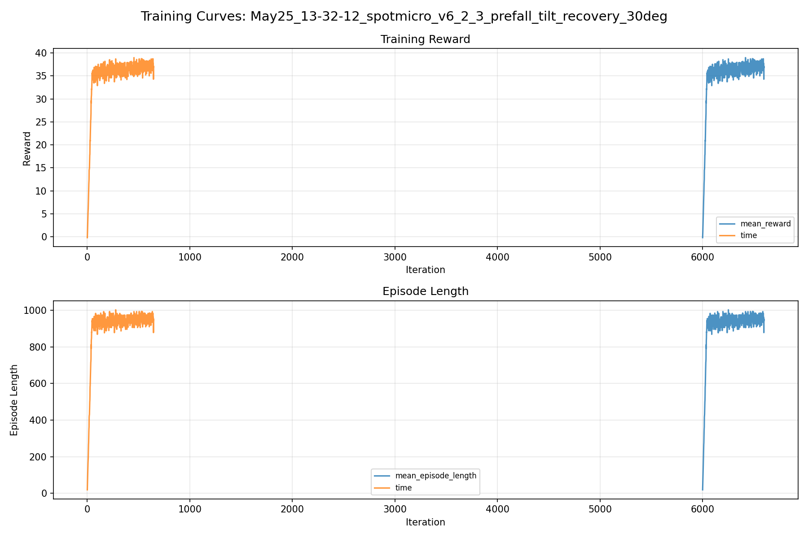
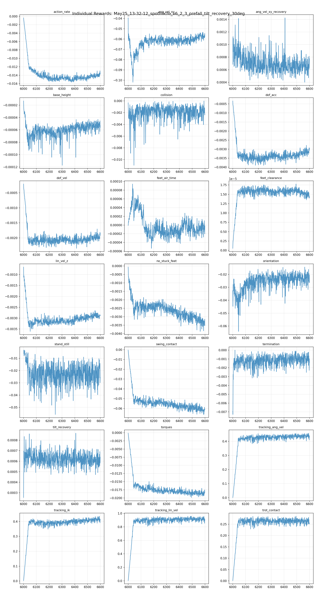
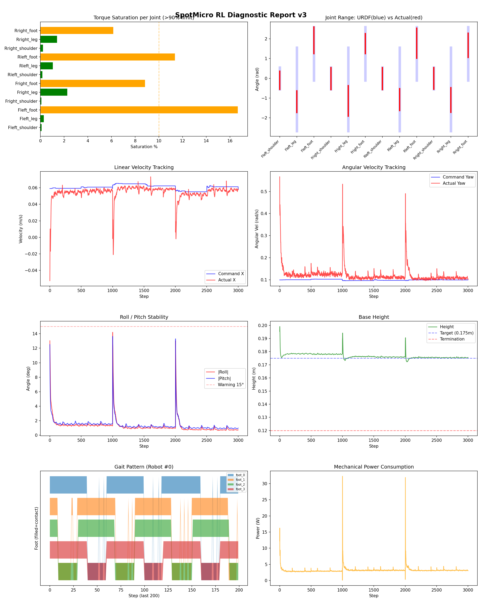
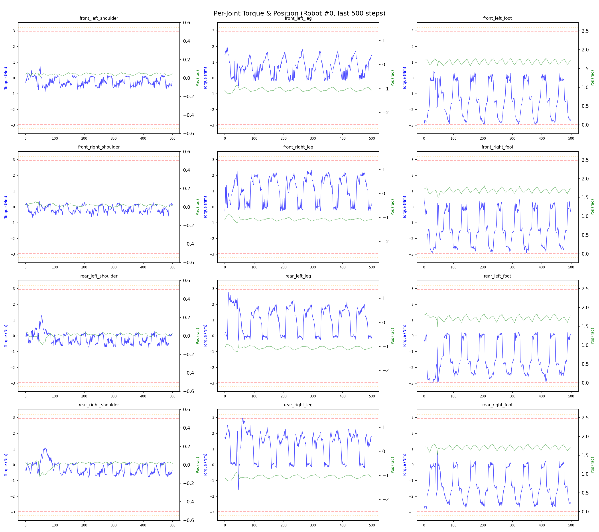
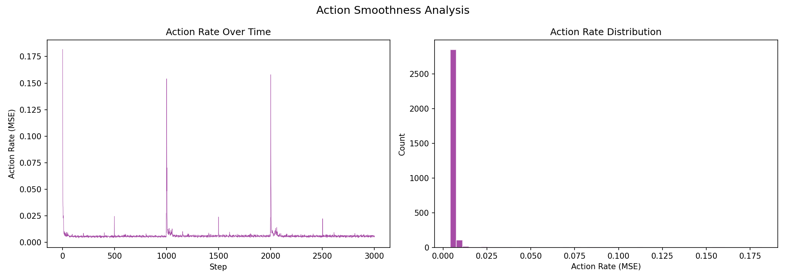

# 실험 076: spotmicro_v6_2_3_prefall_tilt_recovery_30deg

- **날짜:** 2026-05-25 13:46
- **Task:** spotmicro_test
- **Run name:** `spotmicro_v6_2_3_prefall_tilt_recovery_30deg`
- **판정:** ✅ PASS

---

## 실험 목적

v6.2.3 : recovery 각도 확장

---

## 변경점 (이전 커밋 대비)

```diff
diff --git a/ai_training/rl/legged_gym/legged_gym/envs/spotmicro_test/spotmicro_test_config.py b/ai_training/rl/legged_gym/legged_gym/envs/spotmicro_test/spotmicro_test_config.py
index 84a1e57..4543ac0 100644
--- a/ai_training/rl/legged_gym/legged_gym/envs/spotmicro_test/spotmicro_test_config.py
+++ b/ai_training/rl/legged_gym/legged_gym/envs/spotmicro_test/spotmicro_test_config.py
@@ -208,7 +208,7 @@ class SpotmicroTestCfg(LeggedRobotCfg):
         push_ang_vel_z_clip = 0.35
         action_delay = True
         action_delay_range = [1, 2]
-        recovery_roll_pitch_range_deg = 25.0
+        recovery_roll_pitch_range_deg = 30.0
         recovery_lin_vel_xy_range = 0.14
         recovery_lin_vel_z_range = 0.04
         recovery_ang_vel_xy_range = 0.90
@@ -222,10 +222,10 @@ class SpotmicroTestCfgPPO(LeggedRobotCfgPPO):
         learning_rate = 1e-4
 
     class runner(LeggedRobotCfgPPO.runner):
-        run_name = 'spotmicro_v6_2_2_prefall_tilt_recovery_25deg_continue'
+        run_name = 'spotmicro_v6_2_3_prefall_tilt_recovery_30deg'
         experiment_name = 'spotmicro_test'
-        max_iterations = 500
+        max_iterations = 600
         save_interval = 100
         resume = True
-        load_run = "May25_11-31-19_spotmicro_v6_2_1_prefall_tilt_recovery_25deg"
-        checkpoint = 5500
+        load_run = "May25_11-58-44_spotmicro_v6_2_2_prefall_tilt_recovery_25deg_continue"
+        checkpoint = 6000
```

**변경 요약:**
  - recovery_roll_pitch_range_deg = 25.0
  + recovery_roll_pitch_range_deg = 30.0
  - run_name = 'spotmicro_v6_2_2_prefall_tilt_recovery_25deg_continue'
  + run_name = 'spotmicro_v6_2_3_prefall_tilt_recovery_30deg'
  - max_iterations = 500
  + max_iterations = 600
  - load_run = "May25_11-31-19_spotmicro_v6_2_1_prefall_tilt_recovery_25deg"
  - checkpoint = 5500
  + load_run = "May25_11-58-44_spotmicro_v6_2_2_prefall_tilt_recovery_25deg_continue"
  + checkpoint = 6000

---

## 현재 Reward Scales

| Reward | Scale |
|--------|-------|
| action_rate | -0.05 |
| ang_vel_xy | -1.0 |
| ang_vel_xy_recovery | 0.5 |
| base_height | -2.0 |
| collision | -1.0 |
| dof_acc | -2.5e-07 |
| dof_vel | -0.0005 |
| feet_air_time | 0.04 |
| feet_clearance | 0.03 |
| lin_vel_z | -2.0 |
| no_stuck_feet | -0.2 |
| orientation | -10.0 |
| stand_still | -0.4 |
| swing_contact | -0.45 |
| termination | -20.0 |
| tilt_recovery | 4.0 |
| torques | -0.001 |
| tracking_ang_vel | 0.6 |
| tracking_ik | 0.6 |
| tracking_lin_vel | 1.0 |
| trot_contact | 0.35 |

---

## 진단 결과 (Diagnostic)

### 핵심 지표

- ✅ Timeout: 92.3% (≥80%)
- ✅ 속도오차 X: 0.0225 m/s (<0.08)
- ✅ 토크포화: 4.0% (<10%)
- ✅ 자세: roll 1.3°, pitch 1.4° (안정)
- ⚠️ 조기종료: 6.1% (5~20%)
- ⚠️ 전환복구: 71.4% (50~80%)
- ⚠️ 18도+ pre-fall 복구: 60.8% (60~85%)

### 상세 수치

| 지표 | 값 |
|------|-----|
| Timeout% | 92.25225225225225 |
| 조기종료% | 6.126126126126126 |
| 속도오차 X | 0.022505193948745728 m/s |
| 속도오차 Y | 0.01670311577618122 m/s |
| 각속도오차 | 0.07810930162668228 rad/s |
| 토크포화% | 4.043742715617716 |
| 평균 높이 | 0.17657257618008557 m |
| Roll (평균) | 1.294242024421692° |
| Pitch (평균) | 1.4200093746185303° |
| Action Rate | 0.006344964262098074 |
| 평균 전력 | 3.1976258754730225 W |
| CoT | 2.0389246271061343 |
| Recovery 성공률 | 83.99412628487518% |
| Recovery eligible trials | 681 |
| 평균 회복 시간 | 0.3122027902245209 s |
| Recovery 조기 실패율 | 4.992657856093979% |
| Recovery 18도+ 성공률 | 79.81132075471699% |
| Recovery 18도+ trials | 530 |
| Recovery 18도+ horizon 후 tilt | 5.8523215321472515° |
| Transition recovery 성공률 | 71.38047138047138% |
| Transition recovery eligible trials | 297 |
| 평균 Transition recovery 시간 | 0.3117924458610843 s |
| Transition 18도+ 성공률 | 60.824742268041234% |
| Transition 18도+ trials | 194 |
| Transition 18도+ horizon 후 tilt | 8.941679612493392° |

## Recovery Assist 분석

| 지표 | 값 |
|------|-----|
| 판정 | ✅ Recovery 안정적 |
| Recovery 성공률 | 84.0% |
| 성공/실패 | 572 / 109 |
| Eligible trials | 681 / 811 |
| 평균 회복 시간 | 0.312s |
| 조기 실패율 | 5.0% |
| 평가 horizon | 1.0 s |
| 초기 tilt 기준 | 12.000000000000002° |
| 안정 기준 | roll/pitch < 5.0°, height > 0.165m |
| 평균 초기 tilt | 22.437425272587507° |
| 평균 초기 roll/pitch | 17.115864384026473° / 16.68119626521543° |
| 1초 후 평균 roll/pitch | 3.952778472820681° / 3.264870570864523° |
| 1초 내 최대 roll/pitch 평균 | 18.58309773709105° / 17.708696629857528° |

> 해석: `Recovery 성공률`은 초기 tilt가 기준 이상인 episode 중 1초 내 안정 자세로 복귀한 비율입니다. 조기 실패율이 높으면 reset 직후 바로 넘어지는 것이고, 평균 회복 시간이 짧을수록 위기 대응이 빠른 것입니다.

### Recovery Tilt Band 분석

| Tilt 구간 | Trials | 성공률 | Horizon 후 평균 tilt | 평균 회복 시간 |
|-----------|--------|--------|----------------------|----------------|
| 12-18 deg | 151 | 98.7% | 1.70° | 0.18s |
| 18-25 deg | 281 | 91.1% | 3.05° | 0.32s |
| 25-30 deg | 249 | 67.1% | 9.01° | 0.41s |
| 30+ deg | 0 | N/A | N/A | N/A |
| 18+ deg 전체 | 530 | 79.8% | 5.85° | 0.36s |

> 이번 pre-fall 목표는 특히 `18-25 deg`, `25-30 deg`, `18+ deg 전체` 행을 우선 봅니다. `25-30 deg` trial이 없으면 30도 근처 회복 성능은 아직 검증되지 않은 것입니다.


## Transition Recovery 분석

| 지표 | 값 |
|------|-----|
| 판정 | ⚠️ 일부 전환 복구 가능 |
| Transition recovery 성공률 | 71.4% |
| 성공/실패 | 212 / 85 |
| Eligible trials | 297 / 3584 |
| 평균 회복 시간 | 0.312s |
| 조기 실패율 | 5.4% |
| 평가 horizon | 0.75 s |
| push 후 eligible 기준 | max roll/pitch > 12.000000000000002° |
| 안정 기준 | roll/pitch < 5.0°, height > 0.165m |
| 평균 최대 tilt | 21.823460255657714° |
| horizon 후 평균 roll/pitch | 5.399284881210387° / 4.672056599476246° |

> 해석: `Transition Recovery`는 학습 중 push/roll-pitch angular impulse가 들어간 뒤 일정 시간 안에 자세가 안정 기준으로 돌아오는지를 봅니다.

### Transition Recovery Tilt Band 분석

| Tilt 구간 | Trials | 성공률 | Horizon 후 평균 tilt | 평균 회복 시간 |
|-----------|--------|--------|----------------------|----------------|
| 12-18 deg | 103 | 91.3% | 2.27° | 0.25s |
| 18-25 deg | 122 | 73.0% | 4.25° | 0.36s |
| 25-30 deg | 40 | 52.5% | 6.55° | 0.38s |
| 30+ deg | 32 | 25.0% | 29.81° | 0.42s |
| 18+ deg 전체 | 194 | 60.8% | 8.94° | 0.36s |

> 이번 pre-fall 목표는 특히 `18-25 deg`, `25-30 deg`, `18+ deg 전체` 행을 우선 봅니다. `25-30 deg` trial이 없으면 30도 근처 회복 성능은 아직 검증되지 않은 것입니다.


## Command Mode별 회전 추종 분석

| 모드 | 비율 | 샘플 수 | 평균 abs(cmd_wz) | 평균 abs(actual_wz) | yaw 오차 | 상태 |
|------|------|---------|------------------|---------------------|----------|------|
| 정지 | 10.8% | 83096 | 0.0241 | 0.0628 | 0.0611 | ❌ |
| 직진/저회전 | 41.4% | 318263 | 0.0741 | 0.1121 | 0.0850 | ⚠️ |
| 제자리 회전 | 10.3% | 79542 | 0.1744 | 0.1681 | 0.0734 | ✅ |
| 전진+회전 | 14.6% | 112582 | 0.1757 | 0.1783 | 0.0902 | ⚠️ |
| 큰 회전명령 | 0.0% | 0 | N/A | N/A | N/A | N/A |

> 해석 기준: `제자리 회전`만 나쁘면 pure turn 학습/보행 패턴 문제, `큰 회전명령`만 나쁘면 yaw 명령 범위가 현재 토크/보폭 한계보다 큰 문제, `정지`가 나쁘면 stop drift 문제로 보면 됩니다.
        


## 학습 곡선 분석

| 지표 | 값 | 판정 |
|------|-----|------|
| 수렴 iter (90%) | 6042 | 느림 |
| 후반 안정성 (CV) | 0.025 | 안정 |
| 정체 구간 | 없음 | |


## Per-leg 분석

### 발별 접촉/공중 비율

| 발 | 접촉% | 공중% |
|-----|-------|------|
| foot_0 | 75.7% | 24.3% |
| foot_1 | 76.3% | 23.7% |
| foot_2 | 70.0% | 30.0% |
| foot_3 | 70.6% | 29.4% |

### 관절별 토크 포화

| 관절 | 포화% | 최대토크 | 한계 | 상태 |
|------|------|---------|------|------|
| front_left_shoulder | 0.1% | 2.940 | 2.940 | ✅ |
| front_left_leg | 0.3% | 2.940 | 2.940 | ✅ |
| front_left_foot | 16.7% | 2.940 | 2.940 | ⚠️ |
| front_right_shoulder | 0.1% | 2.940 | 2.940 | ✅ |
| front_right_leg | 2.3% | 2.940 | 2.940 | ✅ |
| front_right_foot | 8.8% | 2.940 | 2.940 | ⚠️ |
| rear_left_shoulder | 0.2% | 2.940 | 2.940 | ✅ |
| rear_left_leg | 1.1% | 2.940 | 2.940 | ✅ |
| rear_left_foot | 11.4% | 2.940 | 2.940 | ⚠️ |
| rear_right_shoulder | 0.2% | 2.940 | 2.940 | ✅ |
| rear_right_leg | 1.4% | 2.940 | 2.940 | ✅ |
| rear_right_foot | 6.1% | 2.940 | 2.940 | ⚠️ |


## Gait 분석

| 지표 | 값 |
|------|-----|
| Gait 주파수 | 0.21 Hz |
| Gait 주기 | 60 steps |
| 대각 동기화율 | 90.8% |
| L/R 비대칭 | 0.0%p |
| 판정 | ✅ Trot 패턴 / ✅ 대칭 |


## 관절별 상세

| 관절 | 토크포화% | 사용범위% | 편향(rad) | 한계근접% | 상태 |
|------|----------|----------|----------|----------|------|
| front_left_shoulder | 0.1% | 84% | -0.100 | 0.0% | ⚠️ |
| front_left_leg | 0.3% | 26% | -1.183 | 0.0% | ⚠️ |
| front_left_foot | 16.7% | 50% | +1.921 | 0.0% | ⚠️ |
| front_right_shoulder | 0.1% | 102% | -0.011 | 0.0% | ✅ |
| front_right_leg | 2.3% | 37% | -1.142 | 0.0% | ⚠️ |
| front_right_foot | 8.8% | 38% | +1.756 | 0.0% | ⚠️ |
| rear_left_shoulder | 0.2% | 103% | -0.014 | 0.0% | ✅ |
| rear_left_leg | 1.1% | 26% | -1.075 | 0.0% | ⚠️ |
| rear_left_foot | 11.4% | 57% | +1.773 | 0.0% | ⚠️ |
| rear_right_shoulder | 0.2% | 101% | -0.003 | 0.0% | ✅ |
| rear_right_leg | 1.4% | 30% | -1.098 | 0.0% | ⚠️ |
| rear_right_foot | 6.1% | 46% | +1.669 | 0.0% | ⚠️ |


## 에너지 효율 상세

| 지표 | 값 |
|------|-----|
| 평균 전력 | 3.20 W |
| 피크 전력 | 32.28 W |
| 피크/평균 비율 | 10.1x |
| CoT | 2.04 |

### 관절별 전력 분배

| 관절 | 평균전력(W) | 비율% |
|------|-----------|-------|
| front_left_foot | 0.530 | 16.6% |
| rear_right_foot | 0.485 | 15.2% |
| front_right_foot | 0.471 | 14.7% |
| rear_left_foot | 0.455 | 14.2% |
| front_right_leg | 0.320 | 10.0% |
| rear_right_leg | 0.294 | 9.2% |
| front_left_leg | 0.238 | 7.4% |
| rear_left_leg | 0.226 | 7.1% |
| rear_right_shoulder | 0.054 | 1.7% |
| front_right_shoulder | 0.049 | 1.5% |
| rear_left_shoulder | 0.041 | 1.3% |
| front_left_shoulder | 0.036 | 1.1% |


## 이전 실험 대비 비교

| 지표 | 이전 (exp075) | 현재 (exp076) | 변화 |
|------|-------|-------|------|
| Timeout% | 98.8% | 92.3% | ⚠️ ↓ 6.5894% |
| 속도오차 X | 0.0205 | 0.0225 | ⚠️ ↑ 0.0020m/s |
| 토크포화 | 4.0% | 4.0% | ⚠️ ↑ 0.0070% |
| Roll | 1.3° | 1.3° | ✅ ↓ 0.0481° |
| Pitch | 1.4° | 1.4° | ⚠️ ↑ 0.0131° |
| 평균 전력 | 3.0519W | 3.1976W | ⚠️ ↑ 0.1457W |


## Tensorboard 학습 곡선 요약

| 스칼라 | 최종값 | 최대 | 최소 | 후반10% 평균 |
|--------|--------|------|------|-------------|
| rew_action_rate | -0.0135 | -0.0004 | -0.0157 | -0.0140 |
| rew_ang_vel_xy | -0.0577 | -0.0394 | -0.1019 | -0.0574 |
| rew_ang_vel_xy_recovery | 0.0008 | 0.0014 | 0.0004 | 0.0007 |
| rew_base_height | -0.0001 | -0.0000 | -0.0001 | -0.0001 |
| rew_collision | -0.0022 | 0.0000 | -0.0110 | -0.0020 |
| rew_dof_acc | -0.0029 | -0.0003 | -0.0039 | -0.0032 |
| rew_dof_vel | -0.0018 | -0.0002 | -0.0023 | -0.0020 |
| rew_feet_air_time | -0.0000 | 0.0001 | -0.0001 | -0.0000 |
| rew_feet_clearance | 0.0000 | 0.0000 | 0.0000 | 0.0000 |
| rew_lin_vel_z | -0.0029 | -0.0007 | -0.0036 | -0.0029 |
| rew_no_stuck_feet | -0.0035 | -0.0001 | -0.0039 | -0.0033 |
| rew_orientation | -0.0261 | -0.0143 | -0.0642 | -0.0230 |
| rew_stand_still | -0.0255 | -0.0034 | -0.0558 | -0.0235 |
| rew_swing_contact | -0.0614 | -0.0004 | -0.0661 | -0.0609 |
| rew_termination | -0.0014 | 0.0000 | -0.0073 | -0.0010 |
| rew_tilt_recovery | 0.0006 | 0.0009 | 0.0003 | 0.0006 |
| rew_torques | -0.0182 | -0.0001 | -0.0199 | -0.0185 |
| rew_tracking_ang_vel | 0.4291 | 0.4573 | 0.0016 | 0.4369 |
| rew_tracking_ik | 0.4107 | 0.4354 | 0.0029 | 0.4136 |
| rew_tracking_lin_vel | 0.8935 | 0.9570 | 0.0040 | 0.9137 |
| rew_trot_contact | 0.2547 | 0.2848 | 0.0013 | 0.2617 |
| learning_rate | 0.0002 | 0.0002 | 0.0000 | 0.0002 |
| surrogate | -0.0032 | 0.0017 | -0.0049 | -0.0028 |
| value_function | 0.0044 | 0.0896 | 0.0023 | 0.0038 |
| collection time | 0.7634 | 1.1052 | 0.7332 | 0.7694 |
| learning_time | 0.2834 | 0.3335 | 0.2628 | 0.2890 |
| total_fps | 93903.0000 | 97169.0000 | 69814.0000 | 92921.1667 |
| mean_noise_std | 0.0838 | 0.0886 | 0.0743 | 0.0846 |
| mean_episode_length | 944.1300 | 1002.0000 | 19.1800 | 952.1920 |
| time | 944.1300 | 1002.0000 | 19.1800 | 952.1920 |
| mean_reward | 36.8653 | 38.9893 | -0.1998 | 37.1269 |
| time | 36.8653 | 38.9893 | -0.1998 | 37.1269 |

총 학습 iteration: 6599


---

## 그래프

### Tensorboard 학습 곡선



### Diagnostic 결과





---

## 결론 및 다음 실험 방향

**자동 판정:** ✅ PASS

대부분 기준을 통과했으나 일부 항목이 보통 수준입니다.
  - ⚠️ 조기종료: 6.1% (5~20%)
  - ⚠️ 전환복구: 71.4% (50~80%)
  - ⚠️ 18도+ pre-fall 복구: 60.8% (60~85%)

> 💡 위 결론은 자동 생성되었습니다. 필요시 수정하세요.

---

## 메모

_(추가 메모가 있으면 여기에 작성)_

