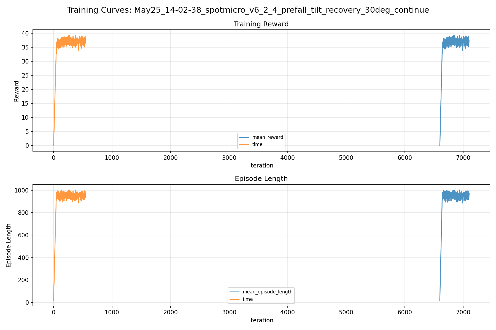
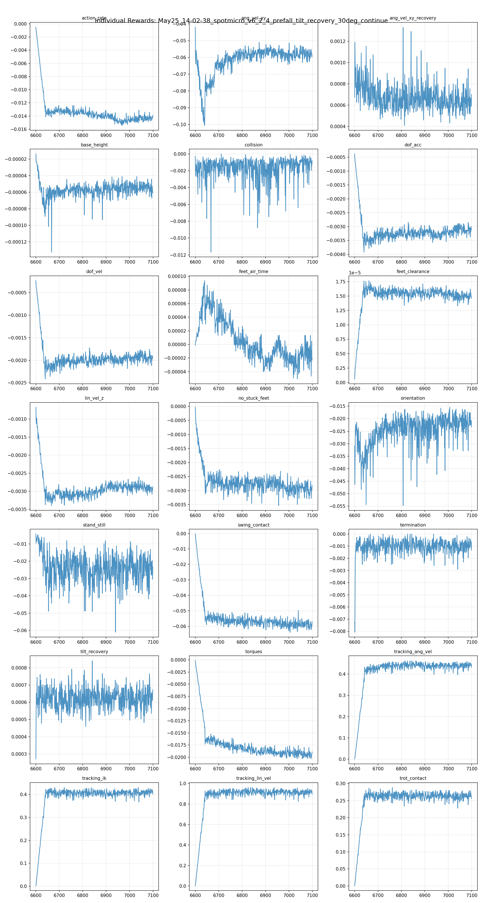
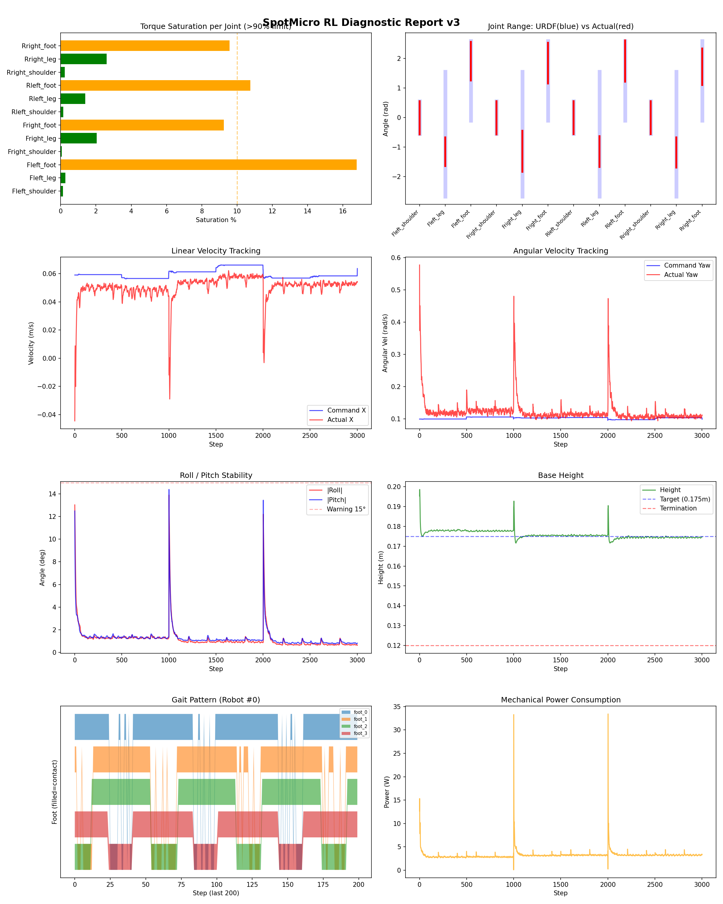
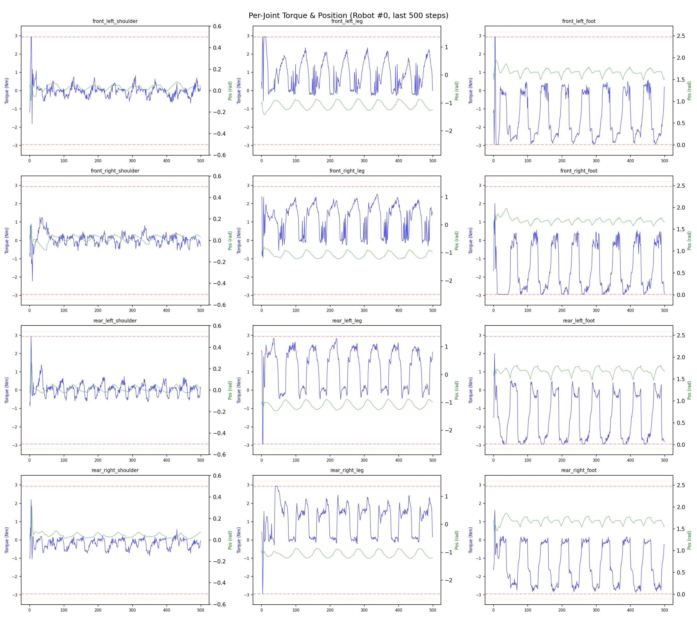
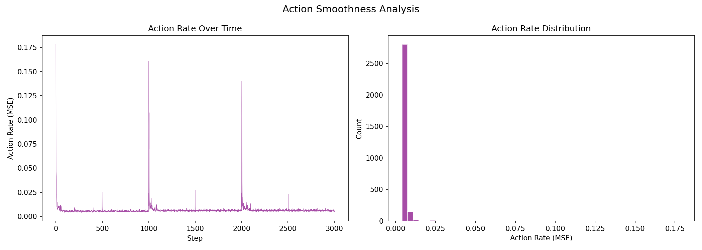

# 실험 077: spotmicro_v6_2_4_prefall_tilt_recovery_30deg_continue

- **날짜:** 2026-05-25 14:15
- **Task:** spotmicro_test
- **Run name:** `spotmicro_v6_2_4_prefall_tilt_recovery_30deg_continue`
- **판정:** ❌ FAIL (일부 기준 미달)

---

## 실험 목적

v6.2.4 : recovery 각도 확장 추가 학습

---

## 변경점 (이전 커밋 대비)

```diff
diff --git a/ai_training/rl/experiment_report.py b/ai_training/rl/experiment_report.py
index fc1551e..3c6b10c 100644
--- a/ai_training/rl/experiment_report.py
+++ b/ai_training/rl/experiment_report.py
@@ -436,18 +436,36 @@ def load_previous_experiment(experiments_dir, current_id):
 # ============================================================
 # 8. Pass/Fail 자동 판정
 # ============================================================
-def auto_judge(metrics, run_name=''):
+def _find_tilt_band(summary, label):
+    for band in summary.get('tilt_bands', []) if summary else []:
+        if band.get('label') == label:
+            return band
+    return {}
+
+
+def auto_judge(metrics, run_name='', recovery_data=None, transition_recovery_data=None):
     if not metrics:
         return "⚠ 수치 데이터 없음 — 수동 판정 필요", []
 
     judgments = []
     all_pass = True
+    prefall_mode = (
+        'prefall' in run_name
+        or bool(recovery_data)
+        or bool(transition_recovery_data)
+    )
 
     timeout = metrics.get('timeout_pct', 0)
-    if timeout >= 80:
-        judgments.append(f"✅ Timeout: {timeout:.1f}% (≥80%)")
+    timeout_pass = 95 if prefall_mode else 80
+    timeout_warn = 90 if prefall_mode else 60
+    if timeout >= timeout_pass:
+        judgments.append(f"✅ Timeout: {timeout:.1f}% (≥{timeout_pass}%)")
+    elif timeout >= timeout_warn:
+        judgments.append(f"⚠️ Timeout: {timeout:.1f}% ({timeout_warn}~{timeout_pass}%, 개선 필요)")
+        if prefall_mode:
+            all_pass = False
     elif timeout >= 60:
-        judgments.append(f"⚠️ Timeout: {timeout:.1f}% (60~80%, 보통)")
+        judgments.append(f"⚠️ Timeout: {timeout:.1f}% (60~{timeout_warn}%, 보통)")
         all_pass = False
     else:
         judgments.append(f"❌ Timeout: {timeout:.1f}% (<60%, 미달)")
@@ -482,10 +500,13 @@ def auto_judge(metrics, run_name=''):
         all_pass = False
 
     early_death = metrics.get('early_death_pct', 0)
-    if early_death < 5:
-        judgments.append(f"✅ 조기종료: {early_death:.1f}% (<5%)")
+    early_death_pass = 5 if prefall_mode else 5
+    if early_death < early_death_pass:
+        judgments.append(f"✅ 조기종료: {early_death:.1f}% (<{early_death_pass}%)")
     elif early_death < 20:
         judgments.append(f"⚠️ 조기종료: {early_death:.1f}% (5~20%)")
+        if prefall_mode:
+            all_pass = False
     else:
         judgments.append(f"❌ 조기종료: {early_death:.1f}% (>20%)")
         all_pass = False
@@ -503,15 +524,52 @@ def auto_judge(metrics, run_name=''):
     prefall_trials = metrics.get('transition_prefall_trials', 0)
     prefall_sr = metrics.get('transition_prefall_success_rate_pct')
     if prefall_trials:
-        if prefall_sr is not None and prefall_sr >= 85:
-            judgments.append(f"✅ 18도+ pre-fall 복구: {prefall_sr:.1f}% (≥85%)")
+        prefall_pass = 70 if prefall_mode else 85
+        prefall_warn = 60
+        if prefall_sr is not None and prefall_sr >= prefall_pass:
+            judgments.append(f"✅ 18도+ pre-fall 복구: {
```

**변경 요약:**
  - def auto_judge(metrics, run_name=''):
  + def _find_tilt_band(summary, label):
  + for band in summary.get('tilt_bands', []) if summary else []:
  + if band.get('label') == label:
  + return band
  + return {}
  + def auto_judge(metrics, run_name='', recovery_data=None, transition_recovery_data=None):
  + prefall_mode = (
  + 'prefall' in run_name
  + or bool(recovery_data)
  + or bool(transition_recovery_data)
  + )
  - if timeout >= 80:
  - judgments.append(f"✅ Timeout: {timeout:.1f}% (≥80%)")
  + timeout_pass = 95 if prefall_mode else 80
  + timeout_warn = 90 if prefall_mode else 60
  + if timeout >= timeout_pass:
  + judgments.append(f"✅ Timeout: {timeout:.1f}% (≥{timeout_pass}%)")
  + elif timeout >= timeout_warn:
  + judgments.append(f"⚠️ Timeout: {timeout:.1f}% ({timeout_warn}~{timeout_pass}%, 개선 필요)")
  + if prefall_mode:
  + all_pass = False
  - judgments.append(f"⚠️ Timeout: {timeout:.1f}% (60~80%, 보통)")
  + judgments.append(f"⚠️ Timeout: {timeout:.1f}% (60~{timeout_warn}%, 보통)")
  - if early_death < 5:
  - judgments.append(f"✅ 조기종료: {early_death:.1f}% (<5%)")
  + early_death_pass = 5 if prefall_mode else 5
  + if early_death < early_death_pass:
  + judgments.append(f"✅ 조기종료: {early_death:.1f}% (<{early_death_pass}%)")
  + if prefall_mode:
  + all_pass = False
  - if prefall_sr is not None and prefall_sr >= 85:
  - judgments.append(f"✅ 18도+ pre-fall 복구: {prefall_sr:.1f}% (≥85%)")
  + prefall_pass = 70 if prefall_mode else 85
  + prefall_warn = 60
  + if prefall_sr is not None and prefall_sr >= prefall_pass:
  + judgments.append(f"✅ 18도+ pre-fall 복구: {prefall_sr:.1f}% (≥{prefall_pass}%)")
  - judgments.append(f"⚠️ 18도+ pre-fall 복구: {prefall_sr:.1f}% (60~85%)")
  + judgments.append(f"⚠️ 18도+ pre-fall 복구: {prefall_sr:.1f}% ({prefall_warn}~{prefall_pass}%, 개선 필요)")
  + if prefall_mode:
  + all_pass = False
  - judgments.append(f"❌ 18도+ pre-fall 복구: {prefall_sr:.1f}% (<60%)")
  + judgments.append(f"❌ 18도+ pre-fall 복구: {prefall_sr:.1f}% (<{prefall_warn}%)")
  + if prefall_mode:
  + all_pass = False
  + if prefall_mode:
  + reset_25_30 = _find_tilt_band(recovery_data, '25-30 deg')
  + reset_sr = reset_25_30.get('success_rate_pct')
  + reset_trials = reset_25_30.get('trials', 0)
  + if reset_trials <= 0:
  + judgments.append("❌ Reset 25-30도 복구: trial 없음")
  + all_pass = False
  + elif reset_sr is not None and reset_sr >= 75:
  + judgments.append(f"✅ Reset 25-30도 복구: {reset_sr:.1f}% (≥75%, n={reset_trials})")
  + elif reset_sr is not None and reset_sr >= 65:
  + judgments.append(f"⚠️ Reset 25-30도 복구: {reset_sr:.1f}% (65~75%, n={reset_trials})")
  + all_pass = False
  + elif reset_sr is not None:
  + judgments.append(f"❌ Reset 25-30도 복구: {reset_sr:.1f}% (<65%, n={reset_trials})")
  + all_pass = False
  + transition_25_30 = _find_tilt_band(transition_recovery_data, '25-30 deg')
  + transition_sr = transition_25_30.get('success_rate_pct')
  + transition_trials = transition_25_30.get('trials', 0)
  + if transition_trials < 20:
  + judgments.append(f"❌ Transition 25-30도 복구: trial 부족 (n={transition_trials}, 최소 20)")
  + all_pass = False
  + elif transition_sr is not None and transition_sr >= 65:
  + judgments.append(f"✅ Transition 25-30도 복구: {transition_sr:.1f}% (≥65%, n={transition_trials})")
  + elif transition_sr is not None and transition_sr >= 55:
  + judgments.append(f"⚠️ Transition 25-30도 복구: {transition_sr:.1f}% (55~65%, n={transition_trials})")
  + all_pass = False
  + elif transition_sr is not None:
  + judgments.append(f"❌ Transition 25-30도 복구: {transition_sr:.1f}% (<55%, n={transition_trials})")
  + all_pass = False
  - overall_judge, judgments = auto_judge(metrics, run_name)
  + overall_judge, judgments = auto_judge(
  + metrics,
  + run_name,
  + recovery_data=recovery_data,
  + transition_recovery_data=transition_recovery_data,
  + )
  - command_scale = 0.25
  + command_scale = 0.15
  - phase_scale = 0.2
  + phase_scale = 0.1
  - run_name = 'spotmicro_v6_2_3_prefall_tilt_recovery_30deg'
  + run_name = 'spotmicro_v6_2_4_prefall_tilt_recovery_30deg_continue'
  - max_iterations = 600
  + max_iterations = 500
  - load_run = "May25_11-58-44_spotmicro_v6_2_2_prefall_tilt_recovery_25deg_continue"
  - checkpoint = 6000
  + load_run = "May25_13-32-12_spotmicro_v6_2_3_prefall_tilt_recovery_30deg"
  + checkpoint = 6600

---

## 현재 Reward Scales

| Reward | Scale |
|--------|-------|
| action_rate | -0.05 |
| ang_vel_xy | -1.0 |
| ang_vel_xy_recovery | 0.5 |
| base_height | -2.0 |
| collision | -1.0 |
| dof_acc | -2.5e-07 |
| dof_vel | -0.0005 |
| feet_air_time | 0.04 |
| feet_clearance | 0.03 |
| lin_vel_z | -2.0 |
| no_stuck_feet | -0.2 |
| orientation | -10.0 |
| stand_still | -0.4 |
| swing_contact | -0.45 |
| termination | -20.0 |
| tilt_recovery | 4.0 |
| torques | -0.001 |
| tracking_ang_vel | 0.6 |
| tracking_ik | 0.6 |
| tracking_lin_vel | 1.0 |
| trot_contact | 0.35 |

---

## 진단 결과 (Diagnostic)

### 핵심 지표

- ⚠️ Timeout: 94.8% (90~95%, 개선 필요)
- ✅ 속도오차 X: 0.0227 m/s (<0.08)
- ✅ 토크포화: 4.4% (<10%)
- ✅ 자세: roll 1.2°, pitch 1.3° (안정)
- ✅ 조기종료: 3.3% (<5%)
- ⚠️ 전환복구: 73.0% (50~80%)
- ⚠️ 18도+ pre-fall 복구: 65.2% (60~70%, 개선 필요)
- ⚠️ Reset 25-30도 복구: 69.0% (65~75%, n=255)
- ❌ Transition 25-30도 복구: 54.2% (<55%, n=48)

### 상세 수치

| 지표 | 값 |
|------|-----|
| Timeout% | 94.81481481481482 |
| 조기종료% | 3.3333333333333335 |
| 속도오차 X | 0.022679487243294716 m/s |
| 속도오차 Y | 0.01800965704023838 m/s |
| 각속도오차 | 0.0761241763830185 rad/s |
| 토크포화% | 4.4377497502497505 |
| 평균 높이 | 0.17587925102208163 m |
| Roll (평균) | 1.2014079093933105° |
| Pitch (평균) | 1.2720093727111816° |
| Action Rate | 0.006603873800486326 |
| 평균 전력 | 3.2436740398406982 W |
| CoT | 2.1988869186449436 |
| Recovery 성공률 | 84.3558282208589% |
| Recovery eligible trials | 652 |
| 평균 회복 시간 | 0.3135636293549429 s |
| Recovery 조기 실패율 | 2.7607361963190185% |
| Recovery 18도+ 성공률 | 80.31809145129225% |
| Recovery 18도+ trials | 503 |
| Recovery 18도+ horizon 후 tilt | 4.768311482493138° |
| Transition recovery 성공률 | 73.01038062283737% |
| Transition recovery eligible trials | 289 |
| 평균 Transition recovery 시간 | 0.3208530733970952 s |
| Transition 18도+ 성공률 | 65.24064171122996% |
| Transition 18도+ trials | 187 |
| Transition 18도+ horizon 후 tilt | 7.606356235669258° |

## Recovery Assist 분석

| 지표 | 값 |
|------|-----|
| 판정 | ✅ Recovery 안정적 |
| Recovery 성공률 | 84.4% |
| 성공/실패 | 550 / 102 |
| Eligible trials | 652 / 796 |
| 평균 회복 시간 | 0.314s |
| 조기 실패율 | 2.8% |
| 평가 horizon | 1.0 s |
| 초기 tilt 기준 | 12.000000000000002° |
| 안정 기준 | roll/pitch < 5.0°, height > 0.165m |
| 평균 초기 tilt | 22.43615248523862° |
| 평균 초기 roll/pitch | 16.641185018612997° / 17.11993884323564° |
| 1초 후 평균 roll/pitch | 3.1475043004049965° / 2.8084714946059752° |
| 1초 내 최대 roll/pitch 평균 | 17.724040618886246° / 18.069317867785145° |

> 해석: `Recovery 성공률`은 초기 tilt가 기준 이상인 episode 중 1초 내 안정 자세로 복귀한 비율입니다. 조기 실패율이 높으면 reset 직후 바로 넘어지는 것이고, 평균 회복 시간이 짧을수록 위기 대응이 빠른 것입니다.

### Recovery Tilt Band 분석

| Tilt 구간 | Trials | 성공률 | Horizon 후 평균 tilt | 평균 회복 시간 |
|-----------|--------|--------|----------------------|----------------|
| 12-18 deg | 149 | 98.0% | 1.71° | 0.18s |
| 18-25 deg | 248 | 91.9% | 2.11° | 0.30s |
| 25-30 deg | 255 | 69.0% | 7.35° | 0.44s |
| 30+ deg | 0 | N/A | N/A | N/A |
| 18+ deg 전체 | 503 | 80.3% | 4.77° | 0.36s |

> 이번 pre-fall 목표는 특히 `18-25 deg`, `25-30 deg`, `18+ deg 전체` 행을 우선 봅니다. `25-30 deg` trial이 없으면 30도 근처 회복 성능은 아직 검증되지 않은 것입니다.


## Transition Recovery 분석

| 지표 | 값 |
|------|-----|
| 판정 | ⚠️ 일부 전환 복구 가능 |
| Transition recovery 성공률 | 73.0% |
| 성공/실패 | 211 / 78 |
| Eligible trials | 289 / 3584 |
| 평균 회복 시간 | 0.321s |
| 조기 실패율 | 4.5% |
| 평가 horizon | 0.75 s |
| push 후 eligible 기준 | max roll/pitch > 12.000000000000002° |
| 안정 기준 | roll/pitch < 5.0°, height > 0.165m |
| 평균 최대 tilt | 21.51672578374437° |
| horizon 후 평균 roll/pitch | 4.4151213103840865° / 4.068613459167609° |

> 해석: `Transition Recovery`는 학습 중 push/roll-pitch angular impulse가 들어간 뒤 일정 시간 안에 자세가 안정 기준으로 돌아오는지를 봅니다.

### Transition Recovery Tilt Band 분석

| Tilt 구간 | Trials | 성공률 | Horizon 후 평균 tilt | 평균 회복 시간 |
|-----------|--------|--------|----------------------|----------------|
| 12-18 deg | 102 | 87.3% | 2.39° | 0.24s |
| 18-25 deg | 119 | 78.2% | 3.70° | 0.36s |
| 25-30 deg | 48 | 54.2% | 6.18° | 0.46s |
| 30+ deg | 20 | 15.0% | 34.26° | 0.40s |
| 18+ deg 전체 | 187 | 65.2% | 7.61° | 0.38s |

> 이번 pre-fall 목표는 특히 `18-25 deg`, `25-30 deg`, `18+ deg 전체` 행을 우선 봅니다. `25-30 deg` trial이 없으면 30도 근처 회복 성능은 아직 검증되지 않은 것입니다.


## Command Mode별 회전 추종 분석

| 모드 | 비율 | 샘플 수 | 평균 abs(cmd_wz) | 평균 abs(actual_wz) | yaw 오차 | 상태 |
|------|------|---------|------------------|---------------------|----------|------|
| 정지 | 10.2% | 78441 | 0.0261 | 0.0666 | 0.0631 | ❌ |
| 직진/저회전 | 41.0% | 315446 | 0.0760 | 0.1090 | 0.0811 | ⚠️ |
| 제자리 회전 | 11.6% | 89175 | 0.1739 | 0.1678 | 0.0754 | ✅ |
| 전진+회전 | 15.3% | 117976 | 0.1748 | 0.1742 | 0.0808 | ⚠️ |
| 큰 회전명령 | 0.0% | 0 | N/A | N/A | N/A | N/A |

> 해석 기준: `제자리 회전`만 나쁘면 pure turn 학습/보행 패턴 문제, `큰 회전명령`만 나쁘면 yaw 명령 범위가 현재 토크/보폭 한계보다 큰 문제, `정지`가 나쁘면 stop drift 문제로 보면 됩니다.
        


## 학습 곡선 분석

| 지표 | 값 | 판정 |
|------|-----|------|
| 수렴 iter (90%) | 6642 | 느림 |
| 후반 안정성 (CV) | 0.024 | 안정 |
| 정체 구간 | 없음 | |


## Per-leg 분석

### 발별 접촉/공중 비율

| 발 | 접촉% | 공중% |
|-----|-------|------|
| foot_0 | 75.7% | 24.3% |
| foot_1 | 76.9% | 23.1% |
| foot_2 | 69.3% | 30.7% |
| foot_3 | 69.8% | 30.2% |

### 관절별 토크 포화

| 관절 | 포화% | 최대토크 | 한계 | 상태 |
|------|------|---------|------|------|
| front_left_shoulder | 0.1% | 2.940 | 2.940 | ✅ |
| front_left_leg | 0.3% | 2.940 | 2.940 | ✅ |
| front_left_foot | 16.8% | 2.940 | 2.940 | ⚠️ |
| front_right_shoulder | 0.1% | 2.940 | 2.940 | ✅ |
| front_right_leg | 2.0% | 2.940 | 2.940 | ✅ |
| front_right_foot | 9.2% | 2.940 | 2.940 | ⚠️ |
| rear_left_shoulder | 0.2% | 2.940 | 2.940 | ✅ |
| rear_left_leg | 1.4% | 2.940 | 2.940 | ✅ |
| rear_left_foot | 10.8% | 2.940 | 2.940 | ⚠️ |
| rear_right_shoulder | 0.2% | 2.940 | 2.940 | ✅ |
| rear_right_leg | 2.6% | 2.940 | 2.940 | ✅ |
| rear_right_foot | 9.6% | 2.940 | 2.940 | ⚠️ |


## Gait 분석

| 지표 | 값 |
|------|-----|
| Gait 주파수 | 0.21 Hz |
| Gait 주기 | 60 steps |
| 대각 동기화율 | 87.8% |
| L/R 비대칭 | 0.0%p |
| 판정 | ✅ Trot 패턴 / ✅ 대칭 |


## 관절별 상세

| 관절 | 토크포화% | 사용범위% | 편향(rad) | 한계근접% | 상태 |
|------|----------|----------|----------|----------|------|
| front_left_shoulder | 0.1% | 102% | -0.009 | 0.0% | ✅ |
| front_left_leg | 0.3% | 23% | -1.153 | 0.0% | ⚠️ |
| front_left_foot | 16.8% | 48% | +1.900 | 0.0% | ⚠️ |
| front_right_shoulder | 0.1% | 102% | -0.011 | 0.1% | ✅ |
| front_right_leg | 2.0% | 33% | -1.137 | 0.0% | ⚠️ |
| front_right_foot | 9.2% | 51% | +1.838 | 0.0% | ⚠️ |
| rear_left_shoulder | 0.2% | 101% | -0.005 | 0.0% | ✅ |
| rear_left_leg | 1.4% | 25% | -1.152 | 0.0% | ⚠️ |
| rear_left_foot | 10.8% | 52% | +1.906 | 0.0% | ⚠️ |
| rear_right_shoulder | 0.2% | 101% | -0.005 | 0.0% | ✅ |
| rear_right_leg | 2.6% | 24% | -1.182 | 0.0% | ⚠️ |
| rear_right_foot | 9.6% | 46% | +1.713 | 0.0% | ⚠️ |


## 에너지 효율 상세

| 지표 | 값 |
|------|-----|
| 평균 전력 | 3.24 W |
| 피크 전력 | 33.43 W |
| 피크/평균 비율 | 10.3x |
| CoT | 2.20 |

### 관절별 전력 분배

| 관절 | 평균전력(W) | 비율% |
|------|-----------|-------|
| front_left_foot | 0.563 | 17.3% |
| front_right_foot | 0.484 | 14.9% |
| rear_right_foot | 0.482 | 14.8% |
| rear_left_foot | 0.431 | 13.3% |
| front_right_leg | 0.318 | 9.8% |
| rear_right_leg | 0.301 | 9.3% |
| front_left_leg | 0.258 | 8.0% |
| rear_left_leg | 0.228 | 7.0% |
| front_right_shoulder | 0.051 | 1.6% |
| rear_right_shoulder | 0.050 | 1.6% |
| rear_left_shoulder | 0.041 | 1.3% |
| front_left_shoulder | 0.036 | 1.1% |


## 이전 실험 대비 비교

| 지표 | 이전 (exp076) | 현재 (exp077) | 변화 |
|------|-------|-------|------|
| Timeout% | 92.3% | 94.8% | ✅ ↑ 2.5626% |
| 속도오차 X | 0.0225 | 0.0227 | ⚠️ ↑ 0.0002m/s |
| 토크포화 | 4.0% | 4.4% | ⚠️ ↑ 0.3940% |
| Roll | 1.3° | 1.2° | ✅ ↓ 0.0928° |
| Pitch | 1.4° | 1.3° | ✅ ↓ 0.1480° |
| 평균 전력 | 3.1976W | 3.2437W | ⚠️ ↑ 0.0460W |


## Tensorboard 학습 곡선 요약

| 스칼라 | 최종값 | 최대 | 최소 | 후반10% 평균 |
|--------|--------|------|------|-------------|
| rew_action_rate | -0.0139 | -0.0005 | -0.0154 | -0.0143 |
| rew_ang_vel_xy | -0.0595 | -0.0420 | -0.1006 | -0.0579 |
| rew_ang_vel_xy_recovery | 0.0007 | 0.0013 | 0.0004 | 0.0006 |
| rew_base_height | -0.0001 | -0.0000 | -0.0001 | -0.0001 |
| rew_collision | -0.0008 | -0.0000 | -0.0117 | -0.0011 |
| rew_dof_acc | -0.0031 | -0.0004 | -0.0039 | -0.0031 |
| rew_dof_vel | -0.0019 | -0.0002 | -0.0024 | -0.0019 |
| rew_feet_air_time | -0.0000 | 0.0001 | -0.0001 | -0.0000 |
| rew_feet_clearance | 0.0000 | 0.0000 | 0.0000 | 0.0000 |
| rew_lin_vel_z | -0.0029 | -0.0007 | -0.0034 | -0.0029 |
| rew_no_stuck_feet | -0.0028 | -0.0000 | -0.0035 | -0.0029 |
| rew_orientation | -0.0233 | -0.0155 | -0.0548 | -0.0216 |
| rew_stand_still | -0.0232 | -0.0043 | -0.0610 | -0.0246 |
| rew_swing_contact | -0.0569 | -0.0003 | -0.0638 | -0.0588 |
| rew_termination | -0.0013 | 0.0000 | -0.0081 | -0.0010 |
| rew_tilt_recovery | 0.0007 | 0.0008 | 0.0003 | 0.0006 |
| rew_torques | -0.0189 | -0.0002 | -0.0203 | -0.0194 |
| rew_tracking_ang_vel | 0.4313 | 0.4620 | 0.0017 | 0.4402 |
| rew_tracking_ik | 0.4015 | 0.4303 | 0.0029 | 0.4094 |
| rew_tracking_lin_vel | 0.8956 | 0.9614 | 0.0041 | 0.9147 |
| rew_trot_contact | 0.2565 | 0.2885 | 0.0011 | 0.2632 |
| learning_rate | 0.0002 | 0.0003 | 0.0000 | 0.0002 |
| surrogate | -0.0029 | 0.0042 | -0.0046 | -0.0025 |
| value_function | 0.0039 | 0.0752 | 0.0021 | 0.0038 |
| collection time | 0.7918 | 0.8726 | 0.7298 | 0.7809 |
| learning_time | 0.2836 | 0.3677 | 0.2770 | 0.2866 |
| total_fps | 91412.0000 | 96702.0000 | 79258.0000 | 92114.3400 |
| mean_noise_std | 0.0836 | 0.0876 | 0.0800 | 0.0850 |
| mean_episode_length | 963.5900 | 1002.0000 | 18.0300 | 957.2650 |
| time | 963.5900 | 1002.0000 | 18.0300 | 957.2650 |
| mean_reward | 37.5036 | 39.2796 | -0.1260 | 37.2853 |
| time | 37.5036 | 39.2796 | -0.1260 | 37.2853 |

총 학습 iteration: 7099


---

## 그래프

### Tensorboard 학습 곡선



### Diagnostic 결과





---

## 결론 및 다음 실험 방향

**자동 판정:** ❌ FAIL (일부 기준 미달)

일부 기준을 통과하지 못했습니다. 조정이 필요합니다.
  - ❌ Transition 25-30도 복구: 54.2% (<55%, n=48)

> 💡 위 결론은 자동 생성되었습니다. 필요시 수정하세요.

---

## 메모

_(추가 메모가 있으면 여기에 작성)_

