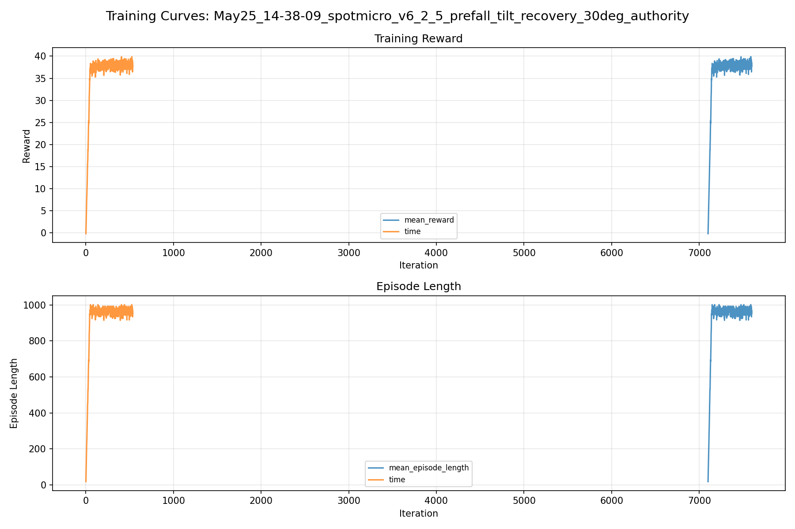
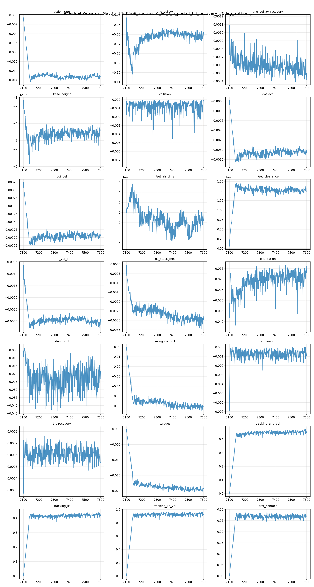
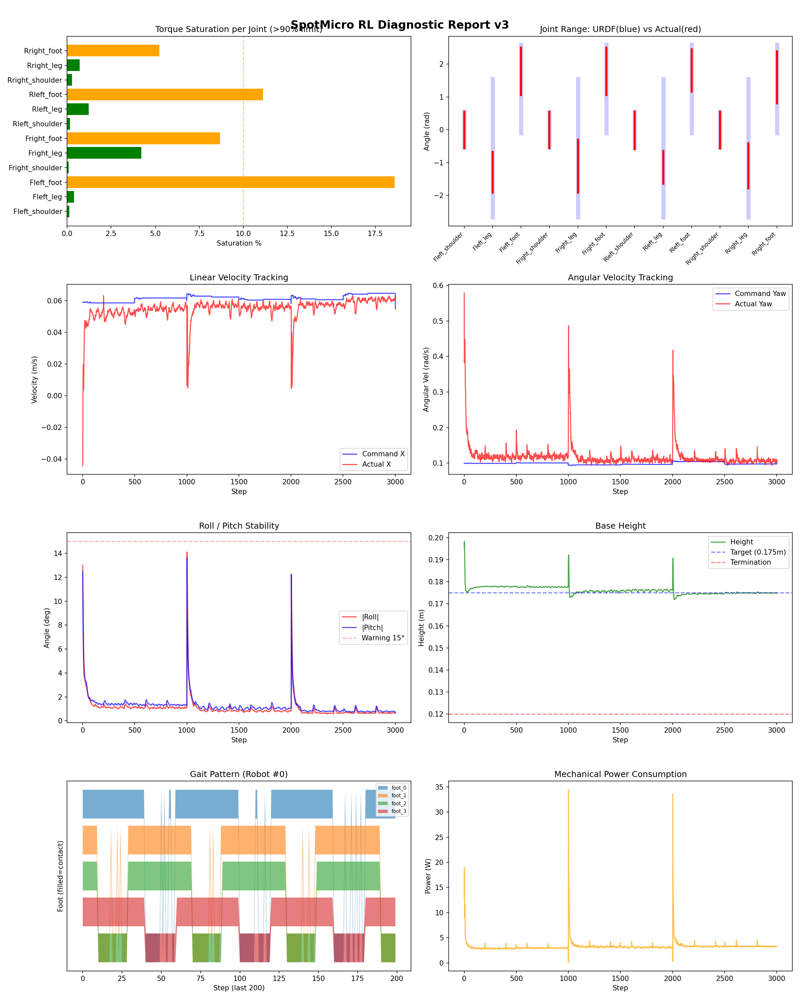
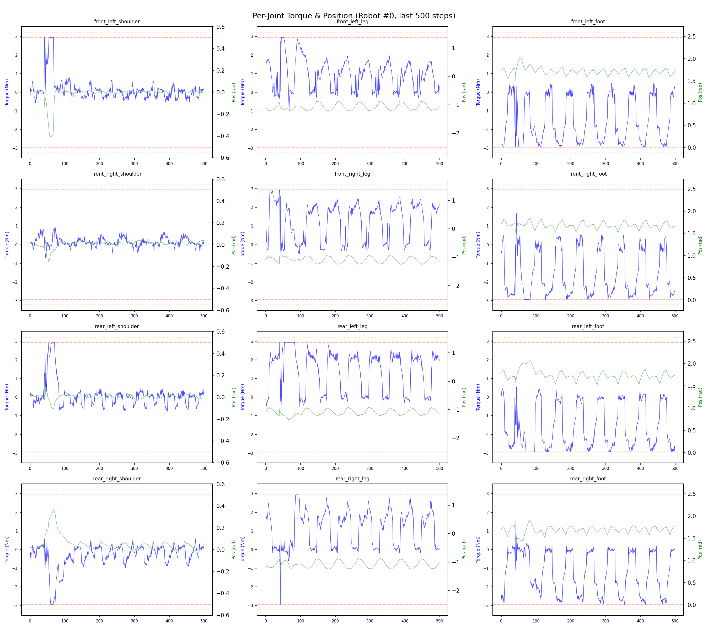
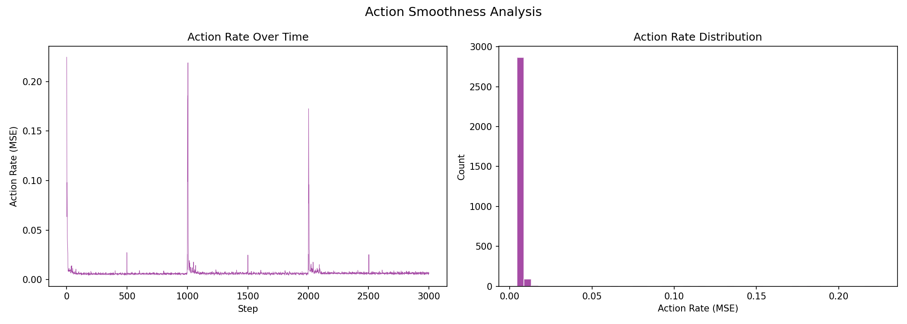

# 실험 078: spotmicro_v6_2_5_prefall_tilt_recovery_30deg_authority

- **날짜:** 2026-05-25 14:50
- **Task:** spotmicro_test
- **Run name:** `spotmicro_v6_2_5_prefall_tilt_recovery_30deg_authority`
- **판정:** ❌ FAIL (일부 기준 미달)

---

## 실험 목적

v6.2.5 : 25~30 recovery 강화

---

## 변경점 (이전 커밋 대비)

```diff
diff --git a/ai_training/rl/legged_gym/legged_gym/envs/spotmicro_test/spotmicro_test_config.py b/ai_training/rl/legged_gym/legged_gym/envs/spotmicro_test/spotmicro_test_config.py
index cac7102..e8bbe73 100644
--- a/ai_training/rl/legged_gym/legged_gym/envs/spotmicro_test/spotmicro_test_config.py
+++ b/ai_training/rl/legged_gym/legged_gym/envs/spotmicro_test/spotmicro_test_config.py
@@ -76,7 +76,7 @@ class SpotmicroTestCfg(LeggedRobotCfg):
         stiffness = {'shoulder': 15.0, 'leg': 10.0, 'foot': 10.0}
         damping = {'shoulder': 0.3, 'leg': 0.3, 'foot': 0.2}
         action_scale = 0.25
-        recovery_action_scale = 0.35
+        recovery_action_scale = 0.40
         decimation = 4
 
     class recovery:
@@ -140,8 +140,8 @@ class SpotmicroTestCfg(LeggedRobotCfg):
         recovery_diagnostic_initial_tilt_threshold_deg = 12.0
         recovery_relief_tilt_threshold_deg = 14.0
         recovery_relief_full_tilt_deg = 25.0
-        recovery_gait_relief_scale = 0.65
-        recovery_ik_relief_scale = 0.65
+        recovery_gait_relief_scale = 0.60
+        recovery_ik_relief_scale = 0.60
         transition_recovery_horizon_s = 0.75
         transition_recovery_initial_tilt_threshold_deg = 12.0
         tracking_sigma = 0.02
@@ -222,10 +222,10 @@ class SpotmicroTestCfgPPO(LeggedRobotCfgPPO):
         learning_rate = 1e-4
 
     class runner(LeggedRobotCfgPPO.runner):
-        run_name = 'spotmicro_v6_2_4_prefall_tilt_recovery_30deg_continue'
+        run_name = 'spotmicro_v6_2_5_prefall_tilt_recovery_30deg_authority'
         experiment_name = 'spotmicro_test'
         max_iterations = 500
         save_interval = 100
         resume = True
-        load_run = "May25_13-32-12_spotmicro_v6_2_3_prefall_tilt_recovery_30deg"
-        checkpoint = 6600
+        load_run = "May25_14-02-38_spotmicro_v6_2_4_prefall_tilt_recovery_30deg_continue"
+        checkpoint = 7100
```

**변경 요약:**
  - recovery_action_scale = 0.35
  + recovery_action_scale = 0.40
  - recovery_gait_relief_scale = 0.65
  - recovery_ik_relief_scale = 0.65
  + recovery_gait_relief_scale = 0.60
  + recovery_ik_relief_scale = 0.60
  - run_name = 'spotmicro_v6_2_4_prefall_tilt_recovery_30deg_continue'
  + run_name = 'spotmicro_v6_2_5_prefall_tilt_recovery_30deg_authority'
  - load_run = "May25_13-32-12_spotmicro_v6_2_3_prefall_tilt_recovery_30deg"
  - checkpoint = 6600
  + load_run = "May25_14-02-38_spotmicro_v6_2_4_prefall_tilt_recovery_30deg_continue"
  + checkpoint = 7100

---

## 현재 Reward Scales

| Reward | Scale |
|--------|-------|
| action_rate | -0.05 |
| ang_vel_xy | -1.0 |
| ang_vel_xy_recovery | 0.5 |
| base_height | -2.0 |
| collision | -1.0 |
| dof_acc | -2.5e-07 |
| dof_vel | -0.0005 |
| feet_air_time | 0.04 |
| feet_clearance | 0.03 |
| lin_vel_z | -2.0 |
| no_stuck_feet | -0.2 |
| orientation | -10.0 |
| stand_still | -0.4 |
| swing_contact | -0.45 |
| termination | -20.0 |
| tilt_recovery | 4.0 |
| torques | -0.001 |
| tracking_ang_vel | 0.6 |
| tracking_ik | 0.6 |
| tracking_lin_vel | 1.0 |
| trot_contact | 0.35 |

---

## 진단 결과 (Diagnostic)

### 핵심 지표

- ⚠️ Timeout: 94.1% (90~95%, 개선 필요)
- ✅ 속도오차 X: 0.0220 m/s (<0.08)
- ✅ 토크포화: 4.2% (<10%)
- ✅ 자세: roll 1.1°, pitch 1.3° (안정)
- ✅ 조기종료: 3.7% (<5%)
- ⚠️ 전환복구: 76.4% (50~80%)
- ⚠️ 18도+ pre-fall 복구: 63.5% (60~70%, 개선 필요)
- ⚠️ Reset 25-30도 복구: 74.4% (65~75%, n=234)
- ❌ Transition 25-30도 복구: 44.4% (<55%, n=27)

### 상세 수치

| 지표 | 값 |
|------|-----|
| Timeout% | 94.11764705882352 |
| 조기종료% | 3.6764705882352944 |
| 속도오차 X | 0.022013716399669647 m/s |
| 속도오차 Y | 0.01594666950404644 m/s |
| 각속도오차 | 0.07189057022333145 rad/s |
| 토크포화% | 4.236366931679432 |
| 평균 높이 | 0.1761112013460198 m |
| Roll (평균) | 1.073294758796692° |
| Pitch (평균) | 1.2557969093322754° |
| Action Rate | 0.007109681610018015 |
| 평균 전력 | 3.288184404373169 W |
| CoT | 2.0905764752608116 |
| Recovery 성공률 | 87.61194029850746% |
| Recovery eligible trials | 670 |
| 평균 회복 시간 | 0.2926064670542842 s |
| Recovery 조기 실패율 | 2.9850746268656714% |
| Recovery 18도+ 성공률 | 84.29423459244532% |
| Recovery 18도+ trials | 503 |
| Recovery 18도+ horizon 후 tilt | 4.190526361782733° |
| Transition recovery 성공률 | 76.40449438202246% |
| Transition recovery eligible trials | 267 |
| 평균 Transition recovery 시간 | 0.2997058756539927 s |
| Transition 18도+ 성공률 | 63.52201257861635% |
| Transition 18도+ trials | 159 |
| Transition 18도+ horizon 후 tilt | 7.263803268566072° |

## Recovery Assist 분석

| 지표 | 값 |
|------|-----|
| 판정 | ✅ Recovery 안정적 |
| Recovery 성공률 | 87.6% |
| 성공/실패 | 587 / 83 |
| Eligible trials | 670 / 800 |
| 평균 회복 시간 | 0.293s |
| 조기 실패율 | 3.0% |
| 평가 horizon | 1.0 s |
| 초기 tilt 기준 | 12.000000000000002° |
| 안정 기준 | roll/pitch < 5.0°, height > 0.165m |
| 평균 초기 tilt | 22.0441484705619° |
| 평균 초기 roll/pitch | 16.517257357913962° / 16.168209851749737° |
| 1초 후 평균 roll/pitch | 2.6641287934635383° / 2.398386087360333° |
| 1초 내 최대 roll/pitch 평균 | 17.54488455840011° / 16.959309704801928° |

> 해석: `Recovery 성공률`은 초기 tilt가 기준 이상인 episode 중 1초 내 안정 자세로 복귀한 비율입니다. 조기 실패율이 높으면 reset 직후 바로 넘어지는 것이고, 평균 회복 시간이 짧을수록 위기 대응이 빠른 것입니다.

### Recovery Tilt Band 분석

| Tilt 구간 | Trials | 성공률 | Horizon 후 평균 tilt | 평균 회복 시간 |
|-----------|--------|--------|----------------------|----------------|
| 12-18 deg | 167 | 97.6% | 1.50° | 0.17s |
| 18-25 deg | 269 | 92.9% | 2.34° | 0.28s |
| 25-30 deg | 234 | 74.4% | 6.32° | 0.43s |
| 30+ deg | 0 | N/A | N/A | N/A |
| 18+ deg 전체 | 503 | 84.3% | 4.19° | 0.34s |

> 이번 pre-fall 목표는 특히 `18-25 deg`, `25-30 deg`, `18+ deg 전체` 행을 우선 봅니다. `25-30 deg` trial이 없으면 30도 근처 회복 성능은 아직 검증되지 않은 것입니다.


## Transition Recovery 분석

| 지표 | 값 |
|------|-----|
| 판정 | ⚠️ 일부 전환 복구 가능 |
| Transition recovery 성공률 | 76.4% |
| 성공/실패 | 204 / 63 |
| Eligible trials | 267 / 3584 |
| 평균 회복 시간 | 0.300s |
| 조기 실패율 | 5.2% |
| 평가 horizon | 0.75 s |
| push 후 eligible 기준 | max roll/pitch > 12.000000000000002° |
| 안정 기준 | roll/pitch < 5.0°, height > 0.165m |
| 평균 최대 tilt | 20.885680760002653° |
| horizon 후 평균 roll/pitch | 3.8725415042964286° / 3.2642392719666775° |

> 해석: `Transition Recovery`는 학습 중 push/roll-pitch angular impulse가 들어간 뒤 일정 시간 안에 자세가 안정 기준으로 돌아오는지를 봅니다.

### Transition Recovery Tilt Band 분석

| Tilt 구간 | Trials | 성공률 | Horizon 후 평균 tilt | 평균 회복 시간 |
|-----------|--------|--------|----------------------|----------------|
| 12-18 deg | 108 | 95.4% | 1.81° | 0.23s |
| 18-25 deg | 112 | 77.7% | 3.49° | 0.37s |
| 25-30 deg | 27 | 44.4% | 5.75° | 0.43s |
| 30+ deg | 20 | 10.0% | 30.43° | 0.37s |
| 18+ deg 전체 | 159 | 63.5% | 7.26° | 0.37s |

> 이번 pre-fall 목표는 특히 `18-25 deg`, `25-30 deg`, `18+ deg 전체` 행을 우선 봅니다. `25-30 deg` trial이 없으면 30도 근처 회복 성능은 아직 검증되지 않은 것입니다.


## Command Mode별 회전 추종 분석

| 모드 | 비율 | 샘플 수 | 평균 abs(cmd_wz) | 평균 abs(actual_wz) | yaw 오차 | 상태 |
|------|------|---------|------------------|---------------------|----------|------|
| 정지 | 10.5% | 81099 | 0.0225 | 0.0595 | 0.0577 | ⚠️ |
| 직진/저회전 | 42.4% | 325867 | 0.0729 | 0.1039 | 0.0747 | ✅ |
| 제자리 회전 | 10.1% | 77595 | 0.1743 | 0.1716 | 0.0721 | ✅ |
| 전진+회전 | 14.5% | 111251 | 0.1746 | 0.1744 | 0.0782 | ✅ |
| 큰 회전명령 | 0.0% | 0 | N/A | N/A | N/A | N/A |

> 해석 기준: `제자리 회전`만 나쁘면 pure turn 학습/보행 패턴 문제, `큰 회전명령`만 나쁘면 yaw 명령 범위가 현재 토크/보폭 한계보다 큰 문제, `정지`가 나쁘면 stop drift 문제로 보면 됩니다.
        


## 학습 곡선 분석

| 지표 | 값 | 판정 |
|------|-----|------|
| 수렴 iter (90%) | 7142 | 느림 |
| 후반 안정성 (CV) | 0.022 | 안정 |
| 정체 구간 | 없음 | |


## Per-leg 분석

### 발별 접촉/공중 비율

| 발 | 접촉% | 공중% |
|-----|-------|------|
| foot_0 | 76.1% | 23.9% |
| foot_1 | 76.2% | 23.8% |
| foot_2 | 70.4% | 29.6% |
| foot_3 | 68.2% | 31.8% |

### 관절별 토크 포화

| 관절 | 포화% | 최대토크 | 한계 | 상태 |
|------|------|---------|------|------|
| front_left_shoulder | 0.1% | 2.940 | 2.940 | ✅ |
| front_left_leg | 0.4% | 2.940 | 2.940 | ✅ |
| front_left_foot | 18.6% | 2.940 | 2.940 | ⚠️ |
| front_right_shoulder | 0.1% | 2.940 | 2.940 | ✅ |
| front_right_leg | 4.2% | 2.940 | 2.940 | ✅ |
| front_right_foot | 8.7% | 2.940 | 2.940 | ⚠️ |
| rear_left_shoulder | 0.2% | 2.940 | 2.940 | ✅ |
| rear_left_leg | 1.2% | 2.940 | 2.940 | ✅ |
| rear_left_foot | 11.1% | 2.940 | 2.940 | ⚠️ |
| rear_right_shoulder | 0.3% | 2.940 | 2.940 | ✅ |
| rear_right_leg | 0.7% | 2.940 | 2.940 | ✅ |
| rear_right_foot | 5.2% | 2.940 | 2.940 | ⚠️ |


## Gait 분석

| 지표 | 값 |
|------|-----|
| Gait 주파수 | 0.21 Hz |
| Gait 주기 | 58 steps |
| 대각 동기화율 | 89.2% |
| L/R 비대칭 | 0.0%p |
| 판정 | ✅ Trot 패턴 / ✅ 대칭 |


## 관절별 상세

| 관절 | 토크포화% | 사용범위% | 편향(rad) | 한계근접% | 상태 |
|------|----------|----------|----------|----------|------|
| front_left_shoulder | 0.1% | 101% | -0.004 | 0.1% | ✅ |
| front_left_leg | 0.4% | 29% | -1.296 | 0.0% | ⚠️ |
| front_left_foot | 18.6% | 54% | +1.779 | 0.0% | ⚠️ |
| front_right_shoulder | 0.1% | 99% | -0.008 | 0.0% | ✅ |
| front_right_leg | 4.2% | 38% | -1.111 | 0.0% | ⚠️ |
| front_right_foot | 8.7% | 53% | +1.783 | 0.0% | ⚠️ |
| rear_left_shoulder | 0.2% | 105% | -0.024 | 0.1% | ✅ |
| rear_left_leg | 1.2% | 24% | -1.146 | 0.0% | ⚠️ |
| rear_left_foot | 11.1% | 48% | +1.804 | 0.0% | ⚠️ |
| rear_right_shoulder | 0.3% | 102% | -0.005 | 0.1% | ✅ |
| rear_right_leg | 0.7% | 33% | -1.096 | 0.0% | ⚠️ |
| rear_right_foot | 5.2% | 59% | +1.597 | 0.0% | ⚠️ |


## 에너지 효율 상세

| 지표 | 값 |
|------|-----|
| 평균 전력 | 3.29 W |
| 피크 전력 | 34.43 W |
| 피크/평균 비율 | 10.5x |
| CoT | 2.09 |

### 관절별 전력 분배

| 관절 | 평균전력(W) | 비율% |
|------|-----------|-------|
| front_left_foot | 0.597 | 18.2% |
| front_right_foot | 0.499 | 15.2% |
| rear_right_foot | 0.452 | 13.7% |
| rear_left_foot | 0.451 | 13.7% |
| front_right_leg | 0.325 | 9.9% |
| front_left_leg | 0.298 | 9.1% |
| rear_right_leg | 0.244 | 7.4% |
| rear_left_leg | 0.233 | 7.1% |
| rear_right_shoulder | 0.056 | 1.7% |
| front_right_shoulder | 0.049 | 1.5% |
| rear_left_shoulder | 0.047 | 1.4% |
| front_left_shoulder | 0.037 | 1.1% |


## 이전 실험 대비 비교

| 지표 | 이전 (exp077) | 현재 (exp078) | 변화 |
|------|-------|-------|------|
| Timeout% | 94.8% | 94.1% | ⚠️ ↓ 0.6972% |
| 속도오차 X | 0.0227 | 0.0220 | ✅ ↓ 0.0007m/s |
| 토크포화 | 4.4% | 4.2% | ✅ ↓ 0.2014% |
| Roll | 1.2° | 1.1° | ✅ ↓ 0.1281° |
| Pitch | 1.3° | 1.3° | ✅ ↓ 0.0162° |
| 평균 전력 | 3.2437W | 3.2882W | ⚠️ ↑ 0.0445W |


## Tensorboard 학습 곡선 요약

| 스칼라 | 최종값 | 최대 | 최소 | 후반10% 평균 |
|--------|--------|------|------|-------------|
| rew_action_rate | -0.0132 | -0.0006 | -0.0143 | -0.0132 |
| rew_ang_vel_xy | -0.0575 | -0.0426 | -0.1094 | -0.0616 |
| rew_ang_vel_xy_recovery | 0.0005 | 0.0012 | 0.0004 | 0.0006 |
| rew_base_height | -0.0000 | -0.0000 | -0.0001 | -0.0001 |
| rew_collision | -0.0002 | -0.0001 | -0.0075 | -0.0011 |
| rew_dof_acc | -0.0031 | -0.0004 | -0.0037 | -0.0031 |
| rew_dof_vel | -0.0019 | -0.0003 | -0.0023 | -0.0019 |
| rew_feet_air_time | -0.0000 | 0.0001 | -0.0001 | -0.0000 |
| rew_feet_clearance | 0.0000 | 0.0000 | 0.0000 | 0.0000 |
| rew_lin_vel_z | -0.0029 | -0.0006 | -0.0033 | -0.0031 |
| rew_no_stuck_feet | -0.0030 | -0.0000 | -0.0034 | -0.0030 |
| rew_orientation | -0.0171 | -0.0132 | -0.0433 | -0.0195 |
| rew_stand_still | -0.0184 | -0.0032 | -0.0434 | -0.0235 |
| rew_swing_contact | -0.0603 | -0.0003 | -0.0651 | -0.0607 |
| rew_termination | -0.0010 | 0.0000 | -0.0069 | -0.0006 |
| rew_tilt_recovery | 0.0005 | 0.0008 | 0.0003 | 0.0006 |
| rew_torques | -0.0193 | -0.0002 | -0.0208 | -0.0196 |
| rew_tracking_ang_vel | 0.4485 | 0.4723 | 0.0017 | 0.4574 |
| rew_tracking_ik | 0.4153 | 0.4428 | 0.0027 | 0.4233 |
| rew_tracking_lin_vel | 0.9166 | 0.9649 | 0.0039 | 0.9340 |
| rew_trot_contact | 0.2657 | 0.2891 | 0.0011 | 0.2680 |
| learning_rate | 0.0001 | 0.0003 | 0.0000 | 0.0001 |
| surrogate | -0.0023 | 0.0025 | -0.0045 | -0.0024 |
| value_function | 0.0046 | 0.0680 | 0.0019 | 0.0035 |
| collection time | 0.7874 | 0.9013 | 0.7283 | 0.7718 |
| learning_time | 0.2819 | 0.3316 | 0.2724 | 0.2867 |
| total_fps | 91929.0000 | 97093.0000 | 82582.0000 | 92906.4000 |
| mean_noise_std | 0.0797 | 0.0849 | 0.0776 | 0.0797 |
| mean_episode_length | 953.2100 | 1002.0000 | 17.7700 | 971.0950 |
| time | 953.2100 | 1002.0000 | 17.7700 | 971.0950 |
| mean_reward | 37.7144 | 39.8899 | -0.1714 | 38.2919 |
| time | 37.7144 | 39.8899 | -0.1714 | 38.2919 |

총 학습 iteration: 7599


---

## 그래프

### Tensorboard 학습 곡선



### Diagnostic 결과





---

## 결론 및 다음 실험 방향

**자동 판정:** ❌ FAIL (일부 기준 미달)

일부 기준을 통과하지 못했습니다. 조정이 필요합니다.
  - ❌ Transition 25-30도 복구: 44.4% (<55%, n=27)

> 💡 위 결론은 자동 생성되었습니다. 필요시 수정하세요.

---

## 메모

_(추가 메모가 있으면 여기에 작성)_

