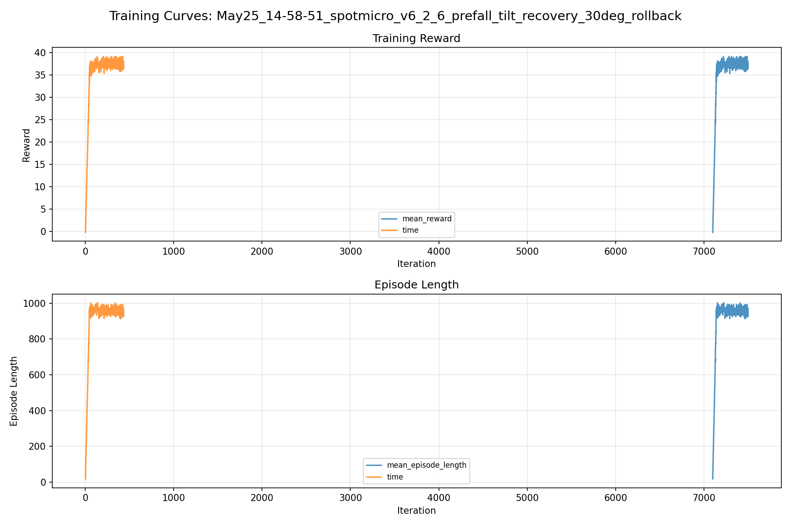
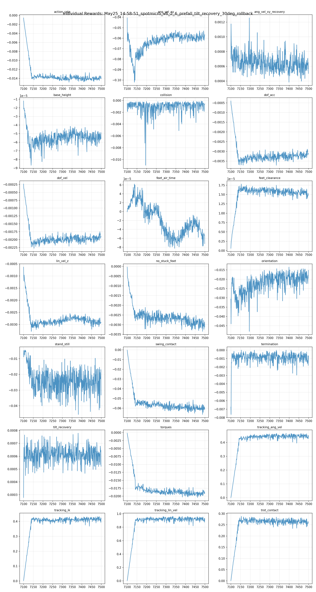
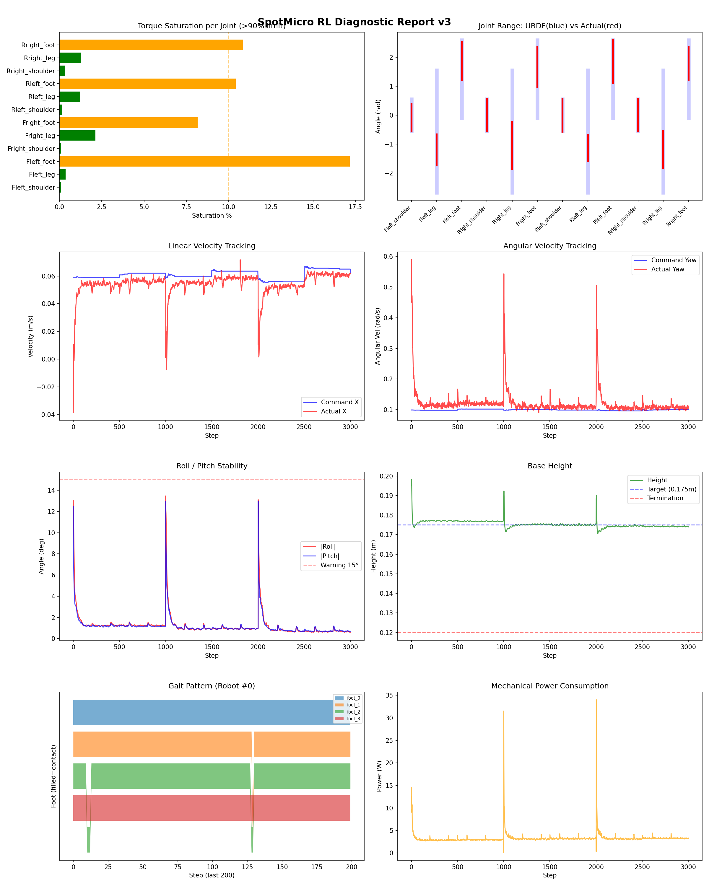
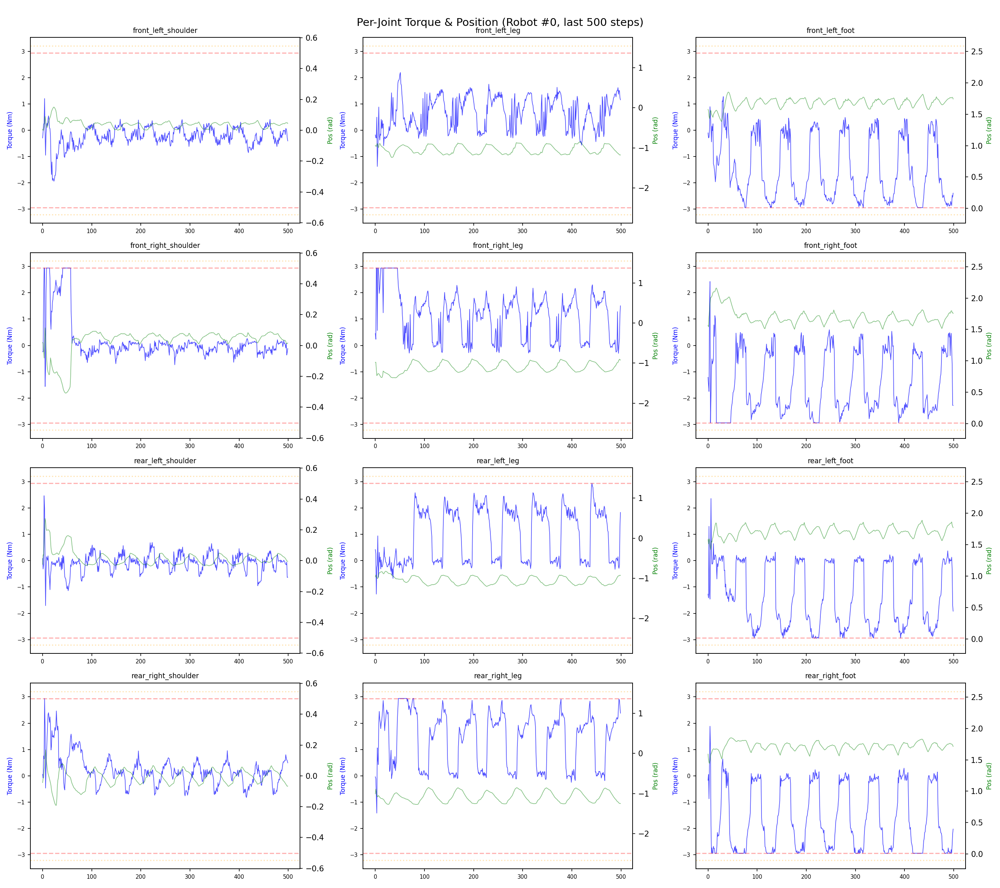
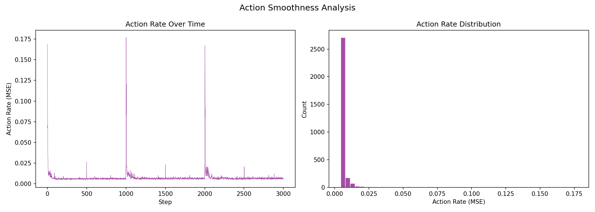

# 실험 079: spotmicro_v6_2_6_prefall_tilt_recovery_30deg_rollback

- **날짜:** 2026-05-25 15:09
- **Task:** spotmicro_test
- **Run name:** `spotmicro_v6_2_6_prefall_tilt_recovery_30deg_rollback`
- **판정:** ❌ FAIL (일부 기준 미달)

---

## 실험 목적

v6.2.6 : 설정 롤백 후 추가학습

---

## 변경점 (이전 커밋 대비)

```diff
diff --git a/ai_training/rl/legged_gym/legged_gym/envs/spotmicro_test/spotmicro_test_config.py b/ai_training/rl/legged_gym/legged_gym/envs/spotmicro_test/spotmicro_test_config.py
index cac7102..b26f3c0 100644
--- a/ai_training/rl/legged_gym/legged_gym/envs/spotmicro_test/spotmicro_test_config.py
+++ b/ai_training/rl/legged_gym/legged_gym/envs/spotmicro_test/spotmicro_test_config.py
@@ -222,10 +222,10 @@ class SpotmicroTestCfgPPO(LeggedRobotCfgPPO):
         learning_rate = 1e-4
 
     class runner(LeggedRobotCfgPPO.runner):
-        run_name = 'spotmicro_v6_2_4_prefall_tilt_recovery_30deg_continue'
+        run_name = 'spotmicro_v6_2_6_prefall_tilt_recovery_30deg_rollback'
         experiment_name = 'spotmicro_test'
-        max_iterations = 500
+        max_iterations = 400
         save_interval = 100
         resume = True
-        load_run = "May25_13-32-12_spotmicro_v6_2_3_prefall_tilt_recovery_30deg"
-        checkpoint = 6600
+        load_run = "May25_14-02-38_spotmicro_v6_2_4_prefall_tilt_recovery_30deg_continue"
+        checkpoint = 7100
```

**변경 요약:**
  - run_name = 'spotmicro_v6_2_4_prefall_tilt_recovery_30deg_continue'
  + run_name = 'spotmicro_v6_2_6_prefall_tilt_recovery_30deg_rollback'
  - max_iterations = 500
  + max_iterations = 400
  - load_run = "May25_13-32-12_spotmicro_v6_2_3_prefall_tilt_recovery_30deg"
  - checkpoint = 6600
  + load_run = "May25_14-02-38_spotmicro_v6_2_4_prefall_tilt_recovery_30deg_continue"
  + checkpoint = 7100

---

## 현재 Reward Scales

| Reward | Scale |
|--------|-------|
| action_rate | -0.05 |
| ang_vel_xy | -1.0 |
| ang_vel_xy_recovery | 0.5 |
| base_height | -2.0 |
| collision | -1.0 |
| dof_acc | -2.5e-07 |
| dof_vel | -0.0005 |
| feet_air_time | 0.04 |
| feet_clearance | 0.03 |
| lin_vel_z | -2.0 |
| no_stuck_feet | -0.2 |
| orientation | -10.0 |
| stand_still | -0.4 |
| swing_contact | -0.45 |
| termination | -20.0 |
| tilt_recovery | 4.0 |
| torques | -0.001 |
| tracking_ang_vel | 0.6 |
| tracking_ik | 0.6 |
| tracking_lin_vel | 1.0 |
| trot_contact | 0.35 |

---

## 진단 결과 (Diagnostic)

### 핵심 지표

- ⚠️ Timeout: 90.8% (90~95%, 개선 필요)
- ✅ 속도오차 X: 0.0210 m/s (<0.08)
- ✅ 토크포화: 4.4% (<10%)
- ✅ 자세: roll 1.2°, pitch 1.2° (안정)
- ⚠️ 조기종료: 6.7% (5~20%)
- ⚠️ 전환복구: 67.4% (50~80%)
- ❌ 18도+ pre-fall 복구: 58.5% (<60%)
- ⚠️ Reset 25-30도 복구: 68.0% (65~75%, n=269)
- ❌ Transition 25-30도 복구: 48.7% (<55%, n=39)

### 상세 수치

| 지표 | 값 |
|------|-----|
| Timeout% | 90.78014184397163 |
| 조기종료% | 6.73758865248227 |
| 속도오차 X | 0.021009713411331177 m/s |
| 속도오차 Y | 0.016852766275405884 m/s |
| 각속도오차 | 0.07229413092136383 rad/s |
| 토크포화% | 4.356320762570762 |
| 평균 높이 | 0.17537213692734965 m |
| Roll (평균) | 1.2227448225021362° |
| Pitch (평균) | 1.1631779670715332° |
| Action Rate | 0.0074107712134718895 |
| 평균 전력 | 3.2630860805511475 W |
| CoT | 2.0967843114963354 |
| Recovery 성공률 | 82.14804063860667% |
| Recovery eligible trials | 689 |
| 평균 회복 시간 | 0.30494698965033457 s |
| Recovery 조기 실패율 | 5.515239477503629% |
| Recovery 18도+ 성공률 | 77.39463601532567% |
| Recovery 18도+ trials | 522 |
| Recovery 18도+ horizon 후 tilt | 6.2119294997318955° |
| Transition recovery 성공률 | 67.36111111111111% |
| Transition recovery eligible trials | 288 |
| 평균 Transition recovery 시간 | 0.31340205485058814 s |
| Transition 18도+ 성공률 | 58.46153846153847% |
| Transition 18도+ trials | 195 |
| Transition 18도+ horizon 후 tilt | 10.023013530556971° |

## Recovery Assist 분석

| 지표 | 값 |
|------|-----|
| 판정 | ✅ Recovery 안정적 |
| Recovery 성공률 | 82.1% |
| 성공/실패 | 566 / 123 |
| Eligible trials | 689 / 820 |
| 평균 회복 시간 | 0.305s |
| 조기 실패율 | 5.5% |
| 평가 horizon | 1.0 s |
| 초기 tilt 기준 | 12.000000000000002° |
| 안정 기준 | roll/pitch < 5.0°, height > 0.165m |
| 평균 초기 tilt | 22.390833404067134° |
| 평균 초기 roll/pitch | 16.970596424600092° / 16.50415929222448° |
| 1초 후 평균 roll/pitch | 4.221204831164211° / 3.2010977580242046° |
| 1초 내 최대 roll/pitch 평균 | 18.548733101700837° / 17.641245243511282° |

> 해석: `Recovery 성공률`은 초기 tilt가 기준 이상인 episode 중 1초 내 안정 자세로 복귀한 비율입니다. 조기 실패율이 높으면 reset 직후 바로 넘어지는 것이고, 평균 회복 시간이 짧을수록 위기 대응이 빠른 것입니다.

### Recovery Tilt Band 분석

| Tilt 구간 | Trials | 성공률 | Horizon 후 평균 tilt | 평균 회복 시간 |
|-----------|--------|--------|----------------------|----------------|
| 12-18 deg | 167 | 97.0% | 1.69° | 0.17s |
| 18-25 deg | 253 | 87.4% | 3.46° | 0.31s |
| 25-30 deg | 269 | 68.0% | 8.80° | 0.42s |
| 30+ deg | 0 | N/A | N/A | N/A |
| 18+ deg 전체 | 522 | 77.4% | 6.21° | 0.36s |

> 이번 pre-fall 목표는 특히 `18-25 deg`, `25-30 deg`, `18+ deg 전체` 행을 우선 봅니다. `25-30 deg` trial이 없으면 30도 근처 회복 성능은 아직 검증되지 않은 것입니다.


## Transition Recovery 분석

| 지표 | 값 |
|------|-----|
| 판정 | ⚠️ 일부 전환 복구 가능 |
| Transition recovery 성공률 | 67.4% |
| 성공/실패 | 194 / 94 |
| Eligible trials | 288 / 3584 |
| 평균 회복 시간 | 0.313s |
| 조기 실패율 | 8.3% |
| 평가 horizon | 0.75 s |
| push 후 eligible 기준 | max roll/pitch > 12.000000000000002° |
| 안정 기준 | roll/pitch < 5.0°, height > 0.165m |
| 평균 최대 tilt | 22.348675938179504° |
| horizon 후 평균 roll/pitch | 6.242965281790627° / 4.828430705605165° |

> 해석: `Transition Recovery`는 학습 중 push/roll-pitch angular impulse가 들어간 뒤 일정 시간 안에 자세가 안정 기준으로 돌아오는지를 봅니다.

### Transition Recovery Tilt Band 분석

| Tilt 구간 | Trials | 성공률 | Horizon 후 평균 tilt | 평균 회복 시간 |
|-----------|--------|--------|----------------------|----------------|
| 12-18 deg | 93 | 86.0% | 2.47° | 0.25s |
| 18-25 deg | 123 | 73.2% | 4.31° | 0.34s |
| 25-30 deg | 39 | 48.7% | 7.39° | 0.43s |
| 30+ deg | 33 | 15.2% | 34.42° | 0.39s |
| 18+ deg 전체 | 195 | 58.5% | 10.02° | 0.35s |

> 이번 pre-fall 목표는 특히 `18-25 deg`, `25-30 deg`, `18+ deg 전체` 행을 우선 봅니다. `25-30 deg` trial이 없으면 30도 근처 회복 성능은 아직 검증되지 않은 것입니다.


## Command Mode별 회전 추종 분석

| 모드 | 비율 | 샘플 수 | 평균 abs(cmd_wz) | 평균 abs(actual_wz) | yaw 오차 | 상태 |
|------|------|---------|------------------|---------------------|----------|------|
| 정지 | 10.9% | 83637 | 0.0238 | 0.0649 | 0.0626 | ❌ |
| 직진/저회전 | 42.5% | 326722 | 0.0745 | 0.1044 | 0.0747 | ✅ |
| 제자리 회전 | 11.4% | 87756 | 0.1746 | 0.1726 | 0.0709 | ✅ |
| 전진+회전 | 13.6% | 104893 | 0.1743 | 0.1821 | 0.0809 | ⚠️ |
| 큰 회전명령 | 0.0% | 0 | N/A | N/A | N/A | N/A |

> 해석 기준: `제자리 회전`만 나쁘면 pure turn 학습/보행 패턴 문제, `큰 회전명령`만 나쁘면 yaw 명령 범위가 현재 토크/보폭 한계보다 큰 문제, `정지`가 나쁘면 stop drift 문제로 보면 됩니다.
        


## 학습 곡선 분석

| 지표 | 값 | 판정 |
|------|-----|------|
| 수렴 iter (90%) | 7140 | 느림 |
| 후반 안정성 (CV) | 0.022 | 안정 |
| 정체 구간 | 없음 | |


## Per-leg 분석

### 발별 접촉/공중 비율

| 발 | 접촉% | 공중% |
|-----|-------|------|
| foot_0 | 76.1% | 23.9% |
| foot_1 | 75.5% | 24.5% |
| foot_2 | 69.6% | 30.4% |
| foot_3 | 69.2% | 30.8% |

### 관절별 토크 포화

| 관절 | 포화% | 최대토크 | 한계 | 상태 |
|------|------|---------|------|------|
| front_left_shoulder | 0.1% | 2.940 | 2.940 | ✅ |
| front_left_leg | 0.4% | 2.940 | 2.940 | ✅ |
| front_left_foot | 17.2% | 2.940 | 2.940 | ⚠️ |
| front_right_shoulder | 0.1% | 2.940 | 2.940 | ✅ |
| front_right_leg | 2.1% | 2.940 | 2.940 | ✅ |
| front_right_foot | 8.2% | 2.940 | 2.940 | ⚠️ |
| rear_left_shoulder | 0.2% | 2.940 | 2.940 | ✅ |
| rear_left_leg | 1.2% | 2.940 | 2.940 | ✅ |
| rear_left_foot | 10.4% | 2.940 | 2.940 | ⚠️ |
| rear_right_shoulder | 0.4% | 2.940 | 2.940 | ✅ |
| rear_right_leg | 1.3% | 2.940 | 2.940 | ✅ |
| rear_right_foot | 10.8% | 2.940 | 2.940 | ⚠️ |


## Gait 분석

| 지표 | 값 |
|------|-----|
| Gait 주파수 | 0.20 Hz |
| Gait 주기 | 62 steps |
| 대각 동기화율 | 88.7% |
| L/R 비대칭 | 0.0%p |
| 판정 | ✅ Trot 패턴 / ✅ 대칭 |


## 관절별 상세

| 관절 | 토크포화% | 사용범위% | 편향(rad) | 한계근접% | 상태 |
|------|----------|----------|----------|----------|------|
| front_left_shoulder | 0.1% | 88% | -0.084 | 0.0% | ✅ |
| front_left_leg | 0.4% | 25% | -1.195 | 0.0% | ⚠️ |
| front_left_foot | 17.2% | 49% | +1.870 | 0.0% | ⚠️ |
| front_right_shoulder | 0.1% | 101% | -0.005 | 0.0% | ✅ |
| front_right_leg | 2.1% | 38% | -1.045 | 0.0% | ⚠️ |
| front_right_foot | 8.2% | 52% | +1.666 | 0.0% | ⚠️ |
| rear_left_shoulder | 0.2% | 102% | -0.009 | 0.0% | ✅ |
| rear_left_leg | 1.2% | 22% | -1.132 | 0.0% | ⚠️ |
| rear_left_foot | 10.4% | 55% | +1.859 | 0.0% | ⚠️ |
| rear_right_shoulder | 0.4% | 101% | -0.006 | 0.2% | ✅ |
| rear_right_leg | 1.3% | 31% | -1.183 | 0.0% | ⚠️ |
| rear_right_foot | 10.8% | 42% | +1.787 | 0.0% | ⚠️ |


## 에너지 효율 상세

| 지표 | 값 |
|------|-----|
| 평균 전력 | 3.26 W |
| 피크 전력 | 34.03 W |
| 피크/평균 비율 | 10.4x |
| CoT | 2.10 |

### 관절별 전력 분배

| 관절 | 평균전력(W) | 비율% |
|------|-----------|-------|
| front_left_foot | 0.600 | 18.4% |
| rear_right_foot | 0.495 | 15.2% |
| front_right_foot | 0.472 | 14.5% |
| rear_left_foot | 0.421 | 12.9% |
| front_right_leg | 0.293 | 9.0% |
| rear_right_leg | 0.292 | 9.0% |
| front_left_leg | 0.271 | 8.3% |
| rear_left_leg | 0.237 | 7.3% |
| rear_right_shoulder | 0.054 | 1.6% |
| front_right_shoulder | 0.047 | 1.4% |
| rear_left_shoulder | 0.046 | 1.4% |
| front_left_shoulder | 0.037 | 1.1% |


## 이전 실험 대비 비교

| 지표 | 이전 (exp078) | 현재 (exp079) | 변화 |
|------|-------|-------|------|
| Timeout% | 94.1% | 90.8% | ⚠️ ↓ 3.3375% |
| 속도오차 X | 0.0220 | 0.0210 | ✅ ↓ 0.0010m/s |
| 토크포화 | 4.2% | 4.4% | ⚠️ ↑ 0.1200% |
| Roll | 1.1° | 1.2° | ⚠️ ↑ 0.1495° |
| Pitch | 1.3° | 1.2° | ✅ ↓ 0.0926° |
| 평균 전력 | 3.2882W | 3.2631W | ✅ ↓ 0.0251W |


## Tensorboard 학습 곡선 요약

| 스칼라 | 최종값 | 최대 | 최소 | 후반10% 평균 |
|--------|--------|------|------|-------------|
| rew_action_rate | -0.0141 | -0.0006 | -0.0148 | -0.0140 |
| rew_ang_vel_xy | -0.0566 | -0.0406 | -0.1021 | -0.0586 |
| rew_ang_vel_xy_recovery | 0.0005 | 0.0013 | 0.0004 | 0.0006 |
| rew_base_height | -0.0001 | -0.0000 | -0.0001 | -0.0001 |
| rew_collision | -0.0005 | -0.0001 | -0.0110 | -0.0008 |
| rew_dof_acc | -0.0031 | -0.0004 | -0.0037 | -0.0032 |
| rew_dof_vel | -0.0019 | -0.0002 | -0.0023 | -0.0019 |
| rew_feet_air_time | -0.0001 | 0.0001 | -0.0001 | -0.0000 |
| rew_feet_clearance | 0.0000 | 0.0000 | 0.0000 | 0.0000 |
| rew_lin_vel_z | -0.0029 | -0.0006 | -0.0033 | -0.0029 |
| rew_no_stuck_feet | -0.0031 | -0.0000 | -0.0033 | -0.0030 |
| rew_orientation | -0.0152 | -0.0135 | -0.0480 | -0.0189 |
| rew_stand_still | -0.0332 | -0.0045 | -0.0456 | -0.0251 |
| rew_swing_contact | -0.0612 | -0.0003 | -0.0665 | -0.0603 |
| rew_termination | -0.0007 | 0.0000 | -0.0076 | -0.0009 |
| rew_tilt_recovery | 0.0005 | 0.0008 | 0.0003 | 0.0006 |
| rew_torques | -0.0191 | -0.0002 | -0.0204 | -0.0191 |
| rew_tracking_ang_vel | 0.4482 | 0.4668 | 0.0017 | 0.4456 |
| rew_tracking_ik | 0.4213 | 0.4346 | 0.0029 | 0.4152 |
| rew_tracking_lin_vel | 0.9275 | 0.9636 | 0.0041 | 0.9200 |
| rew_trot_contact | 0.2572 | 0.2880 | 0.0011 | 0.2629 |
| learning_rate | 0.0002 | 0.0003 | 0.0000 | 0.0002 |
| surrogate | -0.0026 | 0.0014 | -0.0045 | -0.0025 |
| value_function | 0.0036 | 0.0637 | 0.0018 | 0.0036 |
| collection time | 0.8021 | 1.0318 | 0.7368 | 0.7727 |
| learning_time | 0.3067 | 0.3244 | 0.2774 | 0.2872 |
| total_fps | 88657.0000 | 96492.0000 | 73875.0000 | 92784.4250 |
| mean_noise_std | 0.0825 | 0.0849 | 0.0800 | 0.0821 |
| mean_episode_length | 972.5200 | 1002.0000 | 17.7400 | 955.9567 |
| time | 972.5200 | 1002.0000 | 17.7400 | 955.9567 |
| mean_reward | 38.0825 | 39.1884 | -0.1718 | 37.5212 |
| time | 38.0825 | 39.1884 | -0.1718 | 37.5212 |

총 학습 iteration: 7499


---

## 그래프

### Tensorboard 학습 곡선



### Diagnostic 결과





---

## 결론 및 다음 실험 방향

**자동 판정:** ❌ FAIL (일부 기준 미달)

일부 기준을 통과하지 못했습니다. 조정이 필요합니다.
  - ❌ 18도+ pre-fall 복구: 58.5% (<60%)
  - ❌ Transition 25-30도 복구: 48.7% (<55%, n=39)

> 💡 위 결론은 자동 생성되었습니다. 필요시 수정하세요.

---

## 메모

_(추가 메모가 있으면 여기에 작성)_

