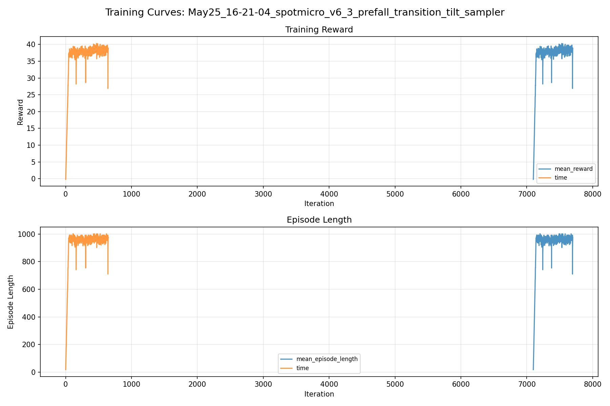
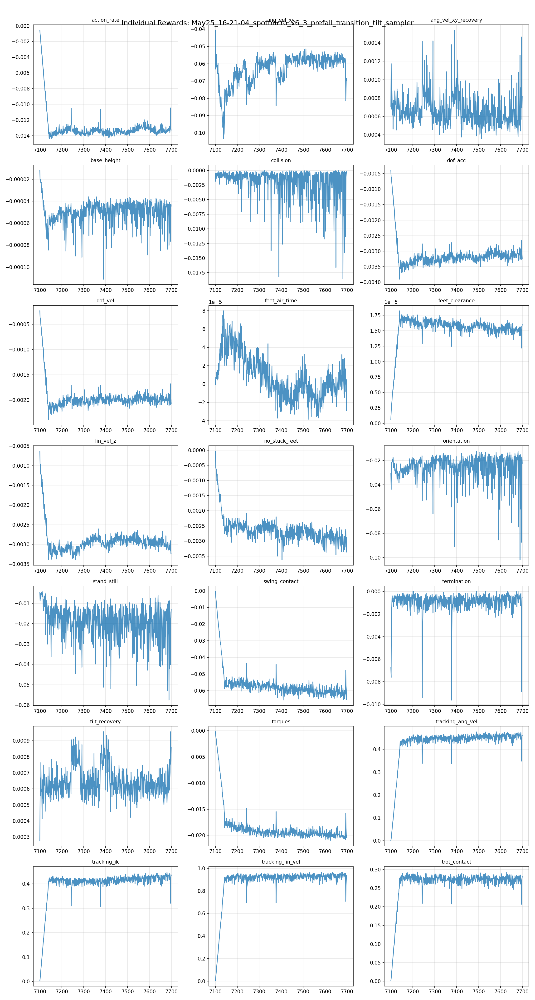
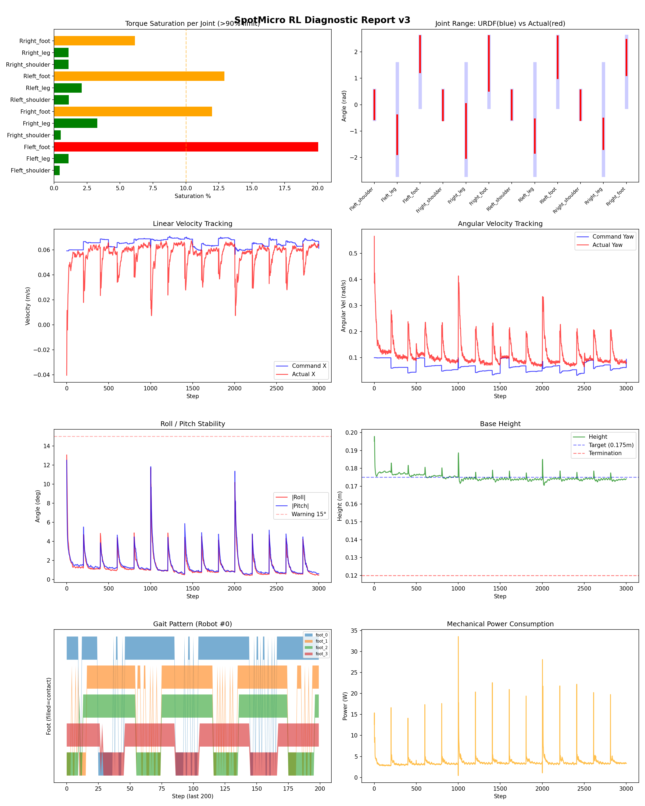
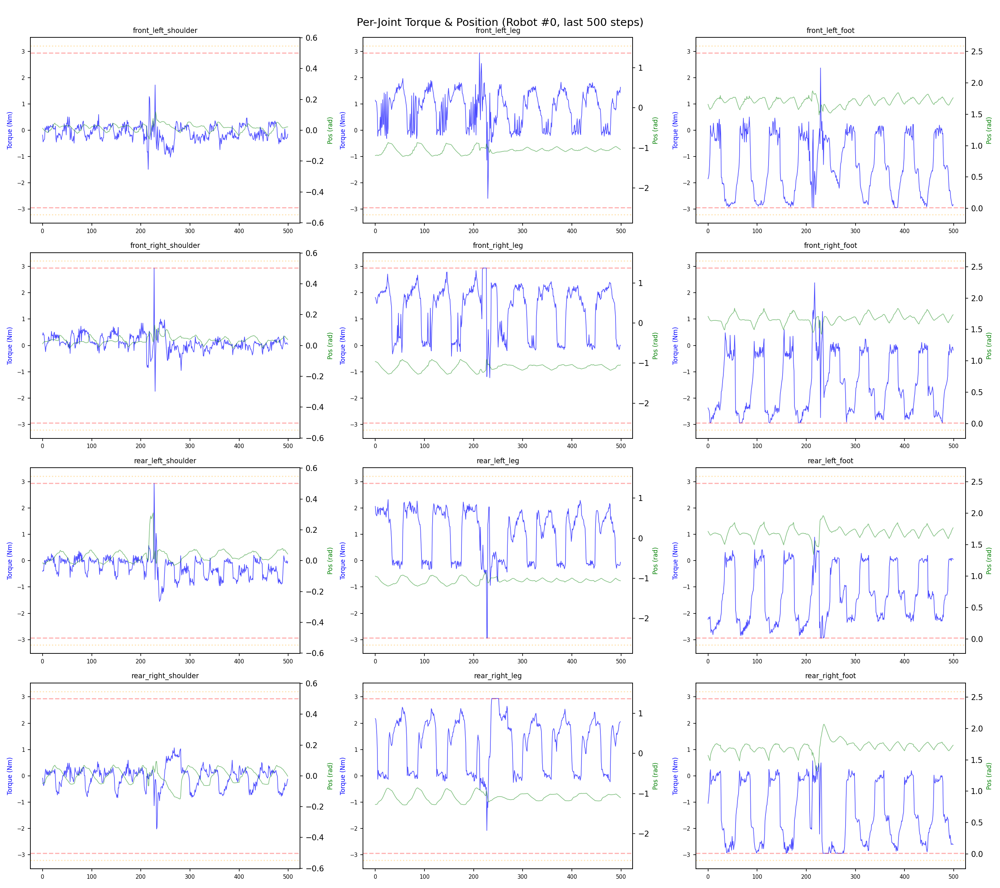
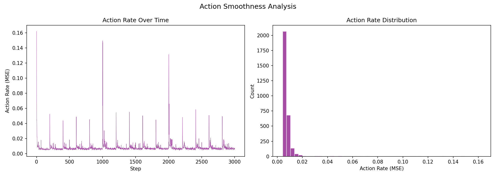

# 실험 080: spotmicro_v6_3_prefall_transition_tilt_sampler

- **날짜:** 2026-05-25 16:35
- **Task:** spotmicro_test
- **Run name:** `spotmicro_v6_3_prefall_transition_tilt_sampler`
- **판정:** ❌ FAIL (일부 기준 미달)

---

## 실험 목적

v6.3 : transition tilt sampler 추가

---

## 변경점 (이전 커밋 대비)

```diff
diff --git a/ai_training/rl/legged_gym/legged_gym/envs/spotmicro_test/spotmicro_test.py b/ai_training/rl/legged_gym/legged_gym/envs/spotmicro_test/spotmicro_test.py
index 164d2ec..229b2a2 100644
--- a/ai_training/rl/legged_gym/legged_gym/envs/spotmicro_test/spotmicro_test.py
+++ b/ai_training/rl/legged_gym/legged_gym/envs/spotmicro_test/spotmicro_test.py
@@ -536,6 +536,8 @@ class SpotmicroTest(LeggedRobot):
                 max=ang_z_clip,
             )
 
+        transition_tilt_count = self._apply_transition_tilt_push()
+
         self.last_transition_push_step = int(self.common_step_counter)
         self.last_transition_push_lin = float(max_lin)
         self.last_transition_push_ang_xy = float(max_ang_xy)
@@ -548,7 +550,64 @@ class SpotmicroTest(LeggedRobot):
         if self._push_count <= 3:
             print(
                 f"[DR] Push #{self._push_count} at step {self.common_step_counter}, "
-                f"lin={max_lin}, ang_xy={max_ang_xy}, ang_z={max_ang_z}")
+                f"lin={max_lin}, ang_xy={max_ang_xy}, ang_z={max_ang_z}, "
+                f"transition_tilt_envs={transition_tilt_count}")
+
+    def _apply_transition_tilt_push(self):
+        """일부 주행 환경을 pre-fall tilt 상태로 직접 보내 transition recovery 샘플을 만든다."""
+        cfg = self.cfg.domain_rand
+        if not getattr(cfg, "transition_tilt_push", False):
+            return 0
+
+        prob = float(getattr(cfg, "transition_tilt_push_prob", 0.0))
+        if prob <= 0.0:
+            return 0
+
+        mask = torch.rand(self.num_envs, device=self.device) < prob
+        env_ids = torch.nonzero(mask, as_tuple=False).flatten()
+        num = len(env_ids)
+        if num == 0:
+            return 0
+
+        min_deg = float(getattr(cfg, "transition_tilt_push_min_deg", 18.0))
+        max_deg = float(getattr(cfg, "transition_tilt_push_max_deg", 28.0))
+        min_rad = math.radians(min_deg)
+        max_rad = math.radians(max_deg)
+
+        tilt = torch_rand_float(min_rad, max_rad, (num, 1), device=self.device).squeeze(1)
+        sign = torch.where(
+            torch.rand(num, device=self.device) < 0.5,
+            -torch.ones(num, device=self.device),
+            torch.ones(num, device=self.device),
+        )
+        use_roll = torch.rand(num, device=self.device) < 0.5
+        roll = torch.zeros(num, device=self.device)
+        pitch = torch.zeros(num, device=self.device)
+        roll[use_roll] = tilt[use_roll] * sign[use_roll]
+        pitch[~use_roll] = tilt[~use_roll] * sign[~use_roll]
+        yaw = torch.zeros(num, device=self.device)
+
+        self.root_states[env_ids, 3:7] = quat_from_euler_xyz(roll, pitch, yaw)
+
+        ang_vel_xy = float(getattr(cfg, "transition_tilt_push_ang_vel_xy", 0.0))
+        if ang_vel_xy > 0.0:
+            ang = torch_rand_float(0.0, ang_vel_xy, (num, 1), device=self.device).squeeze(1)
+            self.root_states[env_ids, 10] += torch.sign(roll) * ang
+            self.root_states[env_ids, 11] += torch.sign(pitch) * 
```

**변경 요약:**
  + transition_tilt_count = self._apply_transition_tilt_push()
  - f"lin={max_lin}, ang_xy={max_ang_xy}, ang_z={max_ang_z}")
  + f"lin={max_lin}, ang_xy={max_ang_xy}, ang_z={max_ang_z}, "
  + f"transition_tilt_envs={transition_tilt_count}")
  + def _apply_transition_tilt_push(self):
  + """일부 주행 환경을 pre-fall tilt 상태로 직접 보내 transition recovery 샘플을 만든다."""
  + cfg = self.cfg.domain_rand
  + if not getattr(cfg, "transition_tilt_push", False):
  + return 0
  + prob = float(getattr(cfg, "transition_tilt_push_prob", 0.0))
  + if prob <= 0.0:
  + return 0
  + mask = torch.rand(self.num_envs, device=self.device) < prob
  + env_ids = torch.nonzero(mask, as_tuple=False).flatten()
  + num = len(env_ids)
  + if num == 0:
  + return 0
  + min_deg = float(getattr(cfg, "transition_tilt_push_min_deg", 18.0))
  + max_deg = float(getattr(cfg, "transition_tilt_push_max_deg", 28.0))
  + min_rad = math.radians(min_deg)
  + max_rad = math.radians(max_deg)
  + tilt = torch_rand_float(min_rad, max_rad, (num, 1), device=self.device).squeeze(1)
  + sign = torch.where(
  + torch.rand(num, device=self.device) < 0.5,
  + -torch.ones(num, device=self.device),
  + torch.ones(num, device=self.device),
  + )
  + use_roll = torch.rand(num, device=self.device) < 0.5
  + roll = torch.zeros(num, device=self.device)
  + pitch = torch.zeros(num, device=self.device)
  + roll[use_roll] = tilt[use_roll] * sign[use_roll]
  + pitch[~use_roll] = tilt[~use_roll] * sign[~use_roll]
  + yaw = torch.zeros(num, device=self.device)
  + self.root_states[env_ids, 3:7] = quat_from_euler_xyz(roll, pitch, yaw)
  + ang_vel_xy = float(getattr(cfg, "transition_tilt_push_ang_vel_xy", 0.0))
  + if ang_vel_xy > 0.0:
  + ang = torch_rand_float(0.0, ang_vel_xy, (num, 1), device=self.device).squeeze(1)
  + self.root_states[env_ids, 10] += torch.sign(roll) * ang
  + self.root_states[env_ids, 11] += torch.sign(pitch) * ang
  + cmd_range = getattr(cfg, "transition_tilt_cmd_x_range", None)
  + if cmd_range is not None:
  + self.commands[env_ids, 0] = torch_rand_float(
  + float(cmd_range[0]),
  + float(cmd_range[1]),
  + (num, 1),
  + device=self.device,
  + ).squeeze(1)
  + self.commands[env_ids, 1] = 0.0
  + if getattr(cfg, "transition_tilt_zero_yaw_cmd", True):
  + self.commands[env_ids, 2] = 0.0
  + return int(num)
  + transition_tilt_push = True
  + transition_tilt_push_prob = 0.35
  + transition_tilt_push_min_deg = 18.0
  + transition_tilt_push_max_deg = 28.0
  + transition_tilt_push_ang_vel_xy = 0.60
  + transition_tilt_cmd_x_range = [0.05, 0.10]
  + transition_tilt_zero_yaw_cmd = True
  - run_name = 'spotmicro_v6_2_6_prefall_tilt_recovery_30deg_rollback'
  + run_name = 'spotmicro_v6_3_prefall_transition_tilt_sampler'
  - max_iterations = 400
  + max_iterations = 600

---

## 현재 Reward Scales

| Reward | Scale |
|--------|-------|
| action_rate | -0.05 |
| ang_vel_xy | -1.0 |
| ang_vel_xy_recovery | 0.5 |
| base_height | -2.0 |
| collision | -1.0 |
| dof_acc | -2.5e-07 |
| dof_vel | -0.0005 |
| feet_air_time | 0.04 |
| feet_clearance | 0.03 |
| lin_vel_z | -2.0 |
| no_stuck_feet | -0.2 |
| orientation | -10.0 |
| stand_still | -0.4 |
| swing_contact | -0.45 |
| termination | -20.0 |
| tilt_recovery | 4.0 |
| torques | -0.001 |
| tracking_ang_vel | 0.6 |
| tracking_ik | 0.6 |
| tracking_lin_vel | 1.0 |
| trot_contact | 0.35 |

---

## 진단 결과 (Diagnostic)

### 핵심 지표

- ⚠️ Timeout: 76.3% (60~90%, 보통)
- ✅ 속도오차 X: 0.0235 m/s (<0.08)
- ✅ 토크포화: 5.1% (<10%)
- ✅ 자세: roll 1.3°, pitch 1.5° (안정)
- ⚠️ 조기종료: 5.4% (5~20%)
- ⚠️ 전환복구: 75.2% (50~80%)
- ✅ 18도+ pre-fall 복구: 71.7% (≥70%)
- ✅ Reset 25-30도 복구: 80.0% (≥75%, n=315)
- ⚠️ Transition 25-30도 복구: 63.7% (55~65%, n=201)

### 상세 수치

| 지표 | 값 |
|------|-----|
| Timeout% | 76.28398791540786 |
| 조기종료% | 5.438066465256798 |
| 속도오차 X | 0.02353728376328945 m/s |
| 속도오차 Y | 0.016247671097517014 m/s |
| 각속도오차 | 0.08313076198101044 rad/s |
| 토크포화% | 5.148031222249973 |
| 평균 높이 | 0.17482477055860685 m |
| Roll (평균) | 1.3156003952026367° |
| Pitch (평균) | 1.450164556503296° |
| Action Rate | 0.00809843186289072 |
| 평균 전력 | 3.6631577014923096 W |
| CoT | 2.2299130902951134 |
| Recovery 성공률 | 87.99472295514512% |
| Recovery eligible trials | 758 |
| 평균 회복 시간 | 0.3336131859464624 s |
| Recovery 조기 실패율 | 3.95778364116095% |
| Recovery 18도+ 성공률 | 85.8603066439523% |
| Recovery 18도+ trials | 587 |
| Recovery 18도+ horizon 후 tilt | 4.214980638565359° |
| Transition recovery 성공률 | 75.1544269045985% |
| Transition recovery eligible trials | 1457 |
| 평균 Transition recovery 시간 | 0.0839452036031305 s |
| Transition 18도+ 성공률 | 71.69811320754717% |
| Transition 18도+ trials | 1219 |
| Transition 18도+ horizon 후 tilt | 7.346199016354923° |

## Recovery Assist 분석

| 지표 | 값 |
|------|-----|
| 판정 | ✅ Recovery 안정적 |
| Recovery 성공률 | 88.0% |
| 성공/실패 | 667 / 91 |
| Eligible trials | 758 / 918 |
| 평균 회복 시간 | 0.334s |
| 조기 실패율 | 4.0% |
| 평가 horizon | 1.0 s |
| 초기 tilt 기준 | 12.000000000000002° |
| 안정 기준 | roll/pitch < 5.0°, height > 0.165m |
| 평균 초기 tilt | 22.614957493461244° |
| 평균 초기 roll/pitch | 17.286465661396303° / 17.464079207354334° |
| 1초 후 평균 roll/pitch | 2.9175733596136877° / 2.728719635631683° |
| 1초 내 최대 roll/pitch 평균 | 18.775832490430343° / 18.857473793004623° |

> 해석: `Recovery 성공률`은 초기 tilt가 기준 이상인 episode 중 1초 내 안정 자세로 복귀한 비율입니다. 조기 실패율이 높으면 reset 직후 바로 넘어지는 것이고, 평균 회복 시간이 짧을수록 위기 대응이 빠른 것입니다.

### Recovery Tilt Band 분석

| Tilt 구간 | Trials | 성공률 | Horizon 후 평균 tilt | 평균 회복 시간 |
|-----------|--------|--------|----------------------|----------------|
| 12-18 deg | 171 | 95.3% | 2.35° | 0.19s |
| 18-25 deg | 272 | 92.6% | 2.56° | 0.31s |
| 25-30 deg | 315 | 80.0% | 5.64° | 0.46s |
| 30+ deg | 0 | N/A | N/A | N/A |
| 18+ deg 전체 | 587 | 85.9% | 4.21° | 0.38s |

> 이번 pre-fall 목표는 특히 `18-25 deg`, `25-30 deg`, `18+ deg 전체` 행을 우선 봅니다. `25-30 deg` trial이 없으면 30도 근처 회복 성능은 아직 검증되지 않은 것입니다.


## Transition Recovery 분석

| 지표 | 값 |
|------|-----|
| 판정 | ⚠️ 일부 전환 복구 가능 |
| Transition recovery 성공률 | 75.2% |
| 성공/실패 | 1095 / 362 |
| Eligible trials | 1457 / 3584 |
| 평균 회복 시간 | 0.084s |
| 조기 실패율 | 8.4% |
| 평가 horizon | 0.75 s |
| push 후 eligible 기준 | max roll/pitch > 12.000000000000002° |
| 안정 기준 | roll/pitch < 5.0°, height > 0.165m |
| 평균 최대 tilt | 23.52017011095783° |
| horizon 후 평균 roll/pitch | 4.05343200421033° / 4.845639347579451° |

> 해석: `Transition Recovery`는 학습 중 push/roll-pitch angular impulse가 들어간 뒤 일정 시간 안에 자세가 안정 기준으로 돌아오는지를 봅니다.

### Transition Recovery Tilt Band 분석

| Tilt 구간 | Trials | 성공률 | Horizon 후 평균 tilt | 평균 회복 시간 |
|-----------|--------|--------|----------------------|----------------|
| 12-18 deg | 238 | 92.9% | 1.67° | 0.07s |
| 18-25 deg | 887 | 83.7% | 2.47° | 0.07s |
| 25-30 deg | 201 | 63.7% | 5.13° | 0.14s |
| 30+ deg | 131 | 3.1% | 43.75° | 0.53s |
| 18+ deg 전체 | 1219 | 71.7% | 7.35° | 0.09s |

> 이번 pre-fall 목표는 특히 `18-25 deg`, `25-30 deg`, `18+ deg 전체` 행을 우선 봅니다. `25-30 deg` trial이 없으면 30도 근처 회복 성능은 아직 검증되지 않은 것입니다.


## Command Mode별 회전 추종 분석

| 모드 | 비율 | 샘플 수 | 평균 abs(cmd_wz) | 평균 abs(actual_wz) | yaw 오차 | 상태 |
|------|------|---------|------------------|---------------------|----------|------|
| 정지 | 7.8% | 59908 | 0.0236 | 0.0618 | 0.0601 | ❌ |
| 직진/저회전 | 63.3% | 486633 | 0.0328 | 0.1006 | 0.0888 | ⚠️ |
| 제자리 회전 | 7.7% | 59422 | 0.1735 | 0.1652 | 0.0778 | ✅ |
| 전진+회전 | 8.4% | 64896 | 0.1750 | 0.1701 | 0.0832 | ⚠️ |
| 큰 회전명령 | 0.0% | 0 | N/A | N/A | N/A | N/A |

> 해석 기준: `제자리 회전`만 나쁘면 pure turn 학습/보행 패턴 문제, `큰 회전명령`만 나쁘면 yaw 명령 범위가 현재 토크/보폭 한계보다 큰 문제, `정지`가 나쁘면 stop drift 문제로 보면 됩니다.
        


## 학습 곡선 분석

| 지표 | 값 | 판정 |
|------|-----|------|
| 수렴 iter (90%) | 7142 | 느림 |
| 후반 안정성 (CV) | 0.029 | 안정 |
| 정체 구간 | 없음 | |


## Per-leg 분석

### 발별 접촉/공중 비율

| 발 | 접촉% | 공중% |
|-----|-------|------|
| foot_0 | 75.9% | 24.1% |
| foot_1 | 75.9% | 24.1% |
| foot_2 | 69.7% | 30.3% |
| foot_3 | 69.0% | 31.0% |

### 관절별 토크 포화

| 관절 | 포화% | 최대토크 | 한계 | 상태 |
|------|------|---------|------|------|
| front_left_shoulder | 0.4% | 2.940 | 2.940 | ✅ |
| front_left_leg | 1.1% | 2.940 | 2.940 | ✅ |
| front_left_foot | 20.0% | 2.940 | 2.940 | ❌ |
| front_right_shoulder | 0.5% | 2.940 | 2.940 | ✅ |
| front_right_leg | 3.3% | 2.940 | 2.940 | ✅ |
| front_right_foot | 12.0% | 2.940 | 2.940 | ⚠️ |
| rear_left_shoulder | 1.1% | 2.940 | 2.940 | ✅ |
| rear_left_leg | 2.1% | 2.940 | 2.940 | ✅ |
| rear_left_foot | 12.9% | 2.940 | 2.940 | ⚠️ |
| rear_right_shoulder | 1.1% | 2.940 | 2.940 | ✅ |
| rear_right_leg | 1.1% | 2.940 | 2.940 | ✅ |
| rear_right_foot | 6.1% | 2.940 | 2.940 | ⚠️ |


## Gait 분석

| 지표 | 값 |
|------|-----|
| Gait 주파수 | 0.21 Hz |
| Gait 주기 | 60 steps |
| 대각 동기화율 | 84.7% |
| L/R 비대칭 | 0.0%p |
| 판정 | ✅ Trot 패턴 / ✅ 대칭 |


## 관절별 상세

| 관절 | 토크포화% | 사용범위% | 편향(rad) | 한계근접% | 상태 |
|------|----------|----------|----------|----------|------|
| front_left_shoulder | 0.4% | 101% | -0.003 | 0.1% | ✅ |
| front_left_leg | 1.1% | 35% | -1.136 | 0.0% | ⚠️ |
| front_left_foot | 20.0% | 51% | +1.913 | 0.0% | ⚠️ |
| front_right_shoulder | 0.5% | 104% | -0.021 | 0.4% | ✅ |
| front_right_leg | 3.3% | 49% | -0.998 | 0.0% | ⚠️ |
| front_right_foot | 12.0% | 77% | +1.562 | 0.0% | ⚠️ |
| rear_left_shoulder | 1.1% | 102% | -0.009 | 0.6% | ✅ |
| rear_left_leg | 2.1% | 30% | -1.186 | 0.0% | ⚠️ |
| rear_left_foot | 12.9% | 59% | +1.796 | 0.5% | ⚠️ |
| rear_right_shoulder | 1.1% | 103% | -0.014 | 0.3% | ✅ |
| rear_right_leg | 1.1% | 27% | -1.102 | 0.0% | ⚠️ |
| rear_right_foot | 6.1% | 50% | +1.784 | 0.0% | ⚠️ |


## 에너지 효율 상세

| 지표 | 값 |
|------|-----|
| 평균 전력 | 3.66 W |
| 피크 전력 | 33.57 W |
| 피크/평균 비율 | 9.2x |
| CoT | 2.23 |

### 관절별 전력 분배

| 관절 | 평균전력(W) | 비율% |
|------|-----------|-------|
| front_left_foot | 0.626 | 17.1% |
| front_right_foot | 0.534 | 14.6% |
| rear_left_foot | 0.533 | 14.5% |
| rear_right_foot | 0.514 | 14.0% |
| front_right_leg | 0.358 | 9.8% |
| front_left_leg | 0.307 | 8.4% |
| rear_right_leg | 0.274 | 7.5% |
| rear_left_leg | 0.271 | 7.4% |
| rear_right_shoulder | 0.076 | 2.1% |
| front_right_shoulder | 0.063 | 1.7% |
| rear_left_shoulder | 0.060 | 1.6% |
| front_left_shoulder | 0.049 | 1.3% |


## 이전 실험 대비 비교

| 지표 | 이전 (exp079) | 현재 (exp080) | 변화 |
|------|-------|-------|------|
| Timeout% | 90.8% | 76.3% | ⚠️ ↓ 14.4962% |
| 속도오차 X | 0.0210 | 0.0235 | ⚠️ ↑ 0.0025m/s |
| 토크포화 | 4.4% | 5.1% | ⚠️ ↑ 0.7917% |
| Roll | 1.2° | 1.3° | ⚠️ ↑ 0.0929° |
| Pitch | 1.2° | 1.5° | ⚠️ ↑ 0.2870° |
| 평균 전력 | 3.2631W | 3.6632W | ⚠️ ↑ 0.4001W |


## Tensorboard 학습 곡선 요약

| 스칼라 | 최종값 | 최대 | 최소 | 후반10% 평균 |
|--------|--------|------|------|-------------|
| rew_action_rate | -0.0133 | -0.0006 | -0.0144 | -0.0133 |
| rew_ang_vel_xy | -0.0697 | -0.0406 | -0.1035 | -0.0591 |
| rew_ang_vel_xy_recovery | 0.0008 | 0.0015 | 0.0004 | 0.0007 |
| rew_base_height | -0.0000 | -0.0000 | -0.0001 | -0.0001 |
| rew_collision | -0.0001 | -0.0000 | -0.0186 | -0.0031 |
| rew_dof_acc | -0.0032 | -0.0004 | -0.0039 | -0.0031 |
| rew_dof_vel | -0.0021 | -0.0002 | -0.0024 | -0.0020 |
| rew_feet_air_time | 0.0000 | 0.0001 | -0.0000 | 0.0000 |
| rew_feet_clearance | 0.0000 | 0.0000 | 0.0000 | 0.0000 |
| rew_lin_vel_z | -0.0032 | -0.0006 | -0.0034 | -0.0030 |
| rew_no_stuck_feet | -0.0031 | -0.0000 | -0.0036 | -0.0030 |
| rew_orientation | -0.0223 | -0.0124 | -0.1018 | -0.0294 |
| rew_stand_still | -0.0131 | -0.0042 | -0.0576 | -0.0230 |
| rew_swing_contact | -0.0632 | -0.0003 | -0.0656 | -0.0608 |
| rew_termination | -0.0005 | 0.0000 | -0.0096 | -0.0009 |
| rew_tilt_recovery | 0.0009 | 0.0010 | 0.0003 | 0.0006 |
| rew_torques | -0.0200 | -0.0002 | -0.0210 | -0.0199 |
| rew_tracking_ang_vel | 0.4604 | 0.4762 | 0.0017 | 0.4543 |
| rew_tracking_ik | 0.4342 | 0.4483 | 0.0029 | 0.4247 |
| rew_tracking_lin_vel | 0.9377 | 0.9667 | 0.0041 | 0.9254 |
| rew_trot_contact | 0.2810 | 0.2934 | 0.0011 | 0.2721 |
| learning_rate | 0.0002 | 0.0003 | 0.0000 | 0.0002 |
| surrogate | -0.0025 | 0.0077 | -0.0048 | -0.0022 |
| value_function | 0.0027 | 0.1827 | 0.0015 | 0.0059 |
| collection time | 0.7871 | 0.9094 | 0.7369 | 0.7761 |
| learning_time | 0.2844 | 0.3566 | 0.2720 | 0.2836 |
| total_fps | 91740.0000 | 96348.0000 | 81467.0000 | 92791.2667 |
| mean_noise_std | 0.0792 | 0.0849 | 0.0775 | 0.0795 |
| mean_episode_length | 977.6300 | 1002.0000 | 17.7400 | 962.5397 |
| time | 977.6300 | 1002.0000 | 17.7400 | 962.5397 |
| mean_reward | 38.8776 | 40.2860 | -0.1718 | 38.2552 |
| time | 38.8776 | 40.2860 | -0.1718 | 38.2552 |

총 학습 iteration: 7699


---

## 그래프

### Tensorboard 학습 곡선



### Diagnostic 결과





---

## 결론 및 다음 실험 방향

**자동 판정:** ❌ FAIL (일부 기준 미달)

대부분 기준을 통과했으나 일부 항목이 보통 수준입니다.
  - ⚠️ Timeout: 76.3% (60~90%, 보통)
  - ⚠️ 조기종료: 5.4% (5~20%)
  - ⚠️ 전환복구: 75.2% (50~80%)
  - ⚠️ Transition 25-30도 복구: 63.7% (55~65%, n=201)

> 💡 위 결론은 자동 생성되었습니다. 필요시 수정하세요.

---

## 메모

_(추가 메모가 있으면 여기에 작성)_

