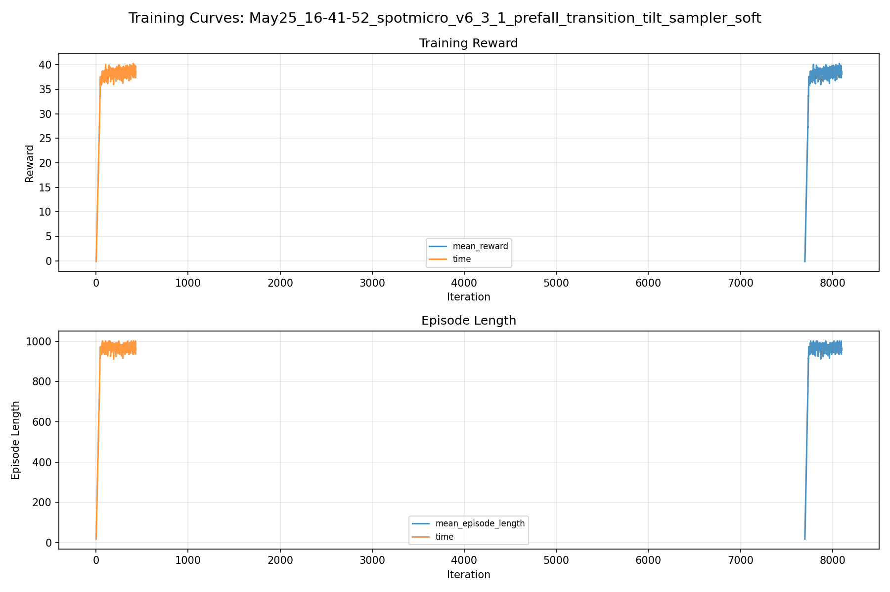
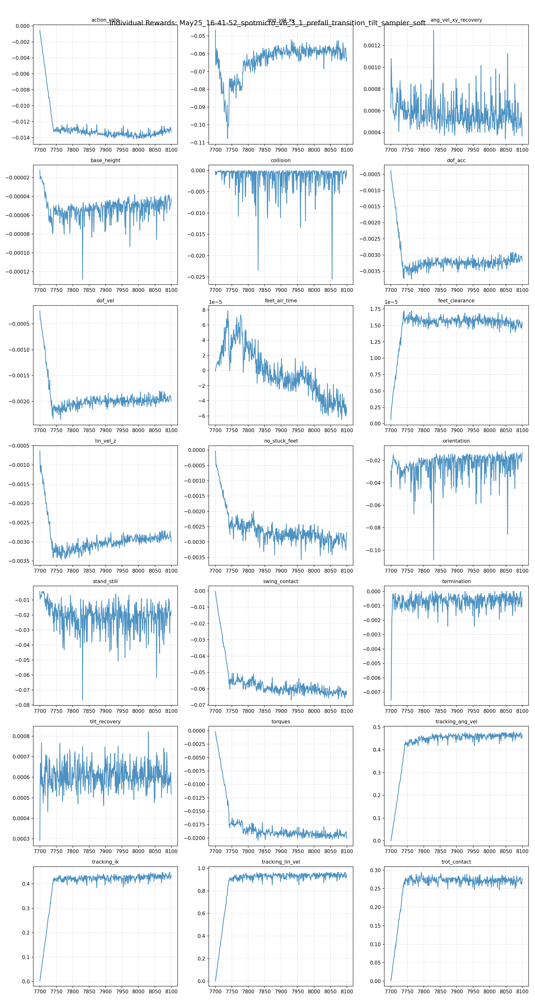
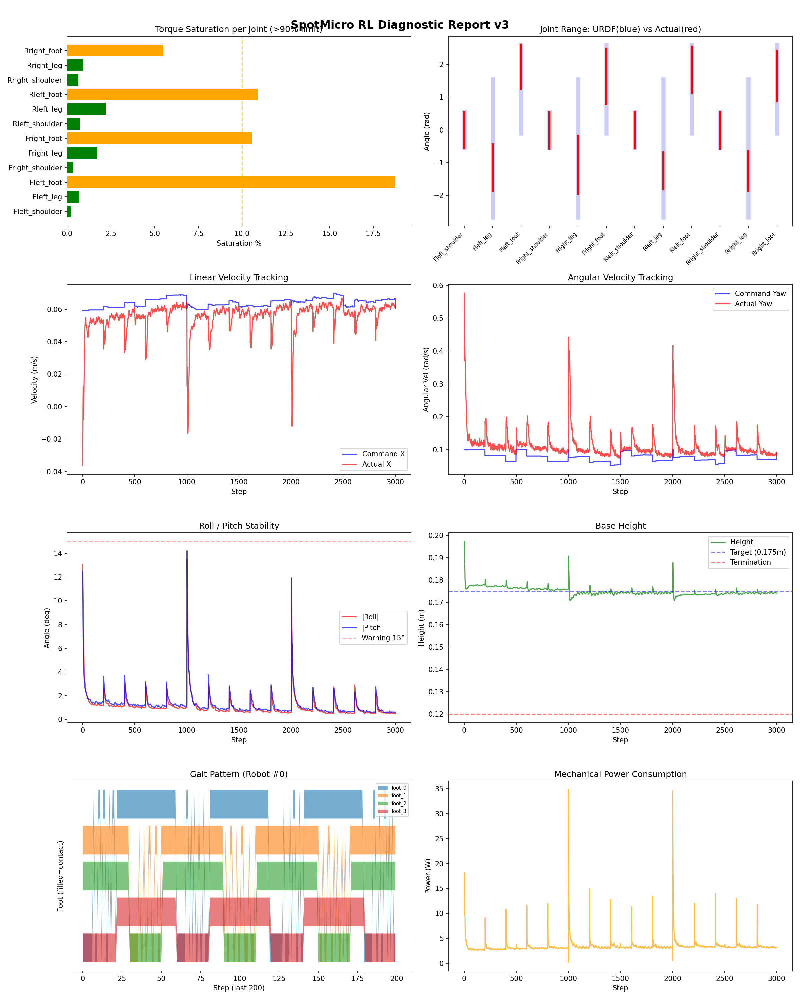
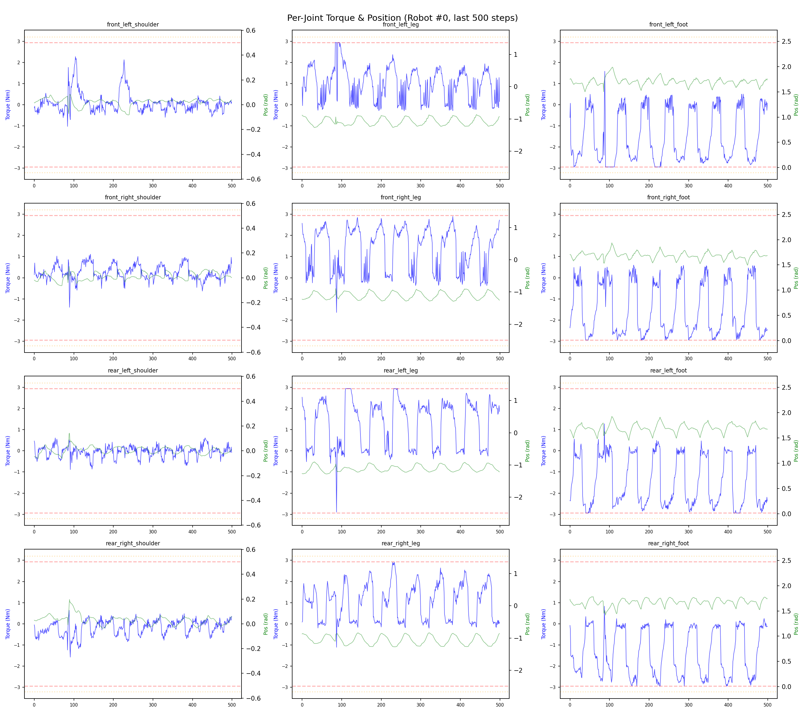
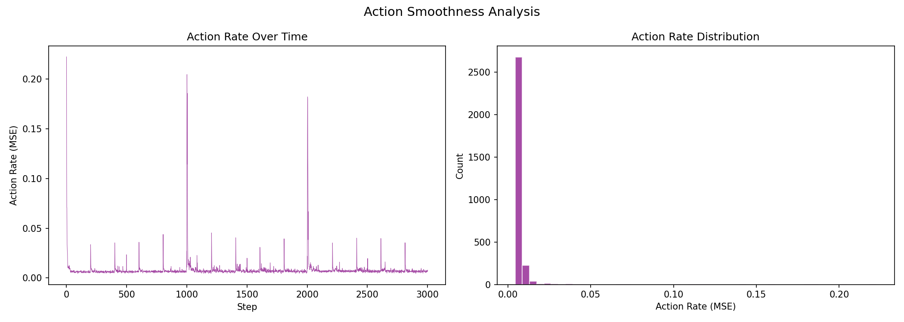

# 실험 081: spotmicro_v6_3_1_prefall_transition_tilt_sampler_soft

- **날짜:** 2026-05-25 16:52
- **Task:** spotmicro_test
- **Run name:** `spotmicro_v6_3_1_prefall_transition_tilt_sampler_soft`
- **판정:** ❌ FAIL (일부 기준 미달)

---

## 실험 목적

v6.3.1 : sampler 강도 약화

---

## 변경점 (이전 커밋 대비)

```diff
diff --git a/ai_training/rl/legged_gym/legged_gym/envs/spotmicro_test/spotmicro_test.py b/ai_training/rl/legged_gym/legged_gym/envs/spotmicro_test/spotmicro_test.py
index 229b2a2..5ebf8e8 100644
--- a/ai_training/rl/legged_gym/legged_gym/envs/spotmicro_test/spotmicro_test.py
+++ b/ai_training/rl/legged_gym/legged_gym/envs/spotmicro_test/spotmicro_test.py
@@ -592,8 +592,9 @@ class SpotmicroTest(LeggedRobot):
         ang_vel_xy = float(getattr(cfg, "transition_tilt_push_ang_vel_xy", 0.0))
         if ang_vel_xy > 0.0:
             ang = torch_rand_float(0.0, ang_vel_xy, (num, 1), device=self.device).squeeze(1)
-            self.root_states[env_ids, 10] += torch.sign(roll) * ang
-            self.root_states[env_ids, 11] += torch.sign(pitch) * ang
+            self.root_states[env_ids, 10:12] = 0.0
+            self.root_states[env_ids, 10] = torch.sign(roll) * ang
+            self.root_states[env_ids, 11] = torch.sign(pitch) * ang
 
         cmd_range = getattr(cfg, "transition_tilt_cmd_x_range", None)
         if cmd_range is not None:
diff --git a/ai_training/rl/legged_gym/legged_gym/envs/spotmicro_test/spotmicro_test_config.py b/ai_training/rl/legged_gym/legged_gym/envs/spotmicro_test/spotmicro_test_config.py
index e0cd30a..22c5fad 100644
--- a/ai_training/rl/legged_gym/legged_gym/envs/spotmicro_test/spotmicro_test_config.py
+++ b/ai_training/rl/legged_gym/legged_gym/envs/spotmicro_test/spotmicro_test_config.py
@@ -207,10 +207,10 @@ class SpotmicroTestCfg(LeggedRobotCfg):
         push_ang_vel_xy_clip = 1.20
         push_ang_vel_z_clip = 0.35
         transition_tilt_push = True
-        transition_tilt_push_prob = 0.35
+        transition_tilt_push_prob = 0.20
         transition_tilt_push_min_deg = 18.0
-        transition_tilt_push_max_deg = 28.0
-        transition_tilt_push_ang_vel_xy = 0.60
+        transition_tilt_push_max_deg = 27.0
+        transition_tilt_push_ang_vel_xy = 0.40
         transition_tilt_cmd_x_range = [0.05, 0.10]
         transition_tilt_zero_yaw_cmd = True
         action_delay = True
@@ -229,10 +229,10 @@ class SpotmicroTestCfgPPO(LeggedRobotCfgPPO):
         learning_rate = 1e-4
 
     class runner(LeggedRobotCfgPPO.runner):
-        run_name = 'spotmicro_v6_3_prefall_transition_tilt_sampler'
+        run_name = 'spotmicro_v6_3_1_prefall_transition_tilt_sampler_soft'
         experiment_name = 'spotmicro_test'
-        max_iterations = 600
+        max_iterations = 400
         save_interval = 100
         resume = True
-        load_run = "May25_14-02-38_spotmicro_v6_2_4_prefall_tilt_recovery_30deg_continue"
-        checkpoint = 7100
+        load_run = "May25_16-21-04_spotmicro_v6_3_prefall_transition_tilt_sampler"
+        checkpoint = 7700
```

**변경 요약:**
  - self.root_states[env_ids, 10] += torch.sign(roll) * ang
  - self.root_states[env_ids, 11] += torch.sign(pitch) * ang
  + self.root_states[env_ids, 10:12] = 0.0
  + self.root_states[env_ids, 10] = torch.sign(roll) * ang
  + self.root_states[env_ids, 11] = torch.sign(pitch) * ang
  - transition_tilt_push_prob = 0.35
  + transition_tilt_push_prob = 0.20
  - transition_tilt_push_max_deg = 28.0
  - transition_tilt_push_ang_vel_xy = 0.60
  + transition_tilt_push_max_deg = 27.0
  + transition_tilt_push_ang_vel_xy = 0.40
  - run_name = 'spotmicro_v6_3_prefall_transition_tilt_sampler'
  + run_name = 'spotmicro_v6_3_1_prefall_transition_tilt_sampler_soft'
  - max_iterations = 600
  + max_iterations = 400
  - load_run = "May25_14-02-38_spotmicro_v6_2_4_prefall_tilt_recovery_30deg_continue"
  - checkpoint = 7100
  + load_run = "May25_16-21-04_spotmicro_v6_3_prefall_transition_tilt_sampler"
  + checkpoint = 7700

---

## 현재 Reward Scales

| Reward | Scale |
|--------|-------|
| action_rate | -0.05 |
| ang_vel_xy | -1.0 |
| ang_vel_xy_recovery | 0.5 |
| base_height | -2.0 |
| collision | -1.0 |
| dof_acc | -2.5e-07 |
| dof_vel | -0.0005 |
| feet_air_time | 0.04 |
| feet_clearance | 0.03 |
| lin_vel_z | -2.0 |
| no_stuck_feet | -0.2 |
| orientation | -10.0 |
| stand_still | -0.4 |
| swing_contact | -0.45 |
| termination | -20.0 |
| tilt_recovery | 4.0 |
| torques | -0.001 |
| tracking_ang_vel | 0.6 |
| tracking_ik | 0.6 |
| tracking_lin_vel | 1.0 |
| trot_contact | 0.35 |

---

## 진단 결과 (Diagnostic)

### 핵심 지표

- ⚠️ Timeout: 88.9% (60~90%, 보통)
- ✅ 속도오차 X: 0.0215 m/s (<0.08)
- ✅ 토크포화: 4.4% (<10%)
- ✅ 자세: roll 1.1°, pitch 1.2° (안정)
- ✅ 조기종료: 3.1% (<5%)
- ✅ 전환복구: 80.7% (≥80%)
- ✅ 18도+ pre-fall 복구: 76.8% (≥70%)
- ✅ Reset 25-30도 복구: 79.5% (≥75%, n=249)
- ⚠️ Transition 25-30도 복구: 58.3% (55~65%, n=72)

### 상세 수치

| 지표 | 값 |
|------|-----|
| Timeout% | 88.85017421602788 |
| 조기종료% | 3.1358885017421603 |
| 속도오차 X | 0.021497558802366257 m/s |
| 속도오차 Y | 0.014569777995347977 m/s |
| 각속도오차 | 0.07255703955888748 rad/s |
| 토크포화% | 4.433478847541348 |
| 평균 높이 | 0.17497048250365727 m |
| Roll (평균) | 1.0974351167678833° |
| Pitch (평균) | 1.2327876091003418° |
| Action Rate | 0.008063206449151039 |
| 평균 전력 | 3.3981685638427734 W |
| CoT | 2.124916719447373 |
| Recovery 성공률 | 89.05109489051095% |
| Recovery eligible trials | 685 |
| 평균 회복 시간 | 0.30108196048340835 s |
| Recovery 조기 실패율 | 2.335766423357664% |
| Recovery 18도+ 성공률 | 86.95652173913044% |
| Recovery 18도+ trials | 529 |
| Recovery 18도+ horizon 후 tilt | 3.7753857265425483° |
| Transition recovery 성공률 | 80.68669527896995% |
| Transition recovery eligible trials | 932 |
| 평균 Transition recovery 시간 | 0.10199467857130506 s |
| Transition 18도+ 성공률 | 76.75675675675676% |
| Transition 18도+ trials | 740 |
| Transition 18도+ horizon 후 tilt | 5.286799788769536° |

## Recovery Assist 분석

| 지표 | 값 |
|------|-----|
| 판정 | ✅ Recovery 안정적 |
| Recovery 성공률 | 89.1% |
| 성공/실패 | 610 / 75 |
| Eligible trials | 685 / 830 |
| 평균 회복 시간 | 0.301s |
| 조기 실패율 | 2.3% |
| 평가 horizon | 1.0 s |
| 초기 tilt 기준 | 12.000000000000002° |
| 안정 기준 | roll/pitch < 5.0°, height > 0.165m |
| 평균 초기 tilt | 22.244140986994395° |
| 평균 초기 roll/pitch | 16.856196074249578° / 16.84434261187147° |
| 1초 후 평균 roll/pitch | 2.583080545907677° / 2.2284334813793576° |
| 1초 내 최대 roll/pitch 평균 | 18.231229736335084° / 17.951178051259397° |

> 해석: `Recovery 성공률`은 초기 tilt가 기준 이상인 episode 중 1초 내 안정 자세로 복귀한 비율입니다. 조기 실패율이 높으면 reset 직후 바로 넘어지는 것이고, 평균 회복 시간이 짧을수록 위기 대응이 빠른 것입니다.

### Recovery Tilt Band 분석

| Tilt 구간 | Trials | 성공률 | Horizon 후 평균 tilt | 평균 회복 시간 |
|-----------|--------|--------|----------------------|----------------|
| 12-18 deg | 156 | 96.2% | 1.43° | 0.19s |
| 18-25 deg | 280 | 93.6% | 2.51° | 0.29s |
| 25-30 deg | 249 | 79.5% | 5.20° | 0.40s |
| 30+ deg | 0 | N/A | N/A | N/A |
| 18+ deg 전체 | 529 | 87.0% | 3.78° | 0.34s |

> 이번 pre-fall 목표는 특히 `18-25 deg`, `25-30 deg`, `18+ deg 전체` 행을 우선 봅니다. `25-30 deg` trial이 없으면 30도 근처 회복 성능은 아직 검증되지 않은 것입니다.


## Transition Recovery 분석

| 지표 | 값 |
|------|-----|
| 판정 | ✅ 전환 복구 안정적 |
| Transition recovery 성공률 | 80.7% |
| 성공/실패 | 752 / 180 |
| Eligible trials | 932 / 3584 |
| 평균 회복 시간 | 0.102s |
| 조기 실패율 | 3.9% |
| 평가 horizon | 0.75 s |
| push 후 eligible 기준 | max roll/pitch > 12.000000000000002° |
| 안정 기준 | roll/pitch < 5.0°, height > 0.165m |
| 평균 최대 tilt | 21.795855020697473° |
| horizon 후 평균 roll/pitch | 3.176940252190399° / 3.3518108822562223° |

> 해석: `Transition Recovery`는 학습 중 push/roll-pitch angular impulse가 들어간 뒤 일정 시간 안에 자세가 안정 기준으로 돌아오는지를 봅니다.

### Transition Recovery Tilt Band 분석

| Tilt 구간 | Trials | 성공률 | Horizon 후 평균 tilt | 평균 회복 시간 |
|-----------|--------|--------|----------------------|----------------|
| 12-18 deg | 192 | 95.8% | 1.50° | 0.12s |
| 18-25 deg | 617 | 84.4% | 2.59° | 0.08s |
| 25-30 deg | 72 | 58.3% | 4.98° | 0.22s |
| 30+ deg | 51 | 9.8% | 38.40° | 0.36s |
| 18+ deg 전체 | 740 | 76.8% | 5.29° | 0.10s |

> 이번 pre-fall 목표는 특히 `18-25 deg`, `25-30 deg`, `18+ deg 전체` 행을 우선 봅니다. `25-30 deg` trial이 없으면 30도 근처 회복 성능은 아직 검증되지 않은 것입니다.


## Command Mode별 회전 추종 분석

| 모드 | 비율 | 샘플 수 | 평균 abs(cmd_wz) | 평균 abs(actual_wz) | yaw 오차 | 상태 |
|------|------|---------|------------------|---------------------|----------|------|
| 정지 | 7.7% | 59261 | 0.0246 | 0.0583 | 0.0567 | ⚠️ |
| 직진/저회전 | 55.4% | 426075 | 0.0429 | 0.0948 | 0.0773 | ✅ |
| 제자리 회전 | 9.2% | 70849 | 0.1744 | 0.1705 | 0.0699 | ✅ |
| 전진+회전 | 10.8% | 83124 | 0.1758 | 0.1756 | 0.0729 | ✅ |
| 큰 회전명령 | 0.0% | 0 | N/A | N/A | N/A | N/A |

> 해석 기준: `제자리 회전`만 나쁘면 pure turn 학습/보행 패턴 문제, `큰 회전명령`만 나쁘면 yaw 명령 범위가 현재 토크/보폭 한계보다 큰 문제, `정지`가 나쁘면 stop drift 문제로 보면 됩니다.
        


## 학습 곡선 분석

| 지표 | 값 | 판정 |
|------|-----|------|
| 수렴 iter (90%) | 7742 | 느림 |
| 후반 안정성 (CV) | 0.020 | 안정 |
| 정체 구간 | 없음 | |


## Per-leg 분석

### 발별 접촉/공중 비율

| 발 | 접촉% | 공중% |
|-----|-------|------|
| foot_0 | 77.0% | 23.0% |
| foot_1 | 76.3% | 23.7% |
| foot_2 | 69.9% | 30.1% |
| foot_3 | 68.4% | 31.6% |

### 관절별 토크 포화

| 관절 | 포화% | 최대토크 | 한계 | 상태 |
|------|------|---------|------|------|
| front_left_shoulder | 0.2% | 2.940 | 2.940 | ✅ |
| front_left_leg | 0.7% | 2.940 | 2.940 | ✅ |
| front_left_foot | 18.7% | 2.940 | 2.940 | ⚠️ |
| front_right_shoulder | 0.4% | 2.940 | 2.940 | ✅ |
| front_right_leg | 1.7% | 2.940 | 2.940 | ✅ |
| front_right_foot | 10.6% | 2.940 | 2.940 | ⚠️ |
| rear_left_shoulder | 0.7% | 2.940 | 2.940 | ✅ |
| rear_left_leg | 2.2% | 2.940 | 2.940 | ✅ |
| rear_left_foot | 10.9% | 2.940 | 2.940 | ⚠️ |
| rear_right_shoulder | 0.6% | 2.940 | 2.940 | ✅ |
| rear_right_leg | 0.9% | 2.940 | 2.940 | ✅ |
| rear_right_foot | 5.5% | 2.940 | 2.940 | ⚠️ |


## Gait 분석

| 지표 | 값 |
|------|-----|
| Gait 주파수 | 0.21 Hz |
| Gait 주기 | 60 steps |
| 대각 동기화율 | 88.0% |
| L/R 비대칭 | 0.0%p |
| 판정 | ✅ Trot 패턴 / ✅ 대칭 |


## 관절별 상세

| 관절 | 토크포화% | 사용범위% | 편향(rad) | 한계근접% | 상태 |
|------|----------|----------|----------|----------|------|
| front_left_shoulder | 0.2% | 101% | -0.006 | 0.1% | ✅ |
| front_left_leg | 0.7% | 34% | -1.153 | 0.0% | ⚠️ |
| front_left_foot | 18.7% | 50% | +1.923 | 0.0% | ⚠️ |
| front_right_shoulder | 0.4% | 102% | -0.010 | 0.1% | ✅ |
| front_right_leg | 1.7% | 42% | -1.061 | 0.0% | ⚠️ |
| front_right_foot | 10.6% | 63% | +1.638 | 0.0% | ⚠️ |
| rear_left_shoulder | 0.7% | 101% | -0.009 | 0.2% | ✅ |
| rear_left_leg | 2.2% | 27% | -1.248 | 0.0% | ⚠️ |
| rear_left_foot | 10.9% | 53% | +1.827 | 0.2% | ⚠️ |
| rear_right_shoulder | 0.6% | 102% | -0.009 | 0.2% | ✅ |
| rear_right_leg | 0.9% | 29% | -1.248 | 0.0% | ⚠️ |
| rear_right_foot | 5.5% | 57% | +1.650 | 0.0% | ⚠️ |


## 에너지 효율 상세

| 지표 | 값 |
|------|-----|
| 평균 전력 | 3.40 W |
| 피크 전력 | 34.81 W |
| 피크/평균 비율 | 10.2x |
| CoT | 2.12 |

### 관절별 전력 분배

| 관절 | 평균전력(W) | 비율% |
|------|-----------|-------|
| front_left_foot | 0.598 | 17.6% |
| rear_left_foot | 0.490 | 14.4% |
| rear_right_foot | 0.488 | 14.3% |
| front_right_foot | 0.469 | 13.8% |
| front_right_leg | 0.330 | 9.7% |
| front_left_leg | 0.301 | 8.8% |
| rear_right_leg | 0.255 | 7.5% |
| rear_left_leg | 0.250 | 7.4% |
| rear_right_shoulder | 0.069 | 2.0% |
| rear_left_shoulder | 0.054 | 1.6% |
| front_right_shoulder | 0.051 | 1.5% |
| front_left_shoulder | 0.043 | 1.3% |


## 이전 실험 대비 비교

| 지표 | 이전 (exp080) | 현재 (exp081) | 변화 |
|------|-------|-------|------|
| Timeout% | 76.3% | 88.9% | ✅ ↑ 12.5662% |
| 속도오차 X | 0.0235 | 0.0215 | ✅ ↓ 0.0020m/s |
| 토크포화 | 5.1% | 4.4% | ✅ ↓ 0.7146% |
| Roll | 1.3° | 1.1° | ✅ ↓ 0.2182° |
| Pitch | 1.5° | 1.2° | ✅ ↓ 0.2174° |
| 평균 전력 | 3.6632W | 3.3982W | ✅ ↓ 0.2650W |


## Tensorboard 학습 곡선 요약

| 스칼라 | 최종값 | 최대 | 최소 | 후반10% 평균 |
|--------|--------|------|------|-------------|
| rew_action_rate | -0.0133 | -0.0005 | -0.0141 | -0.0132 |
| rew_ang_vel_xy | -0.0621 | -0.0467 | -0.1079 | -0.0591 |
| rew_ang_vel_xy_recovery | 0.0004 | 0.0013 | 0.0003 | 0.0005 |
| rew_base_height | -0.0000 | -0.0000 | -0.0001 | -0.0000 |
| rew_collision | 0.0000 | 0.0000 | -0.0255 | -0.0011 |
| rew_dof_acc | -0.0032 | -0.0004 | -0.0038 | -0.0031 |
| rew_dof_vel | -0.0020 | -0.0002 | -0.0024 | -0.0019 |
| rew_feet_air_time | -0.0001 | 0.0001 | -0.0001 | -0.0000 |
| rew_feet_clearance | 0.0000 | 0.0000 | 0.0000 | 0.0000 |
| rew_lin_vel_z | -0.0030 | -0.0006 | -0.0035 | -0.0029 |
| rew_no_stuck_feet | -0.0027 | -0.0000 | -0.0036 | -0.0029 |
| rew_orientation | -0.0130 | -0.0117 | -0.1086 | -0.0199 |
| rew_stand_still | -0.0171 | -0.0042 | -0.0768 | -0.0212 |
| rew_swing_contact | -0.0634 | -0.0004 | -0.0670 | -0.0623 |
| rew_termination | -0.0004 | 0.0000 | -0.0076 | -0.0006 |
| rew_tilt_recovery | 0.0005 | 0.0008 | 0.0003 | 0.0006 |
| rew_torques | -0.0201 | -0.0002 | -0.0204 | -0.0193 |
| rew_tracking_ang_vel | 0.4675 | 0.4797 | 0.0017 | 0.4630 |
| rew_tracking_ik | 0.4353 | 0.4486 | 0.0029 | 0.4312 |
| rew_tracking_lin_vel | 0.9459 | 0.9667 | 0.0041 | 0.9364 |
| rew_trot_contact | 0.2776 | 0.2950 | 0.0012 | 0.2708 |
| learning_rate | 0.0002 | 0.0002 | 0.0000 | 0.0001 |
| surrogate | -0.0020 | 0.0023 | -0.0046 | -0.0023 |
| value_function | 0.0024 | 0.0631 | 0.0019 | 0.0031 |
| collection time | 0.7825 | 0.8486 | 0.7420 | 0.7801 |
| learning_time | 0.2839 | 0.3288 | 0.2612 | 0.2840 |
| total_fps | 92177.0000 | 95593.0000 | 85032.0000 | 92401.3250 |
| mean_noise_std | 0.0759 | 0.0805 | 0.0753 | 0.0757 |
| mean_episode_length | 962.9300 | 1002.0000 | 17.7200 | 970.2977 |
| time | 962.9300 | 1002.0000 | 17.7200 | 970.2977 |
| mean_reward | 38.5218 | 40.2946 | -0.1349 | 38.7522 |
| time | 38.5218 | 40.2946 | -0.1349 | 38.7522 |

총 학습 iteration: 8099


---

## 그래프

### Tensorboard 학습 곡선



### Diagnostic 결과





---

## 결론 및 다음 실험 방향

**자동 판정:** ❌ FAIL (일부 기준 미달)

대부분 기준을 통과했으나 일부 항목이 보통 수준입니다.
  - ⚠️ Timeout: 88.9% (60~90%, 보통)
  - ⚠️ Transition 25-30도 복구: 58.3% (55~65%, n=72)

> 💡 위 결론은 자동 생성되었습니다. 필요시 수정하세요.

---

## 메모

_(추가 메모가 있으면 여기에 작성)_

