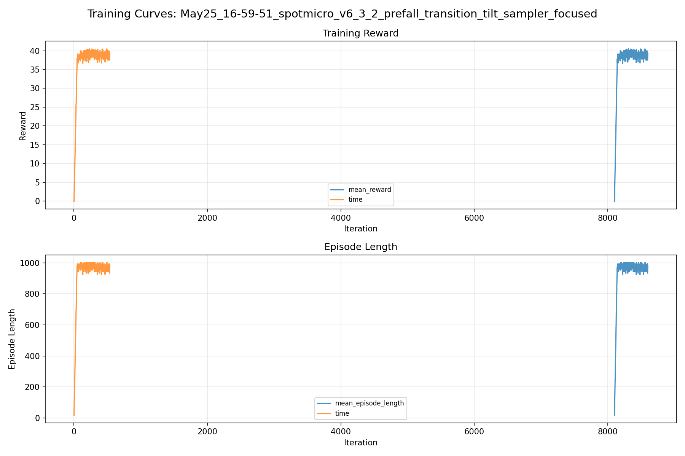
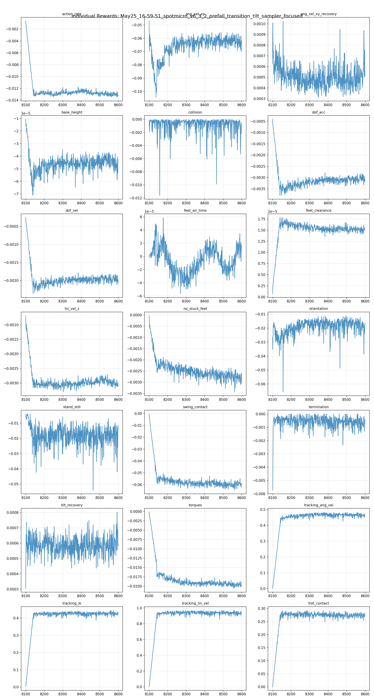
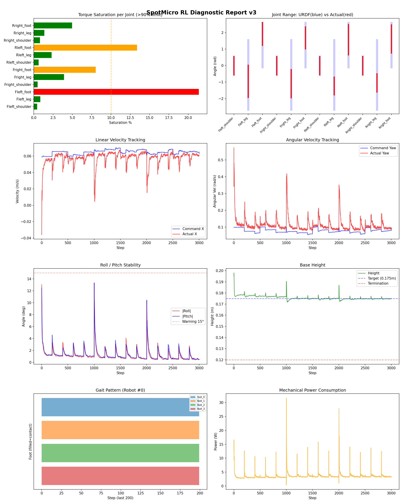
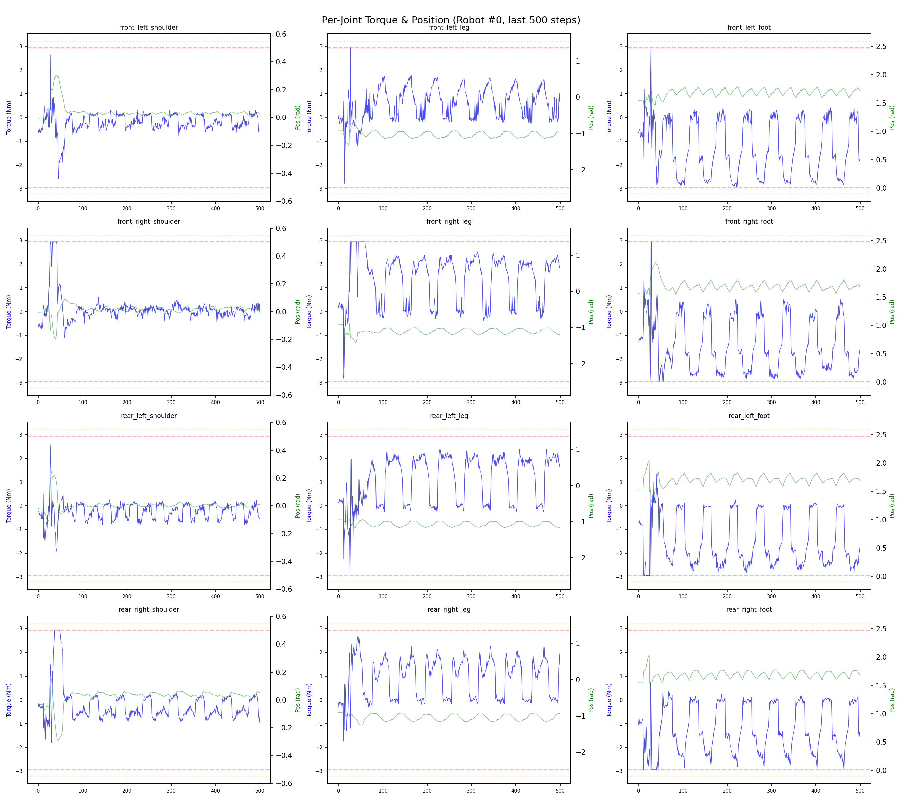
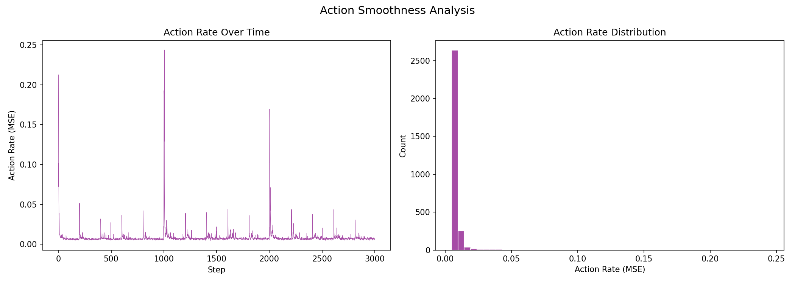

# 실험 082: spotmicro_v6_3_2_prefall_transition_tilt_sampler_focused

- **날짜:** 2026-05-25 17:12
- **Task:** spotmicro_test
- **Run name:** `spotmicro_v6_3_2_prefall_transition_tilt_sampler_focused`
- **판정:** ❌ FAIL (일부 기준 미달)

---

## 실험 목적

v6.3.2 : sampler 각도 범위 집중

---

## 변경점 (이전 커밋 대비)

```diff
diff --git a/ai_training/rl/legged_gym/legged_gym/envs/spotmicro_test/spotmicro_test_config.py b/ai_training/rl/legged_gym/legged_gym/envs/spotmicro_test/spotmicro_test_config.py
index 22c5fad..86a5d45 100644
--- a/ai_training/rl/legged_gym/legged_gym/envs/spotmicro_test/spotmicro_test_config.py
+++ b/ai_training/rl/legged_gym/legged_gym/envs/spotmicro_test/spotmicro_test_config.py
@@ -208,9 +208,9 @@ class SpotmicroTestCfg(LeggedRobotCfg):
         push_ang_vel_z_clip = 0.35
         transition_tilt_push = True
         transition_tilt_push_prob = 0.20
-        transition_tilt_push_min_deg = 18.0
-        transition_tilt_push_max_deg = 27.0
-        transition_tilt_push_ang_vel_xy = 0.40
+        transition_tilt_push_min_deg = 22.0
+        transition_tilt_push_max_deg = 27.5
+        transition_tilt_push_ang_vel_xy = 0.35
         transition_tilt_cmd_x_range = [0.05, 0.10]
         transition_tilt_zero_yaw_cmd = True
         action_delay = True
@@ -229,10 +229,10 @@ class SpotmicroTestCfgPPO(LeggedRobotCfgPPO):
         learning_rate = 1e-4
 
     class runner(LeggedRobotCfgPPO.runner):
-        run_name = 'spotmicro_v6_3_1_prefall_transition_tilt_sampler_soft'
+        run_name = 'spotmicro_v6_3_2_prefall_transition_tilt_sampler_focused'
         experiment_name = 'spotmicro_test'
-        max_iterations = 400
+        max_iterations = 500
         save_interval = 100
         resume = True
-        load_run = "May25_16-21-04_spotmicro_v6_3_prefall_transition_tilt_sampler"
-        checkpoint = 7700
+        load_run = "May25_16-41-52_spotmicro_v6_3_1_prefall_transition_tilt_sampler_soft"
+        checkpoint = 8100
```

**변경 요약:**
  - transition_tilt_push_min_deg = 18.0
  - transition_tilt_push_max_deg = 27.0
  - transition_tilt_push_ang_vel_xy = 0.40
  + transition_tilt_push_min_deg = 22.0
  + transition_tilt_push_max_deg = 27.5
  + transition_tilt_push_ang_vel_xy = 0.35
  - run_name = 'spotmicro_v6_3_1_prefall_transition_tilt_sampler_soft'
  + run_name = 'spotmicro_v6_3_2_prefall_transition_tilt_sampler_focused'
  - max_iterations = 400
  + max_iterations = 500
  - load_run = "May25_16-21-04_spotmicro_v6_3_prefall_transition_tilt_sampler"
  - checkpoint = 7700
  + load_run = "May25_16-41-52_spotmicro_v6_3_1_prefall_transition_tilt_sampler_soft"
  + checkpoint = 8100

---

## 현재 Reward Scales

| Reward | Scale |
|--------|-------|
| action_rate | -0.05 |
| ang_vel_xy | -1.0 |
| ang_vel_xy_recovery | 0.5 |
| base_height | -2.0 |
| collision | -1.0 |
| dof_acc | -2.5e-07 |
| dof_vel | -0.0005 |
| feet_air_time | 0.04 |
| feet_clearance | 0.03 |
| lin_vel_z | -2.0 |
| no_stuck_feet | -0.2 |
| orientation | -10.0 |
| stand_still | -0.4 |
| swing_contact | -0.45 |
| termination | -20.0 |
| tilt_recovery | 4.0 |
| torques | -0.001 |
| tracking_ang_vel | 0.6 |
| tracking_ik | 0.6 |
| tracking_lin_vel | 1.0 |
| trot_contact | 0.35 |

---

## 진단 결과 (Diagnostic)

### 핵심 지표

- ⚠️ Timeout: 79.3% (60~90%, 보통)
- ✅ 속도오차 X: 0.0218 m/s (<0.08)
- ✅ 토크포화: 4.9% (<10%)
- ✅ 자세: roll 1.2°, pitch 1.3° (안정)
- ⚠️ 조기종료: 5.2% (5~20%)
- ⚠️ 전환복구: 68.3% (50~80%)
- ⚠️ 18도+ pre-fall 복구: 66.3% (60~70%, 개선 필요)
- ✅ Reset 25-30도 복구: 75.3% (≥75%, n=279)
- ⚠️ Transition 25-30도 복구: 58.6% (55~65%, n=133)

### 상세 수치

| 지표 | 값 |
|------|-----|
| Timeout% | 79.30489731437599 |
| 조기종료% | 5.213270142180095 |
| 속도오차 X | 0.021777963265776634 m/s |
| 속도오차 Y | 0.015258402563631535 m/s |
| 각속도오차 | 0.07367748022079468 rad/s |
| 토크포화% | 4.870595983877235 |
| 평균 높이 | 0.17569199886732487 m |
| Roll (평균) | 1.1523025035858154° |
| Pitch (평균) | 1.2725486755371094° |
| Action Rate | 0.008664965629577637 |
| 평균 전력 | 3.5537772178649902 W |
| CoT | 2.1532306542791244 |
| Recovery 성공률 | 86.80272108843538% |
| Recovery eligible trials | 735 |
| 평균 회복 시간 | 0.29630093381602934 s |
| Recovery 조기 실패율 | 4.081632653061225% |
| Recovery 18도+ 성공률 | 84.94623655913979% |
| Recovery 18도+ trials | 558 |
| Recovery 18도+ horizon 후 tilt | 4.4352104307209075° |
| Transition recovery 성공률 | 68.29004329004329% |
| Transition recovery eligible trials | 924 |
| 평균 Transition recovery 시간 | 0.10820918934044861 s |
| Transition 18도+ 성공률 | 66.31455399061032% |
| Transition 18도+ trials | 852 |
| Transition 18도+ horizon 후 tilt | 7.975531942079919° |

## Recovery Assist 분석

| 지표 | 값 |
|------|-----|
| 판정 | ✅ Recovery 안정적 |
| Recovery 성공률 | 86.8% |
| 성공/실패 | 638 / 97 |
| Eligible trials | 735 / 888 |
| 평균 회복 시간 | 0.296s |
| 조기 실패율 | 4.1% |
| 평가 horizon | 1.0 s |
| 초기 tilt 기준 | 12.000000000000002° |
| 안정 기준 | roll/pitch < 5.0°, height > 0.165m |
| 평균 초기 tilt | 22.33203738008225° |
| 평균 초기 roll/pitch | 16.931272999653295° / 16.74593653967459° |
| 1초 후 평균 roll/pitch | 3.0848731012043995° / 2.912637390360869° |
| 1초 내 최대 roll/pitch 평균 | 18.60070543483812° / 18.21828131091838° |

> 해석: `Recovery 성공률`은 초기 tilt가 기준 이상인 episode 중 1초 내 안정 자세로 복귀한 비율입니다. 조기 실패율이 높으면 reset 직후 바로 넘어지는 것이고, 평균 회복 시간이 짧을수록 위기 대응이 빠른 것입니다.

### Recovery Tilt Band 분석

| Tilt 구간 | Trials | 성공률 | Horizon 후 평균 tilt | 평균 회복 시간 |
|-----------|--------|--------|----------------------|----------------|
| 12-18 deg | 177 | 92.7% | 2.90° | 0.19s |
| 18-25 deg | 279 | 94.6% | 2.18° | 0.29s |
| 25-30 deg | 279 | 75.3% | 6.69° | 0.39s |
| 30+ deg | 0 | N/A | N/A | N/A |
| 18+ deg 전체 | 558 | 84.9% | 4.44° | 0.33s |

> 이번 pre-fall 목표는 특히 `18-25 deg`, `25-30 deg`, `18+ deg 전체` 행을 우선 봅니다. `25-30 deg` trial이 없으면 30도 근처 회복 성능은 아직 검증되지 않은 것입니다.


## Transition Recovery 분석

| 지표 | 값 |
|------|-----|
| 판정 | ⚠️ 일부 전환 복구 가능 |
| Transition recovery 성공률 | 68.3% |
| 성공/실패 | 631 / 293 |
| Eligible trials | 924 / 3584 |
| 평균 회복 시간 | 0.108s |
| 조기 실패율 | 9.5% |
| 평가 horizon | 0.75 s |
| push 후 eligible 기준 | max roll/pitch > 12.000000000000002° |
| 안정 기준 | roll/pitch < 5.0°, height > 0.165m |
| 평균 최대 tilt | 24.707475738767528° |
| horizon 후 평균 roll/pitch | 5.150553543371092° / 5.585201393281214° |

> 해석: `Transition Recovery`는 학습 중 push/roll-pitch angular impulse가 들어간 뒤 일정 시간 안에 자세가 안정 기준으로 돌아오는지를 봅니다.

### Transition Recovery Tilt Band 분석

| Tilt 구간 | Trials | 성공률 | Horizon 후 평균 tilt | 평균 회복 시간 |
|-----------|--------|--------|----------------------|----------------|
| 12-18 deg | 72 | 91.7% | 2.22° | 0.24s |
| 18-25 deg | 627 | 77.2% | 3.29° | 0.08s |
| 25-30 deg | 133 | 58.6% | 5.57° | 0.15s |
| 30+ deg | 92 | 3.3% | 43.39° | 0.41s |
| 18+ deg 전체 | 852 | 66.3% | 7.98° | 0.09s |

> 이번 pre-fall 목표는 특히 `18-25 deg`, `25-30 deg`, `18+ deg 전체` 행을 우선 봅니다. `25-30 deg` trial이 없으면 30도 근처 회복 성능은 아직 검증되지 않은 것입니다.


## Command Mode별 회전 추종 분석

| 모드 | 비율 | 샘플 수 | 평균 abs(cmd_wz) | 평균 abs(actual_wz) | yaw 오차 | 상태 |
|------|------|---------|------------------|---------------------|----------|------|
| 정지 | 8.0% | 61618 | 0.0247 | 0.0618 | 0.0599 | ⚠️ |
| 직진/저회전 | 54.6% | 419547 | 0.0453 | 0.0998 | 0.0802 | ⚠️ |
| 제자리 회전 | 8.0% | 61161 | 0.1736 | 0.1704 | 0.0662 | ✅ |
| 전진+회전 | 12.2% | 93834 | 0.1745 | 0.1789 | 0.0750 | ✅ |
| 큰 회전명령 | 0.0% | 0 | N/A | N/A | N/A | N/A |

> 해석 기준: `제자리 회전`만 나쁘면 pure turn 학습/보행 패턴 문제, `큰 회전명령`만 나쁘면 yaw 명령 범위가 현재 토크/보폭 한계보다 큰 문제, `정지`가 나쁘면 stop drift 문제로 보면 됩니다.
        


## 학습 곡선 분석

| 지표 | 값 | 판정 |
|------|-----|------|
| 수렴 iter (90%) | 8142 | 느림 |
| 후반 안정성 (CV) | 0.018 | 안정 |
| 정체 구간 | 없음 | |


## Per-leg 분석

### 발별 접촉/공중 비율

| 발 | 접촉% | 공중% |
|-----|-------|------|
| foot_0 | 75.7% | 24.3% |
| foot_1 | 75.9% | 24.1% |
| foot_2 | 70.9% | 29.1% |
| foot_3 | 66.0% | 34.0% |

### 관절별 토크 포화

| 관절 | 포화% | 최대토크 | 한계 | 상태 |
|------|------|---------|------|------|
| front_left_shoulder | 0.4% | 2.940 | 2.940 | ✅ |
| front_left_leg | 0.8% | 2.940 | 2.940 | ✅ |
| front_left_foot | 21.4% | 2.940 | 2.940 | ❌ |
| front_right_shoulder | 0.5% | 2.940 | 2.940 | ✅ |
| front_right_leg | 3.9% | 2.940 | 2.940 | ✅ |
| front_right_foot | 8.0% | 2.940 | 2.940 | ⚠️ |
| rear_left_shoulder | 0.6% | 2.940 | 2.940 | ✅ |
| rear_left_leg | 2.3% | 2.940 | 2.940 | ✅ |
| rear_left_foot | 13.4% | 2.940 | 2.940 | ⚠️ |
| rear_right_shoulder | 0.8% | 2.940 | 2.940 | ✅ |
| rear_right_leg | 1.4% | 2.940 | 2.940 | ✅ |
| rear_right_foot | 5.0% | 2.940 | 2.940 | ✅ |


## Gait 분석

| 지표 | 값 |
|------|-----|
| Gait 주파수 | 0.21 Hz |
| Gait 주기 | 60 steps |
| 대각 동기화율 | 90.9% |
| L/R 비대칭 | 0.0%p |
| 판정 | ✅ Trot 패턴 / ✅ 대칭 |


## 관절별 상세

| 관절 | 토크포화% | 사용범위% | 편향(rad) | 한계근접% | 상태 |
|------|----------|----------|----------|----------|------|
| front_left_shoulder | 0.4% | 101% | -0.007 | 0.1% | ✅ |
| front_left_leg | 0.8% | 46% | -0.955 | 0.0% | ⚠️ |
| front_left_foot | 21.4% | 52% | +1.918 | 0.0% | ⚠️ |
| front_right_shoulder | 0.5% | 101% | -0.008 | 0.1% | ✅ |
| front_right_leg | 3.9% | 41% | -1.095 | 0.0% | ⚠️ |
| front_right_foot | 8.0% | 50% | +1.683 | 0.0% | ⚠️ |
| rear_left_shoulder | 0.6% | 102% | -0.009 | 0.2% | ✅ |
| rear_left_leg | 2.3% | 26% | -1.235 | 0.0% | ⚠️ |
| rear_left_foot | 13.4% | 69% | +1.569 | 0.0% | ⚠️ |
| rear_right_shoulder | 0.8% | 102% | -0.009 | 0.2% | ✅ |
| rear_right_leg | 1.4% | 26% | -1.054 | 0.0% | ⚠️ |
| rear_right_foot | 5.0% | 64% | +1.615 | 0.1% | ⚠️ |


## 에너지 효율 상세

| 지표 | 값 |
|------|-----|
| 평균 전력 | 3.55 W |
| 피크 전력 | 31.64 W |
| 피크/평균 비율 | 8.9x |
| CoT | 2.15 |

### 관절별 전력 분배

| 관절 | 평균전력(W) | 비율% |
|------|-----------|-------|
| front_left_foot | 0.617 | 17.3% |
| rear_left_foot | 0.545 | 15.3% |
| front_right_foot | 0.514 | 14.5% |
| rear_right_foot | 0.459 | 12.9% |
| front_right_leg | 0.374 | 10.5% |
| front_left_leg | 0.291 | 8.2% |
| rear_left_leg | 0.267 | 7.5% |
| rear_right_leg | 0.247 | 6.9% |
| rear_right_shoulder | 0.076 | 2.1% |
| front_right_shoulder | 0.060 | 1.7% |
| rear_left_shoulder | 0.057 | 1.6% |
| front_left_shoulder | 0.048 | 1.3% |


## 이전 실험 대비 비교

| 지표 | 이전 (exp081) | 현재 (exp082) | 변화 |
|------|-------|-------|------|
| Timeout% | 88.9% | 79.3% | ⚠️ ↓ 9.5453% |
| 속도오차 X | 0.0215 | 0.0218 | ⚠️ ↑ 0.0003m/s |
| 토크포화 | 4.4% | 4.9% | ⚠️ ↑ 0.4371% |
| Roll | 1.1° | 1.2° | ⚠️ ↑ 0.0549° |
| Pitch | 1.2° | 1.3° | ⚠️ ↑ 0.0398° |
| 평균 전력 | 3.3982W | 3.5538W | ⚠️ ↑ 0.1556W |


## Tensorboard 학습 곡선 요약

| 스칼라 | 최종값 | 최대 | 최소 | 후반10% 평균 |
|--------|--------|------|------|-------------|
| rew_action_rate | -0.0133 | -0.0007 | -0.0135 | -0.0130 |
| rew_ang_vel_xy | -0.0640 | -0.0472 | -0.1043 | -0.0626 |
| rew_ang_vel_xy_recovery | 0.0005 | 0.0010 | 0.0003 | 0.0005 |
| rew_base_height | -0.0000 | -0.0000 | -0.0001 | -0.0000 |
| rew_collision | -0.0005 | 0.0000 | -0.0116 | -0.0011 |
| rew_dof_acc | -0.0031 | -0.0004 | -0.0038 | -0.0031 |
| rew_dof_vel | -0.0020 | -0.0003 | -0.0024 | -0.0020 |
| rew_feet_air_time | 0.0000 | 0.0001 | -0.0001 | 0.0000 |
| rew_feet_clearance | 0.0000 | 0.0000 | 0.0000 | 0.0000 |
| rew_lin_vel_z | -0.0031 | -0.0007 | -0.0033 | -0.0030 |
| rew_no_stuck_feet | -0.0031 | -0.0000 | -0.0034 | -0.0028 |
| rew_orientation | -0.0164 | -0.0111 | -0.0656 | -0.0189 |
| rew_stand_still | -0.0134 | -0.0040 | -0.0539 | -0.0190 |
| rew_swing_contact | -0.0621 | -0.0004 | -0.0646 | -0.0597 |
| rew_termination | -0.0004 | 0.0000 | -0.0057 | -0.0007 |
| rew_tilt_recovery | 0.0006 | 0.0008 | 0.0003 | 0.0006 |
| rew_torques | -0.0200 | -0.0002 | -0.0206 | -0.0197 |
| rew_tracking_ang_vel | 0.4690 | 0.4826 | 0.0018 | 0.4639 |
| rew_tracking_ik | 0.4312 | 0.4439 | 0.0029 | 0.4256 |
| rew_tracking_lin_vel | 0.9470 | 0.9689 | 0.0045 | 0.9343 |
| rew_trot_contact | 0.2827 | 0.2928 | 0.0013 | 0.2735 |
| learning_rate | 0.0001 | 0.0003 | 0.0000 | 0.0001 |
| surrogate | -0.0027 | 0.0026 | -0.0047 | -0.0026 |
| value_function | 0.0023 | 0.0574 | 0.0014 | 0.0031 |
| collection time | 0.7465 | 0.8703 | 0.7347 | 0.7795 |
| learning_time | 0.2790 | 0.3201 | 0.2771 | 0.2833 |
| total_fps | 95861.0000 | 96769.0000 | 82690.0000 | 92519.7000 |
| mean_noise_std | 0.0755 | 0.0772 | 0.0722 | 0.0755 |
| mean_episode_length | 982.6800 | 1002.0000 | 17.8600 | 969.5214 |
| time | 982.6800 | 1002.0000 | 17.8600 | 969.5214 |
| mean_reward | 39.3312 | 40.5108 | -0.1064 | 38.8247 |
| time | 39.3312 | 40.5108 | -0.1064 | 38.8247 |

총 학습 iteration: 8599


---

## 그래프

### Tensorboard 학습 곡선



### Diagnostic 결과





---

## 결론 및 다음 실험 방향

**자동 판정:** ❌ FAIL (일부 기준 미달)

대부분 기준을 통과했으나 일부 항목이 보통 수준입니다.
  - ⚠️ Timeout: 79.3% (60~90%, 보통)
  - ⚠️ 조기종료: 5.2% (5~20%)
  - ⚠️ 전환복구: 68.3% (50~80%)
  - ⚠️ 18도+ pre-fall 복구: 66.3% (60~70%, 개선 필요)
  - ⚠️ Transition 25-30도 복구: 58.6% (55~65%, n=133)

> 💡 위 결론은 자동 생성되었습니다. 필요시 수정하세요.

---

## 메모

_(추가 메모가 있으면 여기에 작성)_

