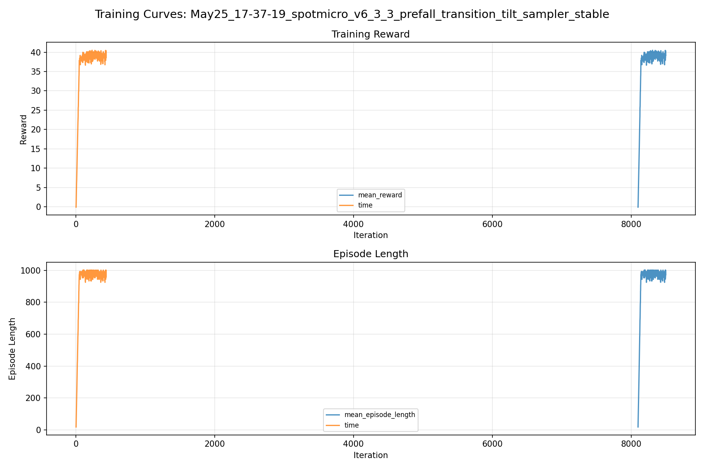
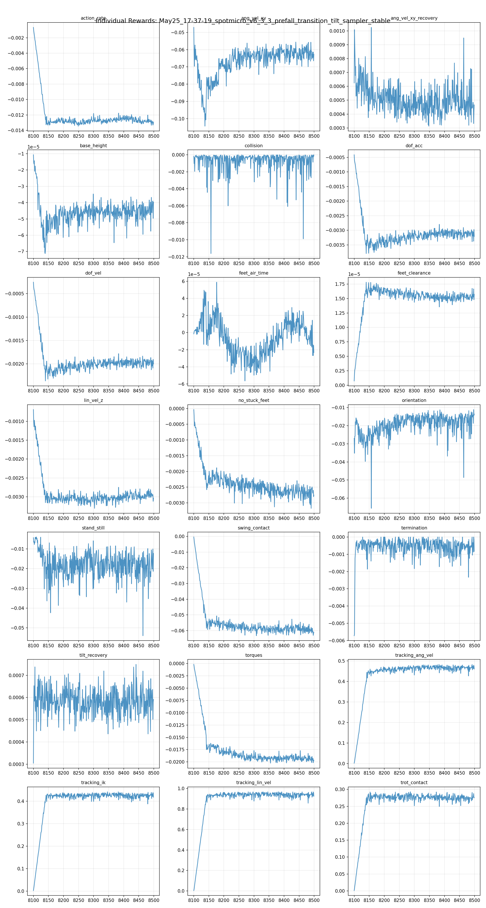
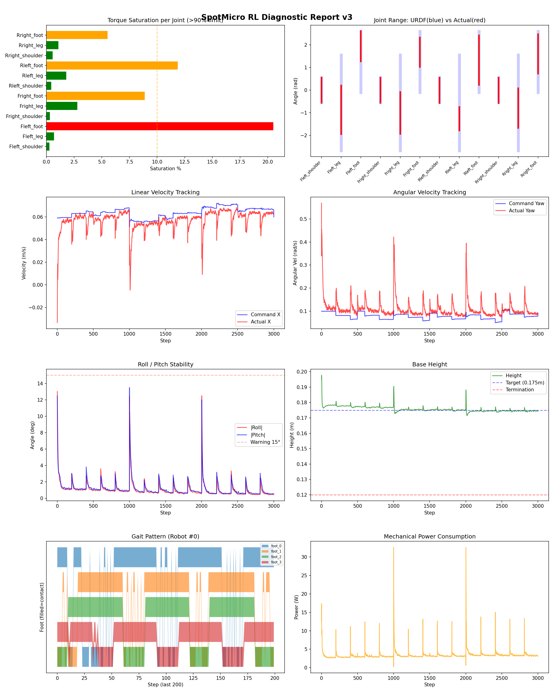
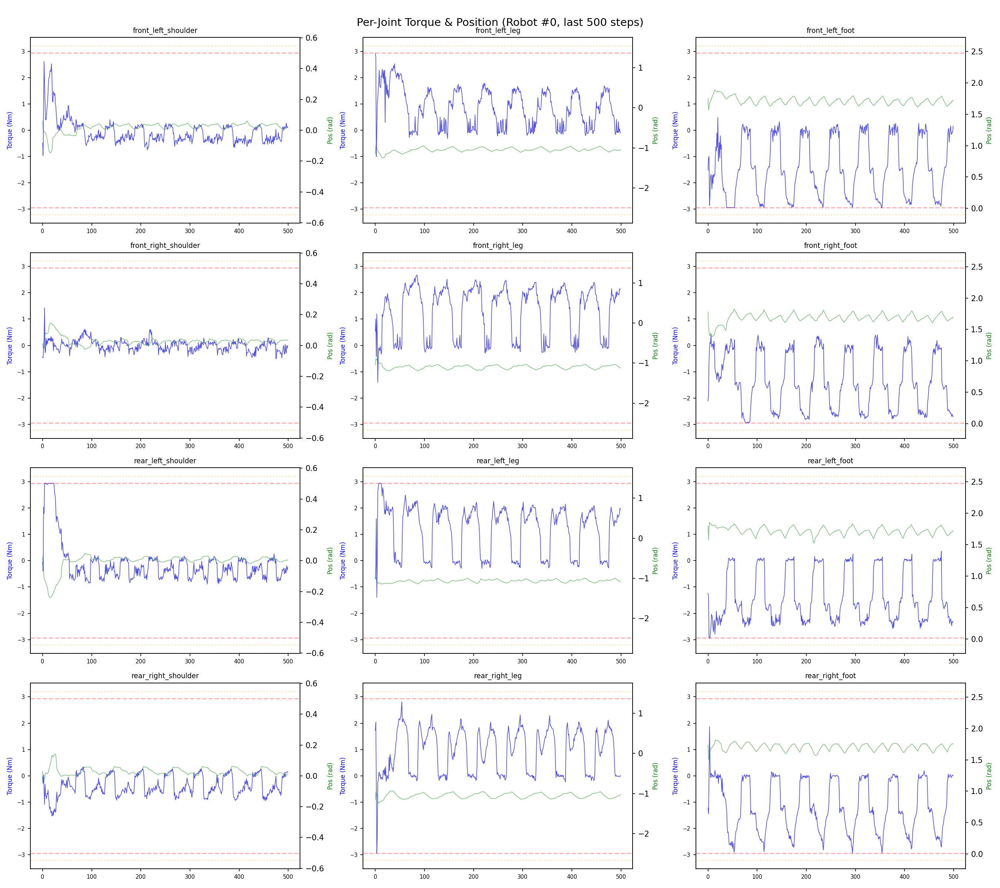
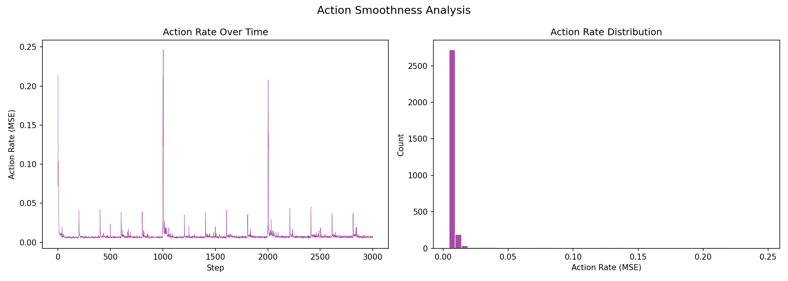

# 실험 083: spotmicro_v6_3_3_prefall_transition_tilt_sampler_stable

- **날짜:** 2026-05-25 17:48
- **Task:** spotmicro_test
- **Run name:** `spotmicro_v6_3_3_prefall_transition_tilt_sampler_stable`
- **판정:** ❌ FAIL (일부 기준 미달)

---

## 실험 목적

v6.3.3 : roll ang vel 감소 후 추가 학습

---

## 변경점 (이전 커밋 대비)

```diff
diff --git a/ai_training/rl/legged_gym/legged_gym/envs/spotmicro_test/spotmicro_test_config.py b/ai_training/rl/legged_gym/legged_gym/envs/spotmicro_test/spotmicro_test_config.py
index 86a5d45..63cd825 100644
--- a/ai_training/rl/legged_gym/legged_gym/envs/spotmicro_test/spotmicro_test_config.py
+++ b/ai_training/rl/legged_gym/legged_gym/envs/spotmicro_test/spotmicro_test_config.py
@@ -208,9 +208,9 @@ class SpotmicroTestCfg(LeggedRobotCfg):
         push_ang_vel_z_clip = 0.35
         transition_tilt_push = True
         transition_tilt_push_prob = 0.20
-        transition_tilt_push_min_deg = 22.0
-        transition_tilt_push_max_deg = 27.5
-        transition_tilt_push_ang_vel_xy = 0.35
+        transition_tilt_push_min_deg = 18.0
+        transition_tilt_push_max_deg = 27.0
+        transition_tilt_push_ang_vel_xy = 0.30
         transition_tilt_cmd_x_range = [0.05, 0.10]
         transition_tilt_zero_yaw_cmd = True
         action_delay = True
@@ -229,9 +229,9 @@ class SpotmicroTestCfgPPO(LeggedRobotCfgPPO):
         learning_rate = 1e-4
 
     class runner(LeggedRobotCfgPPO.runner):
-        run_name = 'spotmicro_v6_3_2_prefall_transition_tilt_sampler_focused'
+        run_name = 'spotmicro_v6_3_3_prefall_transition_tilt_sampler_stable'
         experiment_name = 'spotmicro_test'
-        max_iterations = 500
+        max_iterations = 400
         save_interval = 100
         resume = True
         load_run = "May25_16-41-52_spotmicro_v6_3_1_prefall_transition_tilt_sampler_soft"
```

**변경 요약:**
  - transition_tilt_push_min_deg = 22.0
  - transition_tilt_push_max_deg = 27.5
  - transition_tilt_push_ang_vel_xy = 0.35
  + transition_tilt_push_min_deg = 18.0
  + transition_tilt_push_max_deg = 27.0
  + transition_tilt_push_ang_vel_xy = 0.30
  - run_name = 'spotmicro_v6_3_2_prefall_transition_tilt_sampler_focused'
  + run_name = 'spotmicro_v6_3_3_prefall_transition_tilt_sampler_stable'
  - max_iterations = 500
  + max_iterations = 400

---

## 현재 Reward Scales

| Reward | Scale |
|--------|-------|
| action_rate | -0.05 |
| ang_vel_xy | -1.0 |
| ang_vel_xy_recovery | 0.5 |
| base_height | -2.0 |
| collision | -1.0 |
| dof_acc | -2.5e-07 |
| dof_vel | -0.0005 |
| feet_air_time | 0.04 |
| feet_clearance | 0.03 |
| lin_vel_z | -2.0 |
| no_stuck_feet | -0.2 |
| orientation | -10.0 |
| stand_still | -0.4 |
| swing_contact | -0.45 |
| termination | -20.0 |
| tilt_recovery | 4.0 |
| torques | -0.001 |
| tracking_ang_vel | 0.6 |
| tracking_ik | 0.6 |
| tracking_lin_vel | 1.0 |
| trot_contact | 0.35 |

---

## 진단 결과 (Diagnostic)

### 핵심 지표

- ⚠️ Timeout: 86.1% (60~90%, 보통)
- ✅ 속도오차 X: 0.0211 m/s (<0.08)
- ✅ 토크포화: 4.6% (<10%)
- ✅ 자세: roll 1.0°, pitch 1.2° (안정)
- ✅ 조기종료: 4.7% (<5%)
- ✅ 전환복구: 81.1% (≥80%)
- ✅ 18도+ pre-fall 복구: 77.1% (≥70%)
- ✅ Reset 25-30도 복구: 80.8% (≥75%, n=266)
- ⚠️ Transition 25-30도 복구: 56.9% (55~65%, n=58)

### 상세 수치

| 지표 | 값 |
|------|-----|
| Timeout% | 86.12521150592217 |
| 조기종료% | 4.737732656514383 |
| 속도오차 X | 0.021123921498656273 m/s |
| 속도오차 Y | 0.014234568923711777 m/s |
| 각속도오차 | 0.07041138410568237 rad/s |
| 토크포화% | 4.555871645715396 |
| 평균 높이 | 0.17574689002125174 m |
| Roll (평균) | 1.0384266376495361° |
| Pitch (평균) | 1.150658130645752° |
| Action Rate | 0.008322331123054028 |
| 평균 전력 | 3.383470058441162 W |
| CoT | 2.0785608662280213 |
| Recovery 성공률 | 89.30635838150289% |
| Recovery eligible trials | 692 |
| 평균 회복 시간 | 0.30459546244742414 s |
| Recovery 조기 실패율 | 3.7572254335260116% |
| Recovery 18도+ 성공률 | 87.52327746741155% |
| Recovery 18도+ trials | 537 |
| Recovery 18도+ horizon 후 tilt | 4.097892844629798° |
| Transition recovery 성공률 | 81.13207547169812% |
| Transition recovery eligible trials | 901 |
| 평균 Transition recovery 시간 | 0.10019151622839731 s |
| Transition 18도+ 성공률 | 77.13068181818183% |
| Transition 18도+ trials | 704 |
| Transition 18도+ horizon 후 tilt | 5.718710318287115° |

## Recovery Assist 분석

| 지표 | 값 |
|------|-----|
| 판정 | ✅ Recovery 안정적 |
| Recovery 성공률 | 89.3% |
| 성공/실패 | 618 / 74 |
| Eligible trials | 692 / 847 |
| 평균 회복 시간 | 0.305s |
| 조기 실패율 | 3.8% |
| 평가 horizon | 1.0 s |
| 초기 tilt 기준 | 12.000000000000002° |
| 안정 기준 | roll/pitch < 5.0°, height > 0.165m |
| 평균 초기 tilt | 22.42388026894189° |
| 평균 초기 roll/pitch | 16.990224107617024° / 17.02254837727048° |
| 1초 후 평균 roll/pitch | 2.701918998798142° / 2.57069482235995° |
| 1초 내 최대 roll/pitch 평균 | 18.24908973336909° / 18.1388552350805° |

> 해석: `Recovery 성공률`은 초기 tilt가 기준 이상인 episode 중 1초 내 안정 자세로 복귀한 비율입니다. 조기 실패율이 높으면 reset 직후 바로 넘어지는 것이고, 평균 회복 시간이 짧을수록 위기 대응이 빠른 것입니다.

### Recovery Tilt Band 분석

| Tilt 구간 | Trials | 성공률 | Horizon 후 평균 tilt | 평균 회복 시간 |
|-----------|--------|--------|----------------------|----------------|
| 12-18 deg | 155 | 95.5% | 1.97° | 0.18s |
| 18-25 deg | 271 | 94.1% | 2.08° | 0.28s |
| 25-30 deg | 266 | 80.8% | 6.15° | 0.41s |
| 30+ deg | 0 | N/A | N/A | N/A |
| 18+ deg 전체 | 537 | 87.5% | 4.10° | 0.34s |

> 이번 pre-fall 목표는 특히 `18-25 deg`, `25-30 deg`, `18+ deg 전체` 행을 우선 봅니다. `25-30 deg` trial이 없으면 30도 근처 회복 성능은 아직 검증되지 않은 것입니다.


## Transition Recovery 분석

| 지표 | 값 |
|------|-----|
| 판정 | ✅ 전환 복구 안정적 |
| Transition recovery 성공률 | 81.1% |
| 성공/실패 | 731 / 170 |
| Eligible trials | 901 / 3584 |
| 평균 회복 시간 | 0.100s |
| 조기 실패율 | 5.3% |
| 평가 horizon | 0.75 s |
| push 후 eligible 기준 | max roll/pitch > 12.000000000000002° |
| 안정 기준 | roll/pitch < 5.0°, height > 0.165m |
| 평균 최대 tilt | 21.92062760010685° |
| horizon 후 평균 roll/pitch | 2.873715989504278° / 3.8597276131542384° |

> 해석: `Transition Recovery`는 학습 중 push/roll-pitch angular impulse가 들어간 뒤 일정 시간 안에 자세가 안정 기준으로 돌아오는지를 봅니다.

### Transition Recovery Tilt Band 분석

| Tilt 구간 | Trials | 성공률 | Horizon 후 평균 tilt | 평균 회복 시간 |
|-----------|--------|--------|----------------------|----------------|
| 12-18 deg | 197 | 95.4% | 1.40° | 0.12s |
| 18-25 deg | 595 | 85.4% | 2.48° | 0.09s |
| 25-30 deg | 58 | 56.9% | 5.13° | 0.16s |
| 30+ deg | 51 | 3.9% | 44.14° | 0.55s |
| 18+ deg 전체 | 704 | 77.1% | 5.72° | 0.09s |

> 이번 pre-fall 목표는 특히 `18-25 deg`, `25-30 deg`, `18+ deg 전체` 행을 우선 봅니다. `25-30 deg` trial이 없으면 30도 근처 회복 성능은 아직 검증되지 않은 것입니다.


## Command Mode별 회전 추종 분석

| 모드 | 비율 | 샘플 수 | 평균 abs(cmd_wz) | 평균 abs(actual_wz) | yaw 오차 | 상태 |
|------|------|---------|------------------|---------------------|----------|------|
| 정지 | 7.9% | 60724 | 0.0267 | 0.0606 | 0.0582 | ⚠️ |
| 직진/저회전 | 55.2% | 424545 | 0.0453 | 0.0926 | 0.0741 | ✅ |
| 제자리 회전 | 8.3% | 63788 | 0.1733 | 0.1631 | 0.0686 | ✅ |
| 전진+회전 | 11.1% | 85189 | 0.1753 | 0.1770 | 0.0731 | ✅ |
| 큰 회전명령 | 0.0% | 0 | N/A | N/A | N/A | N/A |

> 해석 기준: `제자리 회전`만 나쁘면 pure turn 학습/보행 패턴 문제, `큰 회전명령`만 나쁘면 yaw 명령 범위가 현재 토크/보폭 한계보다 큰 문제, `정지`가 나쁘면 stop drift 문제로 보면 됩니다.
        


## 학습 곡선 분석

| 지표 | 값 | 판정 |
|------|-----|------|
| 수렴 iter (90%) | 8142 | 느림 |
| 후반 안정성 (CV) | 0.019 | 안정 |
| 정체 구간 | 없음 | |


## Per-leg 분석

### 발별 접촉/공중 비율

| 발 | 접촉% | 공중% |
|-----|-------|------|
| foot_0 | 76.8% | 23.2% |
| foot_1 | 75.5% | 24.5% |
| foot_2 | 70.6% | 29.4% |
| foot_3 | 66.9% | 33.1% |

### 관절별 토크 포화

| 관절 | 포화% | 최대토크 | 한계 | 상태 |
|------|------|---------|------|------|
| front_left_shoulder | 0.3% | 2.940 | 2.940 | ✅ |
| front_left_leg | 0.7% | 2.940 | 2.940 | ✅ |
| front_left_foot | 20.5% | 2.940 | 2.940 | ❌ |
| front_right_shoulder | 0.3% | 2.940 | 2.940 | ✅ |
| front_right_leg | 2.8% | 2.940 | 2.940 | ✅ |
| front_right_foot | 8.9% | 2.940 | 2.940 | ⚠️ |
| rear_left_shoulder | 0.4% | 2.940 | 2.940 | ✅ |
| rear_left_leg | 1.8% | 2.940 | 2.940 | ✅ |
| rear_left_foot | 11.9% | 2.940 | 2.940 | ⚠️ |
| rear_right_shoulder | 0.5% | 2.940 | 2.940 | ✅ |
| rear_right_leg | 1.1% | 2.940 | 2.940 | ✅ |
| rear_right_foot | 5.5% | 2.940 | 2.940 | ⚠️ |


## Gait 분석

| 지표 | 값 |
|------|-----|
| Gait 주파수 | 0.20 Hz |
| Gait 주기 | 61 steps |
| 대각 동기화율 | 87.4% |
| L/R 비대칭 | 0.0%p |
| 판정 | ✅ Trot 패턴 / ✅ 대칭 |


## 관절별 상세

| 관절 | 토크포화% | 사용범위% | 편향(rad) | 한계근접% | 상태 |
|------|----------|----------|----------|----------|------|
| front_left_shoulder | 0.3% | 101% | -0.007 | 0.1% | ✅ |
| front_left_leg | 0.7% | 51% | -0.869 | 0.0% | ⚠️ |
| front_left_foot | 20.5% | 50% | +1.936 | 0.0% | ⚠️ |
| front_right_shoulder | 0.3% | 101% | -0.006 | 0.1% | ✅ |
| front_right_leg | 2.8% | 44% | -1.004 | 0.0% | ⚠️ |
| front_right_foot | 8.9% | 48% | +1.668 | 0.0% | ⚠️ |
| rear_left_shoulder | 0.4% | 102% | -0.010 | 0.1% | ✅ |
| rear_left_leg | 1.8% | 25% | -1.262 | 0.0% | ⚠️ |
| rear_left_foot | 11.9% | 82% | +1.319 | 0.0% | ⚠️ |
| rear_right_shoulder | 0.5% | 102% | -0.011 | 0.2% | ✅ |
| rear_right_leg | 1.1% | 41% | -0.792 | 0.0% | ⚠️ |
| rear_right_foot | 5.5% | 65% | +1.596 | 0.1% | ⚠️ |


## 에너지 효율 상세

| 지표 | 값 |
|------|-----|
| 평균 전력 | 3.38 W |
| 피크 전력 | 32.63 W |
| 피크/평균 비율 | 9.6x |
| CoT | 2.08 |

### 관절별 전력 분배

| 관절 | 평균전력(W) | 비율% |
|------|-----------|-------|
| front_left_foot | 0.571 | 16.9% |
| rear_left_foot | 0.508 | 15.0% |
| front_right_foot | 0.477 | 14.1% |
| rear_right_foot | 0.463 | 13.7% |
| front_right_leg | 0.355 | 10.5% |
| front_left_leg | 0.280 | 8.3% |
| rear_right_leg | 0.261 | 7.7% |
| rear_left_leg | 0.254 | 7.5% |
| rear_right_shoulder | 0.069 | 2.0% |
| front_right_shoulder | 0.053 | 1.6% |
| rear_left_shoulder | 0.051 | 1.5% |
| front_left_shoulder | 0.042 | 1.2% |


## 이전 실험 대비 비교

| 지표 | 이전 (exp082) | 현재 (exp083) | 변화 |
|------|-------|-------|------|
| Timeout% | 79.3% | 86.1% | ✅ ↑ 6.8203% |
| 속도오차 X | 0.0218 | 0.0211 | ✅ ↓ 0.0007m/s |
| 토크포화 | 4.9% | 4.6% | ✅ ↓ 0.3147% |
| Roll | 1.2° | 1.0° | ✅ ↓ 0.1139° |
| Pitch | 1.3° | 1.2° | ✅ ↓ 0.1219° |
| 평균 전력 | 3.5538W | 3.3835W | ✅ ↓ 0.1703W |


## Tensorboard 학습 곡선 요약

| 스칼라 | 최종값 | 최대 | 최소 | 후반10% 평균 |
|--------|--------|------|------|-------------|
| rew_action_rate | -0.0129 | -0.0007 | -0.0134 | -0.0129 |
| rew_ang_vel_xy | -0.0627 | -0.0472 | -0.1043 | -0.0617 |
| rew_ang_vel_xy_recovery | 0.0005 | 0.0010 | 0.0003 | 0.0005 |
| rew_base_height | -0.0000 | -0.0000 | -0.0001 | -0.0000 |
| rew_collision | -0.0000 | 0.0000 | -0.0116 | -0.0009 |
| rew_dof_acc | -0.0032 | -0.0004 | -0.0038 | -0.0031 |
| rew_dof_vel | -0.0020 | -0.0003 | -0.0024 | -0.0020 |
| rew_feet_air_time | -0.0000 | 0.0001 | -0.0001 | -0.0000 |
| rew_feet_clearance | 0.0000 | 0.0000 | 0.0000 | 0.0000 |
| rew_lin_vel_z | -0.0030 | -0.0007 | -0.0033 | -0.0030 |
| rew_no_stuck_feet | -0.0028 | -0.0000 | -0.0032 | -0.0027 |
| rew_orientation | -0.0136 | -0.0111 | -0.0656 | -0.0174 |
| rew_stand_still | -0.0123 | -0.0040 | -0.0539 | -0.0193 |
| rew_swing_contact | -0.0611 | -0.0004 | -0.0632 | -0.0596 |
| rew_termination | -0.0008 | 0.0000 | -0.0057 | -0.0006 |
| rew_tilt_recovery | 0.0006 | 0.0007 | 0.0003 | 0.0006 |
| rew_torques | -0.0197 | -0.0002 | -0.0202 | -0.0194 |
| rew_tracking_ang_vel | 0.4604 | 0.4826 | 0.0018 | 0.4671 |
| rew_tracking_ik | 0.4176 | 0.4415 | 0.0029 | 0.4255 |
| rew_tracking_lin_vel | 0.9253 | 0.9677 | 0.0045 | 0.9401 |
| rew_trot_contact | 0.2753 | 0.2928 | 0.0013 | 0.2746 |
| learning_rate | 0.0002 | 0.0003 | 0.0000 | 0.0001 |
| surrogate | -0.0027 | 0.0026 | -0.0045 | -0.0027 |
| value_function | 0.0036 | 0.0574 | 0.0014 | 0.0030 |
| collection time | 0.8001 | 0.8877 | 0.7435 | 0.7824 |
| learning_time | 0.2825 | 0.3346 | 0.2766 | 0.2849 |
| total_fps | 90806.0000 | 95891.0000 | 83924.0000 | 92126.1750 |
| mean_noise_std | 0.0750 | 0.0772 | 0.0722 | 0.0747 |
| mean_episode_length | 972.5800 | 1002.0000 | 17.8600 | 973.9893 |
| time | 972.5800 | 1002.0000 | 17.8600 | 973.9893 |
| mean_reward | 39.1478 | 40.5108 | -0.1064 | 39.0364 |
| time | 39.1478 | 40.5108 | -0.1064 | 39.0364 |

총 학습 iteration: 8499


---

## 그래프

### Tensorboard 학습 곡선



### Diagnostic 결과





---

## 결론 및 다음 실험 방향

**자동 판정:** ❌ FAIL (일부 기준 미달)

대부분 기준을 통과했으나 일부 항목이 보통 수준입니다.
  - ⚠️ Timeout: 86.1% (60~90%, 보통)
  - ⚠️ Transition 25-30도 복구: 56.9% (55~65%, n=58)

> 💡 위 결론은 자동 생성되었습니다. 필요시 수정하세요.

---

## 메모

_(추가 메모가 있으면 여기에 작성)_

