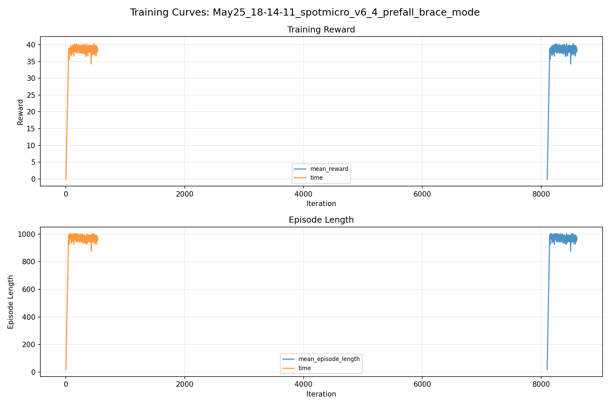
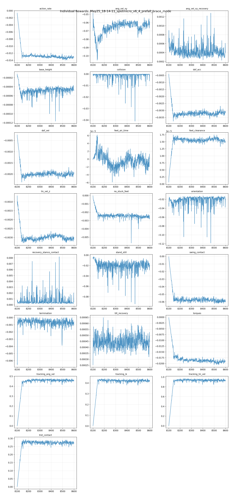
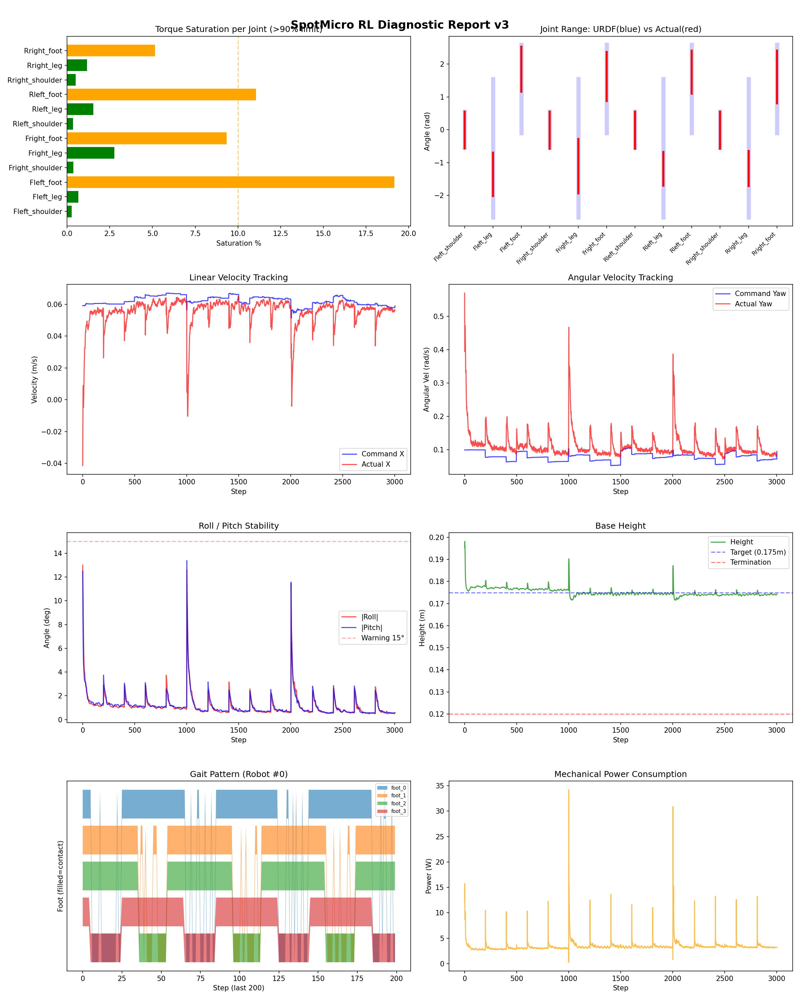
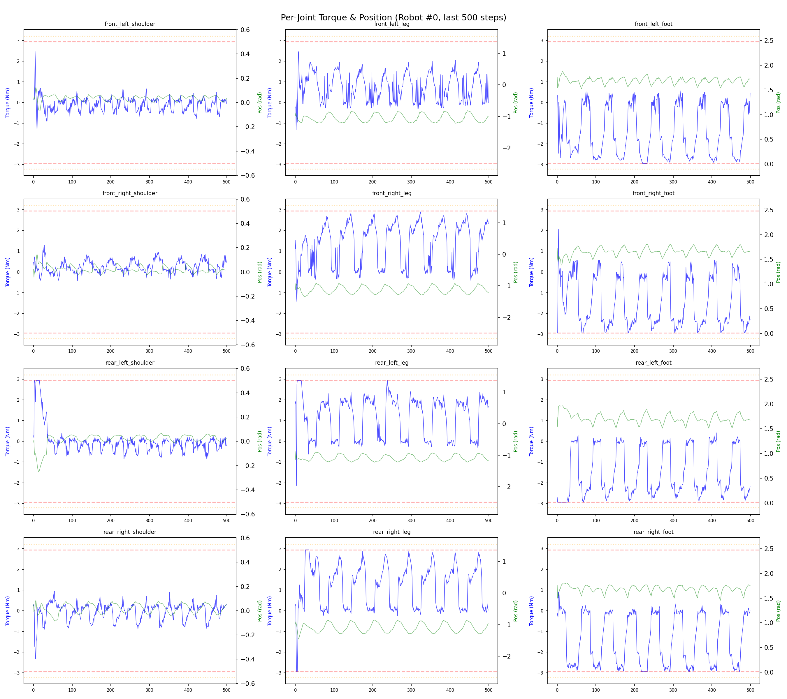
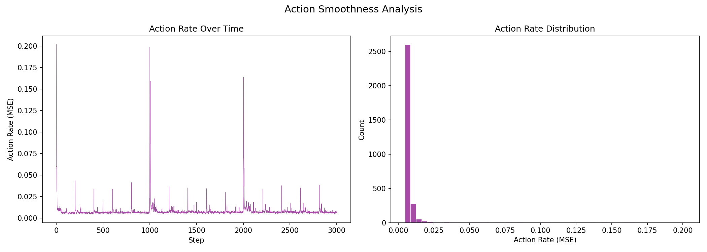

# 실험 084: spotmicro_v6_4_prefall_brace_mode

- **날짜:** 2026-05-25 18:26
- **Task:** spotmicro_test
- **Run name:** `spotmicro_v6_4_prefall_brace_mode`
- **판정:** ❌ FAIL (일부 기준 미달)

---

## 실험 목적

v6.4 : brace mode

---

## 변경점 (이전 커밋 대비)

```diff
diff --git a/ai_training/rl/legged_gym/legged_gym/envs/spotmicro_test/spotmicro_test.py b/ai_training/rl/legged_gym/legged_gym/envs/spotmicro_test/spotmicro_test.py
index 5ebf8e8..a5b7a03 100644
--- a/ai_training/rl/legged_gym/legged_gym/envs/spotmicro_test/spotmicro_test.py
+++ b/ai_training/rl/legged_gym/legged_gym/envs/spotmicro_test/spotmicro_test.py
@@ -985,3 +985,8 @@ class SpotmicroTest(LeggedRobot):
         ang_vel_xy = torch.norm(self.base_ang_vel[:, :2], dim=1)
         damping = torch.clamp(self.last_ang_vel_xy_metric - ang_vel_xy, min=0.0, max=0.5)
         return damping * mask
+
+    def _reward_recovery_stance_contact(self):
+        contact = (self.contact_forces[:, self.feet_indices, 2] > 1.0).float()
+        contact_ratio = torch.mean(contact, dim=1)
+        return contact_ratio * self._recovery_blend()
diff --git a/ai_training/rl/legged_gym/legged_gym/envs/spotmicro_test/spotmicro_test_config.py b/ai_training/rl/legged_gym/legged_gym/envs/spotmicro_test/spotmicro_test_config.py
index 63cd825..a13c0f8 100644
--- a/ai_training/rl/legged_gym/legged_gym/envs/spotmicro_test/spotmicro_test_config.py
+++ b/ai_training/rl/legged_gym/legged_gym/envs/spotmicro_test/spotmicro_test_config.py
@@ -81,12 +81,12 @@ class SpotmicroTestCfg(LeggedRobotCfg):
 
     class recovery:
         enabled = True
-        tilt_threshold_deg = 14.0
-        full_tilt_deg = 25.0
+        tilt_threshold_deg = 17.0
+        full_tilt_deg = 27.0
         command_scale_enabled = True
-        command_scale = 0.15
+        command_scale = 0.0
         phase_enabled = True
-        phase_scale = 0.1
+        phase_scale = 0.0
         phase_freeze = False
         action_scale_enabled = True
 
@@ -131,15 +131,16 @@ class SpotmicroTestCfg(LeggedRobotCfg):
             stand_still = -0.4
             tilt_recovery = 4.0
             ang_vel_xy_recovery = 0.5
+            recovery_stance_contact = 0.25
         soft_dof_pos_limit = 0.9
         base_height_target = 0.175
         min_base_height = 0.13
         max_base_tilt_deg = 50.0
         recovery_min_height = 0.165
-        recovery_reward_tilt_threshold_deg = 12.0
+        recovery_reward_tilt_threshold_deg = 15.0
         recovery_diagnostic_initial_tilt_threshold_deg = 12.0
-        recovery_relief_tilt_threshold_deg = 14.0
-        recovery_relief_full_tilt_deg = 25.0
+        recovery_relief_tilt_threshold_deg = 17.0
+        recovery_relief_full_tilt_deg = 27.0
         recovery_gait_relief_scale = 0.65
         recovery_ik_relief_scale = 0.65
         transition_recovery_horizon_s = 0.75
@@ -229,9 +230,9 @@ class SpotmicroTestCfgPPO(LeggedRobotCfgPPO):
         learning_rate = 1e-4
 
     class runner(LeggedRobotCfgPPO.runner):
-        run_name = 'spotmicro_v6_3_3_prefall_transition_tilt_sampler_stable'
+        run_name = 'spotmicro_v6_4_prefall_brace_mode'
         experiment_name = 'spotmicro_test'
-        max_iterations = 400
+        max_iterations = 500
         save_interval = 100
         r
```

**변경 요약:**
  + def _reward_recovery_stance_contact(self):
  + contact = (self.contact_forces[:, self.feet_indices, 2] > 1.0).float()
  + contact_ratio = torch.mean(contact, dim=1)
  + return contact_ratio * self._recovery_blend()
  - tilt_threshold_deg = 14.0
  - full_tilt_deg = 25.0
  + tilt_threshold_deg = 17.0
  + full_tilt_deg = 27.0
  - command_scale = 0.15
  + command_scale = 0.0
  - phase_scale = 0.1
  + phase_scale = 0.0
  + recovery_stance_contact = 0.25
  - recovery_reward_tilt_threshold_deg = 12.0
  + recovery_reward_tilt_threshold_deg = 15.0
  - recovery_relief_tilt_threshold_deg = 14.0
  - recovery_relief_full_tilt_deg = 25.0
  + recovery_relief_tilt_threshold_deg = 17.0
  + recovery_relief_full_tilt_deg = 27.0
  - run_name = 'spotmicro_v6_3_3_prefall_transition_tilt_sampler_stable'
  + run_name = 'spotmicro_v6_4_prefall_brace_mode'
  - max_iterations = 400
  + max_iterations = 500

---

## 현재 Reward Scales

| Reward | Scale |
|--------|-------|
| action_rate | -0.05 |
| ang_vel_xy | -1.0 |
| ang_vel_xy_recovery | 0.5 |
| base_height | -2.0 |
| collision | -1.0 |
| dof_acc | -2.5e-07 |
| dof_vel | -0.0005 |
| feet_air_time | 0.04 |
| feet_clearance | 0.03 |
| lin_vel_z | -2.0 |
| no_stuck_feet | -0.2 |
| orientation | -10.0 |
| recovery_stance_contact | 0.25 |
| stand_still | -0.4 |
| swing_contact | -0.45 |
| termination | -20.0 |
| tilt_recovery | 4.0 |
| torques | -0.001 |
| tracking_ang_vel | 0.6 |
| tracking_ik | 0.6 |
| tracking_lin_vel | 1.0 |
| trot_contact | 0.35 |

---

## 진단 결과 (Diagnostic)

### 핵심 지표

- ⚠️ Timeout: 82.1% (60~90%, 보통)
- ✅ 속도오차 X: 0.0209 m/s (<0.08)
- ✅ 토크포화: 4.4% (<10%)
- ✅ 자세: roll 1.1°, pitch 1.2° (안정)
- ⚠️ 조기종료: 5.6% (5~20%)
- ⚠️ 전환복구: 78.3% (50~80%)
- ✅ 18도+ pre-fall 복구: 72.3% (≥70%)
- ⚠️ Reset 25-30도 복구: 72.5% (65~75%, n=280)
- ❌ Transition 25-30도 복구: 49.3% (<55%, n=73)

### 상세 수치

| 지표 | 값 |
|------|-----|
| Timeout% | 82.09677419354838 |
| 조기종료% | 5.64516129032258 |
| 속도오차 X | 0.020926350727677345 m/s |
| 속도오차 Y | 0.01552432682365179 m/s |
| 각속도오차 | 0.07208202034235 rad/s |
| 토크포화% | 4.358564612470863 |
| 평균 높이 | 0.17517272823856467 m |
| Roll (평균) | 1.1449962854385376° |
| Pitch (평균) | 1.177804946899414° |
| Action Rate | 0.008114405907690525 |
| 평균 전력 | 3.431251049041748 W |
| CoT | 2.1542028121009995 |
| Recovery 성공률 | 86.10729023383769% |
| Recovery eligible trials | 727 |
| 평균 회복 시간 | 0.3079552646821585 s |
| Recovery 조기 실패율 | 4.676753782668501% |
| Recovery 18도+ 성공률 | 82.57713248638838% |
| Recovery 18도+ trials | 551 |
| Recovery 18도+ horizon 후 tilt | 5.179148795965471° |
| Transition recovery 성공률 | 78.29977628635348% |
| Transition recovery eligible trials | 894 |
| 평균 Transition recovery 시간 | 0.10362856911229236 s |
| Transition 18도+ 성공률 | 72.32796486090776% |
| Transition 18도+ trials | 683 |
| Transition 18도+ horizon 후 tilt | 6.523254609409049° |

## Recovery Assist 분석

| 지표 | 값 |
|------|-----|
| 판정 | ✅ Recovery 안정적 |
| Recovery 성공률 | 86.1% |
| 성공/실패 | 626 / 101 |
| Eligible trials | 727 / 875 |
| 평균 회복 시간 | 0.308s |
| 조기 실패율 | 4.7% |
| 평가 horizon | 1.0 s |
| 초기 tilt 기준 | 12.000000000000002° |
| 안정 기준 | roll/pitch < 5.0°, height > 0.165m |
| 평균 초기 tilt | 22.347028634943307° |
| 평균 초기 roll/pitch | 17.075213275186165° / 16.810236760456682° |
| 1초 후 평균 roll/pitch | 3.552366097293092° / 3.0063902453738462° |
| 1초 내 최대 roll/pitch 평균 | 18.628631877440043° / 18.274450687463542° |

> 해석: `Recovery 성공률`은 초기 tilt가 기준 이상인 episode 중 1초 내 안정 자세로 복귀한 비율입니다. 조기 실패율이 높으면 reset 직후 바로 넘어지는 것이고, 평균 회복 시간이 짧을수록 위기 대응이 빠른 것입니다.

### Recovery Tilt Band 분석

| Tilt 구간 | Trials | 성공률 | Horizon 후 평균 tilt | 평균 회복 시간 |
|-----------|--------|--------|----------------------|----------------|
| 12-18 deg | 176 | 97.2% | 1.84° | 0.20s |
| 18-25 deg | 271 | 93.0% | 2.11° | 0.29s |
| 25-30 deg | 280 | 72.5% | 8.15° | 0.43s |
| 30+ deg | 0 | N/A | N/A | N/A |
| 18+ deg 전체 | 551 | 82.6% | 5.18° | 0.35s |

> 이번 pre-fall 목표는 특히 `18-25 deg`, `25-30 deg`, `18+ deg 전체` 행을 우선 봅니다. `25-30 deg` trial이 없으면 30도 근처 회복 성능은 아직 검증되지 않은 것입니다.


## Transition Recovery 분석

| 지표 | 값 |
|------|-----|
| 판정 | ⚠️ 일부 전환 복구 가능 |
| Transition recovery 성공률 | 78.3% |
| 성공/실패 | 700 / 194 |
| Eligible trials | 894 / 3584 |
| 평균 회복 시간 | 0.104s |
| 조기 실패율 | 6.5% |
| 평가 horizon | 0.75 s |
| push 후 eligible 기준 | max roll/pitch > 12.000000000000002° |
| 안정 기준 | roll/pitch < 5.0°, height > 0.165m |
| 평균 최대 tilt | 22.057052268403986° |
| horizon 후 평균 roll/pitch | 3.8266146055785253° / 3.967550473782532° |

> 해석: `Transition Recovery`는 학습 중 push/roll-pitch angular impulse가 들어간 뒤 일정 시간 안에 자세가 안정 기준으로 돌아오는지를 봅니다.

### Transition Recovery Tilt Band 분석

| Tilt 구간 | Trials | 성공률 | Horizon 후 평균 tilt | 평균 회복 시간 |
|-----------|--------|--------|----------------------|----------------|
| 12-18 deg | 211 | 97.6% | 1.44° | 0.12s |
| 18-25 deg | 555 | 82.2% | 2.82° | 0.08s |
| 25-30 deg | 73 | 49.3% | 6.92° | 0.22s |
| 30+ deg | 55 | 3.6% | 43.36° | 0.62s |
| 18+ deg 전체 | 683 | 72.3% | 6.52° | 0.10s |

> 이번 pre-fall 목표는 특히 `18-25 deg`, `25-30 deg`, `18+ deg 전체` 행을 우선 봅니다. `25-30 deg` trial이 없으면 30도 근처 회복 성능은 아직 검증되지 않은 것입니다.


## Command Mode별 회전 추종 분석

| 모드 | 비율 | 샘플 수 | 평균 abs(cmd_wz) | 평균 abs(actual_wz) | yaw 오차 | 상태 |
|------|------|---------|------------------|---------------------|----------|------|
| 정지 | 8.6% | 66145 | 0.0242 | 0.0596 | 0.0569 | ⚠️ |
| 직진/저회전 | 54.7% | 420682 | 0.0477 | 0.0973 | 0.0770 | ✅ |
| 제자리 회전 | 9.1% | 70224 | 0.1754 | 0.1700 | 0.0686 | ✅ |
| 전진+회전 | 9.9% | 76078 | 0.1739 | 0.1747 | 0.0734 | ✅ |
| 큰 회전명령 | 0.0% | 0 | N/A | N/A | N/A | N/A |

> 해석 기준: `제자리 회전`만 나쁘면 pure turn 학습/보행 패턴 문제, `큰 회전명령`만 나쁘면 yaw 명령 범위가 현재 토크/보폭 한계보다 큰 문제, `정지`가 나쁘면 stop drift 문제로 보면 됩니다.
        


## 학습 곡선 분석

| 지표 | 값 | 판정 |
|------|-----|------|
| 수렴 iter (90%) | 8141 | 느림 |
| 후반 안정성 (CV) | 0.021 | 안정 |
| 정체 구간 | 없음 | |


## Per-leg 분석

### 발별 접촉/공중 비율

| 발 | 접촉% | 공중% |
|-----|-------|------|
| foot_0 | 75.9% | 24.1% |
| foot_1 | 76.1% | 23.9% |
| foot_2 | 69.5% | 30.5% |
| foot_3 | 67.5% | 32.5% |

### 관절별 토크 포화

| 관절 | 포화% | 최대토크 | 한계 | 상태 |
|------|------|---------|------|------|
| front_left_shoulder | 0.3% | 2.940 | 2.940 | ✅ |
| front_left_leg | 0.7% | 2.940 | 2.940 | ✅ |
| front_left_foot | 19.2% | 2.940 | 2.940 | ⚠️ |
| front_right_shoulder | 0.4% | 2.940 | 2.940 | ✅ |
| front_right_leg | 2.8% | 2.940 | 2.940 | ✅ |
| front_right_foot | 9.3% | 2.940 | 2.940 | ⚠️ |
| rear_left_shoulder | 0.4% | 2.940 | 2.940 | ✅ |
| rear_left_leg | 1.5% | 2.940 | 2.940 | ✅ |
| rear_left_foot | 11.1% | 2.940 | 2.940 | ⚠️ |
| rear_right_shoulder | 0.5% | 2.940 | 2.940 | ✅ |
| rear_right_leg | 1.2% | 2.940 | 2.940 | ✅ |
| rear_right_foot | 5.1% | 2.940 | 2.940 | ⚠️ |


## Gait 분석

| 지표 | 값 |
|------|-----|
| Gait 주파수 | 0.21 Hz |
| Gait 주기 | 58 steps |
| 대각 동기화율 | 90.3% |
| L/R 비대칭 | 0.0%p |
| 판정 | ✅ Trot 패턴 / ✅ 대칭 |


## 관절별 상세

| 관절 | 토크포화% | 사용범위% | 편향(rad) | 한계근접% | 상태 |
|------|----------|----------|----------|----------|------|
| front_left_shoulder | 0.3% | 102% | -0.008 | 0.1% | ✅ |
| front_left_leg | 0.7% | 31% | -1.356 | 0.0% | ⚠️ |
| front_left_foot | 19.2% | 51% | +1.845 | 0.0% | ⚠️ |
| front_right_shoulder | 0.4% | 103% | -0.013 | 0.1% | ✅ |
| front_right_leg | 2.8% | 39% | -1.106 | 0.0% | ⚠️ |
| front_right_foot | 9.3% | 56% | +1.623 | 0.0% | ⚠️ |
| rear_left_shoulder | 0.4% | 102% | -0.012 | 0.1% | ✅ |
| rear_left_leg | 1.5% | 24% | -1.187 | 0.0% | ⚠️ |
| rear_left_foot | 11.1% | 48% | +1.757 | 0.0% | ⚠️ |
| rear_right_shoulder | 0.5% | 102% | -0.011 | 0.2% | ✅ |
| rear_right_leg | 1.2% | 25% | -1.181 | 0.0% | ⚠️ |
| rear_right_foot | 5.1% | 59% | +1.610 | 0.0% | ⚠️ |


## 에너지 효율 상세

| 지표 | 값 |
|------|-----|
| 평균 전력 | 3.43 W |
| 피크 전력 | 34.21 W |
| 피크/평균 비율 | 10.0x |
| CoT | 2.15 |

### 관절별 전력 분배

| 관절 | 평균전력(W) | 비율% |
|------|-----------|-------|
| front_left_foot | 0.604 | 17.6% |
| front_right_foot | 0.496 | 14.4% |
| rear_left_foot | 0.489 | 14.2% |
| rear_right_foot | 0.487 | 14.2% |
| front_right_leg | 0.338 | 9.8% |
| rear_right_leg | 0.275 | 8.0% |
| front_left_leg | 0.274 | 8.0% |
| rear_left_leg | 0.253 | 7.4% |
| rear_right_shoulder | 0.064 | 1.9% |
| front_right_shoulder | 0.054 | 1.6% |
| rear_left_shoulder | 0.053 | 1.5% |
| front_left_shoulder | 0.045 | 1.3% |


## 이전 실험 대비 비교

| 지표 | 이전 (exp083) | 현재 (exp084) | 변화 |
|------|-------|-------|------|
| Timeout% | 86.1% | 82.1% | ⚠️ ↓ 4.0284% |
| 속도오차 X | 0.0211 | 0.0209 | ✅ ↓ 0.0002m/s |
| 토크포화 | 4.6% | 4.4% | ✅ ↓ 0.1973% |
| Roll | 1.0° | 1.1° | ⚠️ ↑ 0.1066° |
| Pitch | 1.2° | 1.2° | ⚠️ ↑ 0.0271° |
| 평균 전력 | 3.3835W | 3.4313W | ⚠️ ↑ 0.0478W |


## Tensorboard 학습 곡선 요약

| 스칼라 | 최종값 | 최대 | 최소 | 후반10% 평균 |
|--------|--------|------|------|-------------|
| rew_action_rate | -0.0132 | -0.0007 | -0.0140 | -0.0131 |
| rew_ang_vel_xy | -0.0627 | -0.0485 | -0.1053 | -0.0616 |
| rew_ang_vel_xy_recovery | 0.0004 | 0.0013 | 0.0002 | 0.0004 |
| rew_base_height | -0.0000 | -0.0000 | -0.0001 | -0.0000 |
| rew_collision | -0.0015 | 0.0000 | -0.0410 | -0.0010 |
| rew_dof_acc | -0.0031 | -0.0004 | -0.0038 | -0.0031 |
| rew_dof_vel | -0.0019 | -0.0003 | -0.0024 | -0.0020 |
| rew_feet_air_time | 0.0000 | 0.0001 | -0.0001 | -0.0000 |
| rew_feet_clearance | 0.0000 | 0.0000 | 0.0000 | 0.0000 |
| rew_lin_vel_z | -0.0031 | -0.0007 | -0.0033 | -0.0031 |
| rew_no_stuck_feet | -0.0028 | -0.0000 | -0.0057 | -0.0025 |
| rew_orientation | -0.0200 | -0.0119 | -0.1183 | -0.0188 |
| rew_recovery_stance_contact | 0.0006 | 0.0082 | 0.0002 | 0.0005 |
| rew_stand_still | -0.0189 | -0.0030 | -0.0939 | -0.0200 |
| rew_swing_contact | -0.0601 | -0.0004 | -0.0627 | -0.0588 |
| rew_termination | -0.0006 | 0.0000 | -0.0066 | -0.0007 |
| rew_tilt_recovery | 0.0005 | 0.0006 | 0.0003 | 0.0004 |
| rew_torques | -0.0190 | -0.0002 | -0.0206 | -0.0192 |
| rew_tracking_ang_vel | 0.4630 | 0.4779 | 0.0017 | 0.4587 |
| rew_tracking_ik | 0.4273 | 0.4413 | 0.0028 | 0.4209 |
| rew_tracking_lin_vel | 0.9387 | 0.9685 | 0.0042 | 0.9301 |
| rew_trot_contact | 0.2751 | 0.2940 | 0.0012 | 0.2725 |
| learning_rate | 0.0002 | 0.0002 | 0.0000 | 0.0001 |
| surrogate | -0.0039 | 0.0008 | -0.0048 | -0.0027 |
| value_function | 0.0031 | 0.0714 | 0.0013 | 0.0033 |
| collection time | 0.7797 | 0.8623 | 0.7295 | 0.7728 |
| learning_time | 0.3110 | 0.3551 | 0.2736 | 0.2847 |
| total_fps | 90134.0000 | 97137.0000 | 83551.0000 | 92989.7200 |
| mean_noise_std | 0.0777 | 0.0780 | 0.0720 | 0.0772 |
| mean_episode_length | 973.5500 | 1002.0000 | 17.3500 | 967.3956 |
| time | 973.5500 | 1002.0000 | 17.3500 | 967.3956 |
| mean_reward | 38.8081 | 40.3376 | -0.1030 | 38.5621 |
| time | 38.8081 | 40.3376 | -0.1030 | 38.5621 |

총 학습 iteration: 8599


---

## 그래프

### Tensorboard 학습 곡선



### Diagnostic 결과





---

## 결론 및 다음 실험 방향

**자동 판정:** ❌ FAIL (일부 기준 미달)

일부 기준을 통과하지 못했습니다. 조정이 필요합니다.
  - ❌ Transition 25-30도 복구: 49.3% (<55%, n=73)

> 💡 위 결론은 자동 생성되었습니다. 필요시 수정하세요.

---

## 메모

_(추가 메모가 있으면 여기에 작성)_

