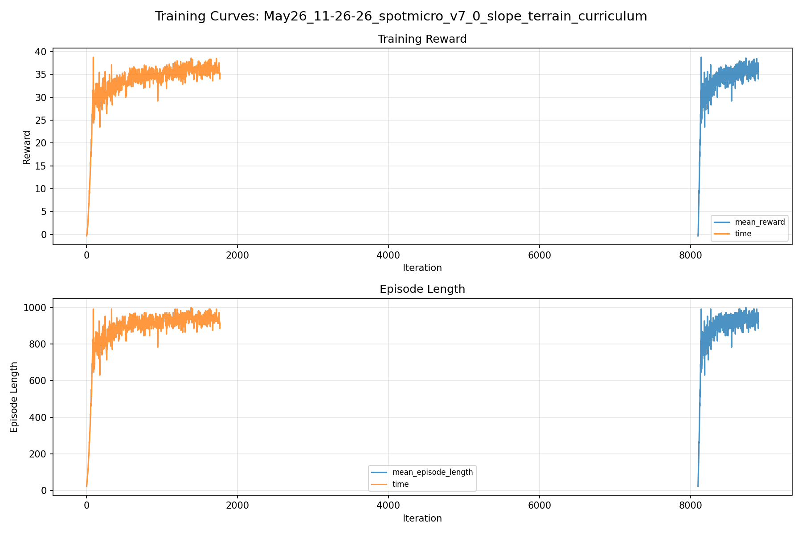
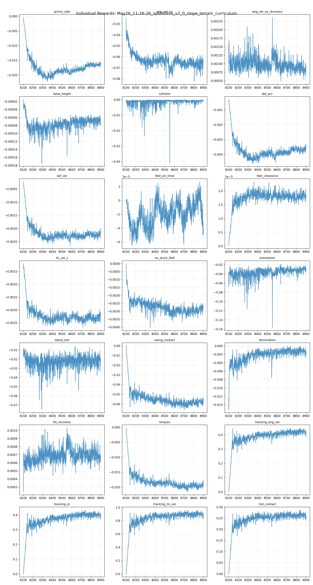
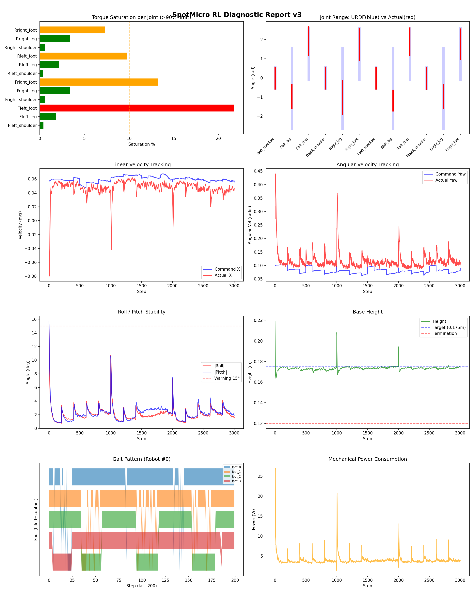
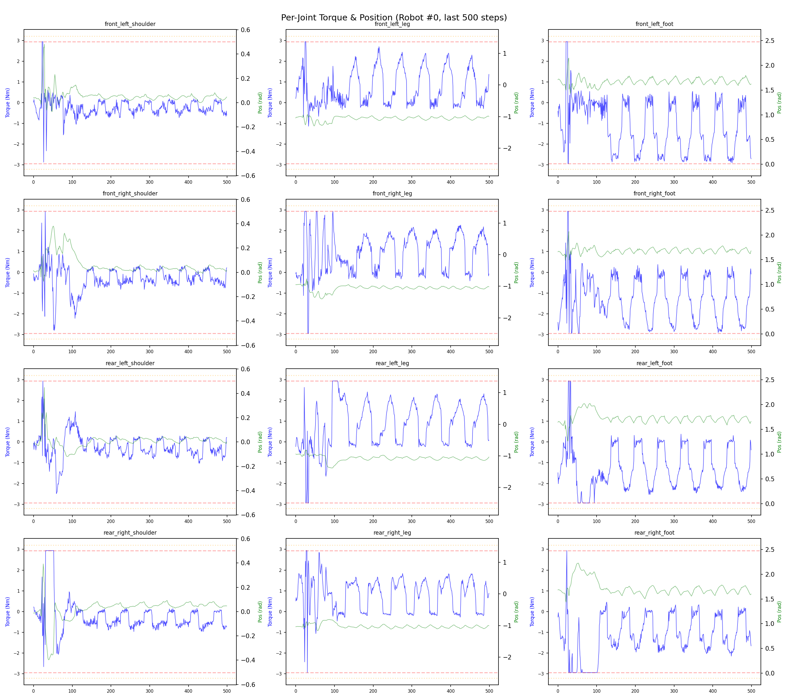
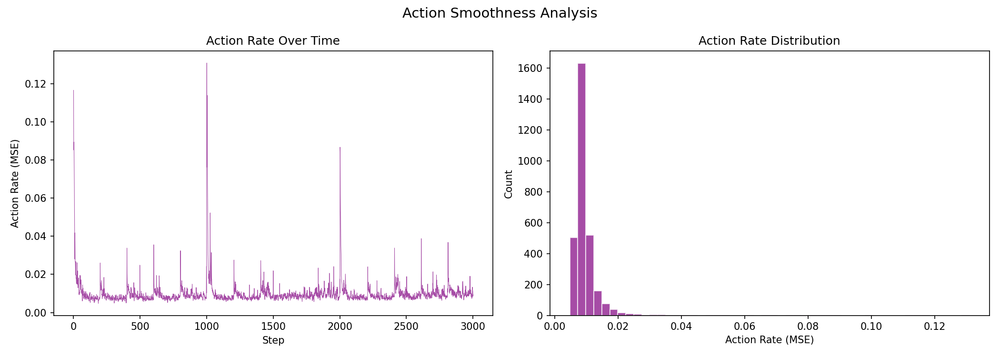

# 실험 085: spotmicro_v7_0_slope_terrain_curriculum

- **날짜:** 2026-05-26 11:59
- **Task:** spotmicro_test
- **Run name:** `spotmicro_v7_0_slope_terrain_curriculum`
- **판정:** ❌ FAIL (일부 기준 미달)

---

## 실험 목적

v7.0: 지형 학습 시작

---

## 변경점 (이전 커밋 대비)

```diff
diff --git a/ai_training/rl/experiment_report.py b/ai_training/rl/experiment_report.py
index 3c6b10c..363a7e0 100644
--- a/ai_training/rl/experiment_report.py
+++ b/ai_training/rl/experiment_report.py
@@ -454,6 +454,7 @@ def auto_judge(metrics, run_name='', recovery_data=None, transition_recovery_dat
         or bool(recovery_data)
         or bool(transition_recovery_data)
     )
+    terrain_mode = 'terrain' in run_name or 'slope' in run_name
 
     timeout = metrics.get('timeout_pct', 0)
     timeout_pass = 95 if prefall_mode else 80
@@ -491,12 +492,23 @@ def auto_judge(metrics, run_name='', recovery_data=None, transition_recovery_dat
 
     roll = metrics.get('mean_roll_deg', 0)
     pitch = metrics.get('mean_pitch_deg', 0)
-    if roll < 8 and pitch < 8:
-        judgments.append(f"✅ 자세: roll {roll:.1f}°, pitch {pitch:.1f}° (안정)")
-    elif roll < 15 and pitch < 15:
-        judgments.append(f"⚠️ 자세: roll {roll:.1f}°, pitch {pitch:.1f}° (보통)")
+    posture_pass = 10 if terrain_mode else 8
+    posture_warn = 18 if terrain_mode else 15
+    if roll < posture_pass and pitch < posture_pass:
+        judgments.append(
+            f"✅ 자세: roll {roll:.1f}°, pitch {pitch:.1f}° "
+            f"(<{posture_pass}°)"
+        )
+    elif roll < posture_warn and pitch < posture_warn:
+        judgments.append(
+            f"⚠️ 자세: roll {roll:.1f}°, pitch {pitch:.1f}° "
+            f"({posture_pass}~{posture_warn}°)"
+        )
     else:
-        judgments.append(f"❌ 자세: roll {roll:.1f}°, pitch {pitch:.1f}° (불안정)")
+        judgments.append(
+            f"❌ 자세: roll {roll:.1f}°, pitch {pitch:.1f}° "
+            f"(>{posture_warn}°)"
+        )
         all_pass = False
 
     early_death = metrics.get('early_death_pct', 0)
@@ -616,6 +628,25 @@ def generate_report(exp_id, purpose, diag_data, tb_data, diff_text,
     # 변경점 요약
     changes_summary = parse_config_changes(diff_text)
 
+    terrain_cfg = config_snapshot.get('terrain', {}) if config_snapshot else {}
+    terrain_section = ""
+    if terrain_cfg:
+        terrain_section = f"""
+### 지형 설정
+
+| 항목 | 값 |
+|------|-----|
+| 평가 모드 | {terrain_cfg.get('eval_mode', 'N/A')} |
+| mesh_type | {terrain_cfg.get('mesh_type', 'N/A')} |
+| terrain_profile | {terrain_cfg.get('terrain_profile', 'N/A')} |
+| measure_heights | {terrain_cfg.get('measure_heights', 'N/A')} |
+| grid | {terrain_cfg.get('num_rows', 'N/A')} x {terrain_cfg.get('num_cols', 'N/A')} |
+| env 크기 | {terrain_cfg.get('terrain_length', 'N/A')} x {terrain_cfg.get('terrain_width', 'N/A')} m |
+| terrain_proportions | {terrain_cfg.get('terrain_proportions', 'N/A')} |
+| slope max | {terrain_cfg.get('spotmicro_slope_max', 'N/A')} |
+| rolling amp max | {terrain_cfg.get('spotmicro_rolling_amp_max', 'N/A')} m |
+"""
+
     # --- 이전 대비 비교표 ---
     comparison = ""
     if prev_data and prev_data.get('metrics'):
@@ -1137,6 +1168,8 @@ def generate_report(exp_id, purpose, diag_data, tb_data, diff_text,
 
 ## 진단 결과 (Diagnostic)
 
+{terrain_section}
+
```

**변경 요약:**
  + terrain_mode = 'terrain' in run_name or 'slope' in run_name
  - if roll < 8 and pitch < 8:
  - judgments.append(f"✅ 자세: roll {roll:.1f}°, pitch {pitch:.1f}° (안정)")
  - elif roll < 15 and pitch < 15:
  - judgments.append(f"⚠️ 자세: roll {roll:.1f}°, pitch {pitch:.1f}° (보통)")
  + posture_pass = 10 if terrain_mode else 8
  + posture_warn = 18 if terrain_mode else 15
  + if roll < posture_pass and pitch < posture_pass:
  + judgments.append(
  + f"✅ 자세: roll {roll:.1f}°, pitch {pitch:.1f}° "
  + f"(<{posture_pass}°)"
  + )
  + elif roll < posture_warn and pitch < posture_warn:
  + judgments.append(
  + f"⚠️ 자세: roll {roll:.1f}°, pitch {pitch:.1f}° "
  + f"({posture_pass}~{posture_warn}°)"
  + )
  - judgments.append(f"❌ 자세: roll {roll:.1f}°, pitch {pitch:.1f}° (불안정)")
  + judgments.append(
  + f"❌ 자세: roll {roll:.1f}°, pitch {pitch:.1f}° "
  + f"(>{posture_warn}°)"
  + )
  + terrain_cfg = config_snapshot.get('terrain', {}) if config_snapshot else {}
  + terrain_section = ""
  + if terrain_cfg:
  + terrain_section = f"""
  + | 항목 | 값 |
  + |------|-----|
  + | 평가 모드 | {terrain_cfg.get('eval_mode', 'N/A')} |
  + | mesh_type | {terrain_cfg.get('mesh_type', 'N/A')} |
  + | terrain_profile | {terrain_cfg.get('terrain_profile', 'N/A')} |
  + | measure_heights | {terrain_cfg.get('measure_heights', 'N/A')} |
  + | grid | {terrain_cfg.get('num_rows', 'N/A')} x {terrain_cfg.get('num_cols', 'N/A')} |
  + | env 크기 | {terrain_cfg.get('terrain_length', 'N/A')} x {terrain_cfg.get('terrain_width', 'N/A')} m |
  + | terrain_proportions | {terrain_cfg.get('terrain_proportions', 'N/A')} |
  + | slope max | {terrain_cfg.get('spotmicro_slope_max', 'N/A')} |
  + | rolling amp max | {terrain_cfg.get('spotmicro_rolling_amp_max', 'N/A')} m |
  + """
  + {terrain_section}
  - mesh_type = 'plane'
  - curriculum = False
  + mesh_type = 'trimesh'
  + terrain_profile = 'spotmicro_slope'
  + curriculum = True
  + horizontal_scale = 0.05
  + vertical_scale = 0.005
  + border_size = 8.0
  + max_init_terrain_level = 2
  + num_rows = 8
  + num_cols = 12
  + terrain_length = 6.0
  + terrain_width = 6.0
  + terrain_proportions = [0.40, 0.25, 0.35]
  + spotmicro_slope_min = 0.02
  + spotmicro_slope_max = 0.14
  + spotmicro_rough_height_max = 0.008
  + spotmicro_rolling_amp_max = 0.025
  + spotmicro_rolling_wavelength_min = 0.45
  + spotmicro_rolling_wavelength_max = 1.20
  + spotmicro_terrain_platform_size = 1.2
  + slope_treshold = 0.75
  - tilt_threshold_deg = 17.0
  - full_tilt_deg = 27.0
  + tilt_threshold_deg = 14.0
  + full_tilt_deg = 25.0
  - command_scale = 0.0
  + command_scale = 0.15
  - phase_scale = 0.0
  + phase_scale = 0.1
  - recovery_stance_contact = 0.25
  - recovery_reward_tilt_threshold_deg = 15.0
  + recovery_reward_tilt_threshold_deg = 12.0
  - recovery_relief_tilt_threshold_deg = 17.0
  - recovery_relief_full_tilt_deg = 27.0
  + recovery_relief_tilt_threshold_deg = 14.0
  + recovery_relief_full_tilt_deg = 25.0
  - transition_tilt_push_ang_vel_xy = 0.30
  + transition_tilt_push_ang_vel_xy = 0.40
  - run_name = 'spotmicro_v6_4_prefall_brace_mode'
  + run_name = 'spotmicro_v7_0_slope_terrain_curriculum'
  - max_iterations = 500
  + max_iterations = 800
  - def run_diagnostic(args, checkpoint_path=None, lightweight=False, with_dr=False, recovery_range_deg=None):
  + def run_diagnostic(
  + args,
  + checkpoint_path=None,
  + lightweight=False,
  + with_dr=False,
  + recovery_range_deg=None,
  + flat_eval=False,
  + ):
  + if flat_eval:
  + env_cfg.terrain.mesh_type = 'plane'
  + env_cfg.terrain.measure_heights = False
  + print("[진단] flat_eval: plane 지형으로 진단합니다")
  + else:
  + terrain_profile = getattr(env_cfg.terrain, "terrain_profile", "default")
  + print(
  + "[진단] terrain_eval: "
  + f"mesh={env_cfg.terrain.mesh_type}, profile={terrain_profile}, "
  + f"measure_heights={env_cfg.terrain.measure_heights}")
  + 'terrain': {
  + 'eval_mode': 'flat' if flat_eval else 'terrain',
  + 'mesh_type': str(getattr(env.cfg.terrain, 'mesh_type', 'unknown')),
  + 'terrain_profile': str(getattr(env.cfg.terrain, 'terrain_profile', 'default')),
  + 'measure_heights': bool(getattr(env.cfg.terrain, 'measure_heights', False)),
  + 'curriculum': bool(getattr(env.cfg.terrain, 'curriculum', False)),
  + 'num_rows': int(getattr(env.cfg.terrain, 'num_rows', 0)),
  + 'num_cols': int(getattr(env.cfg.terrain, 'num_cols', 0)),
  + 'terrain_length': float(getattr(env.cfg.terrain, 'terrain_length', 0.0)),
  + 'terrain_width': float(getattr(env.cfg.terrain, 'terrain_width', 0.0)),
  + 'terrain_proportions': list(getattr(env.cfg.terrain, 'terrain_proportions', [])),
  + 'spotmicro_slope_max': float(getattr(env.cfg.terrain, 'spotmicro_slope_max', 0.0)),
  + 'spotmicro_rolling_amp_max': float(getattr(env.cfg.terrain, 'spotmicro_rolling_amp_max', 0.0)),
  + },
  + flat_eval = '--flat-eval' in sys.argv
  + if flat_eval:
  + sys.argv.remove('--flat-eval')
  + flat_eval=flat_eval,
  + if getattr(self.cfg, "terrain_profile", "") == "spotmicro_slope":
  + return self.make_spotmicro_slope_terrain(terrain, choice, difficulty)
  + def make_spotmicro_slope_terrain(self, terrain, choice, difficulty):
  + """Gentle blind-terrain curriculum for SpotMicro.
  + This profile intentionally excludes stairs, gaps, pits and stepping
  + stones. The policy keeps the same 47-D observation, so terrain should
  + stay smooth enough to infer from IMU/body response rather than local
  + height samples.
  + """
  + proportions = self.proportions
  + slope_min = float(getattr(self.cfg, "spotmicro_slope_min", 0.02))
  + slope_max = float(getattr(self.cfg, "spotmicro_slope_max", 0.14))
  + rough_max = float(getattr(self.cfg, "spotmicro_rough_height_max", 0.008))
  + rolling_amp_max = float(getattr(self.cfg, "spotmicro_rolling_amp_max", 0.025))
  + wavelength_min = float(getattr(self.cfg, "spotmicro_rolling_wavelength_min", 0.45))
  + wavelength_max = float(getattr(self.cfg, "spotmicro_rolling_wavelength_max", 1.20))
  + platform_size = float(getattr(self.cfg, "spotmicro_terrain_platform_size", 1.2))
  + difficulty = np.clip(float(difficulty), 0.0, 1.0)
  + slope_abs = slope_min + difficulty * (slope_max - slope_min)
  + if choice < proportions[0]:
  + slope = terrain_band_sign(choice, 0.0, proportions[0]) * slope_abs
  + directional_sloped_terrain(
  + terrain,
  + slope=slope,
  + platform_size=platform_size,
  + )
  + elif choice < proportions[1]:
  + slope = terrain_band_sign(choice, proportions[0], proportions[1]) * slope_abs
  + directional_sloped_terrain(
  + terrain,
  + slope=slope,
  + platform_size=platform_size,
  + )
  + rough_height = rough_max * (0.25 + 0.75 * difficulty)
  + terrain_utils.random_uniform_terrain(
  + terrain,
  + min_height=-rough_height,
  + max_height=rough_height,
  + step=self.cfg.vertical_scale,
  + downsampled_scale=0.20,
  + )
  + else:
  + slope = terrain_band_sign(choice, proportions[1], 1.0) * slope_abs
  + amplitude = rolling_amp_max * (0.25 + 0.75 * difficulty)
  + wavelength = wavelength_max - difficulty * (wavelength_max - wavelength_min)
  + rolling_sloped_terrain(
  + terrain,
  + slope=0.5 * slope,
  + amplitude=amplitude,
  + wavelength=wavelength,
  + platform_size=platform_size,
  + )
  + return terrain
  + def terrain_band_sign(choice, lo, hi):
  + mid = float(lo) + 0.5 * (float(hi) - float(lo))
  + return -1.0 if float(choice) < mid else 1.0
  + def directional_sloped_terrain(terrain, slope, platform_size=1.0):
  + """Creates a single-axis up/down ramp with a flat spawn platform."""
  + x = (
  + np.arange(terrain.length, dtype=np.float32)
  + - 0.5 * float(terrain.length - 1)
  + ) * terrain.horizontal_scale
  + platform_half = 0.5 * float(platform_size)
  + x_ramp = np.sign(x) * np.maximum(np.abs(x) - platform_half, 0.0)
  + heights = slope * x_ramp
  + raw = np.rint(heights / terrain.vertical_scale).astype(np.int16)
  + terrain.height_field_raw += raw[:, None]
  + def rolling_sloped_terrain(terrain, slope, amplitude, wavelength, platform_size=1.0):
  + """Creates repeated smooth inclines/declines without discrete steps."""
  + x = (
  + np.arange(terrain.length, dtype=np.float32)
  + - 0.5 * float(terrain.length - 1)
  + ) * terrain.horizontal_scale
  + y = (
  + np.arange(terrain.width, dtype=np.float32)
  + - 0.5 * float(terrain.width - 1)
  + ) * terrain.horizontal_scale
  + platform_half = 0.5 * float(platform_size)
  + outside = np.maximum(np.abs(x) - platform_half, 0.0)
  + x_ramp = np.sign(x) * outside
  + envelope = np.clip(outside / max(float(wavelength), 1.0e-6), 0.0, 1.0)
  + wave_x = np.sin(2.0 * np.pi * x / max(float(wavelength), 1.0e-6))
  + wave_y = np.sin(2.0 * np.pi * y / max(float(wavelength) * 1.7, 1.0e-6))
  + heights = (
  + slope * x_ramp[:, None]
  + + envelope[:, None] * float(amplitude) * wave_x[:, None]
  + + envelope[:, None] * float(amplitude) * 0.35 * wave_y[None, :]
  + )
  + raw = np.rint(heights / terrain.vertical_scale).astype(np.int16)
  + terrain.height_field_raw += raw

---

## 현재 Reward Scales

| Reward | Scale |
|--------|-------|
| action_rate | -0.05 |
| ang_vel_xy | -1.0 |
| ang_vel_xy_recovery | 0.5 |
| base_height | -2.0 |
| collision | -1.0 |
| dof_acc | -2.5e-07 |
| dof_vel | -0.0005 |
| feet_air_time | 0.04 |
| feet_clearance | 0.03 |
| lin_vel_z | -2.0 |
| no_stuck_feet | -0.2 |
| orientation | -10.0 |
| stand_still | -0.4 |
| swing_contact | -0.45 |
| termination | -20.0 |
| tilt_recovery | 4.0 |
| torques | -0.001 |
| tracking_ang_vel | 0.6 |
| tracking_ik | 0.6 |
| tracking_lin_vel | 1.0 |
| trot_contact | 0.35 |

---

## 진단 결과 (Diagnostic)


### 지형 설정

| 항목 | 값 |
|------|-----|
| 평가 모드 | terrain |
| mesh_type | trimesh |
| terrain_profile | spotmicro_slope |
| measure_heights | False |
| grid | 5 x 5 |
| env 크기 | 6.0 x 6.0 m |
| terrain_proportions | [0.4, 0.25, 0.35] |
| slope max | 0.14 |
| rolling amp max | 0.025 m |


### 핵심 지표

- ⚠️ Timeout: 61.6% (60~90%, 보통)
- ✅ 속도오차 X: 0.0280 m/s (<0.08)
- ✅ 토크포화: 5.4% (<10%)
- ✅ 자세: roll 2.1°, pitch 2.2° (<10°)
- ⚠️ 조기종료: 6.9% (5~20%)
- ❌ 전환복구: 36.5% (<50%)
- ❌ 18도+ pre-fall 복구: 33.5% (<60%)
- ❌ Reset 25-30도 복구: 61.7% (<65%, n=316)
- ❌ Transition 25-30도 복구: 31.6% (<55%, n=117)

### 상세 수치

| 지표 | 값 |
|------|-----|
| Timeout% | 61.62018592297477 |
| 조기종료% | 6.905710491367861 |
| 속도오차 X | 0.02801041677594185 m/s |
| 속도오차 Y | 0.016828736290335655 m/s |
| 각속도오차 | 0.08306388556957245 rad/s |
| 토크포화% | 5.399288211788212 |
| 평균 높이 | 0.17342476154759134 m |
| Roll (평균) | 2.0656046867370605° |
| Pitch (평균) | 2.213494300842285° |
| Action Rate | 0.01004741620272398 |
| 평균 전력 | 3.935128688812256 W |
| CoT | 2.5959073545204703 |
| Recovery 성공률 | 77.93427230046949% |
| Recovery eligible trials | 852 |
| 평균 회복 시간 | 0.4089457739918796 s |
| Recovery 조기 실패율 | 6.103286384976526% |
| Recovery 18도+ 성공률 | 73.11827956989248% |
| Recovery 18도+ trials | 651 |
| Recovery 18도+ horizon 후 tilt | 5.569326113835092° |
| Transition recovery 성공률 | 36.5296803652968% |
| Transition recovery eligible trials | 876 |
| 평균 Transition recovery 시간 | 0.20356249545002356 s |
| Transition 18도+ 성공률 | 33.48148148148148% |
| Transition 18도+ trials | 675 |
| Transition 18도+ horizon 후 tilt | 11.000873255718638° |

## Recovery Assist 분석

| 지표 | 값 |
|------|-----|
| 판정 | ⚠️ 일부 회복 가능 |
| Recovery 성공률 | 77.9% |
| 성공/실패 | 664 / 188 |
| Eligible trials | 852 / 994 |
| 평균 회복 시간 | 0.409s |
| 조기 실패율 | 6.1% |
| 평가 horizon | 1.0 s |
| 초기 tilt 기준 | 12.000000000000002° |
| 안정 기준 | roll/pitch < 5.0°, height > 0.165m |
| 평균 초기 tilt | 22.384297998192878° |
| 평균 초기 roll/pitch | 16.893152879687136° / 16.46297035353739° |
| 1초 후 평균 roll/pitch | 3.5674688521972935° / 3.291353458301175° |
| 1초 내 최대 roll/pitch 평균 | 19.023389090674584° / 18.935077660940063° |

> 해석: `Recovery 성공률`은 초기 tilt가 기준 이상인 episode 중 1초 내 안정 자세로 복귀한 비율입니다. 조기 실패율이 높으면 reset 직후 바로 넘어지는 것이고, 평균 회복 시간이 짧을수록 위기 대응이 빠른 것입니다.

### Recovery Tilt Band 분석

| Tilt 구간 | Trials | 성공률 | Horizon 후 평균 tilt | 평균 회복 시간 |
|-----------|--------|--------|----------------------|----------------|
| 12-18 deg | 201 | 93.5% | 1.75° | 0.29s |
| 18-25 deg | 335 | 83.9% | 3.24° | 0.41s |
| 25-30 deg | 316 | 61.7% | 8.04° | 0.52s |
| 30+ deg | 0 | N/A | N/A | N/A |
| 18+ deg 전체 | 651 | 73.1% | 5.57° | 0.46s |

> 이번 pre-fall 목표는 특히 `18-25 deg`, `25-30 deg`, `18+ deg 전체` 행을 우선 봅니다. `25-30 deg` trial이 없으면 30도 근처 회복 성능은 아직 검증되지 않은 것입니다.


## Transition Recovery 분석

| 지표 | 값 |
|------|-----|
| 판정 | ❌ 전환 복구 부족 |
| Transition recovery 성공률 | 36.5% |
| 성공/실패 | 320 / 556 |
| Eligible trials | 876 / 3584 |
| 평균 회복 시간 | 0.204s |
| 조기 실패율 | 11.0% |
| 평가 horizon | 0.75 s |
| push 후 eligible 기준 | max roll/pitch > 12.000000000000002° |
| 안정 기준 | roll/pitch < 5.0°, height > 0.165m |
| 평균 최대 tilt | 22.846640642421836° |
| horizon 후 평균 roll/pitch | 6.998898390507789° / 7.072359544816151° |

> 해석: `Transition Recovery`는 학습 중 push/roll-pitch angular impulse가 들어간 뒤 일정 시간 안에 자세가 안정 기준으로 돌아오는지를 봅니다.

### Transition Recovery Tilt Band 분석

| Tilt 구간 | Trials | 성공률 | Horizon 후 평균 tilt | 평균 회복 시간 |
|-----------|--------|--------|----------------------|----------------|
| 12-18 deg | 201 | 46.8% | 6.49° | 0.18s |
| 18-25 deg | 472 | 37.3% | 7.38° | 0.18s |
| 25-30 deg | 117 | 31.6% | 9.35° | 0.30s |
| 30+ deg | 86 | 15.1% | 33.13° | 0.47s |
| 18+ deg 전체 | 675 | 33.5% | 11.00° | 0.21s |

> 이번 pre-fall 목표는 특히 `18-25 deg`, `25-30 deg`, `18+ deg 전체` 행을 우선 봅니다. `25-30 deg` trial이 없으면 30도 근처 회복 성능은 아직 검증되지 않은 것입니다.


## Command Mode별 회전 추종 분석

| 모드 | 비율 | 샘플 수 | 평균 abs(cmd_wz) | 평균 abs(actual_wz) | yaw 오차 | 상태 |
|------|------|---------|------------------|---------------------|----------|------|
| 정지 | 9.9% | 76312 | 0.0258 | 0.0704 | 0.0676 | ❌ |
| 직진/저회전 | 49.4% | 379937 | 0.0457 | 0.1079 | 0.0917 | ⚠️ |
| 제자리 회전 | 9.9% | 75732 | 0.1747 | 0.1586 | 0.0735 | ✅ |
| 전진+회전 | 10.6% | 81259 | 0.1758 | 0.1790 | 0.0875 | ⚠️ |
| 큰 회전명령 | 0.0% | 0 | N/A | N/A | N/A | N/A |

> 해석 기준: `제자리 회전`만 나쁘면 pure turn 학습/보행 패턴 문제, `큰 회전명령`만 나쁘면 yaw 명령 범위가 현재 토크/보폭 한계보다 큰 문제, `정지`가 나쁘면 stop drift 문제로 보면 됩니다.
        


## 학습 곡선 분석

| 지표 | 값 | 판정 |
|------|-----|------|
| 수렴 iter (90%) | 8142 | 느림 |
| 후반 안정성 (CV) | 0.036 | 안정 |
| 정체 구간 | 없음 | |


## Per-leg 분석

### 발별 접촉/공중 비율

| 발 | 접촉% | 공중% |
|-----|-------|------|
| foot_0 | 76.6% | 23.4% |
| foot_1 | 75.2% | 24.8% |
| foot_2 | 68.9% | 31.1% |
| foot_3 | 68.5% | 31.5% |

### 관절별 토크 포화

| 관절 | 포화% | 최대토크 | 한계 | 상태 |
|------|------|---------|------|------|
| front_left_shoulder | 0.4% | 2.940 | 2.940 | ✅ |
| front_left_leg | 1.8% | 2.940 | 2.940 | ✅ |
| front_left_foot | 21.7% | 2.940 | 2.940 | ❌ |
| front_right_shoulder | 0.6% | 2.940 | 2.940 | ✅ |
| front_right_leg | 3.4% | 2.940 | 2.940 | ✅ |
| front_right_foot | 13.2% | 2.940 | 2.940 | ⚠️ |
| rear_left_shoulder | 0.4% | 2.940 | 2.940 | ✅ |
| rear_left_leg | 2.2% | 2.940 | 2.940 | ✅ |
| rear_left_foot | 9.8% | 2.940 | 2.940 | ⚠️ |
| rear_right_shoulder | 0.6% | 2.940 | 2.940 | ✅ |
| rear_right_leg | 3.4% | 2.940 | 2.940 | ✅ |
| rear_right_foot | 7.3% | 2.940 | 2.940 | ⚠️ |


## Gait 분석

| 지표 | 값 |
|------|-----|
| Gait 주파수 | 0.20 Hz |
| Gait 주기 | 61 steps |
| 대각 동기화율 | 84.6% |
| L/R 비대칭 | 0.0%p |
| 판정 | ✅ Trot 패턴 / ✅ 대칭 |


## 관절별 상세

| 관절 | 토크포화% | 사용범위% | 편향(rad) | 한계근접% | 상태 |
|------|----------|----------|----------|----------|------|
| front_left_shoulder | 0.4% | 103% | -0.016 | 0.1% | ✅ |
| front_left_leg | 1.8% | 30% | -0.969 | 0.0% | ⚠️ |
| front_left_foot | 21.7% | 56% | +1.930 | 0.1% | ⚠️ |
| front_right_shoulder | 0.6% | 103% | -0.013 | 0.2% | ✅ |
| front_right_leg | 3.4% | 42% | -1.013 | 0.0% | ⚠️ |
| front_right_foot | 13.2% | 62% | +1.763 | 0.0% | ⚠️ |
| rear_left_shoulder | 0.4% | 103% | -0.014 | 0.1% | ✅ |
| rear_left_leg | 2.2% | 26% | -1.190 | 0.0% | ⚠️ |
| rear_left_foot | 9.8% | 52% | +1.894 | 0.1% | ⚠️ |
| rear_right_shoulder | 0.6% | 104% | -0.018 | 0.1% | ✅ |
| rear_right_leg | 3.4% | 29% | -0.972 | 0.0% | ⚠️ |
| rear_right_foot | 7.3% | 59% | +1.762 | 0.0% | ⚠️ |


## 에너지 효율 상세

| 지표 | 값 |
|------|-----|
| 평균 전력 | 3.94 W |
| 피크 전력 | 26.99 W |
| 피크/평균 비율 | 6.9x |
| CoT | 2.60 |

### 관절별 전력 분배

| 관절 | 평균전력(W) | 비율% |
|------|-----------|-------|
| front_left_foot | 0.723 | 18.4% |
| front_right_foot | 0.595 | 15.1% |
| rear_left_foot | 0.547 | 13.9% |
| rear_right_foot | 0.507 | 12.9% |
| front_right_leg | 0.397 | 10.1% |
| front_left_leg | 0.339 | 8.6% |
| rear_right_leg | 0.280 | 7.1% |
| rear_left_leg | 0.265 | 6.7% |
| rear_right_shoulder | 0.075 | 1.9% |
| front_right_shoulder | 0.073 | 1.9% |
| front_left_shoulder | 0.072 | 1.8% |
| rear_left_shoulder | 0.062 | 1.6% |


## 이전 실험 대비 비교

| 지표 | 이전 (exp084) | 현재 (exp085) | 변화 |
|------|-------|-------|------|
| Timeout% | 82.1% | 61.6% | ⚠️ ↓ 20.4766% |
| 속도오차 X | 0.0209 | 0.0280 | ⚠️ ↑ 0.0071m/s |
| 토크포화 | 4.4% | 5.4% | ⚠️ ↑ 1.0407% |
| Roll | 1.1° | 2.1° | ⚠️ ↑ 0.9206° |
| Pitch | 1.2° | 2.2° | ⚠️ ↑ 1.0357° |
| 평균 전력 | 3.4313W | 3.9351W | ⚠️ ↑ 0.5039W |


## Tensorboard 학습 곡선 요약

| 스칼라 | 최종값 | 최대 | 최소 | 후반10% 평균 |
|--------|--------|------|------|-------------|
| rew_action_rate | -0.0165 | -0.0005 | -0.0221 | -0.0165 |
| rew_ang_vel_xy | -0.0630 | -0.0243 | -0.0823 | -0.0667 |
| rew_ang_vel_xy_recovery | 0.0009 | 0.0024 | 0.0005 | 0.0009 |
| rew_base_height | -0.0001 | -0.0000 | -0.0002 | -0.0001 |
| rew_collision | -0.0008 | -0.0000 | -0.0411 | -0.0009 |
| rew_dof_acc | -0.0036 | -0.0003 | -0.0046 | -0.0037 |
| rew_dof_vel | -0.0022 | -0.0002 | -0.0026 | -0.0022 |
| rew_feet_air_time | -0.0001 | 0.0000 | -0.0001 | -0.0000 |
| rew_feet_clearance | 0.0000 | 0.0000 | 0.0000 | 0.0000 |
| rew_lin_vel_z | -0.0032 | -0.0012 | -0.0037 | -0.0033 |
| rew_no_stuck_feet | -0.0028 | -0.0000 | -0.0040 | -0.0029 |
| rew_orientation | -0.0272 | -0.0181 | -0.1563 | -0.0302 |
| rew_stand_still | -0.0208 | -0.0056 | -0.0749 | -0.0215 |
| rew_swing_contact | -0.0590 | -0.0002 | -0.0657 | -0.0579 |
| rew_termination | -0.0013 | 0.0000 | -0.0151 | -0.0012 |
| rew_tilt_recovery | 0.0007 | 0.0010 | 0.0002 | 0.0007 |
| rew_torques | -0.0194 | -0.0003 | -0.0215 | -0.0195 |
| rew_tracking_ang_vel | 0.4206 | 0.4473 | 0.0021 | 0.4213 |
| rew_tracking_ik | 0.4016 | 0.4330 | 0.0020 | 0.4016 |
| rew_tracking_lin_vel | 0.8939 | 0.9588 | 0.0040 | 0.8985 |
| rew_trot_contact | 0.2613 | 0.2862 | 0.0004 | 0.2634 |
| terrain_level | 0.0054 | 0.9988 | 0.0054 | 0.0062 |
| learning_rate | 0.0002 | 0.0003 | 0.0000 | 0.0002 |
| surrogate | -0.0032 | 0.0056 | -0.0053 | -0.0029 |
| value_function | 0.0070 | 0.2528 | 0.0025 | 0.0047 |
| collection time | 2.2184 | 4.0949 | 1.3390 | 2.0021 |
| learning_time | 0.2871 | 0.3839 | 0.2815 | 0.2945 |
| total_fps | 39235.0000 | 60330.0000 | 21948.0000 | 42911.8125 |
| mean_noise_std | 0.0932 | 0.1095 | 0.0765 | 0.0927 |
| mean_episode_length | 915.4700 | 1000.5900 | 22.5400 | 941.2895 |
| time | 915.4700 | 1000.5900 | 22.5400 | 941.2895 |
| mean_reward | 35.2442 | 38.7717 | -0.3420 | 36.2800 |
| time | 35.2442 | 38.7717 | -0.3420 | 36.2800 |

총 학습 iteration: 8899


---

## 그래프

### Tensorboard 학습 곡선



### Diagnostic 결과





---

## 결론 및 다음 실험 방향

**자동 판정:** ❌ FAIL (일부 기준 미달)

일부 기준을 통과하지 못했습니다. 조정이 필요합니다.
  - ❌ 전환복구: 36.5% (<50%)
  - ❌ 18도+ pre-fall 복구: 33.5% (<60%)
  - ❌ Reset 25-30도 복구: 61.7% (<65%, n=316)
  - ❌ Transition 25-30도 복구: 31.6% (<55%, n=117)

> 💡 위 결론은 자동 생성되었습니다. 필요시 수정하세요.

---

## 메모

_(추가 메모가 있으면 여기에 작성)_

