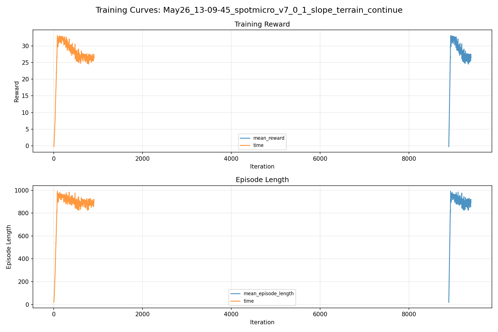
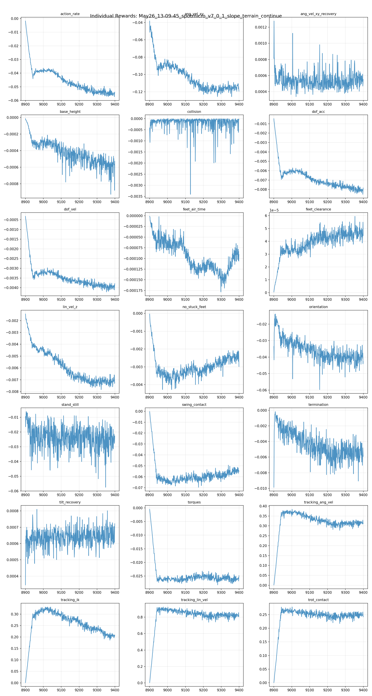
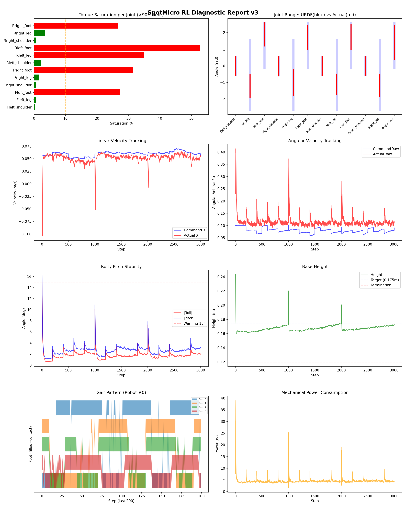
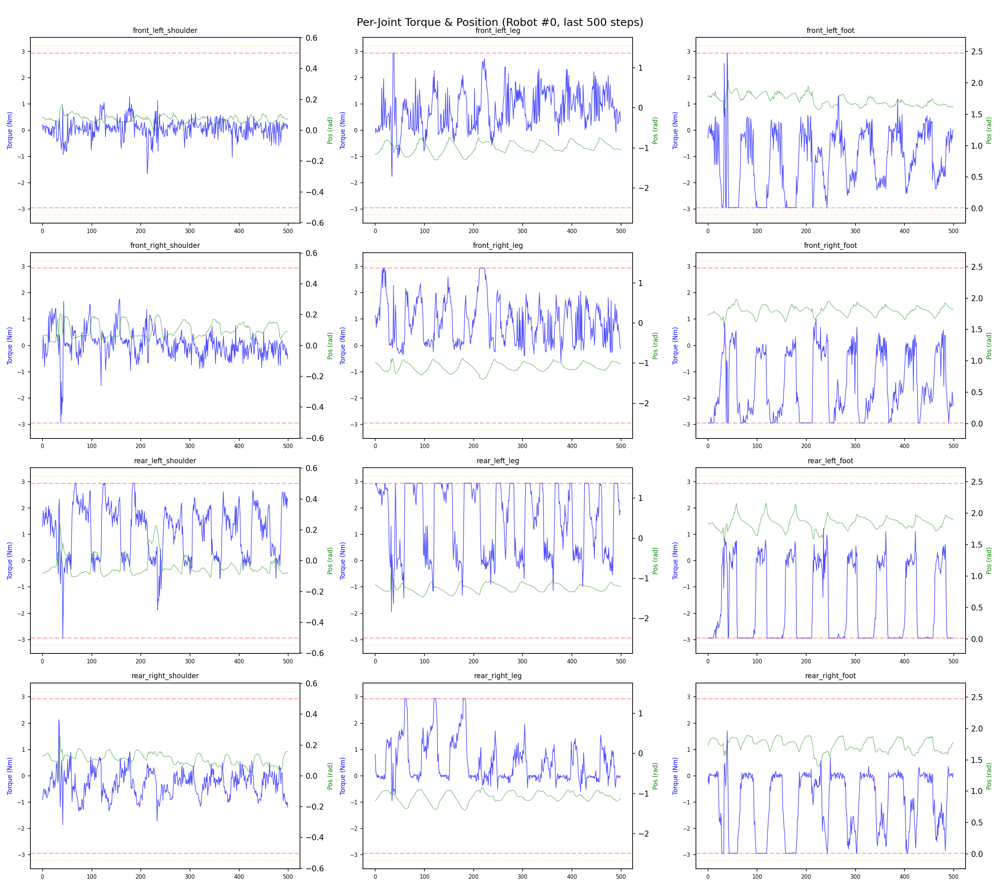
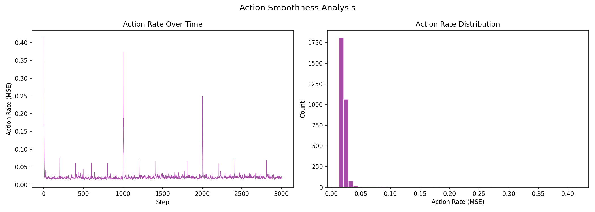

# 실험 087: spotmicro_v7_0_1_slope_terrain_continue

- **날짜:** 2026-05-26 13:30
- **Task:** spotmicro_test
- **Run name:** `spotmicro_v7_0_1_slope_terrain_continue`
- **판정:** ❌ FAIL (일부 기준 미달)

---

## 실험 목적

v7.0.1: 지형 학습 추가 학습

---

## 변경점 (이전 커밋 대비)

```diff
diff --git a/ai_training/rl/legged_gym/legged_gym/envs/spotmicro_test/spotmicro_test_config.py b/ai_training/rl/legged_gym/legged_gym/envs/spotmicro_test/spotmicro_test_config.py
index fdc26ae..09b73c4 100644
--- a/ai_training/rl/legged_gym/legged_gym/envs/spotmicro_test/spotmicro_test_config.py
+++ b/ai_training/rl/legged_gym/legged_gym/envs/spotmicro_test/spotmicro_test_config.py
@@ -250,10 +250,10 @@ class SpotmicroTestCfgPPO(LeggedRobotCfgPPO):
         learning_rate = 1e-4
 
     class runner(LeggedRobotCfgPPO.runner):
-        run_name = 'spotmicro_v7_0_slope_terrain_curriculum'
+        run_name = 'spotmicro_v7_0_1_slope_terrain_continue'
         experiment_name = 'spotmicro_test'
-        max_iterations = 800
+        max_iterations = 500
         save_interval = 100
         resume = True
-        load_run = "May25_16-41-52_spotmicro_v6_3_1_prefall_transition_tilt_sampler_soft"
-        checkpoint = 8100
+        load_run = "May26_12-31-57_spotmicro_v7_0_slope_terrain_curriculum"
+        checkpoint = 8900
```

**변경 요약:**
  - run_name = 'spotmicro_v7_0_slope_terrain_curriculum'
  + run_name = 'spotmicro_v7_0_1_slope_terrain_continue'
  - max_iterations = 800
  + max_iterations = 500
  - load_run = "May25_16-41-52_spotmicro_v6_3_1_prefall_transition_tilt_sampler_soft"
  - checkpoint = 8100
  + load_run = "May26_12-31-57_spotmicro_v7_0_slope_terrain_curriculum"
  + checkpoint = 8900

---

## 현재 Reward Scales

| Reward | Scale |
|--------|-------|
| action_rate | -0.05 |
| ang_vel_xy | -1.0 |
| ang_vel_xy_recovery | 0.5 |
| base_height | -2.0 |
| collision | -1.0 |
| dof_acc | -2.5e-07 |
| dof_vel | -0.0005 |
| feet_air_time | 0.04 |
| feet_clearance | 0.03 |
| lin_vel_z | -2.0 |
| no_stuck_feet | -0.2 |
| orientation | -10.0 |
| stand_still | -0.4 |
| swing_contact | -0.45 |
| termination | -20.0 |
| tilt_recovery | 4.0 |
| torques | -0.001 |
| tracking_ang_vel | 0.6 |
| tracking_ik | 0.6 |
| tracking_lin_vel | 1.0 |
| trot_contact | 0.35 |

---

## 진단 결과 (Diagnostic)


### 지형 설정

| 항목 | 값 |
|------|-----|
| 평가 모드 | terrain_random |
| walk_eval | False |
| mesh_type | trimesh |
| terrain_profile | spotmicro_slope |
| measure_heights | False |
| grid | 5 x 5 |
| env 크기 | 6.0 x 6.0 m |
| terrain_proportions | [0.4, 0.25, 0.35] |
| slope max | 0.14 |
| rolling amp max | 0.025 m |


### 핵심 지표

- ❌ Timeout: 56.8% (<60%, 미달)
- ✅ 속도오차 X: 0.0288 m/s (<0.08)
- ⚠️ 토크포화: 15.2% (10~40%)
- ✅ 자세: roll 1.8°, pitch 2.7° (<10°)
- ✅ 조기종료: 2.8% (<5%)
- ❌ 전환복구: 19.5% (<50%)
- ❌ 18도+ pre-fall 복구: 17.2% (<60%)
- ℹ️ Recovery/pre-fall 지표는 참고값입니다 (terrain run 자동 PASS/FAIL 기준에서는 제외)

### 상세 수치

| 지표 | 값 |
|------|-----|
| Timeout% | 56.8241469816273 |
| 조기종료% | 2.7559055118110236 |
| 속도오차 X | 0.028819827362895012 m/s |
| 속도오차 Y | 0.01652684062719345 m/s |
| 각속도오차 | 0.08654940873384476 rad/s |
| 토크포화% | 15.213497440059939 |
| 평균 높이 | 0.1672352362812419 m |
| Roll (평균) | 1.8224611282348633° |
| Pitch (평균) | 2.6960830688476562° |
| Action Rate | 0.022191286087036133 |
| 평균 전력 | 4.573231220245361 W |
| CoT | 2.994116362627172 |
| Recovery 성공률 | 34.371395617070355% |
| Recovery eligible trials | 867 |
| 평균 회복 시간 | 0.4685234794605698 s |
| Recovery 조기 실패율 | 2.422145328719723% |
| Recovery 18도+ 성공률 | 33.94216133942161% |
| Recovery 18도+ trials | 657 |
| Recovery 18도+ horizon 후 tilt | 3.0001795467108354° |
| Transition recovery 성공률 | 19.518377693282638% |
| Transition recovery eligible trials | 789 |
| 평균 Transition recovery 시간 | 0.30961038269005814 s |
| Transition 18도+ 성공률 | 17.236024844720497% |
| Transition 18도+ trials | 644 |
| Transition 18도+ horizon 후 tilt | 6.693600563841485° |

## Recovery Assist 분석

| 지표 | 값 |
|------|-----|
| 판정 | ❌ Recovery 부족 |
| Recovery 성공률 | 34.4% |
| 성공/실패 | 298 / 569 |
| Eligible trials | 867 / 1011 |
| 평균 회복 시간 | 0.469s |
| 조기 실패율 | 2.4% |
| 평가 horizon | 1.0 s |
| 초기 tilt 기준 | 12.000000000000002° |
| 안정 기준 | roll/pitch < 5.0°, height > 0.165m |
| 평균 초기 tilt | 22.162057324993597° |
| 평균 초기 roll/pitch | 16.251158775622155° / 17.05267041768665° |
| 1초 후 평균 roll/pitch | 1.8807767135185587° / 2.109331282157818° |
| 1초 내 최대 roll/pitch 평균 | 18.004602273030265° / 19.42061980125401° |

> 해석: `Recovery 성공률`은 초기 tilt가 기준 이상인 episode 중 1초 내 안정 자세로 복귀한 비율입니다. 조기 실패율이 높으면 reset 직후 바로 넘어지는 것이고, 평균 회복 시간이 짧을수록 위기 대응이 빠른 것입니다.

### Recovery Tilt Band 분석

| Tilt 구간 | Trials | 성공률 | Horizon 후 평균 tilt | 평균 회복 시간 |
|-----------|--------|--------|----------------------|----------------|
| 12-18 deg | 210 | 35.7% | 1.59° | 0.37s |
| 18-25 deg | 337 | 32.0% | 2.34° | 0.47s |
| 25-30 deg | 320 | 35.9% | 3.70° | 0.53s |
| 30+ deg | 0 | N/A | N/A | N/A |
| 18+ deg 전체 | 657 | 33.9% | 3.00° | 0.50s |

> 이번 pre-fall 목표는 특히 `18-25 deg`, `25-30 deg`, `18+ deg 전체` 행을 우선 봅니다. `25-30 deg` trial이 없으면 30도 근처 회복 성능은 아직 검증되지 않은 것입니다.


## Transition Recovery 분석

| 지표 | 값 |
|------|-----|
| 판정 | ❌ 전환 복구 부족 |
| Transition recovery 성공률 | 19.5% |
| 성공/실패 | 154 / 635 |
| Eligible trials | 789 / 3584 |
| 평균 회복 시간 | 0.310s |
| 조기 실패율 | 6.7% |
| 평가 horizon | 0.75 s |
| push 후 eligible 기준 | max roll/pitch > 12.000000000000002° |
| 안정 기준 | roll/pitch < 5.0°, height > 0.165m |
| 평균 최대 tilt | 21.924842598907965° |
| horizon 후 평균 roll/pitch | 3.8854451622280997° / 4.750478051745077° |

> 해석: `Transition Recovery`는 학습 중 push/roll-pitch angular impulse가 들어간 뒤 일정 시간 안에 자세가 안정 기준으로 돌아오는지를 봅니다.

### Transition Recovery Tilt Band 분석

| Tilt 구간 | Trials | 성공률 | Horizon 후 평균 tilt | 평균 회복 시간 |
|-----------|--------|--------|----------------------|----------------|
| 12-18 deg | 145 | 29.7% | 4.31° | 0.29s |
| 18-25 deg | 502 | 17.7% | 5.61° | 0.28s |
| 25-30 deg | 108 | 15.7% | 5.45° | 0.48s |
| 30+ deg | 34 | 14.7% | 26.67° | 0.42s |
| 18+ deg 전체 | 644 | 17.2% | 6.69° | 0.32s |

> 이번 pre-fall 목표는 특히 `18-25 deg`, `25-30 deg`, `18+ deg 전체` 행을 우선 봅니다. `25-30 deg` trial이 없으면 30도 근처 회복 성능은 아직 검증되지 않은 것입니다.


## Command Mode별 회전 추종 분석

| 모드 | 비율 | 샘플 수 | 평균 abs(cmd_wz) | 평균 abs(actual_wz) | yaw 오차 | 상태 |
|------|------|---------|------------------|---------------------|----------|------|
| 정지 | 9.0% | 69134 | 0.0256 | 0.0777 | 0.0750 | ❌ |
| 직진/저회전 | 51.1% | 393153 | 0.0444 | 0.1054 | 0.0922 | ⚠️ |
| 제자리 회전 | 9.5% | 73065 | 0.1738 | 0.1584 | 0.0799 | ✅ |
| 전진+회전 | 11.0% | 84634 | 0.1748 | 0.1708 | 0.0909 | ⚠️ |
| 큰 회전명령 | 0.0% | 0 | N/A | N/A | N/A | N/A |

> 해석 기준: `제자리 회전`만 나쁘면 pure turn 학습/보행 패턴 문제, `큰 회전명령`만 나쁘면 yaw 명령 범위가 현재 토크/보폭 한계보다 큰 문제, `정지`가 나쁘면 stop drift 문제로 보면 됩니다.
        


## 학습 곡선 분석

| 지표 | 값 | 판정 |
|------|-----|------|
| 수렴 iter (90%) | 8939 | 느림 |
| 후반 안정성 (CV) | 0.043 | 안정 |
| 정체 구간 | 없음 | |


## Per-leg 분석

### 발별 접촉/공중 비율

| 발 | 접촉% | 공중% |
|-----|-------|------|
| foot_0 | 70.6% | 29.4% |
| foot_1 | 69.4% | 30.6% |
| foot_2 | 76.4% | 23.6% |
| foot_3 | 63.2% | 36.8% |

### 관절별 토크 포화

| 관절 | 포화% | 최대토크 | 한계 | 상태 |
|------|------|---------|------|------|
| front_left_shoulder | 0.3% | 2.940 | 2.940 | ✅ |
| front_left_leg | 0.7% | 2.940 | 2.940 | ✅ |
| front_left_foot | 27.2% | 2.940 | 2.940 | ❌ |
| front_right_shoulder | 0.5% | 2.940 | 2.940 | ✅ |
| front_right_leg | 1.6% | 2.940 | 2.940 | ✅ |
| front_right_foot | 31.5% | 2.940 | 2.940 | ❌ |
| rear_left_shoulder | 2.2% | 2.940 | 2.940 | ✅ |
| rear_left_leg | 34.9% | 2.940 | 2.940 | ❌ |
| rear_left_foot | 52.8% | 2.940 | 2.940 | ❌ |
| rear_right_shoulder | 0.6% | 2.940 | 2.940 | ✅ |
| rear_right_leg | 3.6% | 2.940 | 2.940 | ✅ |
| rear_right_foot | 26.6% | 2.940 | 2.940 | ❌ |


## Gait 분석

| 지표 | 값 |
|------|-----|
| Gait 주파수 | 0.00 Hz |
| Gait 주기 | 3003 steps |
| 대각 동기화율 | 83.1% |
| L/R 비대칭 | 0.0%p |
| 판정 | ✅ Trot 패턴 / ✅ 대칭 |


## 관절별 상세

| 관절 | 토크포화% | 사용범위% | 편향(rad) | 한계근접% | 상태 |
|------|----------|----------|----------|----------|------|
| front_left_shoulder | 0.3% | 102% | -0.006 | 0.1% | ✅ |
| front_left_leg | 0.7% | 33% | -1.229 | 0.0% | ⚠️ |
| front_left_foot | 27.2% | 52% | +1.899 | 0.0% | ⚠️ |
| front_right_shoulder | 0.5% | 105% | -0.026 | 0.0% | ✅ |
| front_right_leg | 1.6% | 38% | -1.001 | 0.0% | ⚠️ |
| front_right_foot | 31.5% | 54% | +1.702 | 0.0% | ⚠️ |
| rear_left_shoulder | 2.2% | 102% | -0.008 | 0.1% | ✅ |
| rear_left_leg | 34.9% | 29% | -1.109 | 0.0% | ⚠️ |
| rear_left_foot | 52.8% | 55% | +1.735 | 0.0% | ⚠️ |
| rear_right_shoulder | 0.6% | 102% | -0.009 | 0.1% | ✅ |
| rear_right_leg | 3.6% | 31% | -1.172 | 0.0% | ⚠️ |
| rear_right_foot | 26.6% | 75% | +1.395 | 0.0% | ⚠️ |


## 에너지 효율 상세

| 지표 | 값 |
|------|-----|
| 평균 전력 | 4.57 W |
| 피크 전력 | 39.03 W |
| 피크/평균 비율 | 8.5x |
| CoT | 2.99 |

### 관절별 전력 분배

| 관절 | 평균전력(W) | 비율% |
|------|-----------|-------|
| rear_left_foot | 0.809 | 17.7% |
| front_right_foot | 0.709 | 15.5% |
| front_left_foot | 0.691 | 15.1% |
| rear_right_foot | 0.542 | 11.9% |
| rear_left_leg | 0.467 | 10.2% |
| rear_right_leg | 0.326 | 7.1% |
| front_left_leg | 0.287 | 6.3% |
| front_right_leg | 0.283 | 6.2% |
| rear_left_shoulder | 0.190 | 4.2% |
| rear_right_shoulder | 0.120 | 2.6% |
| front_right_shoulder | 0.086 | 1.9% |
| front_left_shoulder | 0.063 | 1.4% |


## 이전 실험 대비 비교

| 지표 | 이전 (exp086) | 현재 (exp087) | 변화 |
|------|-------|-------|------|
| Timeout% | 58.6% | 56.8% | ⚠️ ↓ 1.8245% |
| 속도오차 X | 0.0285 | 0.0288 | ⚠️ ↑ 0.0004m/s |
| 토크포화 | 14.2% | 15.2% | ⚠️ ↑ 1.0335% |
| Roll | 2.1° | 1.8° | ✅ ↓ 0.3121° |
| Pitch | 2.7° | 2.7° | ✅ ↓ 0.0058° |
| 평균 전력 | 4.5195W | 4.5732W | ⚠️ ↑ 0.0537W |


## Tensorboard 학습 곡선 요약

| 스칼라 | 최종값 | 최대 | 최소 | 후반10% 평균 |
|--------|--------|------|------|-------------|
| rew_action_rate | -0.0539 | -0.0018 | -0.0573 | -0.0550 |
| rew_ang_vel_xy | -0.1194 | -0.0382 | -0.1257 | -0.1153 |
| rew_ang_vel_xy_recovery | 0.0006 | 0.0013 | 0.0003 | 0.0006 |
| rew_base_height | -0.0005 | -0.0000 | -0.0009 | -0.0006 |
| rew_collision | -0.0000 | 0.0000 | -0.0034 | -0.0002 |
| rew_dof_acc | -0.0078 | -0.0005 | -0.0085 | -0.0080 |
| rew_dof_vel | -0.0038 | -0.0003 | -0.0042 | -0.0040 |
| rew_feet_air_time | -0.0001 | -0.0000 | -0.0002 | -0.0001 |
| rew_feet_clearance | 0.0000 | 0.0001 | 0.0000 | 0.0000 |
| rew_lin_vel_z | -0.0072 | -0.0014 | -0.0078 | -0.0071 |
| rew_no_stuck_feet | -0.0030 | -0.0000 | -0.0043 | -0.0025 |
| rew_orientation | -0.0427 | -0.0138 | -0.0598 | -0.0408 |
| rew_stand_still | -0.0226 | -0.0061 | -0.0575 | -0.0259 |
| rew_swing_contact | -0.0552 | -0.0003 | -0.0697 | -0.0550 |
| rew_termination | -0.0059 | -0.0002 | -0.0099 | -0.0054 |
| rew_tilt_recovery | 0.0007 | 0.0008 | 0.0003 | 0.0007 |
| rew_torques | -0.0248 | -0.0005 | -0.0283 | -0.0262 |
| rew_tracking_ang_vel | 0.3105 | 0.3837 | 0.0018 | 0.3158 |
| rew_tracking_ik | 0.2087 | 0.3314 | 0.0010 | 0.2064 |
| rew_tracking_lin_vel | 0.8096 | 0.9236 | 0.0044 | 0.8218 |
| rew_trot_contact | 0.2415 | 0.2780 | 0.0008 | 0.2495 |
| terrain_level | 4.8367 | 4.9047 | 1.1746 | 4.8680 |
| learning_rate | 0.0003 | 0.0005 | 0.0000 | 0.0004 |
| surrogate | -0.0021 | 0.0038 | -0.0054 | -0.0031 |
| value_function | 0.0203 | 0.0582 | 0.0030 | 0.0204 |
| collection time | 1.7518 | 3.6573 | 1.2273 | 1.7506 |
| learning_time | 0.5659 | 0.6061 | 0.2748 | 0.5740 |
| total_fps | 42415.0000 | 64965.0000 | 24615.0000 | 42292.7000 |
| mean_noise_std | 0.1914 | 0.1932 | 0.1523 | 0.1920 |
| mean_episode_length | 892.1400 | 991.8200 | 19.7700 | 889.2312 |
| time | 892.1400 | 991.8200 | 19.7700 | 889.2312 |
| mean_reward | 26.6983 | 33.0718 | -0.2206 | 26.3832 |
| time | 26.6983 | 33.0718 | -0.2206 | 26.3832 |

총 학습 iteration: 9399


---

## 그래프

### Tensorboard 학습 곡선



### Diagnostic 결과





---

## 결론 및 다음 실험 방향

**자동 판정:** ❌ FAIL (일부 기준 미달)

일부 기준을 통과하지 못했습니다. 조정이 필요합니다.
  - ❌ Timeout: 56.8% (<60%, 미달)
  - ❌ 전환복구: 19.5% (<50%)
  - ❌ 18도+ pre-fall 복구: 17.2% (<60%)

**제안:** Timeout이 낮습니다. 최근 추가한 페널티를 절반으로 줄여보세요.

> 💡 위 결론은 자동 생성되었습니다. 필요시 수정하세요.

---

## 메모

_(추가 메모가 있으면 여기에 작성)_

