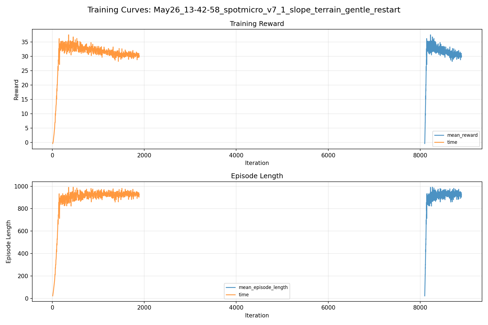
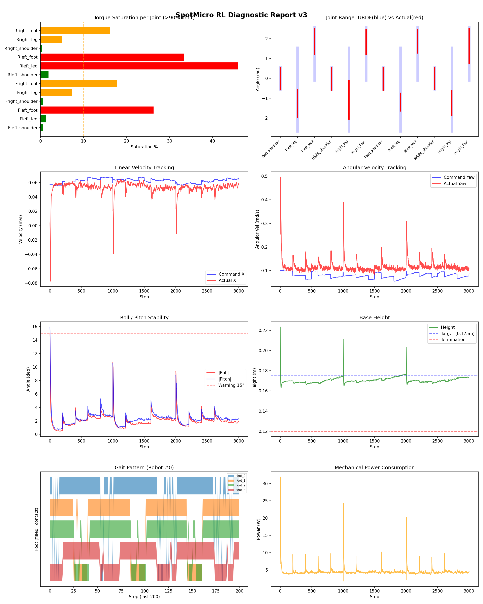
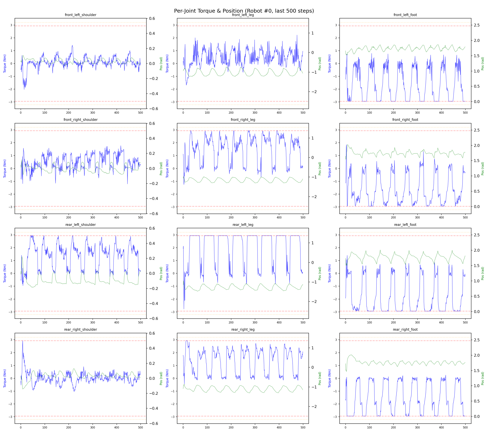
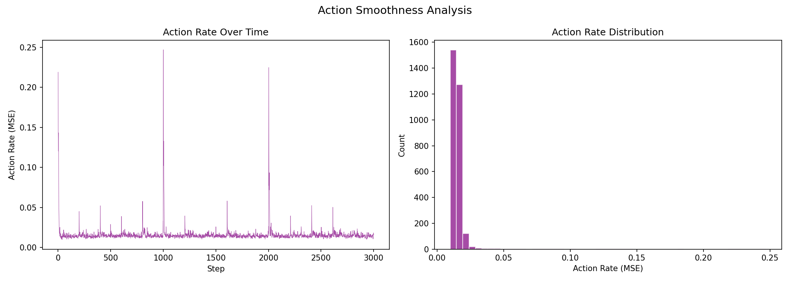

# 실험 088: spotmicro_v7_1_slope_terrain_gentle_restart

- **날짜:** 2026-05-26 14:20
- **Task:** spotmicro_test
- **Run name:** `spotmicro_v7_1_slope_terrain_gentle_restart`
- **판정:** ❌ FAIL (일부 기준 미달)

---

## 실험 목적

v7.1: 지형 학습 설정 변경 후 학습

---

## 변경점 (이전 커밋 대비)

```diff
diff --git a/ai_training/rl/legged_gym/legged_gym/envs/spotmicro_test/spotmicro_test_config.py b/ai_training/rl/legged_gym/legged_gym/envs/spotmicro_test/spotmicro_test_config.py
index 09b73c4..71e4edc 100644
--- a/ai_training/rl/legged_gym/legged_gym/envs/spotmicro_test/spotmicro_test_config.py
+++ b/ai_training/rl/legged_gym/legged_gym/envs/spotmicro_test/spotmicro_test_config.py
@@ -54,20 +54,20 @@ class SpotmicroTestCfg(LeggedRobotCfg):
         horizontal_scale = 0.05
         vertical_scale = 0.005
         border_size = 8.0
-        max_init_terrain_level = 2
+        max_init_terrain_level = 1
         num_rows = 8
         num_cols = 12
         terrain_length = 6.0
         terrain_width = 6.0
-        curriculum_move_up_distance = 0.90
+        curriculum_move_up_distance = 1.10
         curriculum_move_down_command_scale = 0.25
-        terrain_proportions = [0.40, 0.25, 0.35]
+        terrain_proportions = [0.50, 0.25, 0.25]
         spotmicro_slope_min = 0.02
-        spotmicro_slope_max = 0.14
-        spotmicro_rough_height_max = 0.008
-        spotmicro_rolling_amp_max = 0.025
-        spotmicro_rolling_wavelength_min = 0.45
-        spotmicro_rolling_wavelength_max = 1.20
+        spotmicro_slope_max = 0.10
+        spotmicro_rough_height_max = 0.005
+        spotmicro_rolling_amp_max = 0.015
+        spotmicro_rolling_wavelength_min = 0.65
+        spotmicro_rolling_wavelength_max = 1.40
         spotmicro_terrain_platform_size = 0.7
         slope_treshold = 0.75
         static_friction = 1.0
@@ -250,10 +250,10 @@ class SpotmicroTestCfgPPO(LeggedRobotCfgPPO):
         learning_rate = 1e-4
 
     class runner(LeggedRobotCfgPPO.runner):
-        run_name = 'spotmicro_v7_0_1_slope_terrain_continue'
+        run_name = 'spotmicro_v7_1_slope_terrain_gentle_restart'
         experiment_name = 'spotmicro_test'
-        max_iterations = 500
+        max_iterations = 800
         save_interval = 100
         resume = True
-        load_run = "May26_12-31-57_spotmicro_v7_0_slope_terrain_curriculum"
-        checkpoint = 8900
+        load_run = "May25_16-41-52_spotmicro_v6_3_1_prefall_transition_tilt_sampler_soft"
+        checkpoint = 8100
```

**변경 요약:**
  - max_init_terrain_level = 2
  + max_init_terrain_level = 1
  - curriculum_move_up_distance = 0.90
  + curriculum_move_up_distance = 1.10
  - terrain_proportions = [0.40, 0.25, 0.35]
  + terrain_proportions = [0.50, 0.25, 0.25]
  - spotmicro_slope_max = 0.14
  - spotmicro_rough_height_max = 0.008
  - spotmicro_rolling_amp_max = 0.025
  - spotmicro_rolling_wavelength_min = 0.45
  - spotmicro_rolling_wavelength_max = 1.20
  + spotmicro_slope_max = 0.10
  + spotmicro_rough_height_max = 0.005
  + spotmicro_rolling_amp_max = 0.015
  + spotmicro_rolling_wavelength_min = 0.65
  + spotmicro_rolling_wavelength_max = 1.40
  - run_name = 'spotmicro_v7_0_1_slope_terrain_continue'
  + run_name = 'spotmicro_v7_1_slope_terrain_gentle_restart'
  - max_iterations = 500
  + max_iterations = 800
  - load_run = "May26_12-31-57_spotmicro_v7_0_slope_terrain_curriculum"
  - checkpoint = 8900
  + load_run = "May25_16-41-52_spotmicro_v6_3_1_prefall_transition_tilt_sampler_soft"
  + checkpoint = 8100

---

## 현재 Reward Scales

| Reward | Scale |
|--------|-------|
| action_rate | -0.05 |
| ang_vel_xy | -1.0 |
| ang_vel_xy_recovery | 0.5 |
| base_height | -2.0 |
| collision | -1.0 |
| dof_acc | -2.5e-07 |
| dof_vel | -0.0005 |
| feet_air_time | 0.04 |
| feet_clearance | 0.03 |
| lin_vel_z | -2.0 |
| no_stuck_feet | -0.2 |
| orientation | -10.0 |
| stand_still | -0.4 |
| swing_contact | -0.45 |
| termination | -20.0 |
| tilt_recovery | 4.0 |
| torques | -0.001 |
| tracking_ang_vel | 0.6 |
| tracking_ik | 0.6 |
| tracking_lin_vel | 1.0 |
| trot_contact | 0.35 |

---

## 진단 결과 (Diagnostic)


### 지형 설정

| 항목 | 값 |
|------|-----|
| 평가 모드 | terrain_random |
| walk_eval | False |
| mesh_type | trimesh |
| terrain_profile | spotmicro_slope |
| measure_heights | False |
| grid | 5 x 5 |
| env 크기 | 6.0 x 6.0 m |
| terrain_proportions | [0.5, 0.25, 0.25] |
| slope max | 0.1 |
| rolling amp max | 0.015 m |


### 핵심 지표

- ⚠️ Timeout: 65.0% (60~80%, 개선 필요)
- ✅ 속도오차 X: 0.0287 m/s (<0.08)
- ⚠️ 토크포화: 13.1% (10~40%)
- ✅ 자세: roll 2.0°, pitch 2.3° (<10°)
- ✅ 조기종료: 3.0% (<5%)
- ❌ 전환복구: 33.7% (<50%)
- ❌ 18도+ pre-fall 복구: 31.1% (<60%)
- ℹ️ Recovery/pre-fall 지표는 참고값입니다 (terrain run 자동 PASS/FAIL 기준에서는 제외)

### 상세 수치

| 지표 | 값 |
|------|-----|
| Timeout% | 65.01416430594901 |
| 조기종료% | 2.974504249291785 |
| 속도오차 X | 0.028656035661697388 m/s |
| 속도오차 Y | 0.016149520874023438 m/s |
| 각속도오차 | 0.08913089334964752 rad/s |
| 토크포화% | 13.091064751221001 |
| 평균 높이 | 0.1704954376200458 m |
| Roll (평균) | 2.02309513092041° |
| Pitch (평균) | 2.3332300186157227° |
| Action Rate | 0.015830131247639656 |
| 평균 전력 | 4.49555778503418 W |
| CoT | 2.8863629243940947 |
| Recovery 성공률 | 78.94088669950739% |
| Recovery eligible trials | 812 |
| 평균 회복 시간 | 0.4092043590282966 s |
| Recovery 조기 실패율 | 2.3399014778325125% |
| Recovery 18도+ 성공률 | 77.2875816993464% |
| Recovery 18도+ trials | 612 |
| Recovery 18도+ horizon 후 tilt | 2.970333938699922° |
| Transition recovery 성공률 | 33.65735115431349% |
| Transition recovery eligible trials | 823 |
| 평균 Transition recovery 시간 | 0.2823104630039487 s |
| Transition 18도+ 성공률 | 31.097560975609756% |
| Transition 18도+ trials | 656 |
| Transition 18도+ horizon 후 tilt | 8.283843601270148° |

## Recovery Assist 분석

| 지표 | 값 |
|------|-----|
| 판정 | ⚠️ 일부 회복 가능 |
| Recovery 성공률 | 78.9% |
| 성공/실패 | 641 / 171 |
| Eligible trials | 812 / 957 |
| 평균 회복 시간 | 0.409s |
| 조기 실패율 | 2.3% |
| 평가 horizon | 1.0 s |
| 초기 tilt 기준 | 12.000000000000002° |
| 안정 기준 | roll/pitch < 5.0°, height > 0.165m |
| 평균 초기 tilt | 22.20949264542724° |
| 평균 초기 roll/pitch | 16.884751194560636° / 16.515906349532003° |
| 1초 후 평균 roll/pitch | 1.8023812152351266° / 2.127784634130007° |
| 1초 내 최대 roll/pitch 평균 | 18.486232732170322° / 18.361499505824057° |

> 해석: `Recovery 성공률`은 초기 tilt가 기준 이상인 episode 중 1초 내 안정 자세로 복귀한 비율입니다. 조기 실패율이 높으면 reset 직후 바로 넘어지는 것이고, 평균 회복 시간이 짧을수록 위기 대응이 빠른 것입니다.

### Recovery Tilt Band 분석

| Tilt 구간 | Trials | 성공률 | Horizon 후 평균 tilt | 평균 회복 시간 |
|-----------|--------|--------|----------------------|----------------|
| 12-18 deg | 200 | 84.0% | 1.66° | 0.30s |
| 18-25 deg | 328 | 80.8% | 2.05° | 0.41s |
| 25-30 deg | 284 | 73.2% | 4.04° | 0.50s |
| 30+ deg | 0 | N/A | N/A | N/A |
| 18+ deg 전체 | 612 | 77.3% | 2.97° | 0.45s |

> 이번 pre-fall 목표는 특히 `18-25 deg`, `25-30 deg`, `18+ deg 전체` 행을 우선 봅니다. `25-30 deg` trial이 없으면 30도 근처 회복 성능은 아직 검증되지 않은 것입니다.


## Transition Recovery 분석

| 지표 | 값 |
|------|-----|
| 판정 | ❌ 전환 복구 부족 |
| Transition recovery 성공률 | 33.7% |
| 성공/실패 | 277 / 546 |
| Eligible trials | 823 / 3584 |
| 평균 회복 시간 | 0.282s |
| 조기 실패율 | 7.9% |
| 평가 horizon | 0.75 s |
| push 후 eligible 기준 | max roll/pitch > 12.000000000000002° |
| 안정 기준 | roll/pitch < 5.0°, height > 0.165m |
| 평균 최대 tilt | 22.17013368151169° |
| horizon 후 평균 roll/pitch | 5.092780323571881° / 5.90835215963756° |

> 해석: `Transition Recovery`는 학습 중 push/roll-pitch angular impulse가 들어간 뒤 일정 시간 안에 자세가 안정 기준으로 돌아오는지를 봅니다.

### Transition Recovery Tilt Band 분석

| Tilt 구간 | Trials | 성공률 | Horizon 후 평균 tilt | 평균 회복 시간 |
|-----------|--------|--------|----------------------|----------------|
| 12-18 deg | 167 | 43.7% | 5.36° | 0.27s |
| 18-25 deg | 472 | 34.1% | 5.87° | 0.24s |
| 25-30 deg | 134 | 29.9% | 7.07° | 0.47s |
| 30+ deg | 50 | 6.0% | 34.36° | 0.39s |
| 18+ deg 전체 | 656 | 31.1% | 8.28° | 0.29s |

> 이번 pre-fall 목표는 특히 `18-25 deg`, `25-30 deg`, `18+ deg 전체` 행을 우선 봅니다. `25-30 deg` trial이 없으면 30도 근처 회복 성능은 아직 검증되지 않은 것입니다.


## Command Mode별 회전 추종 분석

| 모드 | 비율 | 샘플 수 | 평균 abs(cmd_wz) | 평균 abs(actual_wz) | yaw 오차 | 상태 |
|------|------|---------|------------------|---------------------|----------|------|
| 정지 | 9.1% | 70200 | 0.0246 | 0.0790 | 0.0779 | ❌ |
| 직진/저회전 | 52.5% | 403963 | 0.0459 | 0.1087 | 0.0953 | ⚠️ |
| 제자리 회전 | 7.9% | 60663 | 0.1770 | 0.1541 | 0.0827 | ⚠️ |
| 전진+회전 | 11.4% | 87532 | 0.1757 | 0.1745 | 0.0902 | ⚠️ |
| 큰 회전명령 | 0.0% | 0 | N/A | N/A | N/A | N/A |

> 해석 기준: `제자리 회전`만 나쁘면 pure turn 학습/보행 패턴 문제, `큰 회전명령`만 나쁘면 yaw 명령 범위가 현재 토크/보폭 한계보다 큰 문제, `정지`가 나쁘면 stop drift 문제로 보면 됩니다.
        


## 학습 곡선 분석

| 지표 | 값 | 판정 |
|------|-----|------|
| 수렴 iter (90%) | 8142 | 느림 |
| 후반 안정성 (CV) | 0.027 | 안정 |
| 정체 구간 | 없음 | |


## Per-leg 분석

### 발별 접촉/공중 비율

| 발 | 접촉% | 공중% |
|-----|-------|------|
| foot_0 | 73.6% | 26.4% |
| foot_1 | 73.1% | 26.9% |
| foot_2 | 75.9% | 24.1% |
| foot_3 | 62.8% | 37.2% |

### 관절별 토크 포화

| 관절 | 포화% | 최대토크 | 한계 | 상태 |
|------|------|---------|------|------|
| front_left_shoulder | 0.6% | 2.940 | 2.940 | ✅ |
| front_left_leg | 1.3% | 2.940 | 2.940 | ✅ |
| front_left_foot | 26.3% | 2.940 | 2.940 | ❌ |
| front_right_shoulder | 0.6% | 2.940 | 2.940 | ✅ |
| front_right_leg | 7.4% | 2.940 | 2.940 | ⚠️ |
| front_right_foot | 17.9% | 2.940 | 2.940 | ⚠️ |
| rear_left_shoulder | 1.9% | 2.940 | 2.940 | ✅ |
| rear_left_leg | 46.0% | 2.940 | 2.940 | ❌ |
| rear_left_foot | 33.5% | 2.940 | 2.940 | ❌ |
| rear_right_shoulder | 0.4% | 2.940 | 2.940 | ✅ |
| rear_right_leg | 5.1% | 2.940 | 2.940 | ⚠️ |
| rear_right_foot | 16.1% | 2.940 | 2.940 | ⚠️ |


## Gait 분석

| 지표 | 값 |
|------|-----|
| Gait 주파수 | 0.21 Hz |
| Gait 주기 | 60 steps |
| 대각 동기화율 | 85.9% |
| L/R 비대칭 | 0.0%p |
| 판정 | ✅ Trot 패턴 / ✅ 대칭 |


## 관절별 상세

| 관절 | 토크포화% | 사용범위% | 편향(rad) | 한계근접% | 상태 |
|------|----------|----------|----------|----------|------|
| front_left_shoulder | 0.6% | 102% | -0.011 | 0.1% | ✅ |
| front_left_leg | 1.3% | 33% | -1.268 | 0.0% | ⚠️ |
| front_left_foot | 26.3% | 48% | +1.860 | 0.0% | ⚠️ |
| front_right_shoulder | 0.6% | 103% | -0.017 | 0.3% | ✅ |
| front_right_leg | 7.4% | 46% | -1.079 | 0.0% | ⚠️ |
| front_right_foot | 17.9% | 46% | +1.829 | 0.0% | ⚠️ |
| rear_left_shoulder | 1.9% | 103% | -0.017 | 0.1% | ✅ |
| rear_left_leg | 46.0% | 21% | -1.194 | 0.0% | ⚠️ |
| rear_left_foot | 33.5% | 43% | +1.862 | 0.0% | ⚠️ |
| rear_right_shoulder | 0.4% | 101% | -0.004 | 0.0% | ✅ |
| rear_right_leg | 5.1% | 30% | -1.255 | 0.0% | ⚠️ |
| rear_right_foot | 16.1% | 65% | +1.621 | 0.0% | ⚠️ |


## 에너지 효율 상세

| 지표 | 값 |
|------|-----|
| 평균 전력 | 4.50 W |
| 피크 전력 | 31.88 W |
| 피크/평균 비율 | 7.1x |
| CoT | 2.89 |

### 관절별 전력 분배

| 관절 | 평균전력(W) | 비율% |
|------|-----------|-------|
| front_left_foot | 0.763 | 17.0% |
| rear_left_foot | 0.702 | 15.6% |
| front_right_foot | 0.595 | 13.2% |
| rear_right_foot | 0.496 | 11.0% |
| rear_left_leg | 0.454 | 10.1% |
| front_right_leg | 0.441 | 9.8% |
| rear_right_leg | 0.321 | 7.1% |
| front_left_leg | 0.308 | 6.9% |
| rear_left_shoulder | 0.174 | 3.9% |
| front_right_shoulder | 0.109 | 2.4% |
| rear_right_shoulder | 0.072 | 1.6% |
| front_left_shoulder | 0.060 | 1.3% |


## 이전 실험 대비 비교

| 지표 | 이전 (exp087) | 현재 (exp088) | 변화 |
|------|-------|-------|------|
| Timeout% | 56.8% | 65.0% | ✅ ↑ 8.1900% |
| 속도오차 X | 0.0288 | 0.0287 | ✅ ↓ 0.0002m/s |
| 토크포화 | 15.2% | 13.1% | ✅ ↓ 2.1224% |
| Roll | 1.8° | 2.0° | ⚠️ ↑ 0.2006° |
| Pitch | 2.7° | 2.3° | ✅ ↓ 0.3629° |
| 평균 전력 | 4.5732W | 4.4956W | ✅ ↓ 0.0777W |


## Tensorboard 학습 곡선 요약

| 스칼라 | 최종값 | 최대 | 최소 | 후반10% 평균 |
|--------|--------|------|------|-------------|
| rew_action_rate | -0.0457 | -0.0005 | -0.0460 | -0.0440 |
| rew_ang_vel_xy | -0.0995 | -0.0254 | -0.1035 | -0.0944 |
| rew_ang_vel_xy_recovery | 0.0007 | 0.0017 | 0.0004 | 0.0006 |
| rew_base_height | -0.0003 | -0.0000 | -0.0005 | -0.0003 |
| rew_collision | -0.0005 | 0.0000 | -0.0124 | -0.0002 |
| rew_dof_acc | -0.0067 | -0.0003 | -0.0069 | -0.0065 |
| rew_dof_vel | -0.0034 | -0.0002 | -0.0035 | -0.0033 |
| rew_feet_air_time | -0.0001 | 0.0000 | -0.0002 | -0.0001 |
| rew_feet_clearance | 0.0000 | 0.0000 | 0.0000 | 0.0000 |
| rew_lin_vel_z | -0.0047 | -0.0012 | -0.0054 | -0.0049 |
| rew_no_stuck_feet | -0.0036 | -0.0000 | -0.0044 | -0.0038 |
| rew_orientation | -0.0333 | -0.0213 | -0.0650 | -0.0336 |
| rew_stand_still | -0.0241 | -0.0081 | -0.0600 | -0.0253 |
| rew_swing_contact | -0.0663 | -0.0002 | -0.0721 | -0.0667 |
| rew_termination | -0.0032 | -0.0009 | -0.0144 | -0.0040 |
| rew_tilt_recovery | 0.0007 | 0.0009 | 0.0003 | 0.0007 |
| rew_torques | -0.0268 | -0.0003 | -0.0268 | -0.0253 |
| rew_tracking_ang_vel | 0.3439 | 0.4380 | 0.0020 | 0.3389 |
| rew_tracking_ik | 0.3150 | 0.4105 | 0.0020 | 0.3219 |
| rew_tracking_lin_vel | 0.8710 | 0.9228 | 0.0041 | 0.8637 |
| rew_trot_contact | 0.2556 | 0.2794 | 0.0004 | 0.2516 |
| terrain_level | 4.5952 | 4.5952 | 0.4184 | 4.5671 |
| learning_rate | 0.0003 | 0.0004 | 0.0000 | 0.0003 |
| surrogate | -0.0025 | 0.0008 | -0.0047 | -0.0029 |
| value_function | 0.0144 | 0.2258 | 0.0047 | 0.0185 |
| collection time | 1.7184 | 6.6005 | 1.6034 | 1.6791 |
| learning_time | 0.5779 | 0.6016 | 0.5252 | 0.5858 |
| total_fps | 42809.0000 | 45005.0000 | 13697.0000 | 43407.4750 |
| mean_noise_std | 0.1729 | 0.1729 | 0.0764 | 0.1701 |
| mean_episode_length | 927.7700 | 991.5000 | 22.1200 | 929.5145 |
| time | 927.7700 | 991.5000 | 22.1200 | 929.5145 |
| mean_reward | 30.2722 | 37.4909 | -0.3311 | 30.4884 |
| time | 30.2722 | 37.4909 | -0.3311 | 30.4884 |

총 학습 iteration: 8899


---

## 그래프

### Tensorboard 학습 곡선



### Diagnostic 결과





---

## 결론 및 다음 실험 방향

**자동 판정:** ❌ FAIL (일부 기준 미달)

일부 기준을 통과하지 못했습니다. 조정이 필요합니다.
  - ❌ 전환복구: 33.7% (<50%)
  - ❌ 18도+ pre-fall 복구: 31.1% (<60%)

> 💡 위 결론은 자동 생성되었습니다. 필요시 수정하세요.

---

## 메모

_(추가 메모가 있으면 여기에 작성)_

