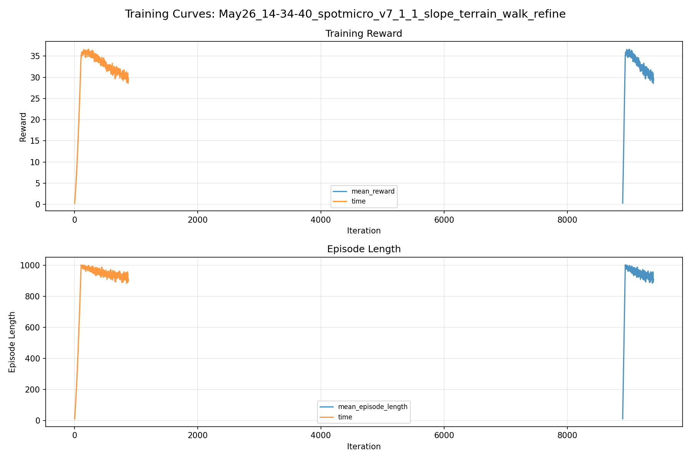
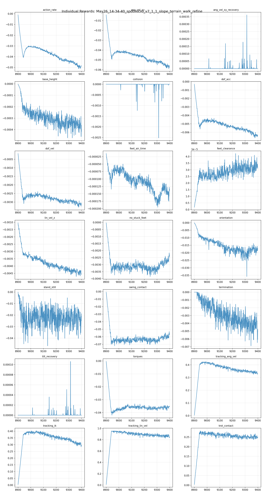
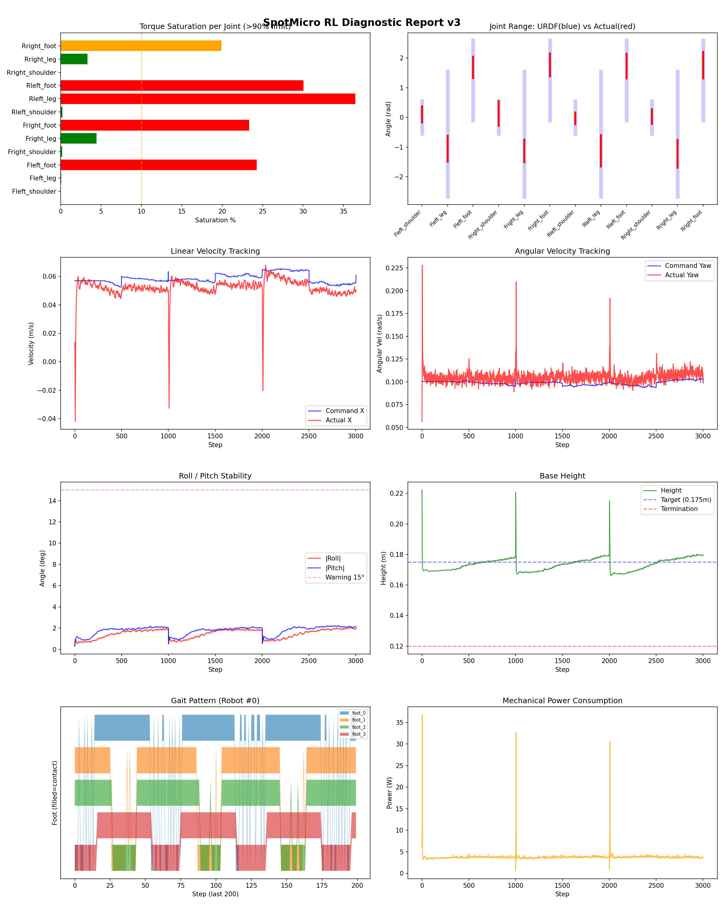
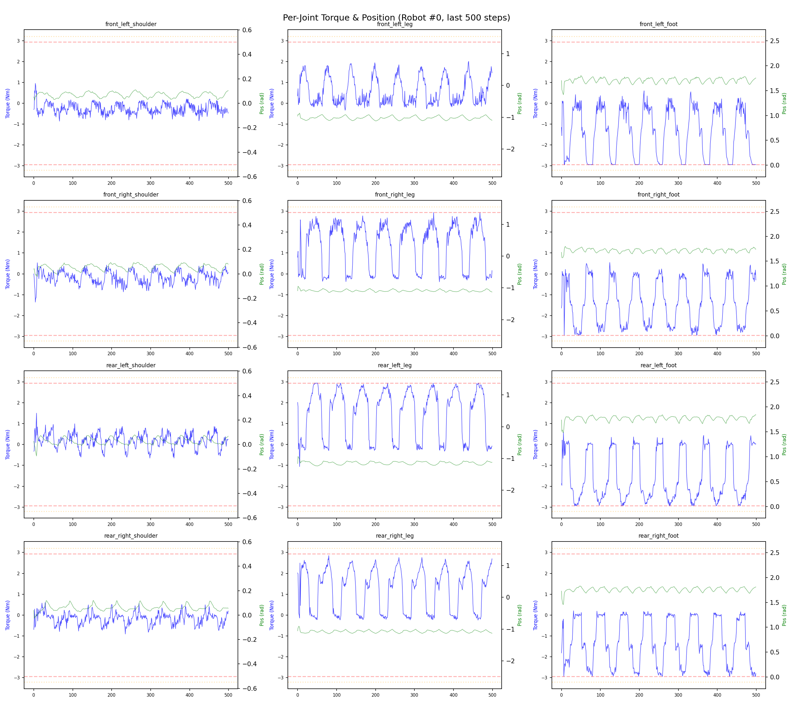
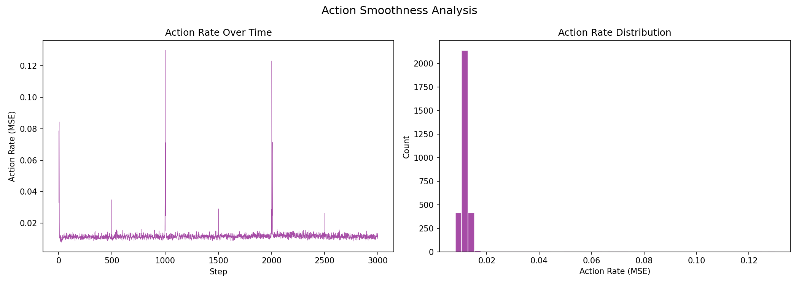

# 실험 090: spotmicro_v7_1_1_slope_terrain_walk_refine

- **날짜:** 2026-05-26 14:53
- **Task:** spotmicro_test
- **Run name:** `spotmicro_v7_1_1_slope_terrain_walk_refine`
- **판정:** ❌ FAIL (일부 기준 미달)

---

## 실험 목적

v7.1.1: 과도한 tilt transition 끄고 학습

---

## 변경점 (이전 커밋 대비)

```diff
diff --git a/ai_training/rl/legged_gym/legged_gym/envs/spotmicro_test/spotmicro_test_config.py b/ai_training/rl/legged_gym/legged_gym/envs/spotmicro_test/spotmicro_test_config.py
index 71e4edc..08f76df 100644
--- a/ai_training/rl/legged_gym/legged_gym/envs/spotmicro_test/spotmicro_test_config.py
+++ b/ai_training/rl/legged_gym/legged_gym/envs/spotmicro_test/spotmicro_test_config.py
@@ -133,10 +133,10 @@ class SpotmicroTestCfg(LeggedRobotCfg):
             lin_vel_z = -2.0
             ang_vel_xy = -1.0
             orientation = -10.0
-            torques = -0.001
+            torques = -0.0015
             dof_vel = -0.0005
             dof_acc = -2.5e-7
-            action_rate = -0.05
+            action_rate = -0.06
             base_height = -2.0
             feet_air_time = 0.04
             dof_pos_limits = 0.0
@@ -218,7 +218,7 @@ class SpotmicroTestCfg(LeggedRobotCfg):
         damping_scale_range = [1.0, 1.0]
         randomize_joint_obs_offset = False
         joint_obs_offset_range = [0.0, 0.0]
-        push_robots = True
+        push_robots = False
         push_interval_s = 4
         max_push_vel_xy = 0.18
         max_push_ang_vel_xy = 0.85
@@ -226,7 +226,7 @@ class SpotmicroTestCfg(LeggedRobotCfg):
         push_lin_vel_clip = 0.30
         push_ang_vel_xy_clip = 1.20
         push_ang_vel_z_clip = 0.35
-        transition_tilt_push = True
+        transition_tilt_push = False
         transition_tilt_push_prob = 0.20
         transition_tilt_push_min_deg = 18.0
         transition_tilt_push_max_deg = 27.0
@@ -235,12 +235,12 @@ class SpotmicroTestCfg(LeggedRobotCfg):
         transition_tilt_zero_yaw_cmd = True
         action_delay = True
         action_delay_range = [1, 2]
-        recovery_roll_pitch_range_deg = 30.0
-        recovery_yaw_range_deg = 180.0
-        recovery_lin_vel_xy_range = 0.14
-        recovery_lin_vel_z_range = 0.04
-        recovery_ang_vel_xy_range = 0.90
-        recovery_ang_vel_z_range = 0.35
+        recovery_roll_pitch_range_deg = 0.0
+        recovery_yaw_range_deg = 0.0
+        recovery_lin_vel_xy_range = 0.0
+        recovery_lin_vel_z_range = 0.0
+        recovery_ang_vel_xy_range = 0.0
+        recovery_ang_vel_z_range = 0.0
 
 
 class SpotmicroTestCfgPPO(LeggedRobotCfgPPO):
@@ -250,10 +250,10 @@ class SpotmicroTestCfgPPO(LeggedRobotCfgPPO):
         learning_rate = 1e-4
 
     class runner(LeggedRobotCfgPPO.runner):
-        run_name = 'spotmicro_v7_1_slope_terrain_gentle_restart'
+        run_name = 'spotmicro_v7_1_1_slope_terrain_walk_refine'
         experiment_name = 'spotmicro_test'
-        max_iterations = 800
+        max_iterations = 500
         save_interval = 100
         resume = True
-        load_run = "May25_16-41-52_spotmicro_v6_3_1_prefall_transition_tilt_sampler_soft"
-        checkpoint = 8100
+        load_run = "May26_13-42-58_spotmicro_v7_1_slope_terrain_gentle_restart"
+        checkpoint = 8900
```

**변경 요약:**
  - torques = -0.001
  + torques = -0.0015
  - action_rate = -0.05
  + action_rate = -0.06
  - push_robots = True
  + push_robots = False
  - transition_tilt_push = True
  + transition_tilt_push = False
  - recovery_roll_pitch_range_deg = 30.0
  - recovery_yaw_range_deg = 180.0
  - recovery_lin_vel_xy_range = 0.14
  - recovery_lin_vel_z_range = 0.04
  - recovery_ang_vel_xy_range = 0.90
  - recovery_ang_vel_z_range = 0.35
  + recovery_roll_pitch_range_deg = 0.0
  + recovery_yaw_range_deg = 0.0
  + recovery_lin_vel_xy_range = 0.0
  + recovery_lin_vel_z_range = 0.0
  + recovery_ang_vel_xy_range = 0.0
  + recovery_ang_vel_z_range = 0.0
  - run_name = 'spotmicro_v7_1_slope_terrain_gentle_restart'
  + run_name = 'spotmicro_v7_1_1_slope_terrain_walk_refine'
  - max_iterations = 800
  + max_iterations = 500
  - load_run = "May25_16-41-52_spotmicro_v6_3_1_prefall_transition_tilt_sampler_soft"
  - checkpoint = 8100
  + load_run = "May26_13-42-58_spotmicro_v7_1_slope_terrain_gentle_restart"
  + checkpoint = 8900

---

## 현재 Reward Scales

| Reward | Scale |
|--------|-------|
| action_rate | -0.06 |
| ang_vel_xy | -1.0 |
| ang_vel_xy_recovery | 0.5 |
| base_height | -2.0 |
| collision | -1.0 |
| dof_acc | -2.5e-07 |
| dof_vel | -0.0005 |
| feet_air_time | 0.04 |
| feet_clearance | 0.03 |
| lin_vel_z | -2.0 |
| no_stuck_feet | -0.2 |
| orientation | -10.0 |
| stand_still | -0.4 |
| swing_contact | -0.45 |
| termination | -20.0 |
| tilt_recovery | 4.0 |
| torques | -0.0015 |
| tracking_ang_vel | 0.6 |
| tracking_ik | 0.6 |
| tracking_lin_vel | 1.0 |
| trot_contact | 0.35 |

---

## 진단 결과 (Diagnostic)


### 지형 설정

| 항목 | 값 |
|------|-----|
| 평가 모드 | terrain_random_walk |
| walk_eval | True |
| mesh_type | trimesh |
| terrain_profile | spotmicro_slope |
| measure_heights | False |
| grid | 5 x 5 |
| env 크기 | 6.0 x 6.0 m |
| terrain_proportions | [0.5, 0.25, 0.25] |
| slope max | 0.1 |
| rolling amp max | 0.015 m |


### 핵심 지표

- ⚠️ Timeout: 73.7% (60~80%, 개선 필요)
- ✅ 속도오차 X: 0.0205 m/s (<0.08)
- ⚠️ 토크포화: 11.9% (10~40%)
- ✅ 자세: roll 1.5°, pitch 1.8° (<10°)
- ✅ 조기종료: 0.0% (<5%)
- ⚠️ 18도+ pre-fall 복구: trial 없음 (30도 목표 미검증)
- ℹ️ Recovery/pre-fall 지표는 참고값입니다 (terrain run 자동 PASS/FAIL 기준에서는 제외)

### 상세 수치

| 지표 | 값 |
|------|-----|
| Timeout% | 73.69255150554676 |
| 조기종료% | 0.0 |
| 속도오차 X | 0.020494086667895317 m/s |
| 속도오차 Y | 0.012244641780853271 m/s |
| 각속도오차 | 0.06904438883066177 rad/s |
| 토크포화% | 11.853467712842713 |
| 평균 높이 | 0.17338213520549434 m |
| Roll (평균) | 1.462325930595398° |
| Pitch (평균) | 1.7778842449188232° |
| Action Rate | 0.012012992054224014 |
| 평균 전력 | 3.8282930850982666 W |
| CoT | 2.6963756516973634 |
| Recovery 성공률 | None% |
| Recovery eligible trials | 0 |
| 평균 회복 시간 | None s |
| Recovery 조기 실패율 | None% |
| Recovery 18도+ 성공률 | None% |
| Recovery 18도+ trials | 0 |
| Recovery 18도+ horizon 후 tilt | None° |
| Transition recovery 성공률 | None% |
| Transition recovery eligible trials | 0 |
| 평균 Transition recovery 시간 | None s |
| Transition 18도+ 성공률 | None% |
| Transition 18도+ trials | 0 |
| Transition 18도+ horizon 후 tilt | None° |

## Recovery Assist 분석

| 지표 | 값 |
|------|-----|
| 판정 | ⚠️ eligible trial 없음 |
| Recovery 성공률 | N/A |
| 성공/실패 | 0 / 0 |
| Eligible trials | 0 / 886 |
| 평균 회복 시간 | N/A |
| 조기 실패율 | N/A |
| 평가 horizon | 1.0 s |
| 초기 tilt 기준 | 12.000000000000002° |
| 안정 기준 | roll/pitch < 5.0°, height > 0.165m |
| 평균 초기 tilt | None° |
| 평균 초기 roll/pitch | None° / None° |
| 1초 후 평균 roll/pitch | None° / None° |
| 1초 내 최대 roll/pitch 평균 | None° / None° |

> 해석: `Recovery 성공률`은 초기 tilt가 기준 이상인 episode 중 1초 내 안정 자세로 복귀한 비율입니다. 조기 실패율이 높으면 reset 직후 바로 넘어지는 것이고, 평균 회복 시간이 짧을수록 위기 대응이 빠른 것입니다.

### Recovery Tilt Band 분석

| Tilt 구간 | Trials | 성공률 | Horizon 후 평균 tilt | 평균 회복 시간 |
|-----------|--------|--------|----------------------|----------------|
| 12-18 deg | 0 | N/A | N/A | N/A |
| 18-25 deg | 0 | N/A | N/A | N/A |
| 25-30 deg | 0 | N/A | N/A | N/A |
| 30+ deg | 0 | N/A | N/A | N/A |
| 18+ deg 전체 | 0 | N/A | N/A | N/A |

> 이번 pre-fall 목표는 특히 `18-25 deg`, `25-30 deg`, `18+ deg 전체` 행을 우선 봅니다. `25-30 deg` trial이 없으면 30도 근처 회복 성능은 아직 검증되지 않은 것입니다.


## Transition Recovery 분석

| 지표 | 값 |
|------|-----|
| 판정 | ⚠️ eligible trial 없음 |
| Transition recovery 성공률 | N/A |
| 성공/실패 | 0 / 0 |
| Eligible trials | 0 / 0 |
| 평균 회복 시간 | N/A |
| 조기 실패율 | N/A |
| 평가 horizon | 0.75 s |
| push 후 eligible 기준 | max roll/pitch > 12.000000000000002° |
| 안정 기준 | roll/pitch < 5.0°, height > 0.165m |
| 평균 최대 tilt | None° |
| horizon 후 평균 roll/pitch | None° / None° |

> 해석: `Transition Recovery`는 학습 중 push/roll-pitch angular impulse가 들어간 뒤 일정 시간 안에 자세가 안정 기준으로 돌아오는지를 봅니다.

### Transition Recovery Tilt Band 분석

| Tilt 구간 | Trials | 성공률 | Horizon 후 평균 tilt | 평균 회복 시간 |
|-----------|--------|--------|----------------------|----------------|
| 12-18 deg | 0 | N/A | N/A | N/A |
| 18-25 deg | 0 | N/A | N/A | N/A |
| 25-30 deg | 0 | N/A | N/A | N/A |
| 30+ deg | 0 | N/A | N/A | N/A |
| 18+ deg 전체 | 0 | N/A | N/A | N/A |

> 이번 pre-fall 목표는 특히 `18-25 deg`, `25-30 deg`, `18+ deg 전체` 행을 우선 봅니다. `25-30 deg` trial이 없으면 30도 근처 회복 성능은 아직 검증되지 않은 것입니다.


## Command Mode별 회전 추종 분석

| 모드 | 비율 | 샘플 수 | 평균 abs(cmd_wz) | 평균 abs(actual_wz) | yaw 오차 | 상태 |
|------|------|---------|------------------|---------------------|----------|------|
| 정지 | 12.0% | 92021 | 0.0263 | 0.0628 | 0.0615 | ❌ |
| 직진/저회전 | 41.3% | 317444 | 0.0744 | 0.0930 | 0.0700 | ✅ |
| 제자리 회전 | 10.6% | 81509 | 0.1755 | 0.1493 | 0.0723 | ✅ |
| 전진+회전 | 13.0% | 99938 | 0.1758 | 0.1575 | 0.0747 | ✅ |
| 큰 회전명령 | 0.0% | 0 | N/A | N/A | N/A | N/A |

> 해석 기준: `제자리 회전`만 나쁘면 pure turn 학습/보행 패턴 문제, `큰 회전명령`만 나쁘면 yaw 명령 범위가 현재 토크/보폭 한계보다 큰 문제, `정지`가 나쁘면 stop drift 문제로 보면 됩니다.
        


## 학습 곡선 분석

| 지표 | 값 | 판정 |
|------|-----|------|
| 수렴 iter (90%) | 8939 | 느림 |
| 후반 안정성 (CV) | 0.037 | 안정 |
| 정체 구간 | 없음 | |


## Per-leg 분석

### 발별 접촉/공중 비율

| 발 | 접촉% | 공중% |
|-----|-------|------|
| foot_0 | 76.2% | 23.8% |
| foot_1 | 73.6% | 26.4% |
| foot_2 | 77.3% | 22.7% |
| foot_3 | 65.3% | 34.7% |

### 관절별 토크 포화

| 관절 | 포화% | 최대토크 | 한계 | 상태 |
|------|------|---------|------|------|
| front_left_shoulder | 0.0% | 2.940 | 2.940 | ✅ |
| front_left_leg | 0.1% | 2.940 | 2.940 | ✅ |
| front_left_foot | 24.3% | 2.940 | 2.940 | ❌ |
| front_right_shoulder | 0.2% | 2.940 | 2.940 | ✅ |
| front_right_leg | 4.4% | 2.940 | 2.940 | ✅ |
| front_right_foot | 23.3% | 2.940 | 2.940 | ❌ |
| rear_left_shoulder | 0.2% | 2.940 | 2.940 | ✅ |
| rear_left_leg | 36.5% | 2.940 | 2.940 | ❌ |
| rear_left_foot | 30.1% | 2.940 | 2.940 | ❌ |
| rear_right_shoulder | 0.0% | 2.843 | 2.940 | ✅ |
| rear_right_leg | 3.3% | 2.940 | 2.940 | ✅ |
| rear_right_foot | 19.9% | 2.940 | 2.940 | ⚠️ |


## Gait 분석

| 지표 | 값 |
|------|-----|
| Gait 주파수 | 0.20 Hz |
| Gait 주기 | 61 steps |
| 대각 동기화율 | 87.9% |
| L/R 비대칭 | 0.0%p |
| 판정 | ✅ Trot 패턴 / ✅ 대칭 |


## 관절별 상세

| 관절 | 토크포화% | 사용범위% | 편향(rad) | 한계근접% | 상태 |
|------|----------|----------|----------|----------|------|
| front_left_shoulder | 0.0% | 51% | +0.105 | 0.0% | ⚠️ |
| front_left_leg | 0.1% | 21% | -1.054 | 0.0% | ⚠️ |
| front_left_foot | 24.3% | 27% | +1.685 | 0.0% | ⚠️ |
| front_right_shoulder | 0.2% | 76% | +0.133 | 0.0% | ⚠️ |
| front_right_leg | 4.4% | 18% | -1.131 | 0.0% | ⚠️ |
| front_right_foot | 23.3% | 28% | +1.771 | 0.0% | ⚠️ |
| rear_left_shoulder | 0.2% | 36% | -0.030 | 0.0% | ✅ |
| rear_left_leg | 36.5% | 25% | -1.126 | 0.0% | ⚠️ |
| rear_left_foot | 30.1% | 31% | +1.728 | 0.0% | ⚠️ |
| rear_right_shoulder | 0.0% | 46% | +0.031 | 0.0% | ✅ |
| rear_right_leg | 3.3% | 22% | -1.224 | 0.0% | ⚠️ |
| rear_right_foot | 19.9% | 33% | +1.760 | 0.0% | ⚠️ |


## 에너지 효율 상세

| 지표 | 값 |
|------|-----|
| 평균 전력 | 3.83 W |
| 피크 전력 | 36.80 W |
| 피크/평균 비율 | 9.6x |
| CoT | 2.70 |

### 관절별 전력 분배

| 관절 | 평균전력(W) | 비율% |
|------|-----------|-------|
| rear_left_foot | 0.654 | 17.1% |
| front_left_foot | 0.582 | 15.2% |
| front_right_foot | 0.579 | 15.1% |
| rear_right_foot | 0.461 | 12.0% |
| rear_left_leg | 0.412 | 10.8% |
| front_right_leg | 0.375 | 9.8% |
| rear_right_leg | 0.315 | 8.2% |
| front_left_leg | 0.201 | 5.2% |
| rear_left_shoulder | 0.090 | 2.3% |
| front_right_shoulder | 0.077 | 2.0% |
| rear_right_shoulder | 0.048 | 1.3% |
| front_left_shoulder | 0.034 | 0.9% |


## 이전 실험 대비 비교

| 지표 | 이전 (exp089) | 현재 (exp090) | 변화 |
|------|-------|-------|------|
| Timeout% | 76.2% | 73.7% | ⚠️ ↓ 2.5289% |
| 속도오차 X | 0.0219 | 0.0205 | ✅ ↓ 0.0014m/s |
| 토크포화 | 13.2% | 11.9% | ✅ ↓ 1.3781% |
| Roll | 1.4° | 1.5° | ⚠️ ↑ 0.0479° |
| Pitch | 1.7° | 1.8° | ⚠️ ↑ 0.0287° |
| 평균 전력 | 4.3203W | 3.8283W | ✅ ↓ 0.4920W |


## Tensorboard 학습 곡선 요약

| 스칼라 | 최종값 | 최대 | 최소 | 후반10% 평균 |
|--------|--------|------|------|-------------|
| rew_action_rate | -0.0486 | -0.0011 | -0.0511 | -0.0485 |
| rew_ang_vel_xy | -0.0557 | -0.0043 | -0.0588 | -0.0558 |
| rew_ang_vel_xy_recovery | 0.0000 | 0.0004 | 0.0000 | 0.0000 |
| rew_base_height | -0.0004 | -0.0000 | -0.0005 | -0.0004 |
| rew_collision | 0.0000 | 0.0000 | -0.0025 | -0.0000 |
| rew_dof_acc | -0.0063 | -0.0003 | -0.0067 | -0.0063 |
| rew_dof_vel | -0.0031 | -0.0002 | -0.0033 | -0.0031 |
| rew_feet_air_time | -0.0001 | -0.0000 | -0.0002 | -0.0001 |
| rew_feet_clearance | 0.0000 | 0.0000 | 0.0000 | 0.0000 |
| rew_lin_vel_z | -0.0045 | -0.0010 | -0.0047 | -0.0044 |
| rew_no_stuck_feet | -0.0023 | -0.0000 | -0.0038 | -0.0027 |
| rew_orientation | -0.0171 | -0.0001 | -0.0358 | -0.0176 |
| rew_stand_still | -0.0188 | -0.0001 | -0.0467 | -0.0230 |
| rew_swing_contact | -0.0566 | -0.0009 | -0.0722 | -0.0596 |
| rew_termination | -0.0047 | 0.0000 | -0.0069 | -0.0043 |
| rew_tilt_recovery | 0.0000 | 0.0001 | 0.0000 | 0.0000 |
| rew_torques | -0.0351 | -0.0004 | -0.0420 | -0.0359 |
| rew_tracking_ang_vel | 0.3309 | 0.4264 | 0.0041 | 0.3403 |
| rew_tracking_ik | 0.2973 | 0.4033 | 0.0042 | 0.3070 |
| rew_tracking_lin_vel | 0.8481 | 0.9572 | 0.0106 | 0.8653 |
| rew_trot_contact | 0.2509 | 0.2829 | 0.0035 | 0.2509 |
| terrain_level | 3.5972 | 3.5972 | 0.4669 | 3.5294 |
| learning_rate | 0.0003 | 0.0005 | 0.0000 | 0.0003 |
| surrogate | -0.0032 | 0.0001 | -0.0041 | -0.0026 |
| value_function | 0.0177 | 0.0296 | 0.0014 | 0.0187 |
| collection time | 1.3218 | 3.9526 | 1.3027 | 1.3675 |
| learning_time | 0.2889 | 0.3353 | 0.2795 | 0.2861 |
| total_fps | 61032.0000 | 61963.0000 | 22926.0000 | 59455.1000 |
| mean_noise_std | 0.1705 | 0.1718 | 0.1192 | 0.1701 |
| mean_episode_length | 907.6700 | 1001.6400 | 11.9302 | 923.6182 |
| time | 907.6700 | 1001.6400 | 11.9302 | 923.6182 |
| mean_reward | 29.7666 | 36.6212 | 0.2750 | 30.2099 |
| time | 29.7666 | 36.6212 | 0.2750 | 30.2099 |

총 학습 iteration: 9399


---

## 그래프

### Tensorboard 학습 곡선



### Diagnostic 결과





---

## 결론 및 다음 실험 방향

**자동 판정:** ❌ FAIL (일부 기준 미달)

대부분 기준을 통과했으나 일부 항목이 보통 수준입니다.
  - ⚠️ Timeout: 73.7% (60~80%, 개선 필요)
  - ⚠️ 토크포화: 11.9% (10~40%)
  - ⚠️ 18도+ pre-fall 복구: trial 없음 (30도 목표 미검증)

> 💡 위 결론은 자동 생성되었습니다. 필요시 수정하세요.

---

## 메모

_(추가 메모가 있으면 여기에 작성)_

