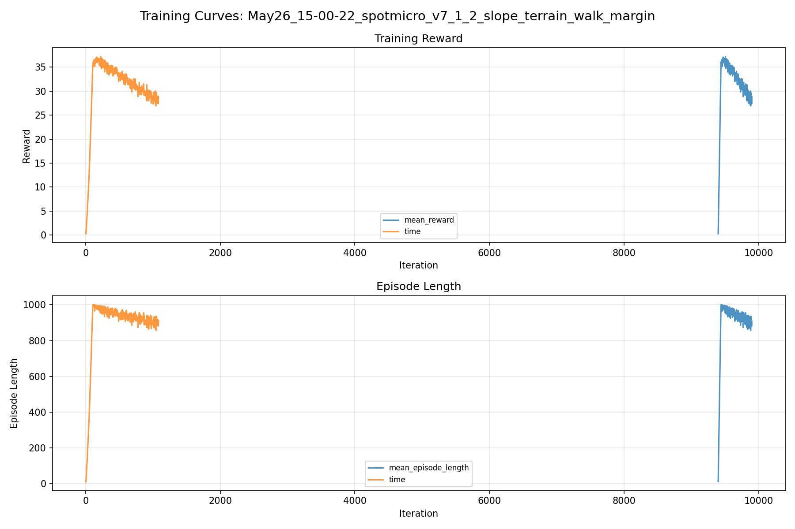
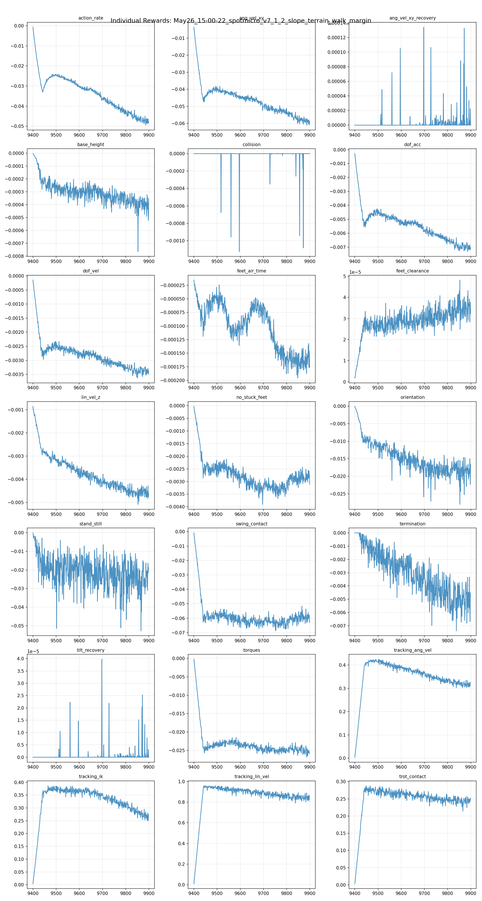
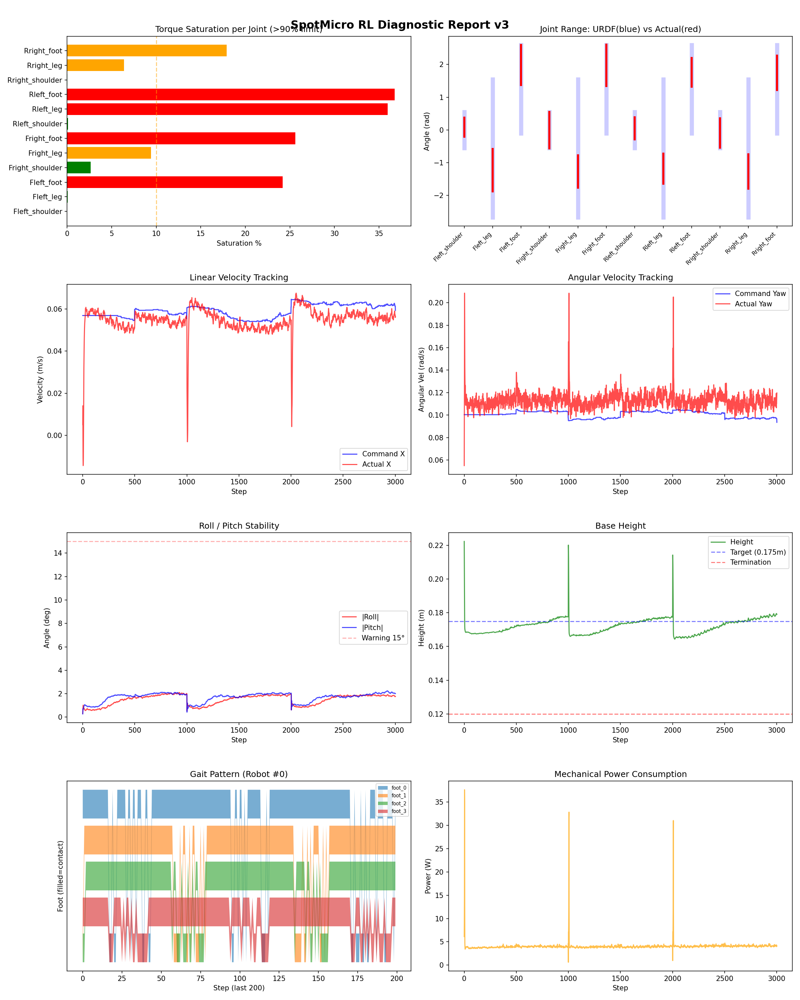
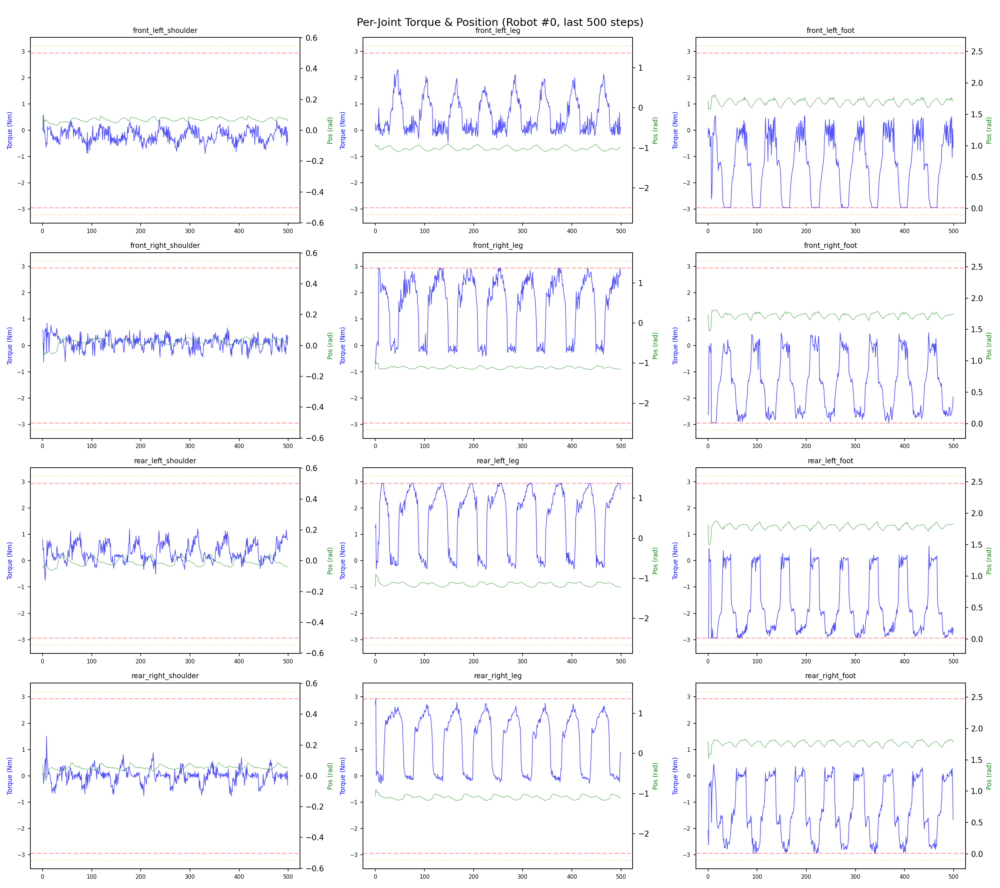
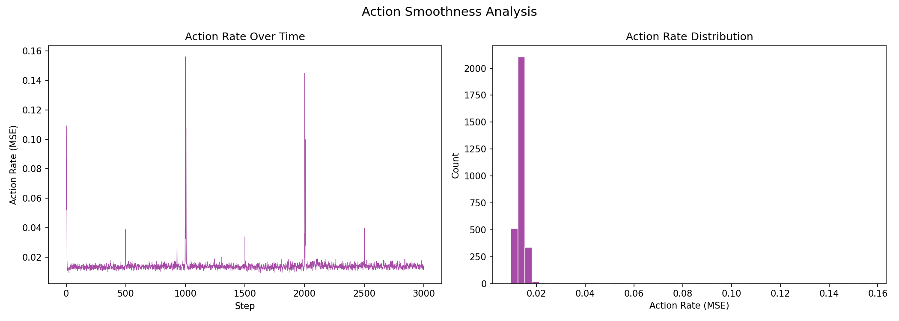

# 실험 091: spotmicro_v7_1_2_slope_terrain_walk_margin

- **날짜:** 2026-05-26 15:23
- **Task:** spotmicro_test
- **Run name:** `spotmicro_v7_1_2_slope_terrain_walk_margin`
- **판정:** ❌ FAIL (일부 기준 미달)

---

## 실험 목적

v7.1.2: termination 보완 되어야함

---

## 변경점 (이전 커밋 대비)

```diff
diff --git a/ai_training/rl/legged_gym/legged_gym/envs/spotmicro_test/spotmicro_test_config.py b/ai_training/rl/legged_gym/legged_gym/envs/spotmicro_test/spotmicro_test_config.py
index 08f76df..12b74a9 100644
--- a/ai_training/rl/legged_gym/legged_gym/envs/spotmicro_test/spotmicro_test_config.py
+++ b/ai_training/rl/legged_gym/legged_gym/envs/spotmicro_test/spotmicro_test_config.py
@@ -59,6 +59,7 @@ class SpotmicroTestCfg(LeggedRobotCfg):
         num_cols = 12
         terrain_length = 6.0
         terrain_width = 6.0
+        curriculum_use_full_range = True
         curriculum_move_up_distance = 1.10
         curriculum_move_down_command_scale = 0.25
         terrain_proportions = [0.50, 0.25, 0.25]
@@ -133,10 +134,10 @@ class SpotmicroTestCfg(LeggedRobotCfg):
             lin_vel_z = -2.0
             ang_vel_xy = -1.0
             orientation = -10.0
-            torques = -0.0015
+            torques = -0.001
             dof_vel = -0.0005
             dof_acc = -2.5e-7
-            action_rate = -0.06
+            action_rate = -0.05
             base_height = -2.0
             feet_air_time = 0.04
             dof_pos_limits = 0.0
@@ -250,10 +251,10 @@ class SpotmicroTestCfgPPO(LeggedRobotCfgPPO):
         learning_rate = 1e-4
 
     class runner(LeggedRobotCfgPPO.runner):
-        run_name = 'spotmicro_v7_1_1_slope_terrain_walk_refine'
+        run_name = 'spotmicro_v7_1_2_slope_terrain_walk_margin'
         experiment_name = 'spotmicro_test'
         max_iterations = 500
         save_interval = 100
         resume = True
-        load_run = "May26_13-42-58_spotmicro_v7_1_slope_terrain_gentle_restart"
-        checkpoint = 8900
+        load_run = "May26_14-34-40_spotmicro_v7_1_1_slope_terrain_walk_refine"
+        checkpoint = 9400
diff --git a/ai_training/rl/legged_gym/legged_gym/utils/terrain.py b/ai_training/rl/legged_gym/legged_gym/utils/terrain.py
index 5f759c8..75e808d 100644
--- a/ai_training/rl/legged_gym/legged_gym/utils/terrain.py
+++ b/ai_training/rl/legged_gym/legged_gym/utils/terrain.py
@@ -85,7 +85,10 @@ class Terrain:
     def curiculum(self):
         for j in range(self.cfg.num_cols):
             for i in range(self.cfg.num_rows):
-                difficulty = i / self.cfg.num_rows
+                if getattr(self.cfg, "curriculum_use_full_range", False):
+                    difficulty = i / max(self.cfg.num_rows - 1, 1)
+                else:
+                    difficulty = i / self.cfg.num_rows
                 choice = j / self.cfg.num_cols + 0.001
 
                 terrain = self.make_terrain(choice, difficulty)
```

**변경 요약:**
  + curriculum_use_full_range = True
  - torques = -0.0015
  + torques = -0.001
  - action_rate = -0.06
  + action_rate = -0.05
  - run_name = 'spotmicro_v7_1_1_slope_terrain_walk_refine'
  + run_name = 'spotmicro_v7_1_2_slope_terrain_walk_margin'
  - load_run = "May26_13-42-58_spotmicro_v7_1_slope_terrain_gentle_restart"
  - checkpoint = 8900
  + load_run = "May26_14-34-40_spotmicro_v7_1_1_slope_terrain_walk_refine"
  + checkpoint = 9400
  - difficulty = i / self.cfg.num_rows
  + if getattr(self.cfg, "curriculum_use_full_range", False):
  + difficulty = i / max(self.cfg.num_rows - 1, 1)
  + else:
  + difficulty = i / self.cfg.num_rows

---

## 현재 Reward Scales

| Reward | Scale |
|--------|-------|
| action_rate | -0.05 |
| ang_vel_xy | -1.0 |
| ang_vel_xy_recovery | 0.5 |
| base_height | -2.0 |
| collision | -1.0 |
| dof_acc | -2.5e-07 |
| dof_vel | -0.0005 |
| feet_air_time | 0.04 |
| feet_clearance | 0.03 |
| lin_vel_z | -2.0 |
| no_stuck_feet | -0.2 |
| orientation | -10.0 |
| stand_still | -0.4 |
| swing_contact | -0.45 |
| termination | -20.0 |
| tilt_recovery | 4.0 |
| torques | -0.001 |
| tracking_ang_vel | 0.6 |
| tracking_ik | 0.6 |
| tracking_lin_vel | 1.0 |
| trot_contact | 0.35 |

---

## 진단 결과 (Diagnostic)


### 지형 설정

| 항목 | 값 |
|------|-----|
| 평가 모드 | terrain_random_walk |
| walk_eval | True |
| mesh_type | trimesh |
| terrain_profile | spotmicro_slope |
| measure_heights | False |
| grid | 5 x 5 |
| env 크기 | 6.0 x 6.0 m |
| terrain_proportions | [0.5, 0.25, 0.25] |
| slope max | 0.1 |
| rolling amp max | 0.015 m |


### 핵심 지표

- ⚠️ Timeout: 75.7% (60~80%, 개선 필요)
- ✅ 속도오차 X: 0.0215 m/s (<0.08)
- ⚠️ 토크포화: 13.3% (10~40%)
- ✅ 자세: roll 1.5°, pitch 1.7° (<10°)
- ✅ 조기종료: 0.0% (<5%)
- ⚠️ 18도+ pre-fall 복구: trial 없음 (30도 목표 미검증)
- ℹ️ Recovery/pre-fall 지표는 참고값입니다 (terrain run 자동 PASS/FAIL 기준에서는 제외)

### 상세 수치

| 지표 | 값 |
|------|-----|
| Timeout% | 75.68438003220612 |
| 조기종료% | 0.0 |
| 속도오차 X | 0.021512189880013466 m/s |
| 속도오차 Y | 0.012988110072910786 m/s |
| 각속도오차 | 0.07413334399461746 rad/s |
| 토크포화% | 13.252589424464425 |
| 평균 높이 | 0.17214041974617567 m |
| Roll (평균) | 1.4977203607559204° |
| Pitch (평균) | 1.7008482217788696° |
| Action Rate | 0.014224759303033352 |
| 평균 전력 | 4.038651943206787 W |
| CoT | 2.7616550140340292 |
| Recovery 성공률 | None% |
| Recovery eligible trials | 0 |
| 평균 회복 시간 | None s |
| Recovery 조기 실패율 | None% |
| Recovery 18도+ 성공률 | None% |
| Recovery 18도+ trials | 0 |
| Recovery 18도+ horizon 후 tilt | None° |
| Transition recovery 성공률 | None% |
| Transition recovery eligible trials | 0 |
| 평균 Transition recovery 시간 | None s |
| Transition 18도+ 성공률 | None% |
| Transition 18도+ trials | 0 |
| Transition 18도+ horizon 후 tilt | None° |

## Recovery Assist 분석

| 지표 | 값 |
|------|-----|
| 판정 | ⚠️ eligible trial 없음 |
| Recovery 성공률 | N/A |
| 성공/실패 | 0 / 0 |
| Eligible trials | 0 / 873 |
| 평균 회복 시간 | N/A |
| 조기 실패율 | N/A |
| 평가 horizon | 1.0 s |
| 초기 tilt 기준 | 12.000000000000002° |
| 안정 기준 | roll/pitch < 5.0°, height > 0.165m |
| 평균 초기 tilt | None° |
| 평균 초기 roll/pitch | None° / None° |
| 1초 후 평균 roll/pitch | None° / None° |
| 1초 내 최대 roll/pitch 평균 | None° / None° |

> 해석: `Recovery 성공률`은 초기 tilt가 기준 이상인 episode 중 1초 내 안정 자세로 복귀한 비율입니다. 조기 실패율이 높으면 reset 직후 바로 넘어지는 것이고, 평균 회복 시간이 짧을수록 위기 대응이 빠른 것입니다.

### Recovery Tilt Band 분석

| Tilt 구간 | Trials | 성공률 | Horizon 후 평균 tilt | 평균 회복 시간 |
|-----------|--------|--------|----------------------|----------------|
| 12-18 deg | 0 | N/A | N/A | N/A |
| 18-25 deg | 0 | N/A | N/A | N/A |
| 25-30 deg | 0 | N/A | N/A | N/A |
| 30+ deg | 0 | N/A | N/A | N/A |
| 18+ deg 전체 | 0 | N/A | N/A | N/A |

> 이번 pre-fall 목표는 특히 `18-25 deg`, `25-30 deg`, `18+ deg 전체` 행을 우선 봅니다. `25-30 deg` trial이 없으면 30도 근처 회복 성능은 아직 검증되지 않은 것입니다.


## Transition Recovery 분석

| 지표 | 값 |
|------|-----|
| 판정 | ⚠️ eligible trial 없음 |
| Transition recovery 성공률 | N/A |
| 성공/실패 | 0 / 0 |
| Eligible trials | 0 / 0 |
| 평균 회복 시간 | N/A |
| 조기 실패율 | N/A |
| 평가 horizon | 0.75 s |
| push 후 eligible 기준 | max roll/pitch > 12.000000000000002° |
| 안정 기준 | roll/pitch < 5.0°, height > 0.165m |
| 평균 최대 tilt | None° |
| horizon 후 평균 roll/pitch | None° / None° |

> 해석: `Transition Recovery`는 학습 중 push/roll-pitch angular impulse가 들어간 뒤 일정 시간 안에 자세가 안정 기준으로 돌아오는지를 봅니다.

### Transition Recovery Tilt Band 분석

| Tilt 구간 | Trials | 성공률 | Horizon 후 평균 tilt | 평균 회복 시간 |
|-----------|--------|--------|----------------------|----------------|
| 12-18 deg | 0 | N/A | N/A | N/A |
| 18-25 deg | 0 | N/A | N/A | N/A |
| 25-30 deg | 0 | N/A | N/A | N/A |
| 30+ deg | 0 | N/A | N/A | N/A |
| 18+ deg 전체 | 0 | N/A | N/A | N/A |

> 이번 pre-fall 목표는 특히 `18-25 deg`, `25-30 deg`, `18+ deg 전체` 행을 우선 봅니다. `25-30 deg` trial이 없으면 30도 근처 회복 성능은 아직 검증되지 않은 것입니다.


## Command Mode별 회전 추종 분석

| 모드 | 비율 | 샘플 수 | 평균 abs(cmd_wz) | 평균 abs(actual_wz) | yaw 오차 | 상태 |
|------|------|---------|------------------|---------------------|----------|------|
| 정지 | 10.6% | 81659 | 0.0245 | 0.0678 | 0.0665 | ❌ |
| 직진/저회전 | 41.5% | 318864 | 0.0774 | 0.1001 | 0.0750 | ✅ |
| 제자리 회전 | 11.7% | 90062 | 0.1749 | 0.1608 | 0.0754 | ✅ |
| 전진+회전 | 13.0% | 100113 | 0.1756 | 0.1605 | 0.0781 | ✅ |
| 큰 회전명령 | 0.0% | 0 | N/A | N/A | N/A | N/A |

> 해석 기준: `제자리 회전`만 나쁘면 pure turn 학습/보행 패턴 문제, `큰 회전명령`만 나쁘면 yaw 명령 범위가 현재 토크/보폭 한계보다 큰 문제, `정지`가 나쁘면 stop drift 문제로 보면 됩니다.
        


## 학습 곡선 분석

| 지표 | 값 | 판정 |
|------|-----|------|
| 수렴 iter (90%) | 9439 | 느림 |
| 후반 안정성 (CV) | 0.056 | 보통 |
| 정체 구간 | 없음 | |


## Per-leg 분석

### 발별 접촉/공중 비율

| 발 | 접촉% | 공중% |
|-----|-------|------|
| foot_0 | 76.2% | 23.8% |
| foot_1 | 74.2% | 25.8% |
| foot_2 | 75.5% | 24.5% |
| foot_3 | 65.8% | 34.2% |

### 관절별 토크 포화

| 관절 | 포화% | 최대토크 | 한계 | 상태 |
|------|------|---------|------|------|
| front_left_shoulder | 0.0% | 2.940 | 2.940 | ✅ |
| front_left_leg | 0.1% | 2.940 | 2.940 | ✅ |
| front_left_foot | 24.2% | 2.940 | 2.940 | ❌ |
| front_right_shoulder | 2.7% | 2.940 | 2.940 | ✅ |
| front_right_leg | 9.4% | 2.940 | 2.940 | ⚠️ |
| front_right_foot | 25.6% | 2.940 | 2.940 | ❌ |
| rear_left_shoulder | 0.1% | 2.940 | 2.940 | ✅ |
| rear_left_leg | 36.0% | 2.940 | 2.940 | ❌ |
| rear_left_foot | 36.8% | 2.940 | 2.940 | ❌ |
| rear_right_shoulder | 0.0% | 2.940 | 2.940 | ✅ |
| rear_right_leg | 6.4% | 2.940 | 2.940 | ⚠️ |
| rear_right_foot | 17.9% | 2.940 | 2.940 | ⚠️ |


## Gait 분석

| 지표 | 값 |
|------|-----|
| Gait 주파수 | 0.21 Hz |
| Gait 주기 | 60 steps |
| 대각 동기화율 | 86.4% |
| L/R 비대칭 | 0.0%p |
| 판정 | ✅ Trot 패턴 / ✅ 대칭 |


## 관절별 상세

| 관절 | 토크포화% | 사용범위% | 편향(rad) | 한계근접% | 상태 |
|------|----------|----------|----------|----------|------|
| front_left_shoulder | 0.0% | 53% | +0.084 | 0.0% | ✅ |
| front_left_leg | 0.1% | 31% | -1.229 | 0.0% | ⚠️ |
| front_left_foot | 24.2% | 45% | +1.982 | 0.0% | ⚠️ |
| front_right_shoulder | 2.7% | 101% | -0.009 | 0.0% | ✅ |
| front_right_leg | 9.4% | 24% | -1.269 | 0.0% | ⚠️ |
| front_right_foot | 25.6% | 47% | +1.972 | 0.0% | ⚠️ |
| rear_left_shoulder | 0.1% | 62% | +0.048 | 0.0% | ✅ |
| rear_left_leg | 36.0% | 22% | -1.181 | 0.0% | ⚠️ |
| rear_left_foot | 36.8% | 33% | +1.757 | 0.0% | ⚠️ |
| rear_right_shoulder | 0.0% | 82% | -0.092 | 0.0% | ✅ |
| rear_right_leg | 6.4% | 25% | -1.268 | 0.0% | ⚠️ |
| rear_right_foot | 17.9% | 39% | +1.746 | 0.0% | ⚠️ |


## 에너지 효율 상세

| 지표 | 값 |
|------|-----|
| 평균 전력 | 4.04 W |
| 피크 전력 | 37.67 W |
| 피크/평균 비율 | 9.3x |
| CoT | 2.76 |

### 관절별 전력 분배

| 관절 | 평균전력(W) | 비율% |
|------|-----------|-------|
| rear_left_foot | 0.703 | 17.4% |
| front_right_foot | 0.638 | 15.8% |
| front_left_foot | 0.575 | 14.2% |
| front_right_leg | 0.430 | 10.7% |
| rear_right_foot | 0.419 | 10.4% |
| rear_left_leg | 0.416 | 10.3% |
| rear_right_leg | 0.364 | 9.0% |
| front_left_leg | 0.191 | 4.7% |
| front_right_shoulder | 0.121 | 3.0% |
| rear_left_shoulder | 0.098 | 2.4% |
| rear_right_shoulder | 0.047 | 1.2% |
| front_left_shoulder | 0.037 | 0.9% |


## 이전 실험 대비 비교

| 지표 | 이전 (exp090) | 현재 (exp091) | 변화 |
|------|-------|-------|------|
| Timeout% | 73.7% | 75.7% | ✅ ↑ 1.9918% |
| 속도오차 X | 0.0205 | 0.0215 | ⚠️ ↑ 0.0010m/s |
| 토크포화 | 11.9% | 13.3% | ⚠️ ↑ 1.3991% |
| Roll | 1.5° | 1.5° | ⚠️ ↑ 0.0354° |
| Pitch | 1.8° | 1.7° | ✅ ↓ 0.0770° |
| 평균 전력 | 3.8283W | 4.0387W | ⚠️ ↑ 0.2104W |


## Tensorboard 학습 곡선 요약

| 스칼라 | 최종값 | 최대 | 최소 | 후반10% 평균 |
|--------|--------|------|------|-------------|
| rew_action_rate | -0.0481 | -0.0007 | -0.0495 | -0.0471 |
| rew_ang_vel_xy | -0.0589 | -0.0036 | -0.0610 | -0.0584 |
| rew_ang_vel_xy_recovery | 0.0000 | 0.0001 | 0.0000 | 0.0000 |
| rew_base_height | -0.0004 | -0.0000 | -0.0008 | -0.0004 |
| rew_collision | 0.0000 | 0.0000 | -0.0011 | -0.0000 |
| rew_dof_acc | -0.0070 | -0.0003 | -0.0073 | -0.0070 |
| rew_dof_vel | -0.0034 | -0.0001 | -0.0036 | -0.0034 |
| rew_feet_air_time | -0.0002 | -0.0000 | -0.0002 | -0.0002 |
| rew_feet_clearance | 0.0000 | 0.0000 | 0.0000 | 0.0000 |
| rew_lin_vel_z | -0.0046 | -0.0009 | -0.0051 | -0.0046 |
| rew_no_stuck_feet | -0.0031 | -0.0000 | -0.0039 | -0.0028 |
| rew_orientation | -0.0165 | -0.0001 | -0.0280 | -0.0189 |
| rew_stand_still | -0.0191 | -0.0001 | -0.0527 | -0.0259 |
| rew_swing_contact | -0.0631 | -0.0008 | -0.0688 | -0.0591 |
| rew_termination | -0.0048 | 0.0000 | -0.0074 | -0.0051 |
| rew_tilt_recovery | 0.0000 | 0.0000 | 0.0000 | 0.0000 |
| rew_torques | -0.0258 | -0.0002 | -0.0269 | -0.0251 |
| rew_tracking_ang_vel | 0.3264 | 0.4251 | 0.0041 | 0.3175 |
| rew_tracking_ik | 0.2758 | 0.3867 | 0.0044 | 0.2732 |
| rew_tracking_lin_vel | 0.8610 | 0.9586 | 0.0105 | 0.8435 |
| rew_trot_contact | 0.2526 | 0.2880 | 0.0035 | 0.2427 |
| terrain_level | 3.4335 | 3.4335 | 0.4669 | 3.3595 |
| learning_rate | 0.0002 | 0.0005 | 0.0000 | 0.0003 |
| surrogate | -0.0021 | 0.0012 | -0.0049 | -0.0029 |
| value_function | 0.0205 | 0.0296 | 0.0014 | 0.0214 |
| collection time | 1.8058 | 3.9886 | 1.3157 | 1.8083 |
| learning_time | 0.5779 | 0.6185 | 0.2786 | 0.5804 |
| total_fps | 41241.0000 | 61151.0000 | 22728.0000 | 41158.5000 |
| mean_noise_std | 0.1844 | 0.1850 | 0.1180 | 0.1840 |
| mean_episode_length | 909.3300 | 1000.9500 | 11.9302 | 899.8118 |
| time | 909.3300 | 1000.9500 | 11.9302 | 899.8118 |
| mean_reward | 28.9133 | 37.1847 | 0.2948 | 28.4830 |
| time | 28.9133 | 37.1847 | 0.2948 | 28.4830 |

총 학습 iteration: 9899


---

## 그래프

### Tensorboard 학습 곡선



### Diagnostic 결과





---

## 결론 및 다음 실험 방향

**자동 판정:** ❌ FAIL (일부 기준 미달)

대부분 기준을 통과했으나 일부 항목이 보통 수준입니다.
  - ⚠️ Timeout: 75.7% (60~80%, 개선 필요)
  - ⚠️ 토크포화: 13.3% (10~40%)
  - ⚠️ 18도+ pre-fall 복구: trial 없음 (30도 목표 미검증)

> 💡 위 결론은 자동 생성되었습니다. 필요시 수정하세요.

---

## 메모

_(추가 메모가 있으면 여기에 작성)_

