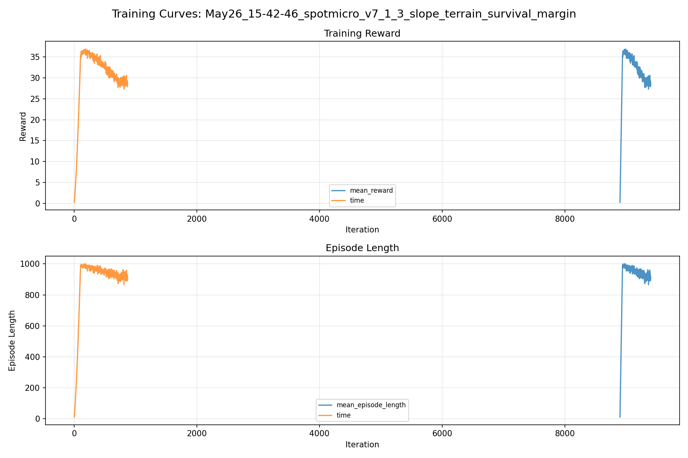
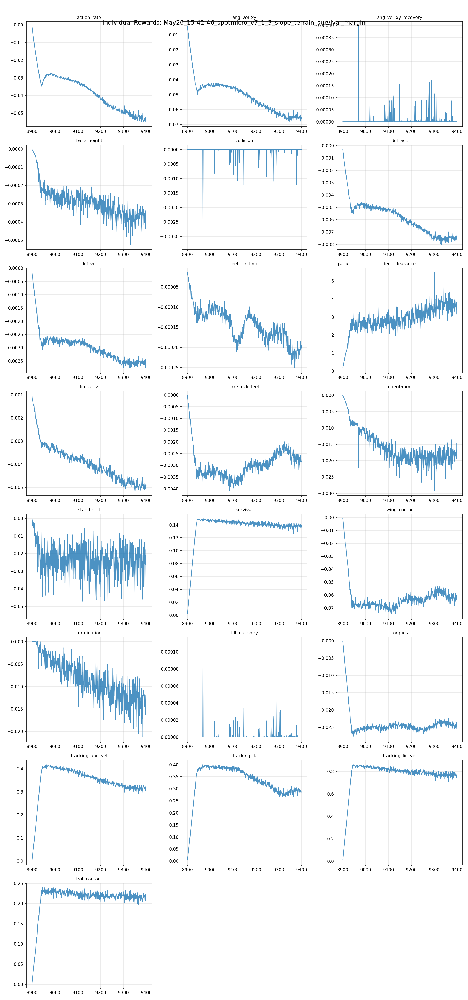
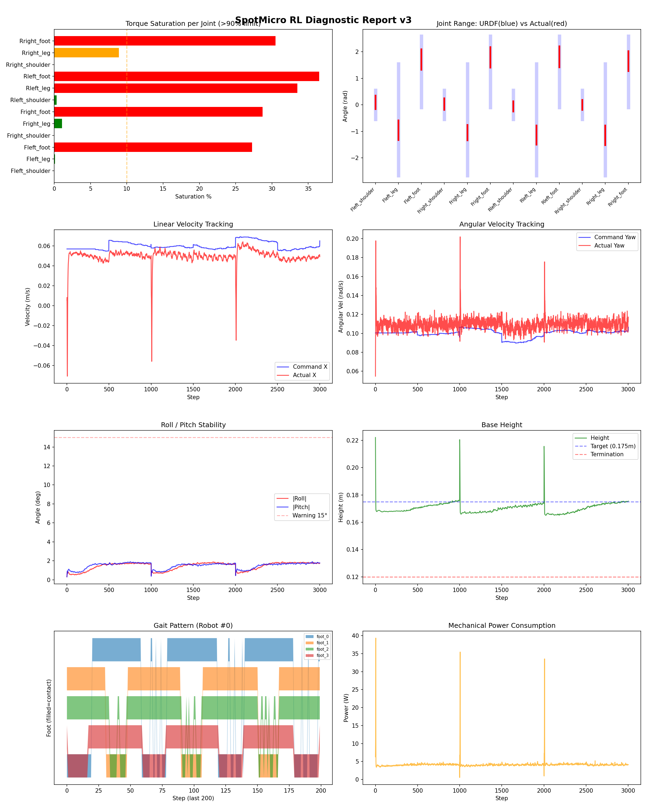
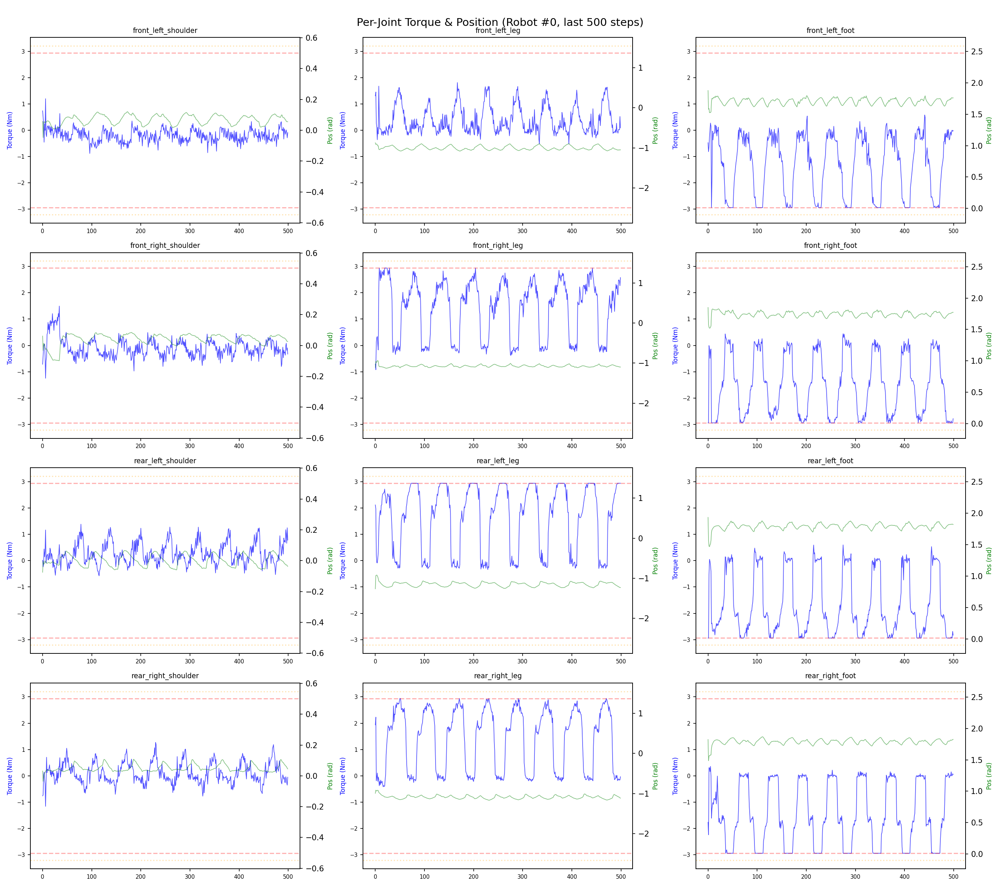
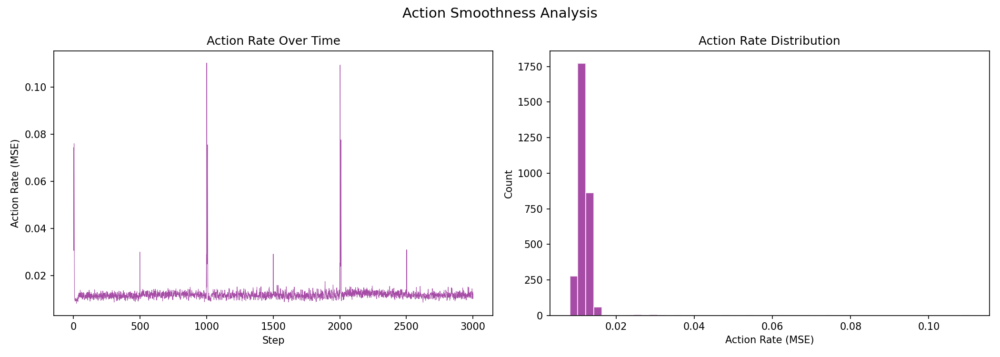

# 실험 092: spotmicro_v7_1_3_slope_terrain_survival_margin

- **날짜:** 2026-05-26 16:01
- **Task:** spotmicro_test
- **Run name:** `spotmicro_v7_1_3_slope_terrain_survival_margin`
- **판정:** ❌ FAIL (일부 기준 미달)

---

## 실험 목적

v7.1.3: timeout 비율 보완

---

## 변경점 (이전 커밋 대비)

```diff
diff --git a/ai_training/rl/legged_gym/legged_gym/envs/spotmicro_test/spotmicro_test.py b/ai_training/rl/legged_gym/legged_gym/envs/spotmicro_test/spotmicro_test.py
index 426fd17..ec91699 100644
--- a/ai_training/rl/legged_gym/legged_gym/envs/spotmicro_test/spotmicro_test.py
+++ b/ai_training/rl/legged_gym/legged_gym/envs/spotmicro_test/spotmicro_test.py
@@ -859,6 +859,9 @@ class SpotmicroTest(LeggedRobot):
             self._get_effective_commands(), dim=1) > self.blend_cmd_norm).float()
         return reward
 
+    def _reward_survival(self):
+        return (~self.reset_buf.bool()).float()
+
     def _reward_feet_clearance(self):
         contact = self.contact_forces[:, self.feet_indices, 2] > 1.
         contact_filt = torch.logical_or(contact, self.last_contacts)
diff --git a/ai_training/rl/legged_gym/legged_gym/envs/spotmicro_test/spotmicro_test_config.py b/ai_training/rl/legged_gym/legged_gym/envs/spotmicro_test/spotmicro_test_config.py
index 12b74a9..7c661ed 100644
--- a/ai_training/rl/legged_gym/legged_gym/envs/spotmicro_test/spotmicro_test_config.py
+++ b/ai_training/rl/legged_gym/legged_gym/envs/spotmicro_test/spotmicro_test_config.py
@@ -128,9 +128,10 @@ class SpotmicroTestCfg(LeggedRobotCfg):
 
     class rewards(LeggedRobotCfg.rewards):
         class scales:
-            tracking_lin_vel = 1.0
+            tracking_lin_vel = 0.9
             tracking_ang_vel = 0.6
-            termination = -20.0
+            termination = -60.0
+            survival = 0.15
             lin_vel_z = -2.0
             ang_vel_xy = -1.0
             orientation = -10.0
@@ -147,7 +148,7 @@ class SpotmicroTestCfg(LeggedRobotCfg):
             symmetric_gait = 0.0
             feet_clearance = 0.03
             swing_contact = -0.45
-            trot_contact = 0.35
+            trot_contact = 0.30
             tracking_ik = 0.6
             stand_still = -0.4
             tilt_recovery = 4.0
@@ -251,10 +252,10 @@ class SpotmicroTestCfgPPO(LeggedRobotCfgPPO):
         learning_rate = 1e-4
 
     class runner(LeggedRobotCfgPPO.runner):
-        run_name = 'spotmicro_v7_1_2_slope_terrain_walk_margin'
+        run_name = 'spotmicro_v7_1_3_slope_terrain_survival_margin'
         experiment_name = 'spotmicro_test'
         max_iterations = 500
         save_interval = 100
         resume = True
-        load_run = "May26_14-34-40_spotmicro_v7_1_1_slope_terrain_walk_refine"
-        checkpoint = 9400
+        load_run = "May26_13-42-58_spotmicro_v7_1_slope_terrain_gentle_restart"
+        checkpoint = 8900
```

**변경 요약:**
  + def _reward_survival(self):
  + return (~self.reset_buf.bool()).float()
  - tracking_lin_vel = 1.0
  + tracking_lin_vel = 0.9
  - termination = -20.0
  + termination = -60.0
  + survival = 0.15
  - trot_contact = 0.35
  + trot_contact = 0.30
  - run_name = 'spotmicro_v7_1_2_slope_terrain_walk_margin'
  + run_name = 'spotmicro_v7_1_3_slope_terrain_survival_margin'
  - load_run = "May26_14-34-40_spotmicro_v7_1_1_slope_terrain_walk_refine"
  - checkpoint = 9400
  + load_run = "May26_13-42-58_spotmicro_v7_1_slope_terrain_gentle_restart"
  + checkpoint = 8900

---

## 현재 Reward Scales

| Reward | Scale |
|--------|-------|
| action_rate | -0.05 |
| ang_vel_xy | -1.0 |
| ang_vel_xy_recovery | 0.5 |
| base_height | -2.0 |
| collision | -1.0 |
| dof_acc | -2.5e-07 |
| dof_vel | -0.0005 |
| feet_air_time | 0.04 |
| feet_clearance | 0.03 |
| lin_vel_z | -2.0 |
| no_stuck_feet | -0.2 |
| orientation | -10.0 |
| stand_still | -0.4 |
| survival | 0.15 |
| swing_contact | -0.45 |
| termination | -60.0 |
| tilt_recovery | 4.0 |
| torques | -0.001 |
| tracking_ang_vel | 0.6 |
| tracking_ik | 0.6 |
| tracking_lin_vel | 0.9 |
| trot_contact | 0.3 |

---

## 진단 결과 (Diagnostic)


### 지형 설정

| 항목 | 값 |
|------|-----|
| 평가 모드 | terrain_random_walk |
| walk_eval | True |
| mesh_type | trimesh |
| terrain_profile | spotmicro_slope |
| measure_heights | False |
| grid | 5 x 5 |
| env 크기 | 6.0 x 6.0 m |
| terrain_proportions | [0.5, 0.25, 0.25] |
| slope max | 0.1 |
| rolling amp max | 0.015 m |


### 핵심 지표

- ⚠️ Timeout: 75.1% (60~80%, 개선 필요)
- ✅ 속도오차 X: 0.0250 m/s (<0.08)
- ⚠️ 토크포화: 13.9% (10~40%)
- ✅ 자세: roll 1.4°, pitch 1.5° (<10°)
- ✅ 조기종료: 0.0% (<5%)
- ⚠️ 18도+ pre-fall 복구: trial 없음 (30도 목표 미검증)
- ℹ️ Recovery/pre-fall 지표는 참고값입니다 (terrain run 자동 PASS/FAIL 기준에서는 제외)

### 상세 수치

| 지표 | 값 |
|------|-----|
| Timeout% | 75.08090614886731 |
| 조기종료% | 0.0 |
| 속도오차 X | 0.024991873651742935 m/s |
| 속도오차 Y | 0.01239714864641428 m/s |
| 각속도오차 | 0.07445363700389862 rad/s |
| 토크포화% | 13.906156777250528 |
| 평균 높이 | 0.170446402890421 m |
| Roll (평균) | 1.437788486480713° |
| Pitch (평균) | 1.5002250671386719° |
| Action Rate | 0.0120632853358984 |
| 평균 전력 | 4.155256748199463 W |
| CoT | 3.048300725285369 |
| Recovery 성공률 | None% |
| Recovery eligible trials | 0 |
| 평균 회복 시간 | None s |
| Recovery 조기 실패율 | None% |
| Recovery 18도+ 성공률 | None% |
| Recovery 18도+ trials | 0 |
| Recovery 18도+ horizon 후 tilt | None° |
| Transition recovery 성공률 | None% |
| Transition recovery eligible trials | 0 |
| 평균 Transition recovery 시간 | None s |
| Transition 18도+ 성공률 | None% |
| Transition 18도+ trials | 0 |
| Transition 18도+ horizon 후 tilt | None° |

## Recovery Assist 분석

| 지표 | 값 |
|------|-----|
| 판정 | ⚠️ eligible trial 없음 |
| Recovery 성공률 | N/A |
| 성공/실패 | 0 / 0 |
| Eligible trials | 0 / 871 |
| 평균 회복 시간 | N/A |
| 조기 실패율 | N/A |
| 평가 horizon | 1.0 s |
| 초기 tilt 기준 | 12.000000000000002° |
| 안정 기준 | roll/pitch < 5.0°, height > 0.165m |
| 평균 초기 tilt | None° |
| 평균 초기 roll/pitch | None° / None° |
| 1초 후 평균 roll/pitch | None° / None° |
| 1초 내 최대 roll/pitch 평균 | None° / None° |

> 해석: `Recovery 성공률`은 초기 tilt가 기준 이상인 episode 중 1초 내 안정 자세로 복귀한 비율입니다. 조기 실패율이 높으면 reset 직후 바로 넘어지는 것이고, 평균 회복 시간이 짧을수록 위기 대응이 빠른 것입니다.

### Recovery Tilt Band 분석

| Tilt 구간 | Trials | 성공률 | Horizon 후 평균 tilt | 평균 회복 시간 |
|-----------|--------|--------|----------------------|----------------|
| 12-18 deg | 0 | N/A | N/A | N/A |
| 18-25 deg | 0 | N/A | N/A | N/A |
| 25-30 deg | 0 | N/A | N/A | N/A |
| 30+ deg | 0 | N/A | N/A | N/A |
| 18+ deg 전체 | 0 | N/A | N/A | N/A |

> 이번 pre-fall 목표는 특히 `18-25 deg`, `25-30 deg`, `18+ deg 전체` 행을 우선 봅니다. `25-30 deg` trial이 없으면 30도 근처 회복 성능은 아직 검증되지 않은 것입니다.


## Transition Recovery 분석

| 지표 | 값 |
|------|-----|
| 판정 | ⚠️ eligible trial 없음 |
| Transition recovery 성공률 | N/A |
| 성공/실패 | 0 / 0 |
| Eligible trials | 0 / 0 |
| 평균 회복 시간 | N/A |
| 조기 실패율 | N/A |
| 평가 horizon | 0.75 s |
| push 후 eligible 기준 | max roll/pitch > 12.000000000000002° |
| 안정 기준 | roll/pitch < 5.0°, height > 0.165m |
| 평균 최대 tilt | None° |
| horizon 후 평균 roll/pitch | None° / None° |

> 해석: `Transition Recovery`는 학습 중 push/roll-pitch angular impulse가 들어간 뒤 일정 시간 안에 자세가 안정 기준으로 돌아오는지를 봅니다.

### Transition Recovery Tilt Band 분석

| Tilt 구간 | Trials | 성공률 | Horizon 후 평균 tilt | 평균 회복 시간 |
|-----------|--------|--------|----------------------|----------------|
| 12-18 deg | 0 | N/A | N/A | N/A |
| 18-25 deg | 0 | N/A | N/A | N/A |
| 25-30 deg | 0 | N/A | N/A | N/A |
| 30+ deg | 0 | N/A | N/A | N/A |
| 18+ deg 전체 | 0 | N/A | N/A | N/A |

> 이번 pre-fall 목표는 특히 `18-25 deg`, `25-30 deg`, `18+ deg 전체` 행을 우선 봅니다. `25-30 deg` trial이 없으면 30도 근처 회복 성능은 아직 검증되지 않은 것입니다.


## Command Mode별 회전 추종 분석

| 모드 | 비율 | 샘플 수 | 평균 abs(cmd_wz) | 평균 abs(actual_wz) | yaw 오차 | 상태 |
|------|------|---------|------------------|---------------------|----------|------|
| 정지 | 11.0% | 84320 | 0.0274 | 0.0664 | 0.0646 | ❌ |
| 직진/저회전 | 40.2% | 309096 | 0.0757 | 0.0997 | 0.0775 | ✅ |
| 제자리 회전 | 10.2% | 78223 | 0.1741 | 0.1485 | 0.0742 | ✅ |
| 전진+회전 | 14.3% | 110044 | 0.1754 | 0.1604 | 0.0808 | ⚠️ |
| 큰 회전명령 | 0.0% | 0 | N/A | N/A | N/A | N/A |

> 해석 기준: `제자리 회전`만 나쁘면 pure turn 학습/보행 패턴 문제, `큰 회전명령`만 나쁘면 yaw 명령 범위가 현재 토크/보폭 한계보다 큰 문제, `정지`가 나쁘면 stop drift 문제로 보면 됩니다.
        


## 학습 곡선 분석

| 지표 | 값 | 판정 |
|------|-----|------|
| 수렴 iter (90%) | 8938 | 느림 |
| 후반 안정성 (CV) | 0.049 | 안정 |
| 정체 구간 | 없음 | |


## Per-leg 분석

### 발별 접촉/공중 비율

| 발 | 접촉% | 공중% |
|-----|-------|------|
| foot_0 | 75.6% | 24.4% |
| foot_1 | 73.0% | 27.0% |
| foot_2 | 77.6% | 22.4% |
| foot_3 | 69.5% | 30.5% |

### 관절별 토크 포화

| 관절 | 포화% | 최대토크 | 한계 | 상태 |
|------|------|---------|------|------|
| front_left_shoulder | 0.0% | 2.645 | 2.940 | ✅ |
| front_left_leg | 0.1% | 2.940 | 2.940 | ✅ |
| front_left_foot | 27.2% | 2.940 | 2.940 | ❌ |
| front_right_shoulder | 0.0% | 2.940 | 2.940 | ✅ |
| front_right_leg | 1.1% | 2.940 | 2.940 | ✅ |
| front_right_foot | 28.7% | 2.940 | 2.940 | ❌ |
| rear_left_shoulder | 0.3% | 2.940 | 2.940 | ✅ |
| rear_left_leg | 33.5% | 2.940 | 2.940 | ❌ |
| rear_left_foot | 36.5% | 2.940 | 2.940 | ❌ |
| rear_right_shoulder | 0.0% | 2.726 | 2.940 | ✅ |
| rear_right_leg | 8.9% | 2.940 | 2.940 | ⚠️ |
| rear_right_foot | 30.5% | 2.940 | 2.940 | ❌ |


## Gait 분석

| 지표 | 값 |
|------|-----|
| Gait 주파수 | 0.20 Hz |
| Gait 주기 | 61 steps |
| 대각 동기화율 | 89.6% |
| L/R 비대칭 | 0.0%p |
| 판정 | ✅ Trot 패턴 / ✅ 대칭 |


## 관절별 상세

| 관절 | 토크포화% | 사용범위% | 편향(rad) | 한계근접% | 상태 |
|------|----------|----------|----------|----------|------|
| front_left_shoulder | 0.0% | 47% | +0.094 | 0.0% | ✅ |
| front_left_leg | 0.1% | 18% | -0.958 | 0.0% | ⚠️ |
| front_left_foot | 27.2% | 29% | +1.710 | 0.0% | ⚠️ |
| front_right_shoulder | 0.0% | 40% | +0.026 | 0.0% | ✅ |
| front_right_leg | 1.1% | 14% | -1.045 | 0.0% | ⚠️ |
| front_right_foot | 28.7% | 29% | +1.790 | 0.0% | ⚠️ |
| rear_left_shoulder | 0.3% | 35% | -0.059 | 0.0% | ✅ |
| rear_left_leg | 33.5% | 17% | -1.141 | 0.0% | ⚠️ |
| rear_left_foot | 36.5% | 30% | +1.810 | 0.0% | ⚠️ |
| rear_right_shoulder | 0.0% | 35% | +0.001 | 0.0% | ✅ |
| rear_right_leg | 8.9% | 18% | -1.151 | 0.0% | ⚠️ |
| rear_right_foot | 30.5% | 28% | +1.648 | 0.0% | ⚠️ |


## 에너지 효율 상세

| 지표 | 값 |
|------|-----|
| 평균 전력 | 4.16 W |
| 피크 전력 | 39.33 W |
| 피크/평균 비율 | 9.5x |
| CoT | 3.05 |

### 관절별 전력 분배

| 관절 | 평균전력(W) | 비율% |
|------|-----------|-------|
| front_left_foot | 0.688 | 16.6% |
| front_right_foot | 0.633 | 15.2% |
| rear_right_foot | 0.628 | 15.1% |
| rear_left_foot | 0.602 | 14.5% |
| rear_left_leg | 0.471 | 11.3% |
| rear_right_leg | 0.401 | 9.6% |
| front_right_leg | 0.274 | 6.6% |
| front_left_leg | 0.180 | 4.3% |
| rear_left_shoulder | 0.122 | 2.9% |
| front_right_shoulder | 0.060 | 1.4% |
| rear_right_shoulder | 0.056 | 1.4% |
| front_left_shoulder | 0.038 | 0.9% |


## 이전 실험 대비 비교

| 지표 | 이전 (exp091) | 현재 (exp092) | 변화 |
|------|-------|-------|------|
| Timeout% | 75.7% | 75.1% | ⚠️ ↓ 0.6035% |
| 속도오차 X | 0.0215 | 0.0250 | ⚠️ ↑ 0.0035m/s |
| 토크포화 | 13.3% | 13.9% | ⚠️ ↑ 0.6536% |
| Roll | 1.5° | 1.4° | ✅ ↓ 0.0599° |
| Pitch | 1.7° | 1.5° | ✅ ↓ 0.2006° |
| 평균 전력 | 4.0387W | 4.1553W | ⚠️ ↑ 0.1166W |


## Tensorboard 학습 곡선 요약

| 스칼라 | 최종값 | 최대 | 최소 | 후반10% 평균 |
|--------|--------|------|------|-------------|
| rew_action_rate | -0.0545 | -0.0009 | -0.0549 | -0.0528 |
| rew_ang_vel_xy | -0.0663 | -0.0044 | -0.0681 | -0.0650 |
| rew_ang_vel_xy_recovery | 0.0000 | 0.0004 | 0.0000 | 0.0000 |
| rew_base_height | -0.0004 | -0.0000 | -0.0005 | -0.0004 |
| rew_collision | 0.0000 | 0.0000 | -0.0033 | -0.0000 |
| rew_dof_acc | -0.0077 | -0.0003 | -0.0080 | -0.0075 |
| rew_dof_vel | -0.0037 | -0.0002 | -0.0038 | -0.0036 |
| rew_feet_air_time | -0.0002 | -0.0000 | -0.0003 | -0.0002 |
| rew_feet_clearance | 0.0000 | 0.0001 | 0.0000 | 0.0000 |
| rew_lin_vel_z | -0.0049 | -0.0010 | -0.0052 | -0.0049 |
| rew_no_stuck_feet | -0.0028 | -0.0000 | -0.0041 | -0.0027 |
| rew_orientation | -0.0168 | -0.0001 | -0.0293 | -0.0184 |
| rew_stand_still | -0.0254 | -0.0001 | -0.0543 | -0.0256 |
| rew_survival | 0.1391 | 0.1498 | 0.0019 | 0.1378 |
| rew_swing_contact | -0.0638 | -0.0009 | -0.0746 | -0.0617 |
| rew_termination | -0.0114 | 0.0000 | -0.0212 | -0.0131 |
| rew_tilt_recovery | 0.0000 | 0.0001 | 0.0000 | 0.0000 |
| rew_torques | -0.0254 | -0.0003 | -0.0278 | -0.0241 |
| rew_tracking_ang_vel | 0.3193 | 0.4173 | 0.0041 | 0.3148 |
| rew_tracking_ik | 0.2866 | 0.3999 | 0.0042 | 0.2906 |
| rew_tracking_lin_vel | 0.7720 | 0.8601 | 0.0095 | 0.7691 |
| rew_trot_contact | 0.2160 | 0.2388 | 0.0030 | 0.2133 |
| terrain_level | 3.4171 | 3.4171 | 0.4685 | 3.3415 |
| learning_rate | 0.0003 | 0.0005 | 0.0000 | 0.0003 |
| surrogate | -0.0034 | -0.0008 | -0.0045 | -0.0030 |
| value_function | 0.0267 | 0.0411 | 0.0013 | 0.0269 |
| collection time | 1.3838 | 3.9687 | 1.2933 | 1.3649 |
| learning_time | 0.2867 | 0.3350 | 0.2825 | 0.2878 |
| total_fps | 58844.0000 | 61968.0000 | 22842.0000 | 59489.5800 |
| mean_noise_std | 0.2034 | 0.2034 | 0.1256 | 0.1984 |
| mean_episode_length | 906.8700 | 1001.0400 | 11.9302 | 919.8552 |
| time | 906.8700 | 1001.0400 | 11.9302 | 919.8552 |
| mean_reward | 28.4334 | 36.8568 | 0.2822 | 29.0311 |
| time | 28.4334 | 36.8568 | 0.2822 | 29.0311 |

총 학습 iteration: 9399


---

## 그래프

### Tensorboard 학습 곡선



### Diagnostic 결과





---

## 결론 및 다음 실험 방향

**자동 판정:** ❌ FAIL (일부 기준 미달)

대부분 기준을 통과했으나 일부 항목이 보통 수준입니다.
  - ⚠️ Timeout: 75.1% (60~80%, 개선 필요)
  - ⚠️ 토크포화: 13.9% (10~40%)
  - ⚠️ 18도+ pre-fall 복구: trial 없음 (30도 목표 미검증)

> 💡 위 결론은 자동 생성되었습니다. 필요시 수정하세요.

---

## 메모

_(추가 메모가 있으면 여기에 작성)_

