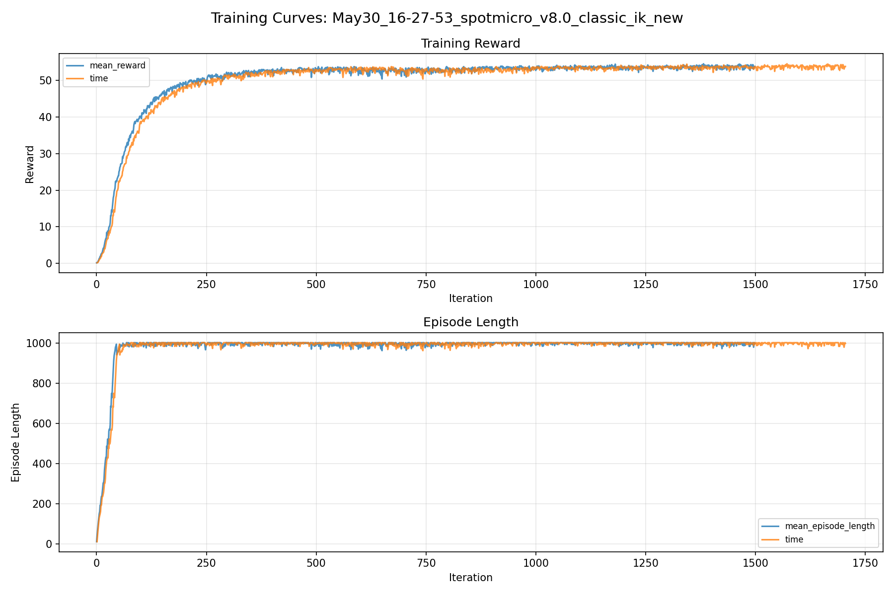
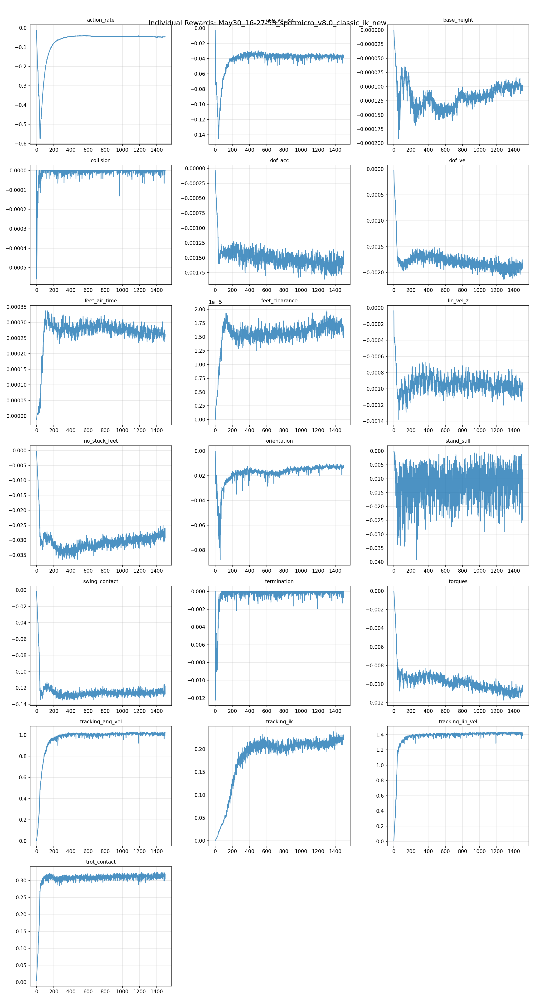
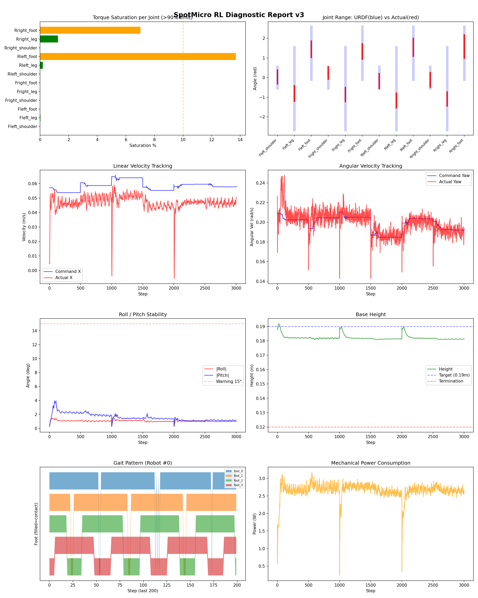
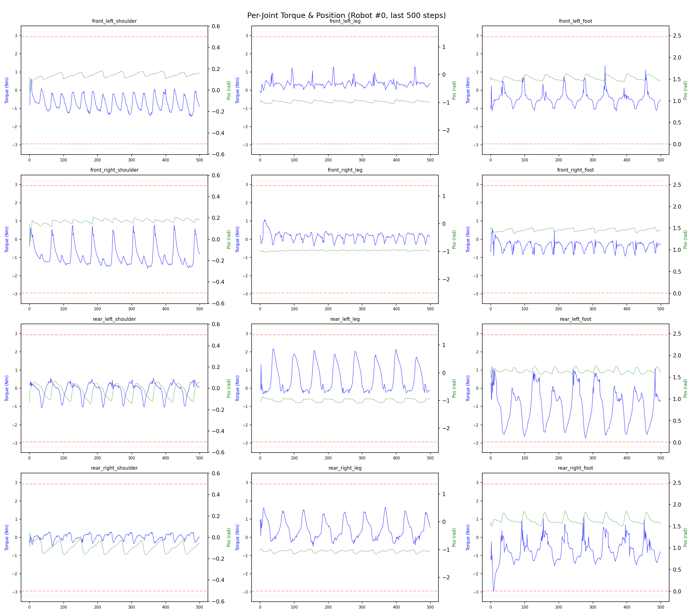
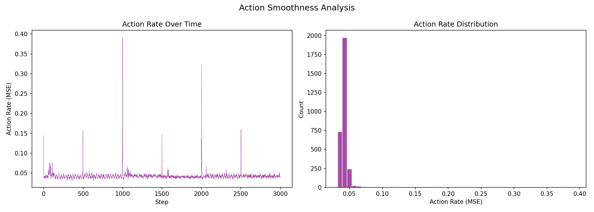

# 실험 093: spotmicro_v8.0_classic_ik_new

- **날짜:** 2026-05-30 16:59
- **Task:** spotmicro_test
- **Run name:** `spotmicro_v8.0_classic_ik_new`
- **판정:** ✅ PASS

---

## 실험 목적

v8.0: 새 IK로 학습

---

## 변경점 (이전 커밋 대비)

```diff
diff --git a/ai_training/rl/legged_gym/legged_gym/envs/spotmicro_test/spotmicro_test_config.py b/ai_training/rl/legged_gym/legged_gym/envs/spotmicro_test/spotmicro_test_config.py
index 2abc133..ade822b 100644
--- a/ai_training/rl/legged_gym/legged_gym/envs/spotmicro_test/spotmicro_test_config.py
+++ b/ai_training/rl/legged_gym/legged_gym/envs/spotmicro_test/spotmicro_test_config.py
@@ -76,8 +76,8 @@ class SpotmicroTestCfg(LeggedRobotCfg):
 
     class control(LeggedRobotCfg.control):
         control_type = 'P'
-        stiffness = {'shoulder': 15.0, 'leg': 10.0, 'foot': 10.0}
-        damping = {'shoulder': 0.3, 'leg': 0.3, 'foot': 0.2}
+        stiffness = {'shoulder': 10.0, 'leg': 10.0, 'foot': 10.0}
+        damping = {'shoulder': 0.3, 'leg': 0.3, 'foot': 0.3}
         action_scale = 0.25
         recovery_action_scale = 0.25
         decimation = 4
@@ -110,8 +110,8 @@ class SpotmicroTestCfg(LeggedRobotCfg):
 
     class rewards(LeggedRobotCfg.rewards):
         class scales:
-            tracking_lin_vel = 1.7
-            tracking_ang_vel = 1.3
+            tracking_lin_vel = 1.5
+            tracking_ang_vel = 1.2
             termination = -20.0
             survival = 0.0
             lin_vel_z = -2.0
@@ -121,7 +121,7 @@ class SpotmicroTestCfg(LeggedRobotCfg):
             dof_vel = -0.0005
             dof_acc = -2.5e-7
             action_rate = -0.04
-            base_height = -1.5
+            base_height = -1.0
             feet_air_time = 0.05
             dof_pos_limits = 0.0
             collision = -1.0
@@ -131,7 +131,7 @@ class SpotmicroTestCfg(LeggedRobotCfg):
             feet_clearance = 0.05
             swing_contact = -0.50
             trot_contact = 0.45
-            tracking_ik = 0.55
+            tracking_ik = 0.6
             stand_still = -0.5
             tilt_recovery = 0.0
             ang_vel_xy_recovery = 0.0
@@ -148,8 +148,8 @@ class SpotmicroTestCfg(LeggedRobotCfg):
         recovery_ik_relief_scale = 0.65
         transition_recovery_horizon_s = 0.75
         transition_recovery_initial_tilt_threshold_deg = 12.0
-        tracking_sigma = 0.04
-        tracking_sigma_ang_vel = 0.06
+        tracking_sigma = 0.03
+        tracking_sigma_ang_vel = 0.04
         swing_contact_grace_time = 0.02
         feet_clearance_min = 0.020
         feet_clearance_cap = 0.030
@@ -188,12 +188,12 @@ class SpotmicroTestCfg(LeggedRobotCfg):
 
     class domain_rand(LeggedRobotCfg.domain_rand):
         randomize_friction = True
-        friction_range = [0.75, 1.25]
+        friction_range = [0.5, 1.25]
         randomize_base_mass = True
-        added_mass_range = [-0.05, 0.10]
+        added_mass_range = [-0.2, 0.20]
         randomize_base_com = True
         base_com_offset_x_range = [-0.010, 0.010]
-        base_com_offset_y_range = [-0.006, 0.006]
+        base_com_offset_y_range = [-0.010, 0.010]
         base_com_offset_z_range = [-0.006, 0.010]
         randomize_motor_strength = True
         motor_strength_range = [
```

**변경 요약:**
  - stiffness = {'shoulder': 15.0, 'leg': 10.0, 'foot': 10.0}
  - damping = {'shoulder': 0.3, 'leg': 0.3, 'foot': 0.2}
  + stiffness = {'shoulder': 10.0, 'leg': 10.0, 'foot': 10.0}
  + damping = {'shoulder': 0.3, 'leg': 0.3, 'foot': 0.3}
  - tracking_lin_vel = 1.7
  - tracking_ang_vel = 1.3
  + tracking_lin_vel = 1.5
  + tracking_ang_vel = 1.2
  - base_height = -1.5
  + base_height = -1.0
  - tracking_ik = 0.55
  + tracking_ik = 0.6
  - tracking_sigma = 0.04
  - tracking_sigma_ang_vel = 0.06
  + tracking_sigma = 0.03
  + tracking_sigma_ang_vel = 0.04
  - friction_range = [0.75, 1.25]
  + friction_range = [0.5, 1.25]
  - added_mass_range = [-0.05, 0.10]
  + added_mass_range = [-0.2, 0.20]
  - base_com_offset_y_range = [-0.006, 0.006]
  + base_com_offset_y_range = [-0.010, 0.010]
  - run_name = 'spotmicro_classic_ik_flat_track_yaw_0p4'
  + run_name = 'spotmicro_v8.0_classic_ik_new'
  - max_iterations = 2000
  + max_iterations = 1500
  - load_run = ""
  - checkpoint = -1

---

## 현재 Reward Scales

| Reward | Scale |
|--------|-------|
| action_rate | -0.04 |
| ang_vel_xy | -1.2 |
| base_height | -1.0 |
| collision | -1.0 |
| dof_acc | -2.5e-07 |
| dof_vel | -0.0005 |
| feet_air_time | 0.05 |
| feet_clearance | 0.05 |
| lin_vel_z | -2.0 |
| no_stuck_feet | -0.25 |
| orientation | -8.0 |
| stand_still | -0.5 |
| swing_contact | -0.5 |
| termination | -20.0 |
| torques | -0.001 |
| tracking_ang_vel | 1.2 |
| tracking_ik | 0.6 |
| tracking_lin_vel | 1.5 |
| trot_contact | 0.45 |

---

## 진단 결과 (Diagnostic)


### 지형 설정

| 항목 | 값 |
|------|-----|
| 평가 모드 | terrain_random_walk |
| walk_eval | True |
| mesh_type | plane |
| terrain_profile | default |
| measure_heights | False |
| grid | 5 x 5 |
| env 크기 | 8.0 x 8.0 m |
| terrain_proportions | [0.1, 0.1, 0.35, 0.25, 0.2] |
| slope max | 0.0 |
| rolling amp max | 0.0 m |


### 핵심 지표

- ✅ Timeout: 93.6% (≥80%)
- ✅ 속도오차 X: 0.0301 m/s (<0.08)
- ✅ 토크포화: 1.8% (<10%)
- ✅ 자세: roll 1.1°, pitch 1.6° (<8°)
- ✅ 조기종료: 0.0% (<5%)
- ⚠️ 18도+ pre-fall 복구: trial 없음 (30도 목표 미검증)

### 상세 수치

| 지표 | 값 |
|------|-----|
| Timeout% | 93.60146252285192 |
| 조기종료% | 0.0 |
| 속도오차 X | 0.03011688031256199 m/s |
| 속도오차 Y | 0.015529904514551163 m/s |
| 각속도오차 | 0.06624539196491241 rad/s |
| 토크포화% | 1.8484011648074148 |
| 평균 높이 | 0.18223286515130943 m |
| Roll (평균) | 1.065279245376587° |
| Pitch (평균) | 1.6003671884536743° |
| Action Rate | 0.04262306168675423 |
| 평균 전력 | 2.665205955505371 W |
| CoT | 1.9926303167708663 |
| Recovery 성공률 | None% |
| Recovery eligible trials | 0 |
| 평균 회복 시간 | None s |
| Recovery 조기 실패율 | None% |
| Recovery 18도+ 성공률 | None% |
| Recovery 18도+ trials | 0 |
| Recovery 18도+ horizon 후 tilt | None° |
| Transition recovery 성공률 | None% |
| Transition recovery eligible trials | 0 |
| 평균 Transition recovery 시간 | None s |
| Transition 18도+ 성공률 | None% |
| Transition 18도+ trials | 0 |
| Transition 18도+ horizon 후 tilt | None° |

## Recovery Assist 분석

| 지표 | 값 |
|------|-----|
| 판정 | ⚠️ eligible trial 없음 |
| Recovery 성공률 | N/A |
| 성공/실패 | 0 / 0 |
| Eligible trials | 0 / 803 |
| 평균 회복 시간 | N/A |
| 조기 실패율 | N/A |
| 평가 horizon | 1.0 s |
| 초기 tilt 기준 | 12.000000000000002° |
| 안정 기준 | roll/pitch < 5.0°, height > 0.165m |
| 평균 초기 tilt | None° |
| 평균 초기 roll/pitch | None° / None° |
| 1초 후 평균 roll/pitch | None° / None° |
| 1초 내 최대 roll/pitch 평균 | None° / None° |

> 해석: `Recovery 성공률`은 초기 tilt가 기준 이상인 episode 중 1초 내 안정 자세로 복귀한 비율입니다. 조기 실패율이 높으면 reset 직후 바로 넘어지는 것이고, 평균 회복 시간이 짧을수록 위기 대응이 빠른 것입니다.

### Recovery Tilt Band 분석

| Tilt 구간 | Trials | 성공률 | Horizon 후 평균 tilt | 평균 회복 시간 |
|-----------|--------|--------|----------------------|----------------|
| 12-18 deg | 0 | N/A | N/A | N/A |
| 18-25 deg | 0 | N/A | N/A | N/A |
| 25-30 deg | 0 | N/A | N/A | N/A |
| 30+ deg | 0 | N/A | N/A | N/A |
| 18+ deg 전체 | 0 | N/A | N/A | N/A |

> 이번 pre-fall 목표는 특히 `18-25 deg`, `25-30 deg`, `18+ deg 전체` 행을 우선 봅니다. `25-30 deg` trial이 없으면 30도 근처 회복 성능은 아직 검증되지 않은 것입니다.


## Transition Recovery 분석

| 지표 | 값 |
|------|-----|
| 판정 | ⚠️ eligible trial 없음 |
| Transition recovery 성공률 | N/A |
| 성공/실패 | 0 / 0 |
| Eligible trials | 0 / 0 |
| 평균 회복 시간 | N/A |
| 조기 실패율 | N/A |
| 평가 horizon | 0.75 s |
| push 후 eligible 기준 | max roll/pitch > 12.000000000000002° |
| 안정 기준 | roll/pitch < 5.0°, height > 0.165m |
| 평균 최대 tilt | None° |
| horizon 후 평균 roll/pitch | None° / None° |

> 해석: `Transition Recovery`는 학습 중 push/roll-pitch angular impulse가 들어간 뒤 일정 시간 안에 자세가 안정 기준으로 돌아오는지를 봅니다.

### Transition Recovery Tilt Band 분석

| Tilt 구간 | Trials | 성공률 | Horizon 후 평균 tilt | 평균 회복 시간 |
|-----------|--------|--------|----------------------|----------------|
| 12-18 deg | 0 | N/A | N/A | N/A |
| 18-25 deg | 0 | N/A | N/A | N/A |
| 25-30 deg | 0 | N/A | N/A | N/A |
| 30+ deg | 0 | N/A | N/A | N/A |
| 18+ deg 전체 | 0 | N/A | N/A | N/A |

> 이번 pre-fall 목표는 특히 `18-25 deg`, `25-30 deg`, `18+ deg 전체` 행을 우선 봅니다. `25-30 deg` trial이 없으면 30도 근처 회복 성능은 아직 검증되지 않은 것입니다.


## Command Mode별 회전 추종 분석

| 모드 | 비율 | 샘플 수 | 평균 abs(cmd_wz) | 평균 abs(actual_wz) | yaw 오차 | 상태 |
|------|------|---------|------------------|---------------------|----------|------|
| 정지 | 6.3% | 48306 | 0.0254 | 0.0465 | 0.0432 | ⚠️ |
| 직진/저회전 | 21.1% | 162159 | 0.0775 | 0.1035 | 0.0685 | ✅ |
| 제자리 회전 | 29.0% | 223208 | 0.2739 | 0.2557 | 0.0631 | ✅ |
| 전진+회전 | 33.2% | 255230 | 0.2742 | 0.2721 | 0.0753 | ✅ |
| 큰 회전명령 | 24.5% | 188432 | 0.3489 | 0.3340 | 0.0744 | ✅ |

> 해석 기준: `제자리 회전`만 나쁘면 pure turn 학습/보행 패턴 문제, `큰 회전명령`만 나쁘면 yaw 명령 범위가 현재 토크/보폭 한계보다 큰 문제, `정지`가 나쁘면 stop drift 문제로 보면 됩니다.
        


## 학습 곡선 분석

| 지표 | 값 | 판정 |
|------|-----|------|
| 수렴 iter (90%) | 190 | 빠름 |
| 후반 안정성 (CV) | 0.009 | 안정 |
| 정체 구간 | 있음 (iter 702, 74 iter) | |


## Per-leg 분석

### 발별 접촉/공중 비율

| 발 | 접촉% | 공중% |
|-----|-------|------|
| foot_0 | 96.1% | 3.9% |
| foot_1 | 94.0% | 6.0% |
| foot_2 | 67.9% | 32.1% |
| foot_3 | 62.8% | 37.2% |

### 관절별 토크 포화

| 관절 | 포화% | 최대토크 | 한계 | 상태 |
|------|------|---------|------|------|
| front_left_shoulder | 0.0% | 2.604 | 2.940 | ✅ |
| front_left_leg | 0.0% | 2.940 | 2.940 | ✅ |
| front_left_foot | 0.0% | 2.940 | 2.940 | ✅ |
| front_right_shoulder | 0.0% | 2.940 | 2.940 | ✅ |
| front_right_leg | 0.0% | 2.940 | 2.940 | ✅ |
| front_right_foot | 0.0% | 2.940 | 2.940 | ✅ |
| rear_left_shoulder | 0.0% | 2.940 | 2.940 | ✅ |
| rear_left_leg | 0.2% | 2.940 | 2.940 | ✅ |
| rear_left_foot | 13.7% | 2.940 | 2.940 | ⚠️ |
| rear_right_shoulder | 0.0% | 2.087 | 2.940 | ✅ |
| rear_right_leg | 1.2% | 2.940 | 2.940 | ✅ |
| rear_right_foot | 7.0% | 2.940 | 2.940 | ⚠️ |


## Gait 분석

| 지표 | 값 |
|------|-----|
| Gait 주파수 | 0.21 Hz |
| Gait 주기 | 60 steps |
| 대각 동기화율 | 72.6% |
| L/R 비대칭 | 0.0%p |
| 판정 | ✅ Trot 패턴 / ✅ 대칭 |


## 관절별 상세

| 관절 | 토크포화% | 사용범위% | 편향(rad) | 한계근접% | 상태 |
|------|----------|----------|----------|----------|------|
| front_left_shoulder | 0.0% | 64% | +0.034 | 0.0% | ✅ |
| front_left_leg | 0.0% | 19% | -0.809 | 0.0% | ⚠️ |
| front_left_foot | 0.0% | 31% | +1.447 | 0.0% | ⚠️ |
| front_right_shoulder | 0.0% | 58% | +0.233 | 0.0% | ⚠️ |
| front_right_leg | 0.0% | 17% | -0.866 | 0.0% | ⚠️ |
| front_right_foot | 0.0% | 29% | +1.329 | 0.0% | ⚠️ |
| rear_left_shoulder | 0.0% | 69% | -0.175 | 0.2% | ⚠️ |
| rear_left_leg | 0.2% | 18% | -1.163 | 0.0% | ⚠️ |
| rear_left_foot | 13.7% | 34% | +1.547 | 0.0% | ⚠️ |
| rear_right_shoulder | 0.0% | 68% | -0.113 | 0.0% | ⚠️ |
| rear_right_leg | 1.2% | 17% | -1.088 | 0.0% | ⚠️ |
| rear_right_foot | 7.0% | 44% | +1.581 | 0.0% | ⚠️ |


## 에너지 효율 상세

| 지표 | 값 |
|------|-----|
| 평균 전력 | 2.67 W |
| 피크 전력 | 3.18 W |
| 피크/평균 비율 | 1.2x |
| CoT | 1.99 |

### 관절별 전력 분배

| 관절 | 평균전력(W) | 비율% |
|------|-----------|-------|
| rear_right_foot | 0.510 | 19.1% |
| rear_left_foot | 0.495 | 18.6% |
| front_left_leg | 0.284 | 10.7% |
| front_right_leg | 0.265 | 9.9% |
| rear_right_leg | 0.233 | 8.7% |
| front_right_shoulder | 0.227 | 8.5% |
| front_left_shoulder | 0.181 | 6.8% |
| rear_left_leg | 0.170 | 6.4% |
| front_left_foot | 0.092 | 3.4% |
| front_right_foot | 0.088 | 3.3% |
| rear_left_shoulder | 0.068 | 2.5% |
| rear_right_shoulder | 0.054 | 2.0% |


## 이전 실험 대비 비교

| 지표 | 이전 (exp092) | 현재 (exp093) | 변화 |
|------|-------|-------|------|
| Timeout% | 75.1% | 93.6% | ✅ ↑ 18.5206% |
| 속도오차 X | 0.0250 | 0.0301 | ⚠️ ↑ 0.0051m/s |
| 토크포화 | 13.9% | 1.8% | ✅ ↓ 12.0578% |
| Roll | 1.4° | 1.1° | ✅ ↓ 0.3725° |
| Pitch | 1.5° | 1.6° | ⚠️ ↑ 0.1001° |
| 평균 전력 | 4.1553W | 2.6652W | ✅ ↓ 1.4901W |


## Tensorboard 학습 곡선 요약

| 스칼라 | 최종값 | 최대 | 최소 | 후반10% 평균 |
|--------|--------|------|------|-------------|
| rew_action_rate | -0.0463 | -0.0117 | -0.5759 | -0.0467 |
| rew_ang_vel_xy | -0.0362 | -0.0029 | -0.1453 | -0.0375 |
| rew_base_height | -0.0001 | -0.0000 | -0.0002 | -0.0001 |
| rew_collision | 0.0000 | 0.0000 | -0.0006 | -0.0000 |
| rew_dof_acc | -0.0014 | -0.0000 | -0.0019 | -0.0016 |
| rew_dof_vel | -0.0018 | -0.0000 | -0.0021 | -0.0019 |
| rew_feet_air_time | 0.0003 | 0.0003 | -0.0000 | 0.0003 |
| rew_feet_clearance | 0.0000 | 0.0000 | 0.0000 | 0.0000 |
| rew_lin_vel_z | -0.0010 | -0.0000 | -0.0014 | -0.0010 |
| rew_no_stuck_feet | -0.0293 | -0.0002 | -0.0366 | -0.0284 |
| rew_orientation | -0.0119 | -0.0002 | -0.0880 | -0.0128 |
| rew_stand_still | -0.0078 | -0.0001 | -0.0392 | -0.0099 |
| rew_swing_contact | -0.1274 | -0.0016 | -0.1349 | -0.1249 |
| rew_termination | -0.0001 | 0.0000 | -0.0122 | -0.0001 |
| rew_torques | -0.0108 | -0.0000 | -0.0117 | -0.0109 |
| rew_tracking_ang_vel | 1.0202 | 1.0306 | 0.0047 | 1.0120 |
| rew_tracking_ik | 0.2202 | 0.2377 | 0.0007 | 0.2192 |
| rew_tracking_lin_vel | 1.4177 | 1.4374 | 0.0139 | 1.4186 |
| rew_trot_contact | 0.3190 | 0.3251 | 0.0041 | 0.3139 |
| learning_rate | 0.0003 | 0.0086 | 0.0000 | 0.0003 |
| surrogate | 0.0012 | 0.0092 | -0.0079 | -0.0017 |
| value_function | 0.0032 | 0.0270 | 0.0015 | 0.0031 |
| collection time | 0.8259 | 1.0384 | 0.8113 | 0.8481 |
| learning_time | 0.2877 | 0.3696 | 0.2701 | 0.2866 |
| total_fps | 88277.0000 | 89904.0000 | 74087.0000 | 86650.6133 |
| mean_noise_std | 0.1618 | 0.9906 | 0.1591 | 0.1617 |
| mean_episode_length | 997.9700 | 1002.0000 | 11.9302 | 997.8488 |
| time | 997.9700 | 1002.0000 | 11.9302 | 997.8488 |
| mean_reward | 53.8572 | 54.5958 | 0.1254 | 53.7929 |
| time | 53.8572 | 54.5958 | 0.1254 | 53.7929 |

총 학습 iteration: 1499


---

## 그래프

### Tensorboard 학습 곡선



### Diagnostic 결과





---

## 결론 및 다음 실험 방향

**자동 판정:** ✅ PASS

대부분 기준을 통과했으나 일부 항목이 보통 수준입니다.
  - ⚠️ 18도+ pre-fall 복구: trial 없음 (30도 목표 미검증)

> 💡 위 결론은 자동 생성되었습니다. 필요시 수정하세요.

---

## 메모

_(추가 메모가 있으면 여기에 작성)_

