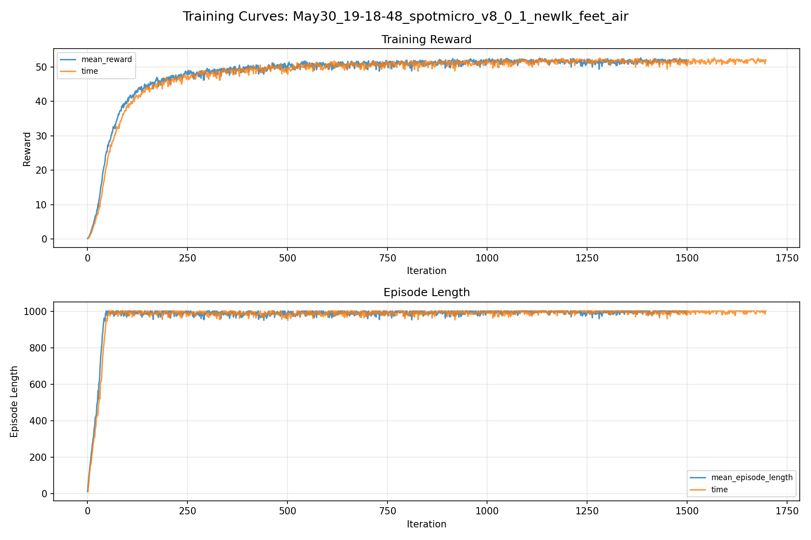
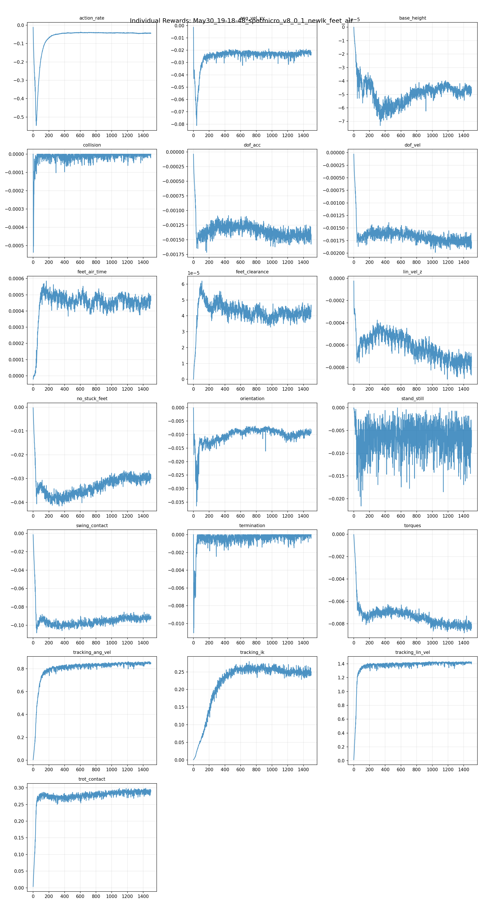
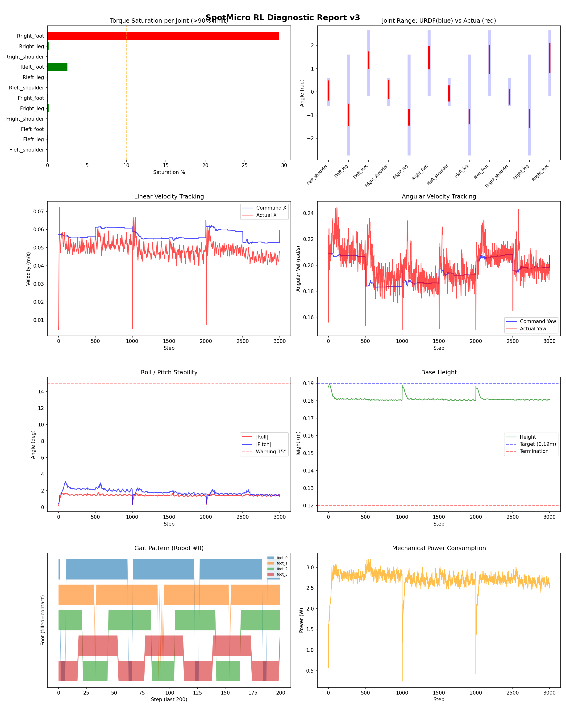
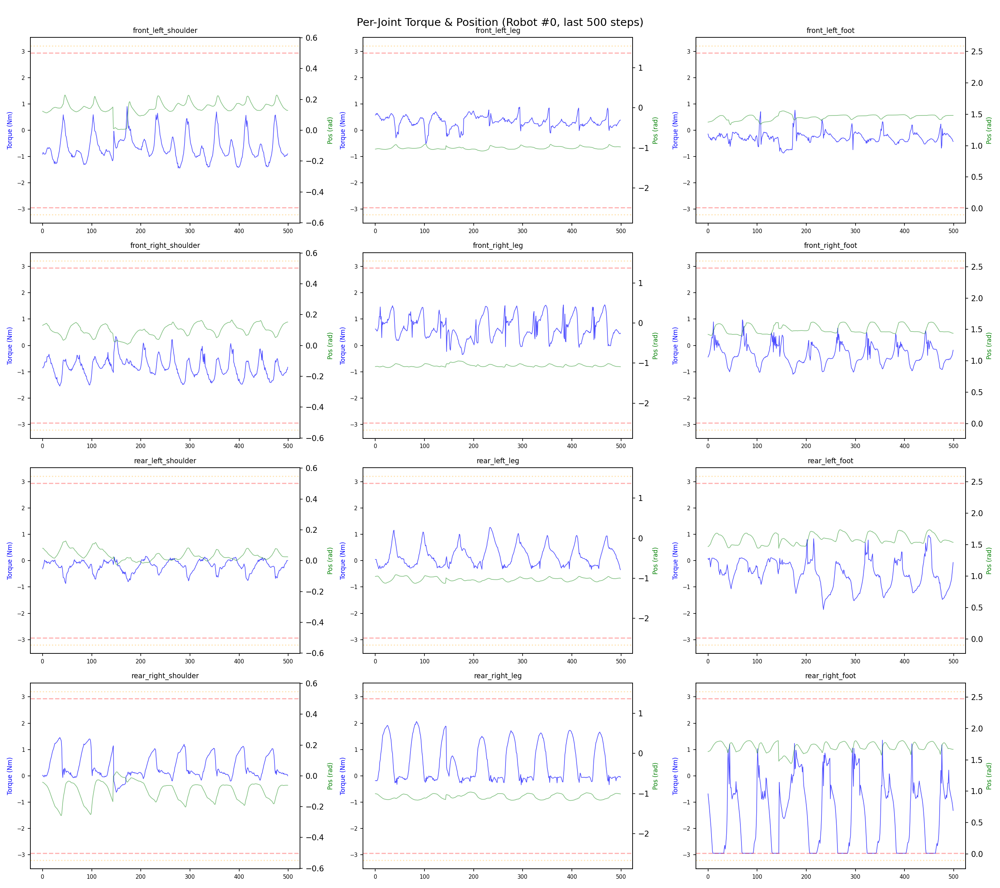
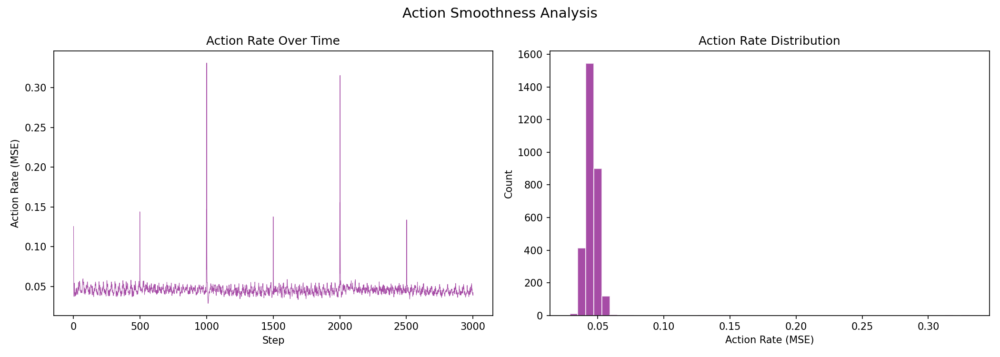

# 실험 094: spotmicro_v8_0_1_newIk_feet_air

- **날짜:** 2026-05-30 19:50
- **Task:** spotmicro_test
- **Run name:** `spotmicro_v8_0_1_newIk_feet_air`
- **판정:** ✅ PASS

---

## 실험 목적

v8.0.1: 새 IK로 학습, 발 들 수 있게

---

## 변경점 (이전 커밋 대비)

```diff
diff --git a/ai_training/rl/legged_gym/legged_gym/envs/spotmicro_test/spotmicro_test_config.py b/ai_training/rl/legged_gym/legged_gym/envs/spotmicro_test/spotmicro_test_config.py
index ade822b..e5ddff9 100644
--- a/ai_training/rl/legged_gym/legged_gym/envs/spotmicro_test/spotmicro_test_config.py
+++ b/ai_training/rl/legged_gym/legged_gym/envs/spotmicro_test/spotmicro_test_config.py
@@ -16,7 +16,7 @@ class SpotmicroTestCfg(LeggedRobotCfg):
         blend_cmd_norm = 0.04
 
         body_height = [0.190, 0.190, 0.190, 0.190]
-        step_height = [0.025, 0.025, 0.025, 0.025]
+        step_height = [0.018, 0.018, 0.021, 0.021]
         default_foot_x = [-0.040, -0.040, -0.040, -0.040]
         default_foot_y = [0.052, -0.052, 0.052, -0.052]
 
@@ -111,28 +111,28 @@ class SpotmicroTestCfg(LeggedRobotCfg):
     class rewards(LeggedRobotCfg.rewards):
         class scales:
             tracking_lin_vel = 1.5
-            tracking_ang_vel = 1.2
+            tracking_ang_vel = 1.0
             termination = -20.0
             survival = 0.0
-            lin_vel_z = -2.0
-            ang_vel_xy = -1.2
-            orientation = -8.0
-            torques = -0.001
+            lin_vel_z = -1.5
+            ang_vel_xy = -0.7
+            orientation = -5.0
+            torques = -0.0008
             dof_vel = -0.0005
             dof_acc = -2.5e-7
             action_rate = -0.04
-            base_height = -1.0
-            feet_air_time = 0.05
+            base_height = -0.4
+            feet_air_time = 0.08
             dof_pos_limits = 0.0
             collision = -1.0
             trot_symmetry = 0.0
-            no_stuck_feet = -0.25
+            no_stuck_feet = -0.3
             symmetric_gait = 0.0
-            feet_clearance = 0.05
-            swing_contact = -0.50
-            trot_contact = 0.45
+            feet_clearance = 0.20
+            swing_contact = -0.4
+            trot_contact = 0.4
             tracking_ik = 0.6
-            stand_still = -0.5
+            stand_still = -0.3
             tilt_recovery = 0.0
             ang_vel_xy_recovery = 0.0
         soft_dof_pos_limit = 0.9
@@ -236,7 +236,7 @@ class SpotmicroTestCfgPPO(LeggedRobotCfgPPO):
         learning_rate = 1e-4
 
     class runner(LeggedRobotCfgPPO.runner):
-        run_name = 'spotmicro_v8.0_classic_ik_new'
+        run_name = 'spotmicro_v8_0_1_newIk_feet_air'
         experiment_name = 'spotmicro_test'
         max_iterations = 1500
         save_interval = 100
```

**변경 요약:**
  - step_height = [0.025, 0.025, 0.025, 0.025]
  + step_height = [0.018, 0.018, 0.021, 0.021]
  - tracking_ang_vel = 1.2
  + tracking_ang_vel = 1.0
  - lin_vel_z = -2.0
  - ang_vel_xy = -1.2
  - orientation = -8.0
  - torques = -0.001
  + lin_vel_z = -1.5
  + ang_vel_xy = -0.7
  + orientation = -5.0
  + torques = -0.0008
  - base_height = -1.0
  - feet_air_time = 0.05
  + base_height = -0.4
  + feet_air_time = 0.08
  - no_stuck_feet = -0.25
  + no_stuck_feet = -0.3
  - feet_clearance = 0.05
  - swing_contact = -0.50
  - trot_contact = 0.45
  + feet_clearance = 0.20
  + swing_contact = -0.4
  + trot_contact = 0.4
  - stand_still = -0.5
  + stand_still = -0.3
  - run_name = 'spotmicro_v8.0_classic_ik_new'
  + run_name = 'spotmicro_v8_0_1_newIk_feet_air'

---

## 현재 Reward Scales

| Reward | Scale |
|--------|-------|
| action_rate | -0.04 |
| ang_vel_xy | -0.7 |
| base_height | -0.4 |
| collision | -1.0 |
| dof_acc | -2.5e-07 |
| dof_vel | -0.0005 |
| feet_air_time | 0.08 |
| feet_clearance | 0.2 |
| lin_vel_z | -1.5 |
| no_stuck_feet | -0.3 |
| orientation | -5.0 |
| stand_still | -0.3 |
| swing_contact | -0.4 |
| termination | -20.0 |
| torques | -0.0008 |
| tracking_ang_vel | 1.0 |
| tracking_ik | 0.6 |
| tracking_lin_vel | 1.5 |
| trot_contact | 0.4 |

---

## 진단 결과 (Diagnostic)


### 지형 설정

| 항목 | 값 |
|------|-----|
| 평가 모드 | terrain_random_walk |
| walk_eval | True |
| mesh_type | plane |
| terrain_profile | default |
| measure_heights | False |
| grid | 5 x 5 |
| env 크기 | 8.0 x 8.0 m |
| terrain_proportions | [0.1, 0.1, 0.35, 0.25, 0.2] |
| slope max | 0.0 |
| rolling amp max | 0.0 m |


### 핵심 지표

- ✅ Timeout: 90.9% (≥80%)
- ✅ 속도오차 X: 0.0367 m/s (<0.08)
- ✅ 토크포화: 2.7% (<10%)
- ✅ 자세: roll 1.4°, pitch 1.8° (<8°)
- ✅ 조기종료: 0.2% (<5%)
- ⚠️ 18도+ pre-fall 복구: trial 없음 (30도 목표 미검증)

### 상세 수치

| 지표 | 값 |
|------|-----|
| Timeout% | 90.94138543516874 |
| 조기종료% | 0.17761989342806395 |
| 속도오차 X | 0.03669784590601921 m/s |
| 속도오차 Y | 0.01401484478265047 m/s |
| 각속도오차 | 0.07557381689548492 rad/s |
| 토크포화% | 2.687460109335109 |
| 평균 높이 | 0.1810237396033335 m |
| Roll (평균) | 1.4228739738464355° |
| Pitch (평균) | 1.8185977935791016° |
| Action Rate | 0.045805227011442184 |
| 평균 전력 | 2.711057662963867 W |
| CoT | 1.8472688922031062 |
| Recovery 성공률 | None% |
| Recovery eligible trials | 0 |
| 평균 회복 시간 | None s |
| Recovery 조기 실패율 | None% |
| Recovery 18도+ 성공률 | None% |
| Recovery 18도+ trials | 0 |
| Recovery 18도+ horizon 후 tilt | None° |
| Transition recovery 성공률 | None% |
| Transition recovery eligible trials | 0 |
| 평균 Transition recovery 시간 | None s |
| Transition 18도+ 성공률 | None% |
| Transition 18도+ trials | 0 |
| Transition 18도+ horizon 후 tilt | None° |

## Recovery Assist 분석

| 지표 | 값 |
|------|-----|
| 판정 | ⚠️ eligible trial 없음 |
| Recovery 성공률 | N/A |
| 성공/실패 | 0 / 0 |
| Eligible trials | 0 / 818 |
| 평균 회복 시간 | N/A |
| 조기 실패율 | N/A |
| 평가 horizon | 1.0 s |
| 초기 tilt 기준 | 12.000000000000002° |
| 안정 기준 | roll/pitch < 5.0°, height > 0.165m |
| 평균 초기 tilt | None° |
| 평균 초기 roll/pitch | None° / None° |
| 1초 후 평균 roll/pitch | None° / None° |
| 1초 내 최대 roll/pitch 평균 | None° / None° |

> 해석: `Recovery 성공률`은 초기 tilt가 기준 이상인 episode 중 1초 내 안정 자세로 복귀한 비율입니다. 조기 실패율이 높으면 reset 직후 바로 넘어지는 것이고, 평균 회복 시간이 짧을수록 위기 대응이 빠른 것입니다.

### Recovery Tilt Band 분석

| Tilt 구간 | Trials | 성공률 | Horizon 후 평균 tilt | 평균 회복 시간 |
|-----------|--------|--------|----------------------|----------------|
| 12-18 deg | 0 | N/A | N/A | N/A |
| 18-25 deg | 0 | N/A | N/A | N/A |
| 25-30 deg | 0 | N/A | N/A | N/A |
| 30+ deg | 0 | N/A | N/A | N/A |
| 18+ deg 전체 | 0 | N/A | N/A | N/A |

> 이번 pre-fall 목표는 특히 `18-25 deg`, `25-30 deg`, `18+ deg 전체` 행을 우선 봅니다. `25-30 deg` trial이 없으면 30도 근처 회복 성능은 아직 검증되지 않은 것입니다.


## Transition Recovery 분석

| 지표 | 값 |
|------|-----|
| 판정 | ⚠️ eligible trial 없음 |
| Transition recovery 성공률 | N/A |
| 성공/실패 | 0 / 0 |
| Eligible trials | 0 / 0 |
| 평균 회복 시간 | N/A |
| 조기 실패율 | N/A |
| 평가 horizon | 0.75 s |
| push 후 eligible 기준 | max roll/pitch > 12.000000000000002° |
| 안정 기준 | roll/pitch < 5.0°, height > 0.165m |
| 평균 최대 tilt | None° |
| horizon 후 평균 roll/pitch | None° / None° |

> 해석: `Transition Recovery`는 학습 중 push/roll-pitch angular impulse가 들어간 뒤 일정 시간 안에 자세가 안정 기준으로 돌아오는지를 봅니다.

### Transition Recovery Tilt Band 분석

| Tilt 구간 | Trials | 성공률 | Horizon 후 평균 tilt | 평균 회복 시간 |
|-----------|--------|--------|----------------------|----------------|
| 12-18 deg | 0 | N/A | N/A | N/A |
| 18-25 deg | 0 | N/A | N/A | N/A |
| 25-30 deg | 0 | N/A | N/A | N/A |
| 30+ deg | 0 | N/A | N/A | N/A |
| 18+ deg 전체 | 0 | N/A | N/A | N/A |

> 이번 pre-fall 목표는 특히 `18-25 deg`, `25-30 deg`, `18+ deg 전체` 행을 우선 봅니다. `25-30 deg` trial이 없으면 30도 근처 회복 성능은 아직 검증되지 않은 것입니다.


## Command Mode별 회전 추종 분석

| 모드 | 비율 | 샘플 수 | 평균 abs(cmd_wz) | 평균 abs(actual_wz) | yaw 오차 | 상태 |
|------|------|---------|------------------|---------------------|----------|------|
| 정지 | 4.9% | 37998 | 0.0243 | 0.0466 | 0.0445 | ⚠️ |
| 직진/저회전 | 22.5% | 172662 | 0.0768 | 0.1113 | 0.0805 | ⚠️ |
| 제자리 회전 | 29.7% | 228342 | 0.2731 | 0.2585 | 0.0727 | ✅ |
| 전진+회전 | 30.4% | 233700 | 0.2757 | 0.2756 | 0.0874 | ⚠️ |
| 큰 회전명령 | 23.8% | 183124 | 0.3493 | 0.3359 | 0.0852 | ⚠️ |

> 해석 기준: `제자리 회전`만 나쁘면 pure turn 학습/보행 패턴 문제, `큰 회전명령`만 나쁘면 yaw 명령 범위가 현재 토크/보폭 한계보다 큰 문제, `정지`가 나쁘면 stop drift 문제로 보면 됩니다.
        


## 학습 곡선 분석

| 지표 | 값 | 판정 |
|------|-----|------|
| 수렴 iter (90%) | 209 | 빠름 |
| 후반 안정성 (CV) | 0.011 | 안정 |
| 정체 구간 | 있음 (iter 1281, 74 iter) | |


## Per-leg 분석

### 발별 접촉/공중 비율

| 발 | 접촉% | 공중% |
|-----|-------|------|
| foot_0 | 93.4% | 6.6% |
| foot_1 | 96.4% | 3.6% |
| foot_2 | 65.1% | 34.9% |
| foot_3 | 56.3% | 43.7% |

### 관절별 토크 포화

| 관절 | 포화% | 최대토크 | 한계 | 상태 |
|------|------|---------|------|------|
| front_left_shoulder | 0.0% | 2.547 | 2.940 | ✅ |
| front_left_leg | 0.0% | 2.940 | 2.940 | ✅ |
| front_left_foot | 0.0% | 2.940 | 2.940 | ✅ |
| front_right_shoulder | 0.0% | 2.940 | 2.940 | ✅ |
| front_right_leg | 0.1% | 2.940 | 2.940 | ✅ |
| front_right_foot | 0.0% | 2.940 | 2.940 | ✅ |
| rear_left_shoulder | 0.0% | 1.894 | 2.940 | ✅ |
| rear_left_leg | 0.0% | 2.940 | 2.940 | ✅ |
| rear_left_foot | 2.5% | 2.940 | 2.940 | ✅ |
| rear_right_shoulder | 0.0% | 2.933 | 2.940 | ✅ |
| rear_right_leg | 0.1% | 2.940 | 2.940 | ✅ |
| rear_right_foot | 29.4% | 2.940 | 2.940 | ❌ |


## Gait 분석

| 지표 | 값 |
|------|-----|
| Gait 주파수 | 0.21 Hz |
| Gait 주기 | 58 steps |
| 대각 동기화율 | 70.0% |
| L/R 비대칭 | 0.0%p |
| 판정 | ✅ Trot 패턴 / ✅ 대칭 |


## 관절별 상세

| 관절 | 토크포화% | 사용범위% | 편향(rad) | 한계근접% | 상태 |
|------|----------|----------|----------|----------|------|
| front_left_shoulder | 0.0% | 74% | +0.059 | 0.0% | ✅ |
| front_left_leg | 0.0% | 21% | -0.987 | 0.0% | ⚠️ |
| front_left_foot | 0.0% | 25% | +1.370 | 0.0% | ⚠️ |
| front_right_shoulder | 0.0% | 67% | +0.101 | 0.0% | ⚠️ |
| front_right_leg | 0.1% | 16% | -1.094 | 0.0% | ⚠️ |
| front_right_foot | 0.0% | 34% | +1.465 | 0.0% | ⚠️ |
| rear_left_shoulder | 0.0% | 57% | -0.068 | 0.0% | ✅ |
| rear_left_leg | 0.0% | 14% | -1.069 | 0.0% | ⚠️ |
| rear_left_foot | 2.5% | 43% | +1.395 | 0.0% | ⚠️ |
| rear_right_shoulder | 0.0% | 57% | -0.202 | 0.0% | ⚠️ |
| rear_right_leg | 0.1% | 18% | -1.145 | 0.0% | ⚠️ |
| rear_right_foot | 29.4% | 46% | +1.472 | 0.0% | ⚠️ |


## 에너지 효율 상세

| 지표 | 값 |
|------|-----|
| 평균 전력 | 2.71 W |
| 피크 전력 | 3.20 W |
| 피크/평균 비율 | 1.2x |
| CoT | 1.85 |

### 관절별 전력 분배

| 관절 | 평균전력(W) | 비율% |
|------|-----------|-------|
| rear_right_foot | 0.715 | 26.4% |
| front_right_leg | 0.430 | 15.8% |
| rear_left_foot | 0.325 | 12.0% |
| front_right_shoulder | 0.239 | 8.8% |
| front_left_leg | 0.233 | 8.6% |
| rear_right_leg | 0.164 | 6.1% |
| front_left_shoulder | 0.162 | 6.0% |
| rear_right_shoulder | 0.113 | 4.2% |
| front_left_foot | 0.100 | 3.7% |
| front_right_foot | 0.089 | 3.3% |
| rear_left_leg | 0.089 | 3.3% |
| rear_left_shoulder | 0.052 | 1.9% |


## 이전 실험 대비 비교

| 지표 | 이전 (exp093) | 현재 (exp094) | 변화 |
|------|-------|-------|------|
| Timeout% | 93.6% | 90.9% | ⚠️ ↓ 2.6601% |
| 속도오차 X | 0.0301 | 0.0367 | ⚠️ ↑ 0.0066m/s |
| 토크포화 | 1.8% | 2.7% | ⚠️ ↑ 0.8391% |
| Roll | 1.1° | 1.4° | ⚠️ ↑ 0.3576° |
| Pitch | 1.6° | 1.8° | ⚠️ ↑ 0.2182° |
| 평균 전력 | 2.6652W | 2.7111W | ⚠️ ↑ 0.0459W |


## Tensorboard 학습 곡선 요약

| 스칼라 | 최종값 | 최대 | 최소 | 후반10% 평균 |
|--------|--------|------|------|-------------|
| rew_action_rate | -0.0437 | -0.0117 | -0.5466 | -0.0441 |
| rew_ang_vel_xy | -0.0218 | -0.0014 | -0.0812 | -0.0219 |
| rew_base_height | -0.0000 | -0.0000 | -0.0001 | -0.0000 |
| rew_collision | 0.0000 | 0.0000 | -0.0005 | -0.0000 |
| rew_dof_acc | -0.0014 | -0.0000 | -0.0017 | -0.0014 |
| rew_dof_vel | -0.0018 | -0.0000 | -0.0020 | -0.0018 |
| rew_feet_air_time | 0.0005 | 0.0006 | -0.0000 | 0.0005 |
| rew_feet_clearance | 0.0000 | 0.0001 | 0.0000 | 0.0000 |
| rew_lin_vel_z | -0.0007 | -0.0000 | -0.0009 | -0.0008 |
| rew_no_stuck_feet | -0.0300 | -0.0003 | -0.0416 | -0.0296 |
| rew_orientation | -0.0092 | -0.0001 | -0.0365 | -0.0093 |
| rew_stand_still | -0.0053 | -0.0000 | -0.0216 | -0.0069 |
| rew_swing_contact | -0.0929 | -0.0014 | -0.1083 | -0.0921 |
| rew_termination | 0.0000 | 0.0000 | -0.0111 | -0.0001 |
| rew_torques | -0.0083 | -0.0000 | -0.0088 | -0.0082 |
| rew_tracking_ang_vel | 0.8507 | 0.8633 | 0.0041 | 0.8484 |
| rew_tracking_ik | 0.2487 | 0.2795 | 0.0007 | 0.2482 |
| rew_tracking_lin_vel | 1.4213 | 1.4340 | 0.0139 | 1.4166 |
| rew_trot_contact | 0.2919 | 0.2986 | 0.0035 | 0.2883 |
| learning_rate | 0.0003 | 0.0100 | 0.0000 | 0.0003 |
| surrogate | -0.0015 | 0.0041 | -0.0082 | -0.0015 |
| value_function | 0.0050 | 0.0138 | 0.0015 | 0.0028 |
| collection time | 0.8209 | 1.0921 | 0.8037 | 0.8407 |
| learning_time | 0.2854 | 0.6260 | 0.2647 | 0.2859 |
| total_fps | 88857.0000 | 91074.0000 | 59125.0000 | 87281.6867 |
| mean_noise_std | 0.1514 | 0.9880 | 0.1505 | 0.1537 |
| mean_episode_length | 1002.0000 | 1002.0000 | 11.9302 | 997.5605 |
| time | 1002.0000 | 1002.0000 | 11.9302 | 997.5605 |
| mean_reward | 51.8286 | 52.6307 | 0.1278 | 51.7059 |
| time | 51.8286 | 52.6307 | 0.1278 | 51.7059 |

총 학습 iteration: 1499


---

## 그래프

### Tensorboard 학습 곡선



### Diagnostic 결과





---

## 결론 및 다음 실험 방향

**자동 판정:** ✅ PASS

대부분 기준을 통과했으나 일부 항목이 보통 수준입니다.
  - ⚠️ 18도+ pre-fall 복구: trial 없음 (30도 목표 미검증)

> 💡 위 결론은 자동 생성되었습니다. 필요시 수정하세요.

---

## 메모

_(추가 메모가 있으면 여기에 작성)_

