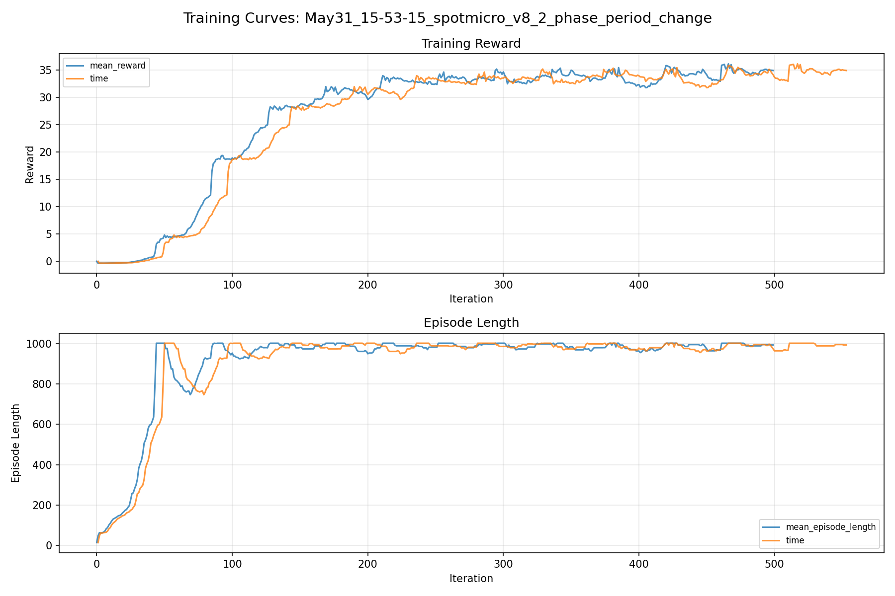
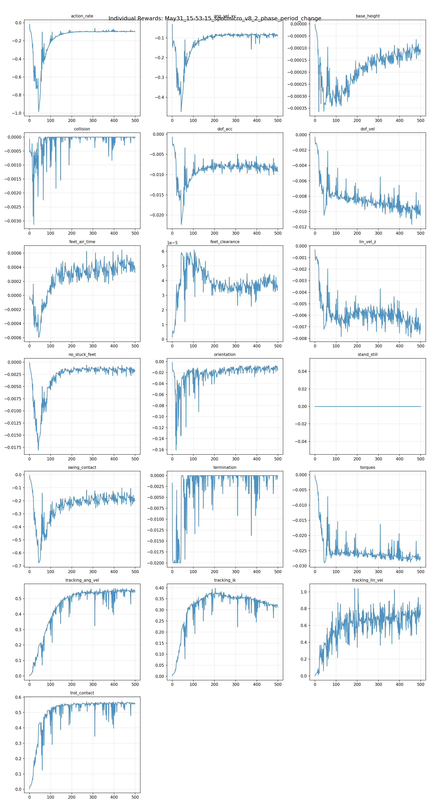
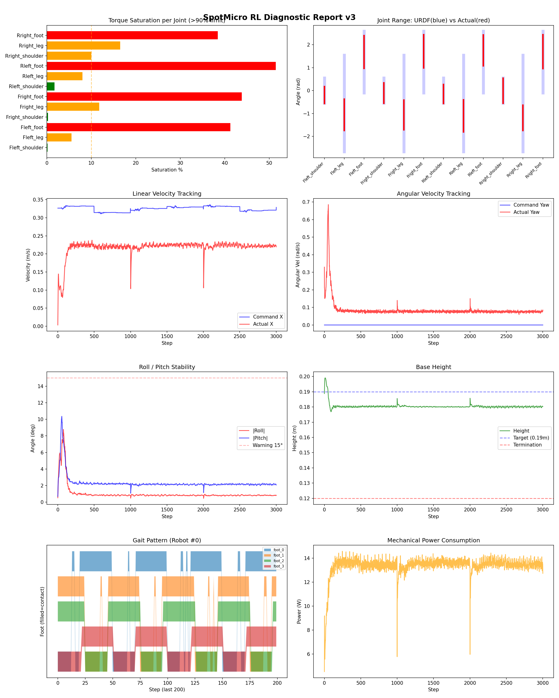
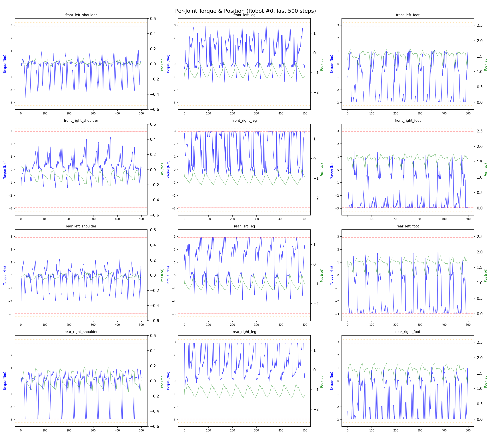
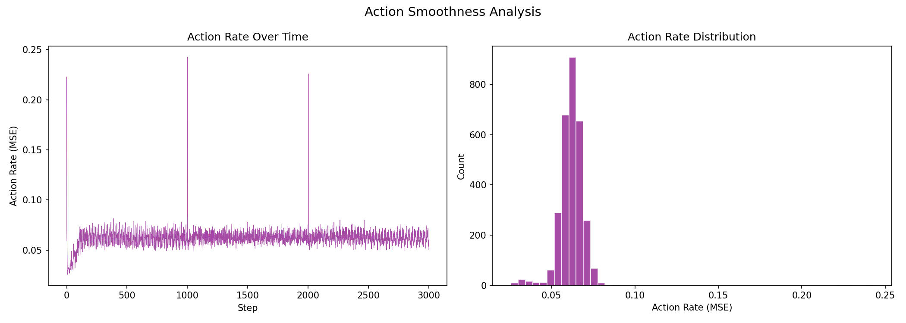

# 실험 097: spotmicro_v8_2_phase_period_change

- **날짜:** 2026-05-31 16:05
- **Task:** spotmicro_test
- **Run name:** `spotmicro_v8_2_phase_period_change`
- **판정:** ✅ PASS

---

## 실험 목적

v8.2: phase 1초 실험

---

## 변경점 (이전 커밋 대비)

```diff
diff --git a/ai_training/rl/legged_gym/legged_gym/envs/spotmicro_test/spotmicro_test.py b/ai_training/rl/legged_gym/legged_gym/envs/spotmicro_test/spotmicro_test.py
index 3e78c64..ee888e3 100644
--- a/ai_training/rl/legged_gym/legged_gym/envs/spotmicro_test/spotmicro_test.py
+++ b/ai_training/rl/legged_gym/legged_gym/envs/spotmicro_test/spotmicro_test.py
@@ -898,22 +898,46 @@ class SpotmicroTest(LeggedRobot):
     def _reward_no_stuck_feet(self):
         contact = self.contact_forces[:, self.feet_indices, 2] > 1.
         contact_filt = torch.logical_or(contact, self.last_contacts)
+
         phases = (self.gait_phase + self.phase_offsets) % 1.0
         desired_air = phases >= self.duty_factor
         swing_contact = desired_air & contact_filt
+
         if not hasattr(self, 'feet_swing_contact_time'):
             self.feet_swing_contact_time = torch.zeros(
-                self.num_envs, len(self.feet_indices), device=self.device)
+                self.num_envs, len(self.feet_indices), device=self.device
+            )
+
         self.feet_swing_contact_time = (
             self.feet_swing_contact_time + self.dt
         ) * swing_contact.float()
-        grace_time = getattr(self.cfg.rewards, "swing_contact_grace_time", 0.03)
-        penalty = torch.sum(
-            torch.clamp(self.feet_swing_contact_time - grace_time, min=0.),
-            dim=1,
+
+        grace_time = getattr(self.cfg.rewards, "swing_contact_grace_time", 0.02)
+
+        weights = torch.tensor(
+            getattr(self.cfg.rewards, "swing_contact_weights", [1.3, 1.3, 1.0, 1.0]),
+            device=self.device,
+            dtype=torch.float,
+        ).view(1, 4)
+
+        over_time = torch.clamp(
+            self.feet_swing_contact_time - grace_time,
+            min=0.0,
+            max=0.20,
         )
-        penalty *= (torch.norm(
-            self._get_effective_commands(), dim=1) > self.blend_cmd_norm).float()
+
+        denom = torch.clamp(
+            (desired_air.float() * weights).sum(dim=1),
+            min=1.0,
+        )
+
+        penalty = torch.sum(over_time * weights, dim=1) / denom
+
+        penalty *= (
+            torch.norm(self._get_effective_commands(), dim=1)
+            > self.blend_cmd_norm
+        ).float()
+
         penalty *= self._recovery_relief_scale("recovery_gait_relief_scale")
         return penalty
 
@@ -969,11 +993,30 @@ class SpotmicroTest(LeggedRobot):
         phases = (self.gait_phase + self.phase_offsets) % 1.0
         desired_air = phases >= self.duty_factor
         actual_contact = self.contact_forces[:, self.feet_indices, 2] > 1.0
-        dragging = (desired_air & actual_contact).float()
+
         cmd_norm = torch.norm(
-            self._get_effective_commands(), dim=1, keepdim=True)
+            self._get_effective_commands(), dim=1, keepdim=True
+        )
         is_moving = (cmd_norm > self.blend_cmd_norm).float()
-        penalty = torch.sum(dragging * is_moving, dim=1) / 4.0
+
+        # 앞발 drag
```

**변경 요약:**
  - self.num_envs, len(self.feet_indices), device=self.device)
  + self.num_envs, len(self.feet_indices), device=self.device
  + )
  - grace_time = getattr(self.cfg.rewards, "swing_contact_grace_time", 0.03)
  - penalty = torch.sum(
  - torch.clamp(self.feet_swing_contact_time - grace_time, min=0.),
  - dim=1,
  + grace_time = getattr(self.cfg.rewards, "swing_contact_grace_time", 0.02)
  + weights = torch.tensor(
  + getattr(self.cfg.rewards, "swing_contact_weights", [1.3, 1.3, 1.0, 1.0]),
  + device=self.device,
  + dtype=torch.float,
  + ).view(1, 4)
  + over_time = torch.clamp(
  + self.feet_swing_contact_time - grace_time,
  + min=0.0,
  + max=0.20,
  - penalty *= (torch.norm(
  - self._get_effective_commands(), dim=1) > self.blend_cmd_norm).float()
  + denom = torch.clamp(
  + (desired_air.float() * weights).sum(dim=1),
  + min=1.0,
  + )
  + penalty = torch.sum(over_time * weights, dim=1) / denom
  + penalty *= (
  + torch.norm(self._get_effective_commands(), dim=1)
  + > self.blend_cmd_norm
  + ).float()
  - dragging = (desired_air & actual_contact).float()
  - self._get_effective_commands(), dim=1, keepdim=True)
  + self._get_effective_commands(), dim=1, keepdim=True
  + )
  - penalty = torch.sum(dragging * is_moving, dim=1) / 4.0
  + weights = torch.tensor(
  + getattr(self.cfg.rewards, "swing_contact_weights", [1.3, 1.3, 1.0, 1.0]),
  + device=self.device,
  + dtype=torch.float,
  + ).view(1, 4)
  + bad = (desired_air & actual_contact).float() * weights
  + denom = torch.clamp(
  + (desired_air.float() * weights).sum(dim=1),
  + min=1.0,
  + )
  + penalty = bad.sum(dim=1) / denom
  + penalty = penalty * is_moving.squeeze(1)
  - weights = torch.tensor([1.0, 1.0, 1.0] * 4, device=self.device)
  - weighted_actions = self.actions * weights
  - error = torch.sum(torch.square(weighted_actions), dim=1)
  - sigma = 2.0
  + scale = self._get_effective_action_scale()
  + residual_rad = self.actions * scale
  + weights = torch.tensor(
  + [1.0, 1.0, 1.0] * 4,
  + device=self.device,
  + dtype=torch.float,
  + ).view(1, 12)
  + error = torch.sum(torch.square(residual_rad * weights), dim=1)
  + sigma = getattr(self.cfg.rewards, "tracking_ik_sigma", 0.20)
  - gait_period = 1.2
  + gait_period = 1.0
  - step_height = [0.018, 0.018, 0.021, 0.021]
  + step_height = [0.021, 0.021, 0.021, 0.021]
  - action_scale = 0.25
  - recovery_action_scale = 0.25
  + action_scale = 0.18
  + recovery_action_scale = 0.35
  - tracking_lin_vel = 1.5
  - tracking_ang_vel = 1.0
  + tracking_lin_vel = 1.2
  + tracking_ang_vel = 0.8
  - ang_vel_xy = -0.7
  - orientation = -5.0
  + ang_vel_xy = -0.8
  + orientation = -6.0
  - action_rate = -0.04
  - base_height = -0.4
  - feet_air_time = 0.08
  + action_rate = -0.06
  + base_height = -0.6
  + feet_air_time = 0.05
  - no_stuck_feet = -0.3
  + no_stuck_feet = -1.0
  - feet_clearance = 0.20
  - swing_contact = -0.4
  - trot_contact = 0.4
  - tracking_ik = 0.6
  + feet_clearance = 0.05
  + swing_contact = -1.5
  + trot_contact = 0.6
  + tracking_ik = 0.8
  + swing_contact_weights = [1.3, 1.3, 1.0, 1.0]
  + tracking_ik_sigma = 0.20
  - lin_vel_x = [-0.03, 0.15]
  + lin_vel_x = [0.5, 0.15]
  - ang_vel_yaw = [-0.40, 0.40]
  + ang_vel_yaw = [0.0, 0.0]
  - friction_range = [0.5, 1.25]
  + friction_range = [0.5, 1.3]
  - added_mass_range = [-0.2, 0.20]
  + added_mass_range = [-0.15, 0.15]
  - base_com_offset_x_range = [-0.010, 0.010]
  + base_com_offset_x_range = [-0.025, 0.015]
  - actuator_lag = True
  + actuator_lag = False
  - run_name = 'spotmicro_v8_0_1_newIk_feet_air'
  + run_name = 'spotmicro_v8_2_phase_period_change'
  - max_iterations = 1500
  + max_iterations = 500
  + ik_only=False,
  - train_cfg.runner.resume = True
  - explicit_load_run = getattr(args, "load_run", None) is not None
  - explicit_checkpoint = getattr(args, "checkpoint", None) is not None
  - if not checkpoint_path and not explicit_load_run and not explicit_checkpoint:
  - train_cfg.runner.load_run = -1
  - train_cfg.runner.checkpoint = -1
  - if checkpoint_path:
  - ck_dir = os.path.dirname(checkpoint_path)
  - ck_basename = os.path.basename(checkpoint_path)  # e.g. model_500.pt
  - train_cfg.runner.load_run = ck_dir
  - m = re.search(r'model_(\d+)\.pt', ck_basename)
  - if m:
  - train_cfg.runner.checkpoint = int(m.group(1))
  + if ik_only:
  + print("[진단] IK-only: policy 미사용, action=0으로 평가합니다.")
  + def policy(obs_tensor):
  + return torch.zeros(
  + (env.num_envs, env.num_actions),
  + device=env.device,
  + dtype=torch.float,
  + )
  - ppo_runner, train_cfg = task_registry.make_alg_runner(
  - env=env, name=args.task, args=args, train_cfg=train_cfg
  - )
  - policy = ppo_runner.get_inference_policy(device=env.device)
  + else:
  + train_cfg.runner.resume = True
  + explicit_load_run = getattr(args, "load_run", None) is not None
  + explicit_checkpoint = getattr(args, "checkpoint", None) is not None
  + if not checkpoint_path and not explicit_load_run and not explicit_checkpoint:
  + train_cfg.runner.load_run = -1
  + train_cfg.runner.checkpoint = -1
  + if checkpoint_path:
  + ck_dir = os.path.dirname(checkpoint_path)
  + ck_basename = os.path.basename(checkpoint_path)  # e.g. model_500.pt
  + train_cfg.runner.load_run = ck_dir
  + m = re.search(r'model_(\d+)\.pt', ck_basename)
  + if m:
  + train_cfg.runner.checkpoint = int(m.group(1))
  + ppo_runner, train_cfg = task_registry.make_alg_runner(
  + env=env, name=args.task, args=args, train_cfg=train_cfg
  + )
  + policy = ppo_runner.get_inference_policy(device=env.device)
  + ik_only = '--ik-only' in sys.argv
  + if ik_only:
  + sys.argv.remove('--ik-only')
  + ik_only=ik_only,

---

## 현재 Reward Scales

| Reward | Scale |
|--------|-------|
| action_rate | -0.06 |
| ang_vel_xy | -0.8 |
| base_height | -0.6 |
| collision | -1.0 |
| dof_acc | -2.5e-07 |
| dof_vel | -0.0005 |
| feet_air_time | 0.05 |
| feet_clearance | 0.05 |
| lin_vel_z | -1.5 |
| no_stuck_feet | -1.0 |
| orientation | -6.0 |
| stand_still | -0.3 |
| swing_contact | -1.5 |
| termination | -20.0 |
| torques | -0.0008 |
| tracking_ang_vel | 0.8 |
| tracking_ik | 0.8 |
| tracking_lin_vel | 1.2 |
| trot_contact | 0.6 |

---

## 진단 결과 (Diagnostic)


### 지형 설정

| 항목 | 값 |
|------|-----|
| 평가 모드 | terrain_random_walk |
| walk_eval | True |
| mesh_type | plane |
| terrain_profile | default |
| measure_heights | False |
| grid | 5 x 5 |
| env 크기 | 8.0 x 8.0 m |
| terrain_proportions | [0.1, 0.1, 0.35, 0.25, 0.2] |
| slope max | 0.0 |
| rolling amp max | 0.0 m |


### 핵심 지표

- ✅ Timeout: 80.9% (≥80%)
- ⚠️ 속도오차 X: 0.1125 m/s (0.08~0.12, 보통)
- ⚠️ 토크포화: 19.1% (10~40%)
- ✅ 자세: roll 1.0°, pitch 2.3° (<8°)
- ✅ 조기종료: 0.3% (<5%)
- ⚠️ 18도+ pre-fall 복구: trial 없음 (30도 목표 미검증)

### 상세 수치

| 지표 | 값 |
|------|-----|
| Timeout% | 80.88467614533965 |
| 조기종료% | 0.315955766192733 |
| 속도오차 X | 0.11247476190328598 m/s |
| 속도오차 Y | 0.024247152730822563 m/s |
| 각속도오차 | 0.08669295161962509 rad/s |
| 토크포화% | 19.072366435647687 |
| 평균 높이 | 0.18048714111734937 m |
| Roll (평균) | 1.0493310689926147° |
| Pitch (평균) | 2.331803798675537° |
| Action Rate | 0.06207159534096718 |
| 평균 전력 | 13.382984161376953 W |
| CoT | 2.399138239656646 |
| Recovery 성공률 | None% |
| Recovery eligible trials | 0 |
| 평균 회복 시간 | None s |
| Recovery 조기 실패율 | None% |
| Recovery 18도+ 성공률 | None% |
| Recovery 18도+ trials | 0 |
| Recovery 18도+ horizon 후 tilt | None° |
| Transition recovery 성공률 | None% |
| Transition recovery eligible trials | 0 |
| 평균 Transition recovery 시간 | None s |
| Transition 18도+ 성공률 | None% |
| Transition 18도+ trials | 0 |
| Transition 18도+ horizon 후 tilt | None° |

## Recovery Assist 분석

| 지표 | 값 |
|------|-----|
| 판정 | ⚠️ eligible trial 없음 |
| Recovery 성공률 | N/A |
| 성공/실패 | 0 / 0 |
| Eligible trials | 0 / 889 |
| 평균 회복 시간 | N/A |
| 조기 실패율 | N/A |
| 평가 horizon | 1.0 s |
| 초기 tilt 기준 | 12.000000000000002° |
| 안정 기준 | roll/pitch < 5.0°, height > 0.165m |
| 평균 초기 tilt | None° |
| 평균 초기 roll/pitch | None° / None° |
| 1초 후 평균 roll/pitch | None° / None° |
| 1초 내 최대 roll/pitch 평균 | None° / None° |

> 해석: `Recovery 성공률`은 초기 tilt가 기준 이상인 episode 중 1초 내 안정 자세로 복귀한 비율입니다. 조기 실패율이 높으면 reset 직후 바로 넘어지는 것이고, 평균 회복 시간이 짧을수록 위기 대응이 빠른 것입니다.

### Recovery Tilt Band 분석

| Tilt 구간 | Trials | 성공률 | Horizon 후 평균 tilt | 평균 회복 시간 |
|-----------|--------|--------|----------------------|----------------|
| 12-18 deg | 0 | N/A | N/A | N/A |
| 18-25 deg | 0 | N/A | N/A | N/A |
| 25-30 deg | 0 | N/A | N/A | N/A |
| 30+ deg | 0 | N/A | N/A | N/A |
| 18+ deg 전체 | 0 | N/A | N/A | N/A |

> 이번 pre-fall 목표는 특히 `18-25 deg`, `25-30 deg`, `18+ deg 전체` 행을 우선 봅니다. `25-30 deg` trial이 없으면 30도 근처 회복 성능은 아직 검증되지 않은 것입니다.


## Transition Recovery 분석

| 지표 | 값 |
|------|-----|
| 판정 | ⚠️ eligible trial 없음 |
| Transition recovery 성공률 | N/A |
| 성공/실패 | 0 / 0 |
| Eligible trials | 0 / 0 |
| 평균 회복 시간 | N/A |
| 조기 실패율 | N/A |
| 평가 horizon | 0.75 s |
| push 후 eligible 기준 | max roll/pitch > 12.000000000000002° |
| 안정 기준 | roll/pitch < 5.0°, height > 0.165m |
| 평균 최대 tilt | None° |
| horizon 후 평균 roll/pitch | None° / None° |

> 해석: `Transition Recovery`는 학습 중 push/roll-pitch angular impulse가 들어간 뒤 일정 시간 안에 자세가 안정 기준으로 돌아오는지를 봅니다.

### Transition Recovery Tilt Band 분석

| Tilt 구간 | Trials | 성공률 | Horizon 후 평균 tilt | 평균 회복 시간 |
|-----------|--------|--------|----------------------|----------------|
| 12-18 deg | 0 | N/A | N/A | N/A |
| 18-25 deg | 0 | N/A | N/A | N/A |
| 25-30 deg | 0 | N/A | N/A | N/A |
| 30+ deg | 0 | N/A | N/A | N/A |
| 18+ deg 전체 | 0 | N/A | N/A | N/A |

> 이번 pre-fall 목표는 특히 `18-25 deg`, `25-30 deg`, `18+ deg 전체` 행을 우선 봅니다. `25-30 deg` trial이 없으면 30도 근처 회복 성능은 아직 검증되지 않은 것입니다.


## Command Mode별 회전 추종 분석

| 모드 | 비율 | 샘플 수 | 평균 abs(cmd_wz) | 평균 abs(actual_wz) | yaw 오차 | 상태 |
|------|------|---------|------------------|---------------------|----------|------|
| 정지 | 0.0% | 0 | N/A | N/A | N/A | N/A |
| 직진/저회전 | 100.0% | 768768 | 0.0000 | 0.0867 | 0.0867 | ⚠️ |
| 제자리 회전 | 0.0% | 0 | N/A | N/A | N/A | N/A |
| 전진+회전 | 0.0% | 0 | N/A | N/A | N/A | N/A |
| 큰 회전명령 | 0.0% | 0 | N/A | N/A | N/A | N/A |

> 해석 기준: `제자리 회전`만 나쁘면 pure turn 학습/보행 패턴 문제, `큰 회전명령`만 나쁘면 yaw 명령 범위가 현재 토크/보폭 한계보다 큰 문제, `정지`가 나쁘면 stop drift 문제로 보면 됩니다.
        


## 학습 곡선 분석

| 지표 | 값 | 판정 |
|------|-----|------|
| 수렴 iter (90%) | 210 | 보통 |
| 후반 안정성 (CV) | 0.028 | 안정 |
| 정체 구간 | 있음 (iter 473, 24 iter) | |


## Per-leg 분석

### 발별 접촉/공중 비율

| 발 | 접촉% | 공중% |
|-----|-------|------|
| foot_0 | 64.0% | 36.0% |
| foot_1 | 63.3% | 36.7% |
| foot_2 | 60.2% | 39.8% |
| foot_3 | 58.2% | 41.8% |

### 관절별 토크 포화

| 관절 | 포화% | 최대토크 | 한계 | 상태 |
|------|------|---------|------|------|
| front_left_shoulder | 0.1% | 2.940 | 2.940 | ✅ |
| front_left_leg | 5.5% | 2.940 | 2.940 | ⚠️ |
| front_left_foot | 41.3% | 2.940 | 2.940 | ❌ |
| front_right_shoulder | 0.3% | 2.940 | 2.940 | ✅ |
| front_right_leg | 11.8% | 2.940 | 2.940 | ⚠️ |
| front_right_foot | 43.8% | 2.940 | 2.940 | ❌ |
| rear_left_shoulder | 1.7% | 2.940 | 2.940 | ✅ |
| rear_left_leg | 8.0% | 2.940 | 2.940 | ⚠️ |
| rear_left_foot | 51.5% | 2.940 | 2.940 | ❌ |
| rear_right_shoulder | 10.0% | 2.940 | 2.940 | ⚠️ |
| rear_right_leg | 16.5% | 2.940 | 2.940 | ⚠️ |
| rear_right_foot | 38.4% | 2.940 | 2.940 | ❌ |


## Gait 분석

| 지표 | 값 |
|------|-----|
| Gait 주파수 | 0.25 Hz |
| Gait 주기 | 50 steps |
| 대각 동기화율 | 89.6% |
| L/R 비대칭 | 0.0%p |
| 판정 | ✅ Trot 패턴 / ✅ 대칭 |


## 관절별 상세

| 관절 | 토크포화% | 사용범위% | 편향(rad) | 한계근접% | 상태 |
|------|----------|----------|----------|----------|------|
| front_left_shoulder | 0.1% | 68% | -0.195 | 0.0% | ⚠️ |
| front_left_leg | 5.5% | 33% | -1.058 | 0.0% | ⚠️ |
| front_left_foot | 41.3% | 53% | +1.684 | 0.0% | ⚠️ |
| front_right_shoulder | 0.3% | 82% | -0.109 | 0.0% | ⚠️ |
| front_right_leg | 11.8% | 31% | -1.060 | 0.0% | ⚠️ |
| front_right_foot | 43.8% | 54% | +1.719 | 0.0% | ⚠️ |
| rear_left_shoulder | 1.7% | 76% | -0.150 | 0.2% | ⚠️ |
| rear_left_leg | 8.0% | 33% | -1.103 | 0.0% | ⚠️ |
| rear_left_foot | 51.5% | 51% | +1.755 | 0.0% | ⚠️ |
| rear_right_shoulder | 10.0% | 100% | -0.005 | 0.0% | ✅ |
| rear_right_leg | 16.5% | 26% | -1.187 | 0.0% | ⚠️ |
| rear_right_foot | 38.4% | 55% | +1.699 | 0.0% | ⚠️ |


## 에너지 효율 상세

| 지표 | 값 |
|------|-----|
| 평균 전력 | 13.38 W |
| 피크 전력 | 14.58 W |
| 피크/평균 비율 | 1.1x |
| CoT | 2.40 |

### 관절별 전력 분배

| 관절 | 평균전력(W) | 비율% |
|------|-----------|-------|
| front_right_foot | 1.975 | 14.8% |
| rear_left_foot | 1.856 | 13.9% |
| front_right_leg | 1.839 | 13.7% |
| front_left_foot | 1.792 | 13.4% |
| rear_right_foot | 1.579 | 11.8% |
| front_left_leg | 1.461 | 10.9% |
| rear_left_leg | 1.149 | 8.6% |
| rear_right_leg | 1.127 | 8.4% |
| rear_right_shoulder | 0.263 | 2.0% |
| rear_left_shoulder | 0.121 | 0.9% |
| front_right_shoulder | 0.116 | 0.9% |
| front_left_shoulder | 0.106 | 0.8% |


## 이전 실험 대비 비교

| 지표 | 이전 (exp096) | 현재 (exp097) | 변화 |
|------|-------|-------|------|
| Timeout% | 77.5% | 80.9% | ✅ ↑ 3.3429% |
| 속도오차 X | 0.1395 | 0.1125 | ✅ ↓ 0.0270m/s |
| 토크포화 | 19.2% | 19.1% | ✅ ↓ 0.0900% |
| Roll | 1.3° | 1.0° | ✅ ↓ 0.2851° |
| Pitch | 3.1° | 2.3° | ✅ ↓ 0.8136° |
| 평균 전력 | 12.9101W | 13.3830W | ⚠️ ↑ 0.4729W |


## Tensorboard 학습 곡선 요약

| 스칼라 | 최종값 | 최대 | 최소 | 후반10% 평균 |
|--------|--------|------|------|-------------|
| rew_action_rate | -0.0986 | -0.0169 | -0.9842 | -0.0961 |
| rew_ang_vel_xy | -0.0905 | -0.0315 | -0.4734 | -0.0860 |
| rew_base_height | -0.0001 | -0.0000 | -0.0004 | -0.0001 |
| rew_collision | 0.0000 | 0.0000 | -0.0031 | -0.0000 |
| rew_dof_acc | -0.0093 | -0.0007 | -0.0223 | -0.0084 |
| rew_dof_vel | -0.0105 | -0.0003 | -0.0117 | -0.0098 |
| rew_feet_air_time | 0.0004 | 0.0006 | -0.0006 | 0.0004 |
| rew_feet_clearance | 0.0000 | 0.0001 | 0.0000 | 0.0000 |
| rew_lin_vel_z | -0.0073 | -0.0003 | -0.0079 | -0.0068 |
| rew_no_stuck_feet | -0.0018 | -0.0001 | -0.0181 | -0.0016 |
| rew_orientation | -0.0119 | -0.0021 | -0.1608 | -0.0125 |
| rew_stand_still | 0.0000 | 0.0000 | 0.0000 | 0.0000 |
| rew_swing_contact | -0.1984 | -0.0059 | -0.6767 | -0.1805 |
| rew_termination | 0.0000 | 0.0000 | -0.0200 | -0.0003 |
| rew_torques | -0.0275 | -0.0002 | -0.0290 | -0.0271 |
| rew_tracking_ang_vel | 0.5454 | 0.5664 | 0.0017 | 0.5466 |
| rew_tracking_ik | 0.3120 | 0.3978 | 0.0026 | 0.3203 |
| rew_tracking_lin_vel | 0.7271 | 1.0415 | 0.0032 | 0.7167 |
| rew_trot_contact | 0.5593 | 0.5745 | 0.0049 | 0.5571 |
| learning_rate | 0.0001 | 0.0086 | 0.0000 | 0.0002 |
| surrogate | -0.0013 | 0.0011 | -0.0123 | -0.0016 |
| value_function | 0.0304 | 0.2837 | 0.0001 | 0.0370 |
| collection time | 0.7743 | 1.0450 | 0.7667 | 0.8205 |
| learning_time | 0.2814 | 0.3380 | 0.2714 | 0.2846 |
| total_fps | 93117.0000 | 93460.0000 | 73010.0000 | 89012.2400 |
| mean_noise_std | 0.1927 | 1.0036 | 0.1888 | 0.1935 |
| mean_episode_length | 993.2200 | 1002.0000 | 13.6100 | 989.6952 |
| time | 993.2200 | 1002.0000 | 13.6100 | 989.6952 |
| mean_reward | 34.9023 | 36.1193 | -0.3881 | 34.6016 |
| time | 34.9023 | 36.1193 | -0.3881 | 34.6016 |

총 학습 iteration: 499


---

## 그래프

### Tensorboard 학습 곡선



### Diagnostic 결과





---

## 결론 및 다음 실험 방향

**자동 판정:** ✅ PASS

대부분 기준을 통과했으나 일부 항목이 보통 수준입니다.
  - ⚠️ 속도오차 X: 0.1125 m/s (0.08~0.12, 보통)
  - ⚠️ 토크포화: 19.1% (10~40%)
  - ⚠️ 18도+ pre-fall 복구: trial 없음 (30도 목표 미검증)

> 💡 위 결론은 자동 생성되었습니다. 필요시 수정하세요.

---

## 메모

_(추가 메모가 있으면 여기에 작성)_

