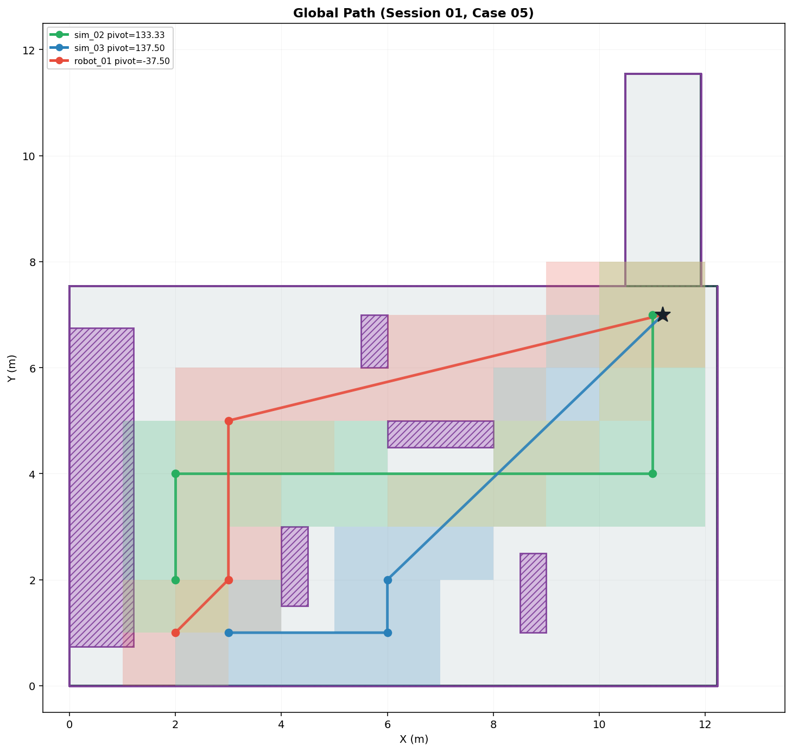

# global_path_manager

## 역할

시연장 맵을 기반으로 다중 로봇의 출발지에서 목적지까지의 후보 경로를 동적 탐색(BFS)으로 생성하고, 공간 분배 및 안전 이격 거리를 고려하여 최적의 경로 세트를 선정 후 발행합니다.

노드는 발행 후에도 살아있어 `TRANSIENT_LOCAL` 캐시를 유지하므로, 늦게 subscribe하는 노드도 경로를 즉시 수신할 수 있습니다.

---

## 핵심 알고리즘 및 특징

* **동적 경로 탐색 (BFS):** 1.0m 해상도의 그리드 상에서 최대 7개의 웨이포인트를 가지는 후보 경로를 자동 생성합니다. x축은 전진 방향만 허용하며, y축은 장애물 우회를 위해 양방향 이동을 허용합니다.
* **물리적 제약과 커버리지의 분리:** 경로 유효성 검증 시에는 벽 및 장애물로부터 0.3m의 안전거리를 엄격히 적용합니다. 반면 가시 영역(Coverage) 계산 시에는 Clearance를 무시하여 실제 벽면 끝까지 도달하는 것으로 평가합니다.
* **다중 로봇 공간 분산 (Spatial Distribution):** 로봇들이 맵 전체에 고르게 퍼지도록 각도 기반 shape 배정(x_first / diagonal / y_first)을 적용합니다.
* **병렬 주행 제어 및 선간 이격:** 로봇 간 최소 안전 이격 거리(1.2m)를 강제하고, 경로 선분에 반발장(Separation Radius 0.6m)을 적용하여 경로 겹침을 방지합니다. 출발지 및 도착지 반경 1.5m 이내는 수렴/발산 구역으로 간주하여 해당 페널티를 면제합니다.

---

## 패키지 구조

```text
global_path_manager/
├── global_path_manager/
│   ├── __init__.py
│   ├── path_set.py                  # 경로 생성 / 유효성 / 선정 핵심 로직
│   └── global_path_manager_node.py  # ROS2 노드
├── config/
│   ├── map.yaml                     # 물리적 맵 경계 / 장애물 / 출발·도착 좌표
│   └── global_path_manager.param.yaml
├── launch/
│   └── global_path_manager.launch.py
├── resource/
│   └── global_path_manager
├── visualize_paths.py               # 오프라인 경로 생성 및 시각화 테스트 스크립트
├── package.xml
├── setup.py
├── setup.cfg
└── README.md
```

---

## Subscribe

없음

## Publish

| 토픽 | 타입 | QoS |
|------|------|-----|
| `/planning/global_path/spot_01` | `robot_interfaces/GlobalPathWaypoints` | RELIABLE, TRANSIENT_LOCAL |
| `/planning/global_path/spot_02` | `robot_interfaces/GlobalPathWaypoints` | RELIABLE, TRANSIENT_LOCAL |
| `/planning/global_path/spot_03` | `robot_interfaces/GlobalPathWaypoints` | RELIABLE, TRANSIENT_LOCAL |

> 토픽은 `map.yaml`의 `starts` 키 기준으로 자동 생성됩니다.

---

## 파라미터

### config/map.yaml

> **주의:** `lobby`와 `corridor_1`의 좌표는 여유 공간이 차감되지 않은 **실제 물리적 벽면의 좌표**를 기재해야 합니다. (안전 거리 0.3m는 `path_set.py`에서 동적으로 계산됩니다.)

| 항목 | 설명 |
|------|------|
| `starts` | 로봇별 출발 좌표 (예: `spot_01`, `spot_02`, `spot_03`) |
| `end` | 공통 도착 좌표 |
| `lobby` | 맵의 주 공간(로비) 물리적 경계 좌표 |
| `corridor_1` | 맵의 추가 공간(복도) 물리적 경계 좌표 (선택 사항) |
| `waypoint_sampling` | 경유지 격자 샘플링 범위 및 간격 |
| `obstacles` | 내부 장애물 목록 (`id`, `x_min`, `x_max`, `y_min`, `y_max`, `clearance`) |

### config/global_path_manager.param.yaml

| 파라미터 | 기본값 | 설명 |
|----------|--------|------|
| `frame_id` | `"map"` | 메시지 헤더의 frame_id |
| `map_config_path` | `""` | 비워둘 경우 패키지에 설치된 기본 `map.yaml` 사용 |

---

## 빌드 및 실행

**빌드**

```bash
colcon build --packages-select global_path_manager
source install/setup.bash
```

**실행**

```bash
ros2 launch global_path_manager global_path_manager.launch.py
```

**토픽 확인**

```bash
ros2 topic echo --once /planning/global_path/spot_01
```

---

## 오프라인 테스트 및 시각화

ROS2 환경을 구동하지 않고 단독으로 경로 생성 로직을 테스트하고 결과를 이미지로 확인할 수 있습니다.

```bash
python3 visualize_paths.py
```

## 경로 시각화 예시


