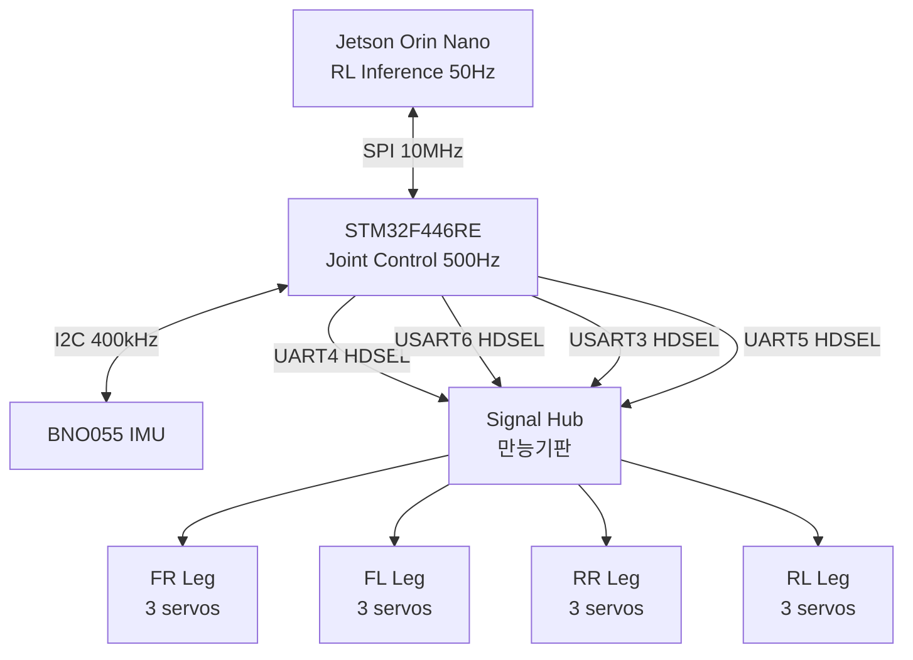

# Hardware Design

Spot Micro 4족 보행 로봇의 하드웨어 설계 문서.
전원 시스템은 [`power_system.md`](./power_system.md) 참고.

---

## 1. System Overview

### 1.1 Components

| 항목 | 모델 | 수량 | 역할 |
|---|---|---|---|
| MCU | STM32F446RE (Nucleo-64) | 1 | 실시간 관절 제어 (500Hz) |
| SBC | NVIDIA Jetson Orin Nano (25W) | 1 | RL inference, 비전 처리 |
| Servo | Feetech STS3215-C018 (12V, 30kg·cm) | 12 | 4 다리 × 3 관절 |
| IMU | Bosch BNO055 | 1 | 자세 추정 (onboard fusion) |
| Signal Hub | 만능기판 | 1 | 4-bus 풀업 + 신호 분배 |

### 1.2 Block Diagram



### 1.3 Mechanical

| 항목 | 값 |
|---|---|
| 총 무게 | ~2.5 kg |
| 다리 구성 | 4 다리 × 3 관절 (Hip / Thigh / Knee) |
| 다리 길이 | ~12 cm (관절 중심 기준) |

---

## 2. Compute

### 2.1 STM32F446RE (Nucleo-64)

**선정 이유**:
- HDSEL 가능한 USART 5개 (USART1/2/3/6, UART4/5) → 4-bus 서보 토폴로지에 충분
- 5V tolerant (FT) 핀 다수 → STS3215의 5V TTL 직결 가능
- 180MHz Cortex-M4 + FPU → 500Hz 제어 루프 + 부동소수점 연산 (projected gravity, PID, unit 변환) 여유
- ST-Link 내장 → 별도 디버거 불필요

**핵심 사용 페리페럴**:
- 4× USART (HDSEL): 서보 제어
- 1× I2C: IMU
- 1× SPI: Jetson 통신
- 1× USART (VCP): 디버그 콘솔
- IWDG: 하드웨어 watchdog

### 2.2 Jetson Orin Nano

**역할**:
- RL policy inference (50Hz)
- 비전 처리 (OAK-D, LiDAR 등)
- 상위 명령 생성 → STM에 SPI로 전송

**모드**: 25W 고정 (성능 안정성 확보).

---

## 3. Servo System (STS3215)

### 3.1 스펙 요약 (C018, 12V)

| 항목 | 값 |
|---|---|
| 입력 전압 | 6 ~ 14 V |
| Stall torque | 30 kg·cm @ 12V |
| Stall current | 2.7 A |
| No-load current | 200 mA |
| Idle current | 30 mA |
| Kt 상수 | 10 kg·cm/A |
| 통신 | TTL Serial Bus (1Mbps default) |
| 신호 레벨 | 5V TTL, half-duplex |
| 엔코더 | 12-bit 자기식 (4096 steps / 360°) |
| 피드백 | Position, Speed, Load, Voltage, Current, Temperature |

### 3.2 4-Bus 토폴로지

12 서보를 다리 단위로 나눠 **4개의 독립 HDSEL UART 버스**에 할당.

| 다리 | UART | TX 핀 | 클럭 도메인 |
|---|---|---|---|
| FR (Front-Right) | UART4 | PA0 | APB1 45MHz |
| FL (Front-Left) | USART6 | PC6 | APB2 90MHz |
| RR (Rear-Right) | USART3 | PC10 | APB1 45MHz |
| RL (Rear-Left) | UART5 | PC12 | APB1 45MHz |

**왜 4-bus 병렬인가**:
1. **속도**: 단일 버스 12서보 직렬 read = 1.7ms → 500Hz 못 맞춤. 4-bus 병렬 = 420μs.
2. **전기적 부하 분산**: 다리당 신호선 ≤30cm, 풀업 1kΩ로 1Mbps 안정.
3. **Fault isolation**: 한 다리 고장이 다른 다리에 영향 없음.
4. **다리 단위 캡슐화**: 디버깅 / 재조립 / 펌웨어 추상화 깔끔.
5. **SYNC_WRITE 효율**: 4 버스 동시 명령 → 보행 동기화 정확.

**Trade-off (왜 6, 12 버스 아닌가)**:

| 구성 | 통신 시간 | 핀 수 | 코드 복잡도 |
|---|---|---|---|
| 1 버스 × 12서보 | 1.7ms | 1 | 단순 |
| 2 버스 × 6서보 | 850μs | 2 | 단순 |
| **4 버스 × 3서보** | **420μs** | **4** | **중간** |
| 6 버스 × 2서보 | 280μs | 6 | 복잡 |
| 12 버스 × 1서보 | 140μs | 12 | 매우 복잡 |

4가 핀 수, 다리 추상화, 속도 모두 sweet spot.

### 3.3 HDSEL (Half-Duplex Single-Wire) 구성

STM32 USART의 `HDSEL` 비트로 TX 핀 하나가 송수신 겸용.

```c
huart4.Instance = UART4;
huart4.Init.BaudRate = 1000000;
huart4.Init.WordLength = UART_WORDLENGTH_8B;
huart4.Init.StopBits = UART_STOPBITS_1;
huart4.Init.Parity = UART_PARITY_NONE;
huart4.Init.Mode = UART_MODE_TX_RX;
huart4.Init.HwFlowCtl = UART_HWCONTROL_NONE;
HAL_HalfDuplex_Init(&huart4);
```

**왜 외부 버퍼 IC (74HC126)를 안 쓰나**:
- STM32 HDSEL이 TX/RX 전환을 하드웨어로 처리 → 별도 칩 불필요
- 회로 단순화, BOM 절감
- 풀업 저항 4개로 충분 (다리당 1개)

**주의 사항**:
- **Self-echo (구현 선택에 따라 발생)**: HDSEL 모드에서는 TX 라인이 RX 패스에 내부 연결됨. `UART_MODE_TX_RX`로 TE/RE를 동시 활성화하면 송신한 바이트가 자기 RX 버퍼에 들어옴. 회피 방법 두 가지:
  1. `HAL_HalfDuplex_EnableTransmitter()` / `EnableReceiver()` 로 TE/RE 토글 (ST 권장)
  2. 동시 활성 유지 + RX 받을 때 echo 분량(요청 패킷 길이) 먼저 flush
  - **본 프로젝트는 방식 2 채택** (토글 오버헤드 회피, Feetech/Dynamixel 라이브러리 일반 패턴)
- TX 핀은 **Open-Drain** 으로 설정해야 다른 서보가 RX 구동 가능
- STS3215 5V TTL → STM32 입력은 FT 핀 사용 필수 (TTa 핀 금지)

### 3.4 SCS Protocol (요약)

데이지 체인 통신 프로토콜:

```
Header(0xFF 0xFF) | ID | Length | Instruction | Params... | Checksum
```

자주 쓰는 instruction:
- `0x01` PING
- `0x02` READ
- `0x03` WRITE
- `0x83` SYNC_WRITE (다중 서보 동시 명령)

**핵심 레지스터** (STS3215):

| 주소 | 이름 | 크기 | 비고 |
|---|---|---|---|
| 0x05 | ID | 1B | EEPROM, 기본값 1 |
| 0x06 | Baudrate | 1B | 0=1Mbps |
| 0x10 | Status Return Level | 1B | 1=READ만 응답, 2=모두 응답 |
| 0x28 | Torque Enable | 1B | 0/1 |
| 0x2A | Goal Position | 2B | 0~4095, little-endian |
| 0x2E | Goal Speed | 2B | 0=최대 |
| 0x38 | Present Position | 2B | LE |
| 0x3A | Present Speed | 2B | LE |
| 0x3C | Present Load | 2B | 접촉 검출용 |
| 0x3E | Present Voltage | 1B | |
| 0x3F | Present Temperature | 1B | |

**Bulk Read 최적화**: 0x38 ~ 0x3F가 연속 8B → 한 번의 READ로 5개 값 (Position + Speed + Load + Voltage + Temperature) 동시 수신.

---

## 4. IMU (BNO055)

### 4.1 선정 이유
- **Onboard sensor fusion** 내장 (Madgwick 직접 구현 불필요)
- Quaternion / Euler / Linear acceleration 출력 직접 제공
- I2C로 간단 연결, 1kHz 폴링 가능

### 4.2 인터페이스
- **I2C1 Fast-Mode** (400kHz)
- 핀: PB6 (SCL), PB7 (SDA)
- 풀업: 4.7kΩ (BNO055 모듈 보드에 내장된 경우 생략)

### 4.3 왜 STM에 직결 (Jetson 직결 X)

1. **하드 리얼타임 샘플링**: 500Hz 등주기 보장
2. **시간 정렬**: 서보 state와 IMU state 동기화
3. **저지연 반사 제어**: 낙상 감지 → 즉시 토크 OFF
4. **Jetson CPU offload**
5. **안전 redundancy**: Jetson 재부팅 중에도 IMU 기반 자세 유지 가능

### 4.4 STM에서의 활용
- Attitude estimation (quaternion)
- Projected gravity 계산 → Jetson 송신
- Fall detection
- Contact detection (가속도 + 서보 load 조합)
- Gait phase trigger
- Inner-loop body stabilization

---

## 5. Signal Hub (만능기판)

### 5.1 역할
- STM32 → 4 다리 신호 분배
- 풀업 저항 배치
- 3.3V / GND 레일 제공

### 5.2 회로 구성

```
            STM32 (4 HDSEL TX)
              │  │  │  │
              │  │  │  │
            ┌─┴──┴──┴──┴─┐
            │  Signal Hub │
            │             │
            │ ┌─────────┐ │
            │ │1kΩ × 4  │ │ ← 풀업 to 3.3V
            │ └─────────┘ │
            │             │
            │ 3.3V rail   │
            │ GND rail    │
            └─┬──┬──┬──┬─┘
              │  │  │  │
             FR FL RR RL
            (각 다리 3 서보)
```

### 5.3 풀업 저항

| 항목 | 값 |
|---|---|
| 저항값 | 1 kΩ (옵션 4.7 kΩ) |
| 풀업 전압 | 3.3 V |
| 수량 | 4 (다리당 1개) |

**1kΩ 선택 이유**: 1Mbps에서 라인 capacitance 흡수 + idle HIGH 빠른 복귀. 4.7kΩ는 신호 라인이 길어지면 RC 시정수 커져서 신호 왜곡 발생 가능.

---

## 6. Communication Architecture

### 6.1 인터페이스 요약

| 링크 | 인터페이스 | 속도 | 주기 |
|---|---|---|---|
| STM ↔ 서보 (4 버스) | HDSEL UART | 1 Mbps | 500 Hz |
| STM ↔ IMU | I2C Fast-Mode | 400 kHz | 500 Hz |
| STM ↔ Jetson | SPI (Jetson master) | 10 MHz | 50 Hz |
| 디버그 콘솔 | USART2 (ST-Link VCP) | 115200 bps | - |

### 6.2 STM ↔ Jetson SPI

- **Master**: Jetson, **Slave**: STM32
- **DATA_READY GPIO 인터럽트** (slave-initiated 이벤트용)
- 핀: PA4 (NSS), PA5 (SCK), PA6 (MISO), PA7 (MOSI), PB0 (DATA_READY)

**왜 UART 아닌 SPI**:
- 50Hz × ~158B = 79kbps 정도면 UART 460800도 충분하지만,
- SPI가 full-duplex라 동시 양방향 가능
- Jetson Linux의 UART는 jitter 있음 (SPI는 더 deterministic)
- CubeMX 이미 SPI로 설계 → sunk cost 측면에서도 합리적

### 6.3 디버그 콘솔 (USART2)

- ST-Link VCP를 통해 USB-UART로 노출
- `printf` redirect로 서보 상태 / 에러 로그 출력
- 별도 USB-TTL 어댑터 불필요

---

## 7. Pin Mapping (STM32F446RE)

| 핀 | 페리페럴 | 용도 | 비고 |
|---|---|---|---|
| PA0 | UART4_TX | FR 다리 HDSEL | FT, AF8 |
| PA1 | (예약) | UART4_RX (HDSEL은 RX 핀 미사용) | - |
| PA2 | USART2_TX | 디버그 콘솔 | ST-Link VCP |
| PA3 | USART2_RX | 디버그 콘솔 | ST-Link VCP |
| PA4 | SPI1_NSS | Jetson SPI | - |
| PA5 | SPI1_SCK | Jetson SPI | - |
| PA6 | SPI1_MISO | Jetson SPI | - |
| PA7 | SPI1_MOSI | Jetson SPI | - |
| PB0 | GPIO_OUT | DATA_READY → Jetson | 인터럽트용 |
| PB6 | I2C1_SCL | IMU | FT |
| PB7 | I2C1_SDA | IMU | FT |
| PC6 | USART6_TX | FL 다리 HDSEL | FT, AF8 |
| PC10 | USART3_TX | RR 다리 HDSEL | FT, AF7 |
| PC12 | UART5_TX | RL 다리 HDSEL | FT, AF8 |

**사용 안 하는 핀 (의도적 회피)**:
- **PA9 (USART1_TX)**: Morpho 헤더에서 USB OTG VBUS sense에 묶여 있어 HDSEL TX로 사용 시 통신 실패 → UART4(PA0)로 이동
- **PA4, PA5 (TTa 핀)**: ADC 전용, 5V 입력 시 손상 → 서보 신호 직결 금지

---

## 8. Protection (옵션)

### 8.1 서보 신호선 보호
- 100Ω 시리즈 저항 (선택): ESD/스파이크 흡수
- TVS 다이오드 (선택): SMAJ12A 등

> **현재 구성에서는 생략**. STS3215는 자체 ESD 보호 회로 내장, 다리 케이블 짧음(<30cm). 필요 시 추후 추가.

### 8.2 Watchdog (펌웨어)
- **통신 watchdog**: 100ms 내 Jetson 명령 미수신 시 hold position
- **하드웨어 IWDG**: 펌웨어 hang 시 자동 리셋

---

## 9. 참고 문서

- [`power_system.md`](./power_system.md) — 전원 시스템 설계
- [STS3215 Datasheet (Feetech)](https://files.seeedstudio.com/products/Feetech/108090023_STS3215-C001_Datasheet.pdf)
- [STS3215 실측 리포트 (Robo9)](https://robonine.com/testing-of-feetech-sts3215-servomotor-backlash-repeatability-and-torque/)
- [STM32F446RE Reference Manual (RM0390)](https://www.st.com/resource/en/reference_manual/rm0390-stm32f446xx-advanced-armbased-32bit-mcus-stmicroelectronics.pdf)